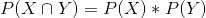
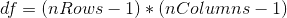
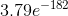

## 12.3 应急表及双向试验

我们经常使用卡方检验的另一种方法是询问两个分类变量是否相互关联。作为一个更现实的例子，让我们来考虑一个问题，当一个黑人司机被警察拦下时，他们是否比一个白人司机更有可能被搜查，斯坦福公开警务项目（[https://open policing.stanford.edu/](https://openpolicing.stanford.edu/)）研究了这个问题，并提供了我们可以用来分析问题的数据。我们将使用来自康涅狄格州的数据，因为它们相当小。首先清理这些数据，以删除所有不必要的数据（参见 code/process_ct_data.py）。

```r
# load police stop data
stopData <-
  read_csv("data/CT_data_cleaned.csv") %>%
  rename(searched = search_conducted)
```

表示分类分析数据的标准方法是通过 _ 列联表 _，列联表显示了属于每个变量值的每个可能组合的观测值的数量或比例。

让我们计算一下警察搜索数据的应急表：

```r
# compute and print two-way contingency table
summaryDf2way <-
  stopData %>%
  count(searched, driver_race) %>%
  arrange(driver_race, searched) 

summaryContingencyTable <-
  summaryDf2way %>%
  spread(driver_race, n)

pander(summaryContingencyTable)
```

<colgroup><col style="width: 15%"> <col style="width: 11%"> <col style="width: 11%"></colgroup> 
| 已搜索 | 黑色 | 白色 |
| --- | --- | --- |
| 错误的 | 36244 个 | 239241 个 |
| 真的 | 1219 年 | 3108 个 |

使用比例而不是原始数字查看应急表也很有用，因为它们更容易在视觉上进行比较。

```r
# Compute and print contingency table using proportions 
# rather than raw frequencies
summaryContingencyTableProportion <-
  summaryContingencyTable %>%
  mutate(
    Black = Black / nrow(stopData), #count of Black individuals searched / total searched
    White = White / nrow(stopData)
  )
pander(summaryContingencyTableProportion, round = 4)
```

<colgroup><col style="width: 15%"> <col style="width: 12%"> <col style="width: 12%"></colgroup> 
| searched | Black | White |
| --- | --- | --- |
| FALSE | 0.1295 年 | 0.855 个 |
| TRUE | 0.0044 美元 | 0.0111 个 |

Pearson 卡方检验允许我们检验观察到的频率是否与预期频率不同，因此我们需要确定如果搜索和种族不相关，我们期望在每个细胞中出现的频率，我们可以定义为 _ 独立。_ 请记住，如果 x 和 y 是独立的，那么：



也就是说，零独立假设下的联合概率仅仅是每个变量的 _ 边际 _ 概率的乘积。边际概率只是每一个事件发生的概率，与其他事件无关。我们可以计算这些边际概率，然后将它们相乘，得到独立状态下的预期比例。

|  | 黑色 | 白色 |  |
| --- | --- | --- | --- |
| 未搜索 | P（ns）*P（b） | P（ns）*P（w） | P（纳秒） |
| 已搜索 | P（S）*P（B） | P（S）*P（W） | P（S） |
|  | P（B） | P（宽） |  |

我们可以使用称为“外积”的线性代数技巧（通过`outer()`函数）来轻松计算。

```r
# first, compute the marginal probabilities

# probability of being each race
summaryDfRace <-
  stopData %>%
  count(driver_race) %>% #count the number of drivers of each race
  mutate(
    prop = n / sum(n) #compute the proportion of each race out of all drivers
  )

# probability of being searched 
summaryDfStop <-
  stopData %>%
  count(searched) %>% #count the number of searched vs. not searched
  mutate(
    prop = n / sum(n) # compute proportion of each outcome out all traffic stops
  )
```

```r
# second, multiply outer product by n (all stops) to compute expected frequencies
expected <- outer(summaryDfRace$prop, summaryDfStop$prop) * nrow(stopData)

# create a data frame of expected frequencies for each race 
expectedDf <- 
  data.frame(expected, driverRace = c("Black", "White")) %>% 
  rename(
    NotSearched = X1,
    Searched = X2
  )

# tidy the data frame
expectedDfTidy <-
  gather(expectedDf, searched, n, -driverRace) %>%
  arrange(driverRace, searched)
```

```r
# third, add expected frequencies to the original summary table
# and fourth, compute the standardized squared difference between 
# the observed and expected frequences

summaryDf2way <-
  summaryDf2way %>%
  mutate(expected = expectedDfTidy$n)

summaryDf2way <-
  summaryDf2way %>%
  mutate(stdSqDiff = (n - expected)**2 / expected)

pander(summaryDf2way)
```

<colgroup><col style="width: 15%"> <col style="width: 19%"> <col style="width: 12%"> <col style="width: 15%"> <col style="width: 15%"></colgroup> 
| searched | 车手比赛 | N 号 | 预期 | 标准平方差 |
| --- | --- | --- | --- | --- |
| FALSE | 黑色 | 36244 | 36883.67 个 | 2009 年 11 月 |
| TRUE | Black | 1219 | 579.33 条 | 第 706.31 条 |
| FALSE | 白色 | 239241 | 238601.3 条 | 1.71 条 |
| TRUE | White | 3108 | 3747.67 美元 | 109.18 条 |

```r
# finally, compute chi-squared statistic by 
# summing the standardized squared differences
chisq <- sum(summaryDf2way$stdSqDiff)
sprintf("Chi-squared value = %0.2f", chisq)
```

```r
## [1] "Chi-squared value = 828.30"
```

在计算了卡方统计之后，我们现在需要将其与卡方分布进行比较，以确定它与我们在无效假设下的期望相比有多极端。这种分布的自由度是——因此，对于类似于这里的 2x2 表，。这里的直觉是计算预期频率需要我们使用三个值：观察总数和两个变量的边际概率。因此，一旦计算出这些值，就只有一个数字可以自由变化，因此有一个自由度。鉴于此，我们可以计算卡方统计的 p 值：

```r
pval <- pchisq(chisq, df = 1, lower.tail = FALSE)
sprintf("p-value = %e", pval)
```

```r
## [1] "p-value = 3.795669e-182"
```

的 p 值非常小，表明如果种族和警察搜查之间真的没有关系，观察到的数据就不太可能，因此我们应该拒绝独立性的无效假设。

我们还可以使用 r 中的`chisq.test()`函数轻松执行此测试：

```r
# first need to rearrange the data into a 2x2 table
summaryDf2wayTable <-
  summaryDf2way %>%
  dplyr::select(-expected, -stdSqDiff) %>%
  spread(searched, n) %>%
  dplyr::select(-driver_race)

chisqTestResult <- chisq.test(summaryDf2wayTable, 1, correct = FALSE)
chisqTestResult
```

```r
## 
##  Pearson's Chi-squared test
## 
## data:  summaryDf2wayTable
## X-squared = 800, df = 1, p-value <2e-16
```