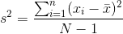
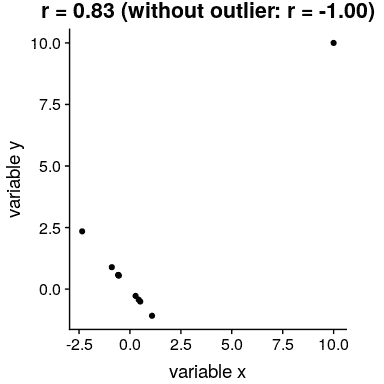

## 13.3 协方差和相关性

量化两个变量之间关系的一种方法是 _ 协方差 _。记住，单个变量的方差计算如下：



这告诉我们每个观察值与平均值相差多远。协方差告诉我们两个不同的变量在观测值之间的偏差是否存在关系。定义如下：


当 x 和 y 都高度偏离平均值时，该值将远离零；如果它们在同一方向上偏离，则协方差为正，而如果它们在相反方向上偏离，则协方差为负。让我们先看一个玩具的例子。

```r
# create data for toy example of covariance
df <-
  tibble(x = c(3, 5, 8, 10, 12)) %>%
  mutate(y = x + round(rnorm(n = 5, mean = 0, sd = 2))) %>%
  mutate(
    y_dev = y - mean(y),
    x_dev = x - mean(x)
  ) %>%
  mutate(crossproduct = y_dev * x_dev)

pander(df)
```

<colgroup><col style="width: 6%"> <col style="width: 6%"> <col style="width: 11%"> <col style="width: 11%"> <col style="width: 19%"></colgroup> 
| X | 是 | Y 轴偏差 | X 轴偏差 | 叉乘 |
| --- | --- | --- | --- | --- |
| 三 | 1 个 | -6.6 条 | -4.6 节 | 30.36 天 |
| 5 个 | 3 | -4.6 | -第 2.6 条 | 11.96 年 |
| 8 个 | 8 | 0.4 倍 | 0.4 | 0.16 分 |
| 10 个 | 12 个 | 第 4.4 条 | 第 2.4 条 | 10.56 条 |
| 12 | 14 | 第 6.4 条 | 4.4 | 28.16 条 |

```r
# compute covariance

sprintf("sum of cross products = %.2f", sum(df$crossproduct))
```

```r
## [1] "sum of cross products = 81.20"
```

```r
covXY <- sum(df$crossproduct) / (nrow(df) - 1)
sprintf("covariance: %.2f", covXY)
```

```r
## [1] "covariance: 20.30"
```

我们通常不使用协方差来描述变量之间的关系，因为它随数据的总体方差水平而变化。相反，我们通常使用 _ 相关系数 _（通常在统计学家 Karl Pearson 之后称为 _Pearson 相关 _）。通过用两个变量的标准偏差缩放协方差来计算相关性：


```r
# compute the correlation coefficient

corXY <- sum(df$crossproduct) / ((nrow(df) - 1) * sd(df$x) * sd(df$y))
sprintf("correlation coefficient = %.2f", corXY)
```

```r
## [1] "correlation coefficient = 0.99"
```

我们还可以使用 r 中的`cor()`函数轻松计算相关值：

```r
# compute r using built-in function

c <- cor(df$x, df$y)
sprintf("correlation coefficient = %.2f", c)
```

```r
## [1] "correlation coefficient = 0.99"
```

相关系数是有用的，因为它在-1 和 1 之间变化，不管数据的性质如何-事实上，我们在讨论影响大小时已经讨论过相关系数。正如我们在上一章关于影响大小的内容中看到的，1 的相关性表示一个完美的线性关系，-1 的相关性表示一个完美的负关系，0 的相关性表示没有线性关系。

我们可以计算仇恨犯罪数据的相关系数：

```r
corGiniHC <-
  cor(
    hateCrimes$gini_index,
    hateCrimes$avg_hatecrimes_per_100k_fbi
  )
sprintf('correlation coefficient = %.2f',corGiniHC)
```

```r
## [1] "correlation coefficient = 0.42"
```

### 13.3.1 相关性假设检验

相关值 0.42 似乎表明两个变量之间的关系相当强，但我们也可以想象，即使没有关系，这种情况也可能是偶然发生的。我们可以使用一个简单的公式来测试相关性为零的空假设，该公式允许我们将相关性值转换为 _t_ 统计：


在零假设下，该统计量以自由度为 t 分布。我们可以使用 r 中的`cor.test()`函数计算：

```r
# perform correlation test on hate crime data
cor.test(
  hateCrimes$avg_hatecrimes_per_100k_fbi,
  hateCrimes$gini_index
)
```

```r
## 
##  Pearson's product-moment correlation
## 
## data:  hateCrimes$avg_hatecrimes_per_100k_fbi and hateCrimes$gini_index
## t = 3, df = 50, p-value = 0.002
## alternative hypothesis: true correlation is not equal to 0
## 95 percent confidence interval:
##  0.16 0.63
## sample estimates:
##  cor 
## 0.42
```

这个测试表明，R 值的可能性很低，这个极限或更高，所以我们将拒绝的无效假设。注意，这个测试假设两个变量都是正态分布的。

我们也可以通过随机化来检验这一点，在随机化中，我们重复地改变其中一个变量的值并计算相关性，然后将我们观察到的相关性值与这个零分布进行比较，以确定我们观察到的值在零假设下的可能性。结果如图[13.3](#fig:shuffleCorr)所示。使用随机化计算的 p 值与 t 检验给出的答案相当相似。

```r
# compute null distribution by shuffling order of variable values

# create a function to compute the correlation on the shuffled values 
shuffleCorr <- function(x, y) {
  xShuffled <- sample(x)
  return(cor(xShuffled, y))
}

# run this function 2500 times 
shuffleDist <- 
  replicate(
    2500, 
    shuffleCorr(hateCrimes$avg_hatecrimes_per_100k_fbi, hateCrimes$gini_index)
  )
```


图 13.3 零假设下相关值的柱状图，通过改变值获得。观测值用蓝线表示。

### 13.3.2 稳健相关性

在图[13.2](#fig:hateCrimeGini)中，您可能注意到了一些有点奇怪的地方——其中一个数据点（哥伦比亚特区的数据点）似乎与其他数据点非常不同。我们称之为 _ 离群值 _，标准相关系数对离群值非常敏感。例如，在图[13.4](#fig:outlierCorr)中，我们可以看到一个孤立的数据点是如何导致非常高的正相关值的，即使其他数据点之间的实际关系是完全负的。



图 13.4 异常值对相关性影响的模拟示例。如果没有离群值，其余数据点具有完全的负相关，但单个离群值将相关值更改为高度正相关。

解决离群值问题的一种方法是在排序后，在数据的列组上计算相关性，而不是在数据本身上计算相关性；这被称为 _ 斯皮尔曼相关性 _。图[13.4](#fig:outlierCorr)中的 Pearson 相关性为 0.83，而 Spearman 相关性为-0.45，表明等级相关性降低了异常值的影响。

我们可以使用`cor.test`函数计算仇恨犯罪数据的等级相关性：

```r
corTestSpearman <- cor.test( hateCrimes$avg_hatecrimes_per_100k_fbi,
  hateCrimes$gini_index,
  method = "spearman")
corTestSpearman
```

```r
## 
##  Spearman's rank correlation rho
## 
## data:  hateCrimes$avg_hatecrimes_per_100k_fbi and hateCrimes$gini_index
## S = 20000, p-value = 0.8
## alternative hypothesis: true rho is not equal to 0
## sample estimates:
##   rho 
## 0.033
```

现在我们看到相关性不再显著（实际上接近于零），这表明 Fivethirtyeight 博客帖子的声明可能由于离群值的影响而不正确。

### 13.3.3 贝叶斯相关分析

我们也可以使用贝叶斯分析来分析五个第八个数据，这有两个优点。首先，它为我们提供了一个后验概率——在本例中，相关值超过零的概率。其次，贝叶斯估计将观察到的证据与 _ 先验 _ 相结合，从而使相关估计 _ 正则化，有效地将其拉向零。在这里，我们可以使用 bayesmed 包中的`jzs_cor`函数来计算它。_

```r
bayesCor <- jzs_cor(
  hateCrimes$avg_hatecrimes_per_100k_fbi,
  hateCrimes$gini_index
)
```

```r
## Compiling model graph
##    Resolving undeclared variables
##    Allocating nodes
## Graph information:
##    Observed stochastic nodes: 50
##    Unobserved stochastic nodes: 4
##    Total graph size: 230
## 
## Initializing model
```

```r
bayesCor
```

```r
## $Correlation
## [1] 0.41
## 
## $BayesFactor
## [1] 11
## 
## $PosteriorProbability
## [1] 0.92
```

请注意，使用贝叶斯方法估计的相关性略小于使用标准相关系数估计的相关性，这是由于该估计基于证据和先验的组合，从而有效地将估计缩小到反渗透。但是，请注意，贝叶斯分析对异常值不具有鲁棒性，它仍然表示有相当强的证据表明相关性大于零。