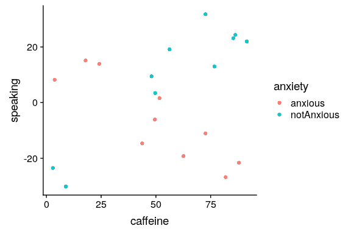

## 14.3 变量之间的相互作用

在前面的模型中，我们假设两组的学习时间对成绩的影响（即回归斜率）是相同的。但是，在某些情况下，我们可以想象一个变量的效果可能会因另一个变量的值而不同，我们称之为变量之间的 _ 交互 _。


图 14.6 咖啡因与公共演讲的关系

让我们用一个新的例子来问这个问题：咖啡因对公众演讲的影响是什么？首先，让我们生成一些数据并绘制它们。从图[14.6](#fig:CaffeineSpeaking)来看，似乎没有关系，我们可以通过对数据进行线性回归来确认：

```r
# perform linear regression with caffeine as independent variable
lmResultCaffeine <- lm(speaking ~ caffeine, data = df)
summary(lmResultCaffeine)
```

```r
## 
## Call:
## lm(formula = speaking ~ caffeine, data = df)
## 
## Residuals:
##    Min     1Q Median     3Q    Max 
## -33.10 -16.02   5.01  16.45  26.98 
## 
## Coefficients:
##             Estimate Std. Error t value Pr(>|t|)
## (Intercept)   -7.413      9.165   -0.81     0.43
## caffeine       0.168      0.151    1.11     0.28
## 
## Residual standard error: 19 on 18 degrees of freedom
## Multiple R-squared:  0.0642, Adjusted R-squared:  0.0122 
## F-statistic: 1.23 on 1 and 18 DF,  p-value: 0.281
```

但现在让我们假设，我们发现研究表明焦虑和非焦虑的人对咖啡因的反应不同。首先，让我们分别为焦虑和非焦虑的人绘制数据。



图 14.7 咖啡因与公共演讲的关系，数据点颜色代表焦虑

从图[14.7](#fig:CaffeineSpeakingAnxiety)可以看出，两组人的言语和咖啡因之间的关系是不同的，咖啡因改善了无焦虑人群的表现，降低了焦虑人群的表现。我们想创建一个解决这个问题的统计模型。首先，让我们看看如果在模型中包含焦虑会发生什么。

```r
# compute linear regression adding anxiety to model
lmResultCafAnx <- lm(speaking ~ caffeine + anxiety, data = df)
summary(lmResultCafAnx)
```

```r
## 
## Call:
## lm(formula = speaking ~ caffeine + anxiety, data = df)
## 
## Residuals:
##    Min     1Q Median     3Q    Max 
## -32.97  -9.74   1.35  10.53  25.36 
## 
## Coefficients:
##                   Estimate Std. Error t value Pr(>|t|)
## (Intercept)        -12.581      9.197   -1.37     0.19
## caffeine             0.131      0.145    0.91     0.38
## anxietynotAnxious   14.233      8.232    1.73     0.10
## 
## Residual standard error: 18 on 17 degrees of freedom
## Multiple R-squared:  0.204,  Adjusted R-squared:  0.11 
## F-statistic: 2.18 on 2 and 17 DF,  p-value: 0.144
```

在这里，我们看到咖啡因和焦虑都没有明显的效果，这看起来有点令人困惑。问题是，这一模型试图符合两组人对咖啡因说话的同一条线。如果我们想使用单独的行来拟合它们，我们需要在模型中包含一个 _ 交互 _，这相当于为两个组中的每个组拟合不同的行；在 r 中，这由符号表示。

```r
# compute linear regression including caffeine X anxiety interaction
lmResultInteraction <- lm(
  speaking ~ caffeine + anxiety + caffeine * anxiety,
  data = df
)
summary(lmResultInteraction)
```

```r
## 
## Call:
## lm(formula = speaking ~ caffeine + anxiety + caffeine * anxiety, 
##     data = df)
## 
## Residuals:
##     Min      1Q  Median      3Q     Max 
## -11.385  -7.103  -0.444   6.171  13.458 
## 
## Coefficients:
##                            Estimate Std. Error t value Pr(>|t|)    
## (Intercept)                 17.4308     5.4301    3.21  0.00546 ** 
## caffeine                    -0.4742     0.0966   -4.91  0.00016 ***
## anxietynotAnxious          -43.4487     7.7914   -5.58  4.2e-05 ***
## caffeine:anxietynotAnxious   1.0839     0.1293    8.38  3.0e-07 ***
## ---
## Signif. codes:  0 '***' 0.001 '**' 0.01 '*' 0.05 '.' 0.1 ' ' 1
## 
## Residual standard error: 8.1 on 16 degrees of freedom
## Multiple R-squared:  0.852,  Adjusted R-squared:  0.825 
## F-statistic: 30.8 on 3 and 16 DF,  p-value: 7.01e-07
```

从这些结果中，我们发现咖啡因和焦虑都有显著的影响（我们称之为 _ 主要影响 _），以及咖啡因和焦虑之间的相互作用。图[14.8](#fig:CaffeineAnxietyInteraction)显示了每组的独立回归线。


图 14.8 公众演讲和咖啡因之间的关系，包括与焦虑的互动。这将生成两条线，分别为每个组建模坡度。

有时我们想比较两个不同模型的相对拟合，以确定哪个模型更好；我们将其称为 _ 模型比较 _。对于上面的模型，我们可以使用 r 中的`anova()`命令比较模型的拟合优度（有无交互作用）：

```r
anova(lmResultCafAnx, lmResultInteraction)
```

```r
## Analysis of Variance Table
## 
## Model 1: speaking ~ caffeine + anxiety
## Model 2: speaking ~ caffeine + anxiety + caffeine * anxiety
##   Res.Df  RSS Df Sum of Sq    F Pr(>F)    
## 1     17 5639                             
## 2     16 1046  1      4593 70.3  3e-07 ***
## ---
## Signif. codes:  0 '***' 0.001 '**' 0.01 '*' 0.05 '.' 0.1 ' ' 1
```

这告诉我们，有很好的证据表明，比起没有交互作用的模型，更倾向于有交互作用的模型。在这种情况下，模型比较相对简单，因为这两个模型是 _ 嵌套的 _——其中一个模型是另一个模型的简化版本。与非嵌套模型的模型比较可能会变得更加复杂。