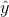

## 14.4“预测”的真正含义是什么？

当我们谈论日常生活中的“预测”时，我们通常指的是在看到数据之前估计某个变量值的能力。然而，该术语通常在线性回归的背景下用于指模型与数据的拟合；估计值（）有时被称为“预测”，独立变量被称为“预测”。这有一个不幸的含义，因为它意味着我们的模型还应该能够预测未来新数据点的值。实际上，模型与用于获取参数的数据集的匹配几乎总是优于模型与新数据集的匹配（copas 1983）。

作为一个例子，让我们从 NHANES 中选取 48 名儿童为样本，并拟合一个体重回归模型，该模型包括几个回归因子（年龄、身高、看电视和使用电脑的时间以及家庭收入）及其相互作用。

```r
# create dataframe with children with complete data on all variables
NHANES_child <-
  NHANES %>%
  drop_na(Height, Weight, TVHrsDayChild, HHIncomeMid, CompHrsDayChild, Age) %>%
  dplyr::filter(Age < 18)
```

```r
# create function to sample data and compute regression on in-sample and out-of-sample data

get_sample_predictions <- function(sample_size, shuffle = FALSE) {
  # generate a sample from NHANES
  orig_sample <-
    NHANES_child %>%
    sample_n(sample_size)

  # if shuffle is turned on, then randomly shuffle the weight variable
  if (shuffle) {
    orig_sample$Weight <- sample(orig_sample$Weight)
  }
  # compute the regression line for Weight, as a function of several
  # other variables (with all possible interactions between variables)
  heightRegressOrig <- lm(
    Weight ~ Height * TVHrsDayChild * CompHrsDayChild * HHIncomeMid * Age,
    data = orig_sample
  )
  # compute the predictions
  pred_orig <- predict(heightRegressOrig)

  # create a new sample from the same population
  new_sample <-
    NHANES_child %>%
    sample_n(sample_size)

  # use the model fom the original sample to predict the 
  # Weight values for the new sample
  pred_new <- predict(heightRegressOrig, new_sample)

  # return r-squared and rmse for original and new data
  return(c(
    cor(pred_orig, orig_sample$Weight)**2,
    cor(pred_new, new_sample$Weight)**2,
    sqrt(mean((pred_orig - orig_sample$Weight)**2)),
    sqrt(mean((pred_new - new_sample$Weight)**2))
  ))
}
```

```r
# implement the function
sim_results <- 
  replicate(100, get_sample_predictions(sample_size = 48, shuffle = FALSE))

sim_results <- 
  t(sim_results) %>%
  data.frame()

mean_rsquared <-
  sim_results %>%
  summarize(
    rmse_original_data = mean(X3),
    rmse_new_data = mean(X4)
  )

pander(mean_rsquared)
```

<colgroup><col style="width: 29%"> <col style="width: 20%"></colgroup> 
| RMSE_ 原始数据 | RMSE_ 新数据 |
| --- | --- |
| 2.97 条 | 25.72 美元 |

在这里，我们看到，虽然模型与原始数据相匹配显示出非常好的拟合（每个人只减去几磅），但同一个模型在预测从同一人群中抽样的新儿童的体重值（每个人减去 25 磅以上）方面做得更差。这是因为我们指定的模型非常复杂，因为它不仅包括每个单独的变量，而且还包括它们的所有可能组合（即它们的 _ 交互 _），从而产生一个具有 32 个参数的模型。由于这几乎和数据点一样多的系数（即 48 个孩子的身高），模型 _ 对数据进行了过度拟合 _，就像我们在[5.4 节](#overfitting)中最初的过度拟合示例中的复杂多项式曲线一样。

另一种观察过度拟合效果的方法是观察如果我们随机地改变权重变量的值会发生什么。随机改变该值应该使得无法从其他变量预测权重，因为它们不应该有系统的关系。

```r
print("using shuffled y variable to simulate null effect")
```

```r
## [1] "using shuffled y variable to simulate null effect"
```

```r
sim_results <- 
  replicate(100, get_sample_predictions(sample_size = 48, shuffle = TRUE))

sim_results <- 
  t(sim_results) %>%
  data.frame()

mean_rsquared <-
  sim_results %>%
  summarize(
    rmse_original_data = mean(X3),
    rmse_new_data = mean(X4)
  )
pander(mean_rsquared)
```

<colgroup><col style="width: 29%"> <col style="width: 20%"></colgroup> 
| rmse_original_data | rmse_new_data |
| --- | --- |
| 7.56 条 | 第 60.1 条 |

这向我们表明，即使没有真正的关系需要建模（因为疏解应该消除了关系），复杂的模型在预测中仍然显示非常低的错误，因为它适合特定数据集中的噪声。然而，当该模型应用于一个新的数据集时，我们会发现错误要大得多，这是应该的。

### 14.4.1 交叉验证

为了帮助解决过拟合问题而开发的一种方法是 _ 交叉验证 _。这种技术通常用于机器学习领域，该领域的重点是构建能够很好地概括为新数据的模型，即使我们没有新的数据集来测试模型。交叉验证背后的想法是，我们反复地适应我们的模型，每次都会遗漏数据的一个子集，然后测试模型预测每个被保留的子集中值的能力。


图 14.9 交叉验证程序示意图。

让我们看看这对于我们的重量预测示例是如何工作的。在这种情况下，我们将执行 12 倍交叉验证，这意味着我们将把数据分成 12 个子集，然后将模型拟合 12 次，在每种情况下，去掉其中一个子集，然后测试模型准确预测所持有的因变量值的能力。-找出数据点。R 中的`caret`包使我们能够轻松地跨数据集运行交叉验证：

```r
# create a function to run cross-validation
# returns the r-squared for the out-of-sample prediction

compute_cv <- function(d, nfolds = 12) {
  # based on https://quantdev.ssri.psu.edu/tutorials/cross-validation-tutorial
  train_ctrl <- trainControl(method = "cv", number = nfolds)
  model_caret <- train(
    Weight ~ Height * TVHrsDayChild * CompHrsDayChild * HHIncomeMid * Age,
    data = d,
    trControl = train_ctrl, # folds
    method = "lm"
  ) # specifying regression model

  r2_cv <- mean(model_caret$resample$Rsquared)
  rmse_cv <- mean(model_caret$resample$RMSE)
  return(c(r2_cv, rmse_cv))
}
```

使用此函数，我们可以对来自 nhanes 数据集的 100 个样本运行交叉验证，并计算交叉验证的 RMSE，以及原始数据和新数据集的 RMSE，正如我们上面计算的那样。

```r
#implement the function
sim_results <- 
  replicate(100, get_sample_predictions_cv(sample_size = 48, shuffle = FALSE))

sim_results <- 
  t(sim_results) %>%
  data.frame()

mean_rsquared <-
  sim_results %>%
  summarize(
    mse_original_data = mean(X4),
    mse_new_data = mean(X5),
    mse_crossvalidation = mean(X6)
  )
pander(mean_rsquared)
```

<colgroup><col style="width: 27%"> <col style="width: 20%"> <col style="width: 29%"></colgroup> 
| MSE 原始数据 | MSE 新数据 | MSE 交叉验证 |
| --- | --- | --- |
| 2.98 年 | 21.64 条 | 29.29 条 |

在这里，我们看到交叉验证给了我们一个预测准确性的估计，它比我们用原始数据集看到的膨胀的准确性更接近我们用一个全新数据集看到的结果——事实上，它甚至比新数据集的平均值更悲观。可能是因为只有部分数据被用来训练每个模型。我们还可以确认，当因变量随机变动时，交叉验证能准确估计预测精度：

<colgroup><col style="width: 29%"> <col style="width: 22%"> <col style="width: 30%"></colgroup> 
| rmse_original_data | rmse_new_data | RMSE 交叉验证 |
| --- | --- | --- |
| 第 7.9 条 | 第 73.7 条 | 75.31 条 |

在这里，我们再次看到交叉验证给了我们一个预测准确性的评估，这与我们对新数据的预期更为接近，而且更为悲观。

正确使用交叉验证是很困难的，建议在实际使用之前咨询专家。然而，本节希望向您展示三件事：

*   “预言”并不总是意味着你认为它意味着什么。
*   复杂的模型会严重地过度拟合数据，这样即使没有真正的预测信号，人们也能看到似乎很好的预测。
*   除非使用适当的方法，否则您应该非常怀疑地查看有关预测准确性的声明。