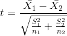
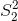

## 15.1 学生 T 考试

在上一章的假设检验中，我们已经遇到了学生 t 统计量。这一统计数据为我们提供了一种测试两组独立观测值之间差异的方法；我们将在本章后面的部分讨论观测值不独立的情况。作为提醒，两个独立组比较的 t 统计量计算如下：



其中和是两组的平均值，和是每组的方差，和是两组的大小。在均值无差的零假设下，该统计量按自由度为 n-2 的 t 分布进行分布（因为我们计算了两个参数估计，即两组的均值）。我们可以使用`t.test()`函数计算 r 中的 t 检验。在本例中，我们从吸烟大麻与更大的电视收看量相关的具体假设开始，因此我们将使用单尾测试。由于 t.test 函数按字母顺序排列条件，“no”组排在第一位，因此我们需要测试第一组是否小于第二组（“yes”）的替代假设；因此，我们指定“less”作为替代。

```r
# compute t test for tv watching as function of marijuana use
t.test(
  TVHrsNum ~ RegularMarij,
  data = NHANES_sample,
  var.equal = TRUE,
  alternative = 'less'
)
```

```r
## 
##  Two Sample t-test
## 
## data:  TVHrsNum by RegularMarij
## t = -3, df = 200, p-value = 0.001
## alternative hypothesis: true difference in means is less than 0
## 95 percent confidence interval:
##   -Inf -0.29
## sample estimates:
##  mean in group No mean in group Yes 
##               2.2               2.8
```

在这种情况下，我们发现，在预期的方向上，两组之间有统计学上的显著差异——普通的大麻吸烟者看更多的电视。