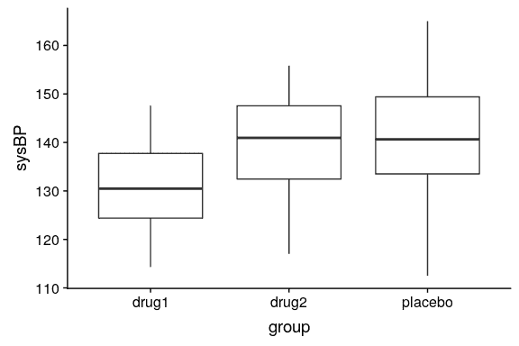
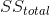
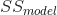
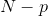
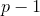
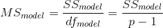
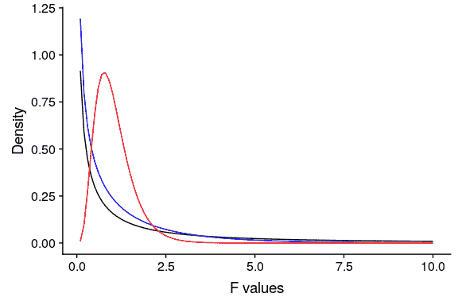

## 15.5 比较两种以上的方法

通常我们想比较两种以上的方法来确定它们之间是否存在差异。假设我们正在分析一项治疗高血压的临床试验的数据。在研究中，志愿者被随机分为三种情况：药物 1、药物 2 或安慰剂。让我们生成一些数据并绘制它们（参见图[15.6](#fig:DrugTrial)）



图 15.6 显示我们临床试验中三个不同组的血压的方框图。

### 15.5.1 方差分析

我们首先要验证一个无效的假设，即所有组的平均值都是相等的——也就是说，两种治疗都没有任何效果。我们可以使用一个名为 _ 方差分析 _（anova）的方法来实现这一点。这是心理统计学中最常用的方法之一，我们将只触及表面。方差分析背后的基本思想是我们在关于一般线性模型的章节中已经讨论过的，事实上，方差分析只是这种模型具体实现的一个名称。

记住，从上一章我们可以将数据中的总方差（）划分为模型（）解释的方差和非模型（）解释的方差。然后我们可以通过除以它们的自由度来计算每一个的 _ 均方 _；对于误差，这是（其中是我们计算的平均数），对于模型，这是：




通过方差分析，我们想要检验在平均值之间没有差异的无效假设下，模型所解释的方差是否大于我们所期望的偶然值。而对于 t 分布，零假设下的期望值是零，这里不是这样，因为平方和总是正数。幸运的是，还有另一个标准分布描述了在零假设下平方和的比率是如何分布的：f 分布（见图[15.7](#fig:FDist)）。这个分布有两个自由度，分别对应分子的自由度（在本例中是模型）和分母（在本例中是误差）。



图 15.7 零假设下，自由度不同值的 F 分布。

为了创建一个方差分析模型，我们扩展了您在上一章中遇到的 _ 伪编码 _ 的思想。记住，对于比较两个平均值的 t 检验，我们创建了一个虚拟变量，其中一个条件的值为 1，另一个条件的值为零。在这里，我们通过创建两个虚拟变量来扩展这一想法，一个是为药物 1 状态编码，另一个是为药物 2 状态编码。正如在 t 检验中一样，我们将有一个条件（在本例中是安慰剂）没有一个虚拟变量，因此代表了与其他变量进行比较的基线；其平均值定义了模型的截距。让我们创建药物 1 和 2 的虚拟编码。

```r
# create dummy variables for drug1 and drug2
df <-
  df %>%
  mutate(
    d1 = as.integer(group == "drug1"), # 1s for drug1, 0s for all other drugs
    d2 = as.integer(group == "drug2")  # 1s for drug2, 0s for all other drugs
  )
```

现在，我们可以使用上一章中使用的相同方法来拟合模型：

```r
# fit ANOVA model
lmResultANOVA <- lm(sysBP ~ d1 + d2, data = df)
summary(lmResultANOVA)
```

```r
## 
## Call:
## lm(formula = sysBP ~ d1 + d2, data = df)
## 
## Residuals:
##     Min      1Q  Median      3Q     Max 
## -29.084  -7.745  -0.098   7.687  23.431 
## 
## Coefficients:
##             Estimate Std. Error t value Pr(>|t|)    
## (Intercept)   141.60       1.66   85.50  < 2e-16 ***
## d1            -10.24       2.34   -4.37  2.9e-05 ***
## d2             -2.03       2.34   -0.87     0.39    
## ---
## Signif. codes:  0 '***' 0.001 '**' 0.01 '*' 0.05 '.' 0.1 ' ' 1
## 
## Residual standard error: 9.9 on 105 degrees of freedom
## Multiple R-squared:  0.169,  Adjusted R-squared:  0.154 
## F-statistic: 10.7 on 2 and 105 DF,  p-value: 5.83e-05
```

这个命令的输出为我们提供了两件事。首先，它向我们展示了每一个虚拟变量的 t 检验结果，这基本上告诉我们每一个条件是否与安慰剂不同；药物 1 似乎不同，而药物 2 则不同。但是，请记住，如果我们想要解释这些测试，我们需要更正 p 值，以说明我们已经进行了多个假设测试；我们将在下一章中看到如何进行此操作的示例。

记住，我们开始想要测试的假设是，任何条件之间是否存在任何差异；我们将其称为 _ 综合假设测试，这是由 F 统计量提供的测试。F 统计量基本上告诉我们，我们的模型是否比只包含截距的简单模型更好。在这种情况下，我们看到 f 检验是非常显著的，这与我们的印象一致，即两组之间确实存在差异（事实上，我们知道存在差异，因为我们创建了数据）。_