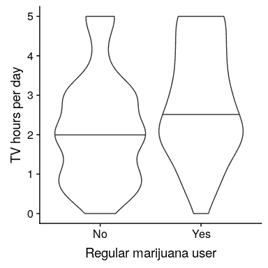

# 15 比较方法

在统计学中，我们要问的最常见的问题之一是两个不同组的平均值是否存在差异。假设我们想知道经常吸食大麻的人是否会看更多的电视。我们可以使用 nhanes 数据集来问这个问题；让我们从数据集中抽取 200 个人的样本，测试每天看电视的时间是否与正常使用大麻有关。图[15.1](#fig:PotTVViolin)显示了使用小提琴绘图的这些数据。

```r
# create sample with tv watching and marijuana use
NHANES_sample <-
  NHANES_adult %>%
  drop_na(TVHrsDay, RegularMarij) %>%
  mutate(
    TVHrsNum = recode( #recode character values into numerical values
      TVHrsDay,
      "More_4_hr" = 5,
      "4_hr" = 4, 
      "2_hr" = 2,
      "1_hr" = 1, 
      "3_hr" = 3, 
      "0_to_1_hr" = 0.5,
      "0_hrs" = 0
    )
  ) %>%
  sample_n(200)
```



图 15.1 显示电视观看分布的小提琴图，由正常的大麻使用分开。