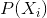
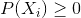
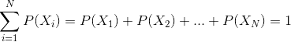

## 3.1 什么是概率？

非正式地，我们通常认为概率是一个描述某些事件发生可能性的数字，范围从零（不可能）到一（确定）。有时概率会用百分比表示，从 0 到 100 不等，正如天气预报预测今天有 20%的可能下雨一样。在每种情况下，这些数字表示特定事件的可能性。

为了将概率论形式化，我们首先需要定义一些术语：

*   实验是产生或观察结果的任何活动。例如，掷硬币、掷 6 面骰子，或者尝试新的工作路线，看它是否比旧路线快。
*   **样本空间**是一个实验的可能结果集。对于硬币翻转，样本空间为 h，t，其中括号代表样本空间，h/t 代表头部/尾部。对于模具，样本空间为 1,2,3,4,5,6。对于工作所需的时间量，样本空间都是可能大于零的实数（因为它不能用负的时间到达某个地方，至少目前还不能）。
*   **事件**是示例空间的子集。在这里，我们将主要关注 _ 基本事件 _，这些事件恰好包含一个可能的结果，例如掷硬币时的头部、掷骰子时的 4 个骰子，或通过新路线回家的 21 分钟。

既然我们有了这些定义，我们就可以概括概率的形式特征，这是俄罗斯数学家安德烈·科尔莫戈罗夫首先定义的。如果是事件概率：

*   概率不能为负：

*   样本空间中所有结果的总概率为 1。我们可以使用求和符号来表示它：

这被解释为“把所有的 n 个基本事件，我们从 1 到 n，加起来它们的概率。这些必须加为 1。“这意味着任何单个事件的概率不能大于 1: