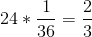
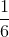
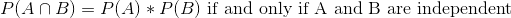
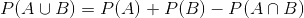
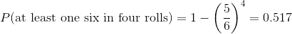
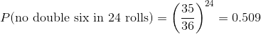
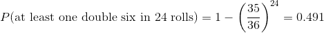

## 3.2 我们如何确定概率？

既然我们知道了概率是什么，那么我们如何才能真正知道任何特定事件的概率是什么呢？

### 3.2.1 个人意见

假设我问你，如果伯尼·桑德斯获得民主党提名而不是希拉里·克林顿的话，他在 2016 年赢得美国总统大选的可能性有多大。这里的样本空间是桑德斯赢了，桑德斯输了，但我们实际上不能做实验来找到结果。然而，大多数了解选举的人都愿意对这一事件的可能性进行猜测。在许多情况下，个人知识和/或意见是我们确定事件发生概率的唯一指南，但这在科学上并不令人满意。

### 3.2.2 经验频率

另一种确定事件发生概率的方法是多次进行实验，并计算每个事件发生的频率。根据不同结果的相对频率，我们可以计算出每个结果的概率。比如说，我们有兴趣知道旧金山下雨的可能性。首先，我们必须定义实验---假设我们将在 2017 的每一天查看国家气象服务数据（可以从 [HTTPS://www. NCDC.NOAAGOV/](https://www.ncdc.noaa.gov/)下载），并确定在旧金山市中心的气象站是否有雨。

```r
# load data on rain in San Francisco and compute probability
SFrain <- read_csv("data/SanFranciscoRain/1329219.csv")

# create a new variable indicating whether it rained on each day
SFrain <- 
  SFrain %>%
  mutate(rainToday = as.integer(PRCP > 0))

SFrain_summary <- 
  SFrain %>%
  summarize(
    nRainyDays = sum(rainToday),
    nDaysMeasured = n(),
    pRainInSF = nRainyDays / nDaysMeasured
  ) 

pander(SFrain_summary)
```

<colgroup><col style="width: 18%"> <col style="width: 22%"> <col style="width: 15%"></colgroup> 
| 每天 | 标准测量值 | 普拉宁斯 |
| --- | --- | --- |
| 73 | 365 个 | 0.2 条 |

根据这些数据，2017 年有 73 个雨天。为了计算旧金山的降雨概率，我们简单地将雨天数除以（365），给出 P（SF 的雨在 2017）＝0.2。

我们怎么知道经验概率给了我们正确的数字？这个问题的答案来自于 _ 大数定律 _，它表明随着样本量的增加，经验概率将接近真实概率。我们可以通过模拟大量的硬币翻转来看到这一点，并查看我们对每次翻转后头部概率的估计。在后面的章节中，我们将花费更多的时间讨论模拟；现在，假设我们有一种计算方法来为每个硬币翻转生成随机结果。


图 3.1 大数定律的演示。一枚硬币被翻转了 30000 次，每次翻转后，头部的概率是根据收集到的头部和尾部的数量来计算的。以 0.5 的真实概率结算的概率大约需要 15000 次翻转。

图[3.1](#fig:FlipSim)显示，随着样本数量（即硬币翻转试验）的增加，头部的估计概率收敛到 0.5 的真实值。但是，请注意，当样本量较小时，估计值可能与真实值相差甚远。在 2017 年佐治亚州美国参议院特别选举中，看到了一个现实世界的例子，这场选举让共和党人罗伊·摩尔与民主党人道格·琼斯相提并论。图[3.2](#fig:ElectionResults)显示了随着越来越多的选票被计算在内，当晚每个候选人所报告的选票的相对数量。晚上早些时候，投票数特别不稳定，从琼斯最初的领先优势到摩尔领先的很长一段时间，直到琼斯最终领先赢得比赛。


图 3.2 2017 年 12 月 12 日美国佐治亚州参议院席位特别选举的投票相对比例，与选区报告百分比的函数关系。这些数据摘自[https://www.ajc.com/news/national/alabama-senate-race-live-updates-roy-moore-doug-jones/kpfkdaweixicw3fhjxqi/](https://www.ajc.com/news/national/alabama-senate-race-live-updates-roy-moore-doug-jones/KPRfkdaweoiXICW3FHjXqI/)

这两个例子表明，虽然大样本最终会收敛于真实概率，但小样本的结果可能会相差很远。不幸的是，许多人忘记了这一点，并曲解了小样本的结果。心理学家丹尼·卡尼曼和阿莫斯·特沃斯基（Danny Kahneman and Amos Tversky）称之为“小数字定律”（HTG0），他们发现人们（甚至是受过训练的研究人员）的行为通常就好像大数字定律甚至适用于小样本一样，对小数据集的结果给予了过多的信任。.在整个过程中，我们将看到一些例子，说明在小样本的基础上生成统计结果会有多不稳定。

### 3.2.3 经典概率

我们中的任何一个人都不太可能投过几万次硬币，但我们仍然愿意相信，倒头的概率是 0.5。这反映了另一种计算概率的方法的使用，我们称之为 _ 经典概率 _。在这种方法中，我们直接根据我们对形势的了解来计算概率。

经典概率源于对骰子和纸牌等机会游戏的研究。一个著名的例子来自一个法国赌徒遇到的一个问题，这个赌徒的名字是“chevalier de m_r_”。德玛 _r_ 玩了两种不同的骰子游戏：第一种是在六面骰子的四个骰子上赌至少一个六的机会，第二种是在两个骰子的 24 个骰子上赌至少一个六的机会。他希望在这两次赌博中都能赢，但他发现，尽管他在第一次赌博中平均赢了钱，但在第二次赌博中却多次输了钱。为了理解这一点，他求助于他的朋友，数学家布莱斯·帕斯卡，他现在被公认为概率论的创始人之一。

我们如何用概率论来理解这个问题？在经典概率论中，我们首先假设样本空间中的所有基本事件都同样可能发生；也就是说，当您滚动一个骰子时，所有可能的结果（1,2,3,4,5,6）都同样可能发生。（不允许加载骰子！）考虑到这一点，我们可以将任何单个结果的概率计算为：


对于六面模具，每个单独结果的概率为 1/6。

这很好，但是 de m_r_ 对更复杂的事件感兴趣，比如多个骰子掷骰子时发生的事情。我们如何计算复杂事件（单个事件的联合）的概率，比如在第一个 _ 或 _ 中滚动一个事件或第二个事件？De M_r_ 认为（错误地，我们将在下面看到），他可以简单地将单个事件的概率相加，以计算组合事件的概率，这意味着在第一卷或第二卷上滚动一个事件的概率将计算如下：


De M_r_ 基于此推断，四卷中至少六卷的概率是每个单卷的概率之和：。同样地，他推断，因为掷骰子时两个 6 的概率是 1/36，那么两个骰子的 24 卷骰子中至少一个 6 的概率是。然而，尽管他总是在第一次下注中赢了钱，但在第二次下注中却输了钱。什么给予？

为了理解 de m_r_ 的误差，我们需要引入概率论的一些规则。第一个是减法规则（htg0），即：


其中表示“非 a”。这个规则直接从我们上面讨论的公理中推导出来；因为 a 和是唯一可能的结果，所以它们的总概率必须加为 1。例如，如果在一次投掷中滚动一个物体的概率是，那么滚动除一个物体以外的任何物体的概率是。

第二条规则告诉我们如何计算联合事件的概率——也就是说，两个事件同时发生的概率。这个版本的规则告诉我们，在特殊情况下，当两个事件彼此独立时，如何计算这个量；我们稍后将确切地了解 _ 独立性 _ 的概念意味着什么，但现在我们可以想当然地认为这两个掷模是不独立的。ndent 事件。



因此，向两个辊中的每一辊投掷六个辊的概率是。

第三条规则告诉我们如何将概率相加——这里我们看到了 de m_r_ 错误的来源。加法规则告诉我们：



也就是说，A 或 B 发生的概率是通过将单个概率相加，然后减去两者同时发生的可能性来确定的。在某种意义上，这会阻止我们将这些实例计数两次。假设我们想找出在两个投掷中的任何一个上滚动 6 的概率。根据我们的规则：


图 3.3 这个矩阵中的每个单元格表示一个 die 的两次 throw 的一个结果，其中列表示第一次 throw，行表示第二次 throw。浅蓝色显示的单元格表示第一次或第二次投掷中有一个单元格的单元格；其余的单元格显示为深蓝色。

让我们使用一个图形化的描述来获得这个规则的不同视图。图[3.3](#fig:ThrowMatrix)显示了一个表示所有可能抛出的矩阵，并突出显示了在第一次或第二次抛出中涉及一个抛出的单元格。如果你用浅蓝色数数这些细胞，你会发现有 11 个这样的细胞。这说明了为什么加法规则给出了与 de m_r_ 不同的答案；如果我们像他那样简单地把两次掷骰的概率相加，那么我们将对两次掷骰都计算（1,1），而实际上只计算一次。

### 3.2.4 解决 de m_r_ 的问题

布莱斯·帕斯卡利用概率法则提出了一个解决德玛·R·_ 问题的方法。首先，他意识到，从一个组合中计算出至少一个事件的概率是很困难的，而计算出某个事件在多个事件中不发生的概率相对来说比较容易——这只是单个事件概率的乘积。因此，他不是计算四卷中至少六卷的概率，而是计算所有卷中没有混乱的概率：


然后，他利用四卷纸中无六个的概率是四卷纸中至少六个六个的补数（因此必须求和为一），并使用减法规则计算利息概率：



德玛 __ 赌他会投至少六分之一的骰子的概率大于 0.5，这解释了德玛 ____ 为什么在这个赌注上平均赚钱。

但是，德姆雷尔的第二个赌注呢？帕斯卡使用了同样的技巧：



这一结果的概率略低于 0.5，这说明了为什么在这场赌博中，de m_r_ 平均赔钱。