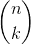
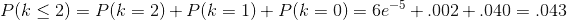

## 3.3 概率分布

我们通常希望能够量化实验中任何可能值的概率。例如，在 2018 年 1 月 20 日，篮球运动员斯蒂芬·科里在与休斯顿火箭队的比赛中 4 次罚球中只有 2 次命中。我们知道库里在整个赛季的罚球命中率是 0.91，所以他在一场比赛中只命中 50%的罚球似乎是不太可能的，但这到底有多不可能呢？我们可以使用理论概率分布来确定这一点；在本课程中，我们将遇到许多这样的概率分布，每个概率分布都适合描述不同类型的数据。在这种情况下，我们使用 _ 二项式 _ 分布，它提供了一种方法来计算在给定一些已知的成功概率的情况下，许多“伯努利试验”（即，成功或失败的试验，两者之间没有任何结果）中一些成功的概率。每次审判。此分布定义为：


这是指成功概率为 p 时 n 次试验中 k 次成功的概率。您可能不熟悉，这被称为 _ 二项式系数 _。二项式系数也被称为“n-choose-k”，因为它描述了从 n 个项目中选择 k 个项目的不同方法的数量。二项式系数计算如下：


解释点在哪里！！）指数字的 _ 阶乘 _：


以斯蒂芬·库里的罚球为例：


这表明，考虑到库里的总罚球率，他不太可能在 4 次罚球中只命中 2 次。这只是为了表明不太可能的事情实际上发生在现实世界中。

### 3.3.1 累积概率分布

通常我们不仅想知道某个特定值的可能性有多大，而且想知道找到一个和某个特定值一样极端或更极端的值的可能性有多大。为了回答这个问题，我们可以使用 _ 累积 _ 概率分布；而标准概率分布告诉我们某个特定值的概率，而累积分布告诉我们一个值比它大或大（或小或小）的概率。Me 特定值。

在罚球的例子中，我们可能想知道：如果斯蒂芬·库里的罚球概率为 0.91，那么他在四个罚球中命中 2 个（htg0）或更少（htg1）的概率是多少。为了确定这一点，我们可以简单地使用二项式概率方程并插入 k 的所有可能值：



在许多情况下，可能的结果数量对于我们来说太大，无法通过列举所有可能的值来计算累积概率；幸运的是，它可以直接计算。对于二项式，我们可以使用`pbinom()`函数在 r 中执行此操作：

```r
# compute cumulative probability distribution for Curry's free throws

tibble(
  numSuccesses = seq(0, 4)
) %>%
  mutate(
    probability = pbinom(numSuccesses, size = 4, prob = 0.91)
  ) %>% 
  pander()
```

<colgroup><col style="width: 20%"> <col style="width: 20%"></colgroup> 
| 无数次成功 | 可能性 |
| --- | --- |
| 0 | 0 |
| 1 个 | 0.003 个 |
| 二 | 0.043 个 |
| 三 | 0.314 个 |
| 4 | 1 |

由此我们可以看出咖喱在 4 次尝试中 2 次或更少的罚球机会是 0.043。