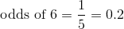
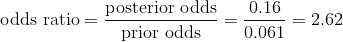

## 3.9 优势比

最后一节的结果显示，基于阳性的 PSA 测试结果，个体患癌症的可能性仍然相当低，尽管它比我们知道测试结果之前大了两倍多。我们通常希望更直接地量化概率之间的关系，我们可以将它们转换为 _ 概率 _，它表示发生或不发生事件的相对可能性：

在我们的 PSA 例子中，患癌症的几率（假设阳性测试）是：

这告诉我们，即使测试呈阳性，患癌症的几率也相当低。相比之下，在一次掷骰子中掷 6 的几率是：

另一方面，这也是许多医学研究人员越来越担心在相对不常见的情况下使用广泛的筛查测试的原因；大多数阳性结果将被证明是假阳性。

我们也可以通过计算所谓的 _ 比值比 _ 来比较不同的概率，这正是它听起来的样子。例如，假设我们想知道阳性测试会增加患者患癌症的几率。我们可以首先计算 _ 先验概率 _——也就是说，在我们知道这个人做了阳性测试之前的概率。这些是使用基本利率计算的：

然后，我们可以将其与后验概率进行比较，后验概率通过后验概率计算得出：

这告诉我们，鉴于阳性测试结果，患癌症的几率增加了 2.62。