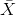
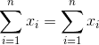

## 5.2 统计建模：示例

让我们来看一个使用 nhanes 中的数据将模型拟合到数据的示例。特别是，我们将尝试在 nhanes 样本中建立儿童身高的模型。首先，让我们加载数据并绘制它们（参见图[5.1](#fig:childHeight)）。


图 5.1 NHANES 儿童身高柱状图。

请记住，我们希望尽可能简单地描述数据，同时仍然捕获它们的重要特性。我们能想象的最简单的模型是什么，它仍然能够捕获数据的本质？数据集中最常见的值（我们称之为 _ 模式 _）如何？R 没有内置的模式函数，所以我们将首先创建一个，我们称之为`getmode()`。

```r
# create function to compute mode and apply to child height data from NHANES
getmode <- function(v) {
  uniqv <- unique(v)
  return(uniqv[which.max(tabulate(match(v, uniqv)))])
}

height_mode <- getmode(NHANES_child$Height)

paste("mode of children's height from NHANES:", height_mode)
```

```r
## [1] "mode of children's height from NHANES: 166.5"
```

鉴于此，我们针对单个数据点的模型将是：


这就用一个数字重新定义了 1691 个孩子的整个集合，如果我们想预测任何一个新孩子的身高，那么我们的猜测将是相同的数字：166.5 厘米。

这个模型有多好？一般来说，我们用误差来定义模型的优度，它代表了模型和数据之间的差异；所有事物都是相等的，产生较低误差的模型就是更好的模型。

```r
# compute error compared to the mode and plot histogram

error_mode <- NHANES_child$Height - height_mode
sprintf("average error from mode (cm): %0.2f", mean(error_mode))
```

```r
## [1] "average error from mode (cm): -28.80"
```

我们发现平均个体的误差相当大，为-28.8 厘米。我们想要一个平均误差为零的模型，结果是如果我们使用算术平均值（通常称为 _ 平均值 _）作为我们的模型，那么情况就是这样。

平均值（通常用变量上的条表示，如）定义为：


也就是说，它是所有值的总和，除以值的数目。我们可以证明平均误差（因此平均误差）之和为零：




考虑到平均误差为零，这似乎是一个更好的模型。让我们确认一下它是正确的。

```r
# compute error from mean

error_mean <- NHANES_child$Height - mean(NHANES_child$Height)
sprintf("average error for mean (cm): %e", mean(error_mean))
```

```r
## [1] "average error for mean (cm): -9.864171e-15"
```


图 5.2 平均值误差分布。

这里的平均误差是一个非常小的数字，虽然技术上不是零；我们稍后将在课程中讨论为什么会发生这种情况（这是由于计算机如何表示数字），但现在您可以将其视为接近零，称之为零。

尽管平均误差的平均值为零，但从图[5.2](#fig:meanError)中的柱状图可以看出，每个个体仍然存在一定程度的误差；有些是正的，有些是负的，而这些误差相互抵消。出于这个原因，我们通常用某种将正错误和负错误都算作坏的度量来总结错误。我们可以使用每个误差值的绝对值，但更常见的是使用平方误差，这是我们将在本课程后面看到的原因。

有几种常见的方法来总结在本书的不同点上会遇到的平方误差，因此了解它们之间的关系是很重要的。首先，我们可以简单地把它们加起来；这被称为 _ 平方误差之和 _。我们通常不使用它的原因是它的大小取决于数据点的数量，所以除非我们观察相同数量的观测结果，否则很难解释。其次，我们可以取平方误差值的平均值，即 _ 平均平方误差（mse）_。但是，由于我们在求平均值之前对这些值进行了平方处理，因此它们与原始数据的比例不同；它们位于中。由于这个原因，我们也经常采用 mse 的平方根，我们称之为 _ 均方根误差（rmse）_，因此它与原始值的单位相同（在本例中为厘米）。

```r
# compute and print RMSE for mean and mode
rmse_mean <- sqrt(mean(error_mean**2))

rmse_mode <- sqrt(mean(error_mode**2))

print(paste("Mode: root mean squared error (centimeters):", rmse_mode))
```

```r
## [1] "Mode: root mean squared error (centimeters): 39.4197926582947"
```

```r
print(paste("Mean: root mean squared error (centimeters):", rmse_mean))
```

```r
## [1] "Mean: root mean squared error (centimeters): 26.9116738708646"
```

这表明平均值有相当大的误差——任何数据点平均距离平均值大约 27 厘米——但它仍然比模式好得多。

### 5.2.1 改进我们的模型

我们能想象一个更好的模型吗？请记住，这些数据来自 NHANES 样本中的所有儿童，他们的年龄从 2 岁到 17 岁不等。鉴于年龄范围很广，我们可能期望我们的身高模型也包括年龄。让我们绘制身高和年龄的数据，看看这种关系是否真的存在。


图 5.3 NHANES 儿童的身高，未使用模型（a）绘制，线性模型仅包括年龄（b）或年龄和常数（c），线性模型适合男性和女性年龄的单独影响（d）。

图[5.3](#fig:childHeightLine)的面板 A 中的黑点显示了数据集中的个体，正如我们所期望的，身高和年龄之间似乎有着很强的关系。因此，我们可以建立一个高度与年龄相关的模型：


其中是一个 _ 参数 _，我们用年龄相乘得到最小的误差。您可能已经注意到，这只是一条斜率为的直线，为了看到这一点，让我们在数据顶部用蓝色绘制出最适合的直线（图[5.3](#fig:childHeightLine)中的面板 B）。这个模型显然有问题，因为这条线似乎没有很好地跟踪数据。事实上，这个模型（39.16）的 RMSE 实际上比只包含平均值的模型高！这个问题是因为我们的模型只包括年龄，这意味着当年龄为零时，模型的高度预测值必须为零。即使数据不包括任何年龄为零的子代，但当 x 为零时，该行在数学上被限制为 Y 值为零，这就解释了为什么该行被下拉到较年轻的数据点之下。我们可以通过在我们的模型中包含一个常量来解决这个问题，它基本上代表年龄等于零时高度的估计值；尽管在这个数据集中零岁的年龄是不合理的，但这是一个数学技巧，它将允许模型解释数据。模型为：


其中 _ 常数 _ 是对所有个体的预测增加的一个常量值（我们也称为 _ 截距 _，因为它映射到一条直线方程中的截距上）。稍后我们还将了解如何实际计算这些值；现在，我们将使用 r 中的`lm()`函数计算常量的值，并使用计算出最小的错误。图[5.3](#fig:childHeightLine)中的面板 C 显示了适合于 nhanes 数据的该模型，在该模型中，我们看到线条与数据的匹配比没有常量的要好得多。

```r
## [1] "model: height = 86.11 + 5.48*Age"
```

```r
## [1] "root mean squared error: 8.36"
```

使用这个模型，我们的误差要小得多——平均只有 8.36 厘米。你能想到其他可能与身高有关的变量吗？性别呢？在图[5.3](#fig:childHeightLine)的面板 D 中，我们用分别为男性和女性安装的线条绘制数据。从情节上看，男性和女性之间似乎存在差异，但相对较小，仅在青春期后出现。让我们估计一下这个模型，看看错误是什么样子的：

```r
# compute model fit for modeling with age and gender

model_age_gender <- lm(Height ~ Age + Gender, data = NHANES_child)

rmse_age_gender <-
  NHANES_child %>% 
  add_predictions(model_age_gender, var = "predicted_age_gender") %>% 
  summarise(
    sqrt(mean((Height - predicted_age_gender)**2))
  ) %>% 
  pull()

sprintf(
  "model: height = %0.2f + %0.2f*Age + %0.2f*Gender",
  model_age_gender$coefficients[1],
  model_age_gender$coefficients[2],
  model_age_gender$coefficients[3]
)
```

```r
## [1] "model: height = 84.37 + 5.48*Age + 3.28*Gender"
```

```r
print(sprintf("root mean squared error: %0.2f", rmse_age_gender))
```

```r
## [1] "root mean squared error: 8.20"
```

在图[5.4](#fig:msePlot)中，我们绘制了不同模型的均方根误差值。从这一点上，我们可以看到，从一种模式到另一种模式，从一种模式到另一种模式，从一种模式到另一种模式再到另一种模式+年龄，这个模式变得更好了一点，而且只通过将性别也包括在内，就可以说更好了。


图 5.4 为上述测试的每个模型绘制的均方误差。