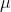

## 5.5 最简单的模型：平均值

我们已经遇到了平均值（或平均值），事实上，大多数人知道平均值，即使他们从未上过统计课。它通常用来描述我们称之为数据集“中心趋势”的东西——也就是说，数据以什么值为中心？大多数人不认为计算平均值是将模型与数据相匹配。然而，这正是我们计算平均值时要做的。

我们已经看到了计算数据样本平均值的公式：


注意，我说过这个公式是专门针对数据的 _ 样本 _ 的，它是从更大的人群中选择的一组数据点。我们希望通过一个样本来描述一个更大的群体——我们感兴趣的全套个体。例如，如果我们是一个政治民意测验者，我们感兴趣的人群可能都是注册选民，而我们的样本可能只包括从这个人群中抽取的几千人。在本课程的后面，我们将更详细地讨论抽样，但现在重要的一点是统计学家通常喜欢使用不同的符号来区分描述样本值的统计数据和描述总体值的参数；在这种情况下，公式 a 表示总体平均值（表示为）为：


其中 n 是整个人口的大小。

我们已经看到，平均值是保证给我们的平均误差为零的汇总统计。平均值还有另一个特点：它是最小化平方误差总和（SSE）的汇总统计。在统计学中，我们称之为“最佳”估计量。我们可以从数学上证明这一点，但我们将在图[5.7](#fig:MinSSE)中以图形方式证明这一点。


图 5.7 平均值作为统计值的证明，可使平方误差之和最小化。使用 nhanes 子高度数据，我们计算平均值（用蓝色条表示）。然后，我们测试其他值的范围，对于每个值，我们从该值计算每个数据点的平方误差之和，该值由黑色曲线表示。我们看到平均值降到平方误差图的最小值。

SSE 的最小化是一个很好的特性，这就是为什么平均值是最常用的统计数据汇总。然而，均值也有一个阴暗面。假设一个酒吧有五个人，我们检查每个人的收入：

```r
# create income data frame

incomeDf <- 
  tibble(
  income = c(48000, 64000, 58000, 72000, 66000),
  person = c("Joe", "Karen", "Mark", "Andrea", "Pat")
)
# glimpse(incomeDf)

panderOptions('digits',2)
pander(incomeDf)
```

<colgroup><col style="width: 12%"> <col style="width: 12%"></colgroup> 
| 收入 | 人 |
| --- | --- |
| 48000 个 | 乔 |
| 64000 个 | 凯伦 |
| 5.8 万 | 作记号 |
| 72000 个 | 安德莉亚 |
| 66000 个 | 拍打 |

```r
sprintf("Mean income: %0.2f", mean(incomeDf$income))
```

```r
## [1] "Mean income: 61600.00"
```

这个平均值似乎是这五个人收入的一个很好的总结。现在让我们看看如果碧昂斯·诺尔斯走进酒吧会发生什么：

```r
# add Beyonce to income data frame

incomeDf <- 
  incomeDf %>% 
  rbind(c(54000000, "Beyonce")) %>% 
  mutate(income = as.double(income))

pander(incomeDf)
```

<colgroup><col style="width: 13%"> <col style="width: 13%"></colgroup> 
| income | person |
| --- | --- |
| 48000 | Joe |
| 64000 | Karen |
| 58000 | Mark |
| 72000 | Andrea |
| 66000 | Pat |
| 5.4E+07 型 | 碧昂斯 |

```r
sprintf("Mean income: %0.2f", mean(incomeDf$income))
```

```r
## [1] "Mean income: 9051333.33"
```

平均值现在接近 1000 万美元，这并不能真正代表酒吧里的任何人——特别是，它受到了碧昂丝价值的巨大驱动。一般来说，平均值对极值非常敏感，这就是为什么在使用平均值汇总数据时，确保没有极值总是很重要的原因。

### 5.5.1 中间值

如果我们想以对异常值不太敏感的方式总结数据，我们可以使用另一种称为 _ 中位数 _ 的统计。如果我们按大小来排序所有的值，那么中值就是中间值。如果有一个偶数的值，那么中间会有两个值，在这种情况下，我们取这两个数字的平均值（即中间点）。

让我们来看一个例子。假设我们要总结以下值：

```r
# create example data frame
dataDf <- 
  tibble(
    values = c(8, 6, 3, 14, 12, 7, 6, 4, 9)
  )

pander(dataDf)
```

<colgroup><col style="width: 11%"></colgroup> 
| 价值观 |
| --- |
| 8 个 |
| 6 |
| 三 |
| 14 |
| 12 个 |
| 7 |
| 6 |
| 4 |
| 9 |

如果我们对这些值进行排序：

```r
# sort values and print
dataDf <-
  dataDf %>% 
  arrange(values)

pander(dataDf)
```

<colgroup><col style="width: 11%"></colgroup> 
| values |
| --- |
| 3 |
| 4 |
| 6 |
| 6 |
| 7 |
| 8 |
| 9 |
| 12 |
| 14 |

中间值是中间值，在本例中是 9 个值中的第 5 个。

平均值最小化平方误差之和，而中位数最小化一个微小的不同数量：绝对误差之和。这就解释了为什么它对异常值不那么敏感——与采用绝对值相比，平方化会加剧较大误差的影响。我们可以在收入示例中看到这一点：

```r
# print income table
pander(incomeDf)
```

<colgroup><col style="width: 13%"> <col style="width: 13%"></colgroup> 
| income | person |
| --- | --- |
| 48000 | Joe |
| 64000 | Karen |
| 58000 | Mark |
| 72000 | Andrea |
| 66000 | Pat |
| 5.4e+07 | Beyonce |

```r
sprintf('Mean income: %.2f',mean(incomeDf$income))
```

```r
## [1] "Mean income: 9051333.33"
```

```r
sprintf('Median income: %.2f',median(incomeDf$income))
```

```r
## [1] "Median income: 65000.00"
```

中位数更能代表整个群体，对一个大的离群值不太敏感。

既然如此，我们为什么要用平均数呢？正如我们将在后面的章节中看到的，平均值是“最佳”估计值，因为与其他估计值相比，它在样本之间的差异较小。这取决于我们是否值得考虑对潜在异常值的敏感性——统计数据都是关于权衡的。