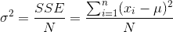
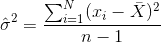

## 5.7 变异性：平均值与数据的拟合程度如何？

一旦我们描述了数据的中心趋势，我们通常还想描述数据的变量——有时也称为“分散度”，这反映了一个事实，即它描述了数据的分散程度。

我们已经遇到了上面的平方误差之和，这是最常用的变异性度量的基础：方差 _ 和标准差 _。一个总体的方差（称为）只是平方误差除以观测次数的总和，也就是说，你之前遇到的 _ 平均平方误差 _。__



其中是人口平均数。标准差就是这个的平方根，也就是我们以前看到的 _ 均方根误差 _。标准偏差是有用的，因为误差的单位与原始数据相同（撤消我们应用于误差的平方）。

我们通常无法访问整个群体，因此我们必须使用一个样本来计算方差，我们称之为，其中“hat”表示这是一个基于样本的估计。的方程式与的方程式相似：



这两个方程之间的唯一区别是我们用 n-1 而不是 n 来除。这与一个基本的统计概念有关：_ 自由度 _。记住，为了计算样本方差，我们首先必须估计样本均值。在估计了这一点之后，数据中的一个值就不再是自由变化的了。例如，假设我们有以下数据点：

```r
# generate example data points

dfDf <- 
  tibble(
    x = c(3, 5, 7, 9, 11)
  )

pander(dfDf)
```

<colgroup><col style="width: 5%"></colgroup> 
| X |
| --- |
| 三 |
| 5 个 |
| 7 |
| 9 |
| 11 个 |

现在我们计算平均值：

```r
# compute mean

meanx <-
  dfDf %>% 
  summarize(
    mean(x)
  ) %>% 
  pull()

sprintf('%0.2f',meanx)
```

```r
## [1] "7.00"
```

因为我们知道这个数据集的平均值是 7，所以我们可以计算出如果缺少某个特定的值会是什么。例如，假设我们要模糊第一个值（3）。这样做之后，我们仍然知道它的值必须是 3，因为 7 的平均值意味着所有值的总和是和。

所以当我们说我们已经“失去”了一定程度的自由，这意味着有一个值在拟合模型后是不能自由改变的。在样本方差的背景下，如果我们不考虑失去的自由度，那么我们对样本方差的估计将是 _ 偏向 _——也就是说，它将小于真实（总体）值。