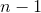

## 5.8 使用模拟了解统计数据

我非常了解使用计算机模拟来理解统计概念，在以后的课程中，我们将深入探讨这些概念的使用。在这里，我们将通过询问在计算样本方差时是否可以确认是否需要从样本大小中减去 1 来介绍这个想法。

让我们将来自 nhanes 数据的整个儿童样本视为我们的“群体”，并查看使用分母中的 n 或 n-1 计算样本方差对数据中大量模拟随机样本的群体方差有多好。现在不要担心细节——我们稍后会回到课程中。

```r
# compare variance estimates using N or N-1 in denominator

population_variance <- 
  NHANES_child %>% 
  summarize(
    var(Height)
  ) %>% 
  pull()

# take 100 samples and estimate the sample variance using both N or N-1  in the demoninator
sampsize <- 50
nsamp <- 1000
varhat_n <- array(data = NA, dim = nsamp)
varhat_nm1 <- array(data = NA, dim = nsamp)

for (i in 1:nsamp) {
  samp <- sample_n(NHANES_child, 1000)[1:sampsize, ]
  sampmean <- mean(samp$Height)
  sse <- sum((samp$Height - sampmean)**2)
  varhat_n[i] <- sse / sampsize
  varhat_nm1[i] <- sse / (sampsize - 1)
}

sprintf("population variance: %.2f", population_variance)
```

```r
## [1] "population variance: 724.67"
```

```r
sprintf("variance estimate(n): %.2f", mean(varhat_n))
```

```r
## [1] "variance estimate(n): 709.03"
```

```r
sprintf("variance estimate(n-1): %.2f", mean(varhat_nm1))
```

```r
## [1] "variance estimate(n-1): 723.50"
```

这表明上述理论是正确的：以为分母的方差估计与以全数据（即总体）为分母计算的方差非常接近，而以为分母计算的方差与真实的 v 值相比有偏差（较小）。值。