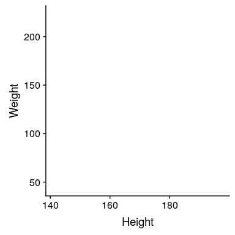
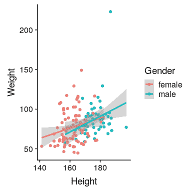

## 6.3 使用 ggplot 在 R 中绘制

在 R 中有许多不同的绘制数据的工具，但我们将重点关注由名为`ggplot2`的包提供的`ggplot()`函数。ggplot 是非常强大的，但是使用它需要了解它的工作原理。

假设我们要创建一个 _ 散点图 _，该散点图绘制了每个成年人的身高和体重，样本来自 nhanes 数据集的 150 人，不同的标记用于表示男性和女性。首先，我们创建示例：

```r
NHANES_sample <- 
  NHANES_adult %>%
  drop_na(Weight, Gender) %>% #remove rows (individuals) with missing values for Weight and Gender
  sample_n(150) #take a random sample of n = 150 rows (individuals)
```

现在让我们设置`ggplot()`命令。这需要我们具体说明两件事。首先，我们需要告诉它从哪个数据帧获取数据（在本例中是`NHANES_sample`）。其次，我们需要通过 _ 美学 _ 函数`aes()`来告诉它要使用的数据框架中的哪些变量。在这种情况下，我们要绘制 X 轴上的高度和 Y 轴上的权重。结果如图[6.4](#fig:emptyPlot)所示：该命令生成一组绘图轴，但实际上没有显示任何数据。

```r
NHANES_sample %>%
  ggplot(aes(x = Height, y = Weight))
```



图 6.4 由 ggplot（）生成的空图框

接下来我们需要添加数据的表示。我们告诉`ggplot`要显示什么的方法是向主`ggplot()`命令添加各种命令。特别是，我们通常需要添加一个 _ 几何体 _ 或“geom”，它指定如何在绘图中排列数据。例如，为了显示每个数据点，我们可以使用`geom_point()`几何图形，如图[6.5](#fig:simpleGeom)所示。每个数据点代表我们的`NHANES_sample`数据集中的一个单独的行，每个行对应于这个数据集中的一个人。

```r
NHANES_sample %>% 
  ggplot(aes(x = Height, y = Weight)) +
  geom_point()
```


图 6.5 简单散点图

最后，我们要根据不同的性别用不同的颜色绘制点。我们只需在美学中添加一个 _ 颜色 _ 关键字，它告诉`geom_point()`函数按性别分开颜色点。如图[6.6](#fig:colorPoints)所示。这个图还显示了一个示例，说明了如何在一个图中包含多个几何层——在本例中，我们使用`geom_smooth()`分别按性别绘制最能描述身高和体重之间关系的线。线条周围的阴影反映了我们对当时估计的信心。

```r
NHANES_sample %>% 
  ggplot(aes(x = Height, y = Weight, color = Gender)) +
  geom_point() +
  geom_smooth(method = "lm")
```



图 6.6 散点图，各点按性别分别着色。