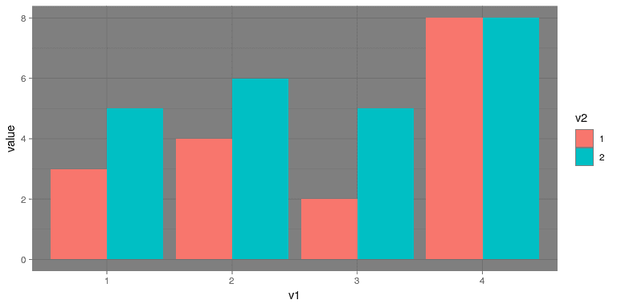
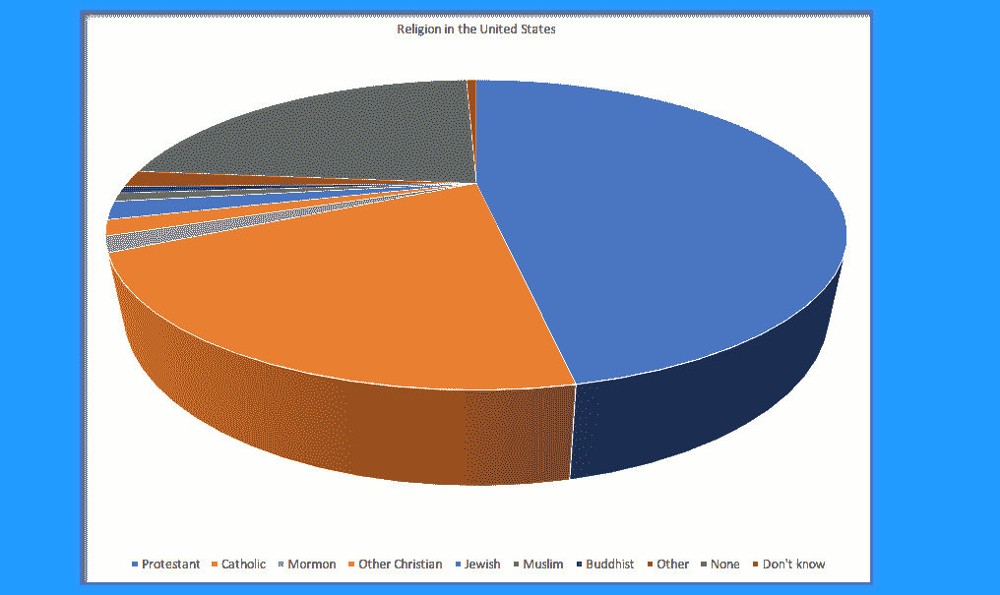

## 6.9 记住人的局限性

人类既有知觉的局限性，也有认知的局限性，这使得一些可视化很难理解。在构建可视化时，务必记住这些内容。

### 6.9.1 知觉限制

许多人（包括我自己）所遭受的一个重要的知觉限制是色盲。这使得很难感知图形中的信息（如图[6.13](#fig:badColors)中的信息），其中元素之间只有颜色对比，但没有亮度对比。除了颜色之外，使用亮度和/或纹理有很大差别的图形元素总是很有帮助的。还有[“色盲友好型”调色板](http://www.cookbook-r.com/Graphs/Colors_(ggplot2)/#a-colorblind-friendly-palette)可用于 R

图 6.13 仅依赖颜色对比度的坏图形示例。

即使对于拥有完美色觉的人来说，也存在一些知觉上的限制，使得某些情节无效。这就是统计学家从不使用饼图的原因之一：人类很难理解形状体积的差异。图[6.14](#fig:pieChart)中的饼图（显示了与上面显示的宗教信仰相同的数据）显示了这有多复杂。

图 6.14 饼图的一个例子，强调了理解不同饼图切片的相对体积的困难。

这个阴谋很可怕，有几个原因。首先，它需要将大量的颜色与图形底部非常小的补丁区分开。第二，视觉角度扭曲了相对数字，因此天主教的饼状楔形比无饼状楔形要大得多，而事实上，无饼状楔形的数字稍大（22.8%对 20.8%），如图[6.9](#fig:chartJunk)所示。第三，通过将图例与图形分开，它要求查看器将信息保存在工作内存中，以便在图形和图例之间进行映射，并进行许多“表查找”，以便不断将图例标签与可视化匹配。最后，它使用的文本太小，不放大就无法阅读。

使用更合理的方法绘制数据（图[6.15](#fig:religionBars)），我们可以更清楚地看到模式。此图可能不像使用 Excel 生成的饼图那样华丽，但它更有效、更准确地表示了数据。

图 6.15 更清晰地展示了宗教隶属关系数据（摘自[http://www.pewforum.org/steerial-landscape-study/](http://www.pewforum.org/religious-landscape-study/)）。

此图允许查看者根据杆**的**长度**沿公共比例**（Y 轴）进行比较。在基于这些感知元素解码差异时，人类往往比基于区域或颜色更准确。