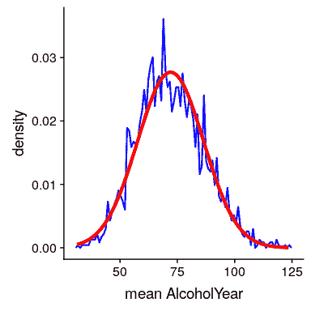

## 7.4 中心极限定理

中心极限定理告诉我们，随着样本大小的增大，即使每个样本中的数据不是正态分布的，平均值的抽样分布也将变为正态分布。

我们也可以在真实数据中看到这一点。让我们来研究一下 nhanes 分布中的可变醇年，它是高度倾斜的，如图[7.2](#fig:alcoholYearDist)所示。

图 7.2 NHANES 数据集中可变酒精年的分布，反映了个人一年内饮酒的天数。

由于缺少更好的单词，这种分布方式很奇怪，而且绝对不是正态分布。现在让我们看看这个变量的平均值的抽样分布。图[7.3](#fig:alcDist50)显示了该变量的采样分布，该分布是通过从 nhanes 数据集中重复抽取大小为 50 的样本并取平均值获得的。尽管原始数据具有明显的非正态性，但采样分布与正态分布非常接近。

图 7.3 NHANES 数据集中醇年平均值的抽样分布，通过绘制尺寸为 50 的蓝色重复样本获得。具有相同平均值和标准偏差的正态分布以红色显示。