## 9.3 无效假设检验过程

我们可以将无效假设测试的过程分解为若干步骤：

1.  在看到数据之前，制定一个能够体现我们预测的假设（_）_
2.  收集一些与假设相关的数据
3.  指定空假设和可选假设
4.  将模型与代表替代假设的数据相匹配，并计算检验统计
5.  假设零假设为真，计算该统计的观测值的概率。
6.  评估结果的“统计显著性”

对于实际操作示例，让我们使用 nhanes 数据来问以下问题：体力活动是否与体重指数相关？在 NHANES 数据集中，参与者被问及他们是否经常从事中等强度或高强度的运动、健身或娱乐活动（存储在变量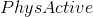中）。他们还测量了身高和体重，并计算了体重指数：

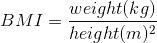

### 9.3.1 步骤 1：制定假设

对于第 1 步，我们假设不从事体育活动的人的体重指数应该比那些从事体育活动的人大。

### 9.3.2 步骤 2：收集一些数据

对于步骤 2，我们收集一些数据。在这种情况下，我们将从 nhanes 数据集中抽取 250 个人作为样本。图[9.1](#fig:bmiSample)显示了这样一个样本的例子，其中 bmi 分别为活跃和不活跃的个体显示。

```r
# sample 250 adults from NHANES and compute mean BMI separately for active
# and inactive individuals

sampSize <- 250

NHANES_sample <- 
  NHANES_adult %>%
  sample_n(sampSize)

sampleSummary <-
  NHANES_sample %>%
  group_by(PhysActive) %>%
  summarize(
    N = length(BMI),
    mean = mean(BMI),
    sd = sd(BMI)
  )

# calculate the mean difference in BMI between active 
# and inactive individuals; we'll use this later to calculate the t-statistic
meanDiff <- 
  sampleSummary %>% 
  select(
    PhysActive,
    mean
  ) %>% 
  spread(PhysActive, mean) %>% 
  mutate(
    meanDiff = No - Yes
  ) %>% 
  pull(meanDiff)

# calculate the summed variances in BMI for active 
# and inactive individuals; we'll use this later to calculate the t-statistic
sumVariance <- 
  sampleSummary %>% 
  select(
    PhysActive,
    N,
    sd
  ) %>% 
  gather(column, stat, N:sd) %>% 
  unite(temp, PhysActive, column) %>% 
  spread(temp, stat) %>% 
  mutate(
    sumVariance = No_sd**2 / No_N + Yes_sd**2 / Yes_N
  ) %>% 
  pull(sumVariance)

# print sampleSummary table
pander(sampleSummary)
```

<colgroup><col style="width: 18%"> <col style="width: 8%"> <col style="width: 11%"> <col style="width: 11%"></colgroup> 
| 物理激活 | N 号 | 意思是 | 标准偏差 |
| --- | --- | --- | --- |
| 不 | 135 | 30.25 天 | 第 8.2 条 |
| 是的 | 115 | 28.6 条 | 6.88 条 |


图 9.1 NHANES 数据集成人样本中的体重指数数据的框线图，根据他们是否报告参与常规体育活动进行划分。

### 9.3.3 步骤 3：指定无效假设和替代假设

对于步骤 3，我们需要指定我们的无效假设（我们称之为）和替代假设（我们称之为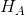）。是用来检验我们的兴趣假设的基线：也就是说，如果没有效果，我们期望数据是什么样子的？无效假设总是涉及到某种等式（=，或）。描述了如果实际存在效果，我们所期望的。另一种假设总是涉及某种不等式（、&gt；或&lt；）。重要的是，无效假设检验是在假设无效假设是真实的前提下进行的，除非证据另有说明。

我们还必须决定是使用 _ 定向 _ 还是 _ 非定向 _ 假设。一个非方向性的假设只是预测会有一个差异，而不预测它将朝哪个方向发展。对于 bmi/活动示例，非方向性无效假设为：


相应的非方向性替代假设是：


另一方面，一个方向性假设预测了差异会朝哪个方向发展。例如，我们有很强的先验知识来预测从事体育活动的人应该比不从事体育活动的人体重轻，因此我们将提出以下定向零假设：


以及方向选择：


### 9.3.4 步骤 4：将模型与数据匹配，并计算测试统计

对于步骤 4，我们希望使用数据来计算一个统计，最终让我们决定是否拒绝无效假设。为此，模型需要量化有利于替代假设的证据数量，相对于数据的可变性。因此，我们可以将测试统计看作是提供了一种与数据的可变性相比效果大小的度量。一般来说，这个检验统计量会有一个与之相关的概率分布，因为这允许我们确定在无效假设下观察到的统计量值的可能性。

对于体重指数的例子，我们需要一个测试统计数据来测试两个平均值之间的差异，因为假设是以每组的平均体重指数来陈述的。一个经常用来比较两种方法的统计数据是 _t-statistic_，首先由统计学家 William Sealy Gossett 开发，他在都柏林的 Guiness Brewery 工作，用笔名“student”书写，因此常被称为“student's t-statistic”。当样本量较小且总体标准差未知时，t 统计量适合比较两组的平均值。两个独立组比较的 t 统计量计算如下：


其中和是两组的平均值，和是两组的估计方差，和是两组的大小。t 统计量是根据概率分布（称为 _t_ 分布）分布的。_t_ 分布看起来非常类似于正态分布，但它不同于自由度的数量，在本例中，这是观测次数减去 2，因为我们计算了两个平均值，因此放弃了两个自由度。当自由度较大时（比如 1000），那么 _t_ 分布与正态分布基本相似，但当它们较小时，则 _t_ 分布的尾部比正态长（见图[9.2](#fig:tVersusNormal)）。


图 9.2 各面板显示了覆盖在正态分布（实线红色）上的 t 分布（蓝色虚线）。左侧面板显示 4 个自由度的 t 分布，在这种情况下，分布类似，但尾部稍宽。右面板显示了 1000 自由度的 T 分布，在这种情况下，它实际上与正常值相同。

### 9.3.5 步骤 5：确定零假设下数据的概率

这是 NHST 开始违背我们的直觉的步骤——而不是在给定数据的情况下确定虚假设为真的可能性，而是在虚假设下确定数据的可能性——因为我们从假设虚假设为真开始！要做到这一点，我们需要知道零假设下统计的概率分布，这样我们就可以问数据在该分布下的可能性有多大。在我们转到我们的 bmi 数据之前，让我们从一些简单的例子开始。

##### 9.3.5.0.1 随机化：一个非常简单的例子

假设我们想确定一枚硬币是否公平。为了收集数据，我们将硬币翻转 100 次，并计算 70 个硬币头。在这个例子中，和，我们的测试统计只是我们计算的头的数量。我们接下来要问的问题是：如果头部的真实概率为 0.5，我们观察 70 个头部的可能性有多大。我们可以想象，这可能只是偶然发生，但似乎不太可能。为了量化这个概率，我们可以使用 _ 二项式分布 _：

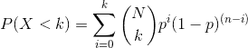

这个方程将告诉我们在给定人头概率的情况下，一定数量人头或更少人头的可能性。然而，我们真正想知道的是某个或多个数字的概率，我们可以从一个数字中减去：

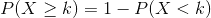

我们可以使用 r 中的`pbinom()`函数计算示例的概率，如下所示：

```r
# compute the probability of 69 or fewer heads, when P(heads)=0.5
p_lt_70 <- pbinom(69, 100, 0.5) 
sprintf("probability of 69 or fewer heads given P(heads)=0.5: %0.6f", p_lt_70)
```

```r
## [1] "probability of 69 or fewer heads given P(heads)=0.5: 0.999961"
```

```r
# the probability of 70 or more heads is simply the complement of p_lt_70
p_ge_70 <- 1 - p_lt_70
sprintf("probability of 70 or more heads given P(heads)=0.5: %0.6f", p_ge_70)
```

```r
## [1] "probability of 70 or more heads given P(heads)=0.5: 0.000039"
```

这个计算表明，如果硬币真的是公平的话，得到 70 个硬币的可能性是非常小的。现在，如果我们没有`pbinom()`函数来告诉我们头部数量的概率呢？相反，我们可以通过模拟来确定它——我们使用 0.5 的真实概率反复翻转一枚硬币 100 次，然后计算这些模拟运行中头部数量的分布。图[9.3](#fig:coinFlips)显示了该模拟的结果。

```r
# simulate tossing of 100,000 flips of 100 coins to identify empirical 
# probability of 70 or more heads out of 100 flips

# create function to toss coins
tossCoins <- function() {
  flips <- runif(100) > 0.5 
  return(sum(flips))
}

# use a large number of replications since this is fast
coinFlips <- replicate(100000, tossCoins())

p_ge_70_sim <- mean(coinFlips >= 70)
sprintf(
  "empirical probability of 70 or more heads given P(heads)=0.5: %0.6f", 
  p_ge_70_sim
)
```

```r
## [1] "empirical probability of 70 or more heads given P(heads)=0.5: 0.000020"
```

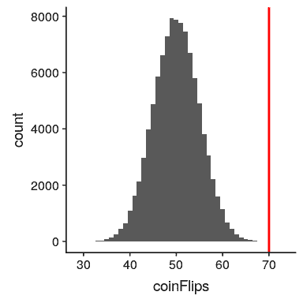

图 9.3 100000 次模拟运行中头数（100 次翻转中）的分布。

在这里，我们可以看到通过模拟计算的概率（0.000020）非常接近理论概率（.00004）。

让我们为我们的 bmi 示例进行类似的计算。首先，我们使用上面计算的样本值计算 t 统计量：

```r
tStat <- 
  meanDiff / sqrt(sumVariance)

sprintf("t statistic = %0.3f", tStat)
```

```r
## [1] "t statistic = 1.735"
```

我们接下来要问的问题是：如果两组之间的真正差异为零或更小（即方向性零假设），我们找到这种大小的 t 统计量的可能性有多大？
我们可以使用 t 分布来确定这个概率。我们的样本量是 250，所以适当的 t 分布有 248 个自由度。我们可以使用 r 中的`pt()`函数来确定发现 t 统计量值大于或等于观察值的概率。注意，我们想要知道一个大于我们观察到的值的概率，但是默认情况下`pt()`给我们一个小于我们提供的值的概率，所以我们必须明确告诉它给我们“上尾”概率（通过设置`lower.tail = FALSE`）。

```r
pvalue_tdist <- 
  pt(tStat, df = 248, lower.tail = FALSE)

sprintf("p(t > %0.2f, df = 248) = %0.3f", tStat, pvalue_tdist)
```

```r
## [1] "p(t > 1.74, df = 248) = 0.042"
```

这告诉我们，如果虚假设真的是真的，我们观察到的 t 统计量值 1.74 是相对不可能的。

在本例中，我们使用了一个方向性假设，因此我们只需要查看零分布的一端。如果我们想测试一个非方向性假设，那么我们就需要能够识别出不管它的方向如何，效果的大小是多么的出乎意料。在 t 检验的上下文中，这意味着我们需要知道统计数据在正方向或负方向上极端的可能性有多大。为此，我们将观察到的 _t_ 值乘以-1，因为 _t_ 分布集中在零附近，然后将两个尾概率相加，得到一个 _ 双尾 _p 值：

```r
pvalue_tdist_twotailed <- 
  pt(tStat, df = 248, lower.tail = FALSE) +
  pt(-1 * tStat, df = 248, lower.tail = TRUE)

sprintf(
  "p(t > %0.2f or t< %0.2f, df = 248) = %0.3f", 
  tStat, 
  -1 * tStat, pvalue_tdist_twotailed
)
```

```r
## [1] "p(t > 1.74 or t< -1.74, df = 248) = 0.084"
```

在这里我们看到，双尾测试的 p 值是单尾测试的两倍大，这反映了一个事实，即极端值并不令人惊讶，因为它可能发生在两个方向上。

如何选择是否使用单尾测试与双尾测试？双尾测试总是比较保守，所以使用它总是一个很好的选择，除非你有一个非常强烈的理由使用单尾测试。在这种情况下，您应该在查看数据之前写下假设。在第[17 章](#doing-reproducible-research)中，我们将讨论假设预登记的概念，它使在您看到实际数据之前写下假设的想法正式化。一旦你看过数据，你就不应该决定如何进行假设检验，因为这会给结果带来严重的偏差。

#### 9.3.5.1 使用随机化计算 p 值

到目前为止，我们已经看到了如何使用 t 分布来计算零假设下数据的概率，但是我们也可以使用模拟来实现这一点。其基本思想是，我们生成模拟数据，就像我们在零假设下所期望的那样，然后询问观察到的数据与模拟数据相比有多极端。关键问题是：我们如何生成零假设为真的数据？一般的答案是，我们可以以一种特定的方式随机地重新排列数据，如果空值是真的，那么数据看起来就像是真的。这类似于引导的想法，从某种意义上说，它使用我们自己的数据来得出一个答案，但它的方式不同。

##### 9.3.5.1.1 随机化：一个简单的例子

让我们从一个简单的例子开始。假设我们想将足球运动员与越野跑运动员的平均蹲起能力与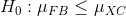和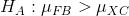进行比较。我们测量 5 名足球运动员和 5 名越野跑者的最大蹲坐能力（我们将随机生成，假设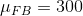、和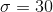。

```r
# generate simulated data for squatting ability across football players 
# and cross country runners

# reset random seed for this example
set.seed(12345678)

# create a function to round values to nearest product of 5,
# to keep example simple
roundToNearest5 <- function(x, base = 5) {
  return(base * round(x / base))
}

# create and show data frame containing simulated data
squatDf <- tibble(
  group = as.factor(c(rep("FB", 5), rep("XC", 5))),
  squat = roundToNearest5(c(rnorm(5) * 30 + 300, rnorm(5) * 30 + 140))
)

pander(squatDf)
```

<colgroup><col style="width: 11%"> <col style="width: 11%"></colgroup> 
| 组 | 蹲下 |
| --- | --- |
| 联邦调查局 | 335 个 |
| FB | 350 个 |
| FB | 230 |
| FB | 290 个 |
| FB | 325 |
| 徐克 | 115 |
| XC | 115 |
| XC | 170 个 |
| XC | 175 个 |
| XC | 215 个 |


图 9.4 足球运动员和越野跑者的模拟蹲坐能力方框图。

从图[9.4](#fig:squatPlot)的图中可以清楚地看出，两组之间存在很大的差异。我们可以使用 r 中的`t.test()`命令进行标准 t 检验来检验我们的假设：

```r
# compute and print t statistic comparing two groups

tt <- 
  t.test(
    squat ~ group, 
    data = squatDf, 
    alternative = "greater", 
    var.equal = TRUE
  )

sprintf("p(t > %0.2f, df = 8) = %0.5f", tt$statistic, tt$p.value)
```

```r
## [1] "p(t > 5.14, df = 8) = 0.00044"
```

这表明，在零假设下出现这种差异的可能性很小，使用 _t_ 分布来定义零。现在让我们看看如何使用随机化来回答相同的问题。其基本思想是，如果两组之间没有差异的零假设是正确的，那么一组来自哪个组（足球运动员和越野跑者）就不重要了——因此，为了创建与实际数据相似但又符合零假设的数据，我们可以随机地为数据集中的个人排序组标签，然后重新计算组之间的差异。这种洗牌的结果如图[9.5](#fig:scramPlot)所示。

```r
# create a scrambled version of the group membership variable

dfScram <-
  squatDf %>%
  mutate(
    scrambledGroup = sample(group)
  ) %>%
  select(-group)

pander(dfScram)
```

<colgroup><col style="width: 11%"> <col style="width: 22%"></colgroup> 
| squat | 加扰群 |
| --- | --- |
| 335 | FB |
| 350 | XC |
| 230 | FB |
| 290 | XC |
| 325 | XC |
| 115 | FB |
| 115 | FB |
| 170 | XC |
| 175 | FB |
| 215 | XC |


图 9.5 加扰组标签后分配给每组受试者的方框图。

在把标签弄乱之后，我们发现这两个组现在更相似了，事实上，跨国组现在的平均值略高。现在让我们做 10000 次，并存储每个迭代的 t 统计信息；这可能需要一些时间来完成。

```r
# shuffle data 10,000 times and compute distribution of t values

nRuns <- 10000

shuffleAndMeasure <- function(df) {
  dfScram <- 
    df %>%
    mutate(
      scrambledGroup = sample(group)
    )
  tt <- t.test(
    squat ~ scrambledGroup,
    data = dfScram,
    alternative = "greater", 
    var.equal = TRUE
  )
  return(tt$statistic)
}

shuffleDiff <- replicate(nRuns, shuffleAndMeasure(squatDf))

sprintf("mean t value across shuffles = %0.3f", mean(shuffleDiff))
```

```r
## [1] "mean t value across shuffles = -0.004"
```

我们现在可以研究随机分布的数据集中的平均差的分布。图[9.6](#fig:shuffleHist)显示了所有随机随机随机洗牌的组差异的直方图。正如在零假设下所预期的那样，这个分布集中在零。


图 9.6 随机改组后足球和越野组之间差异的柱状图。红线表示两组间观察到的实际差异，蓝线表示本次分析的理论 t 分布。

我们可以看到，洗牌后 t 值的分布大致遵循零假设下的理论 t 分布（平均值=0），表明随机化产生零数据的效果。如果我们将洗牌后的 t 值与实际的 t 值进行比较，我们还会看到一些有趣的事情：

```r
# compute number of runs on which t statistic for shuffle data was 
# equal to observed t statistic

equalSum <- sum(shuffleDiff == tt$statistic)
sprintf("Number of runs on which shuffled t == observed t: %d", equalSum)
```

```r
## [1] "Number of runs on which shuffled t == observed t: 33"
```

```r
# compute number of runs on which t statistic for shuffle data was
# equal to observed t statistic times -1

equalSumMinus <- sum(shuffleDiff == tt$statistic * -1)
sprintf("Number of runs on which shuffled t == observed t*-1: %d", equalSumMinus)
```

```r
## [1] "Number of runs on which shuffled t == observed t*-1: 28"
```

有 33 次随机播放，其中随机播放数据的 t 统计值与观察到的数据完全相同，这意味着随机播放导致了与实际数据相同的标签！这是不可能的，但不是 _ 不可能的，我们可以用概率论来计算它的可能性。10 个项目的可能排列数为，结果为 3628800。每组 5 的可能重排数为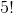，结果为 120，因此两组 5 的可能重排数为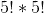或 14400。因此，我们预计 0.0039 的随机标签将与原始标签完全相同，这与我们在模拟中看到的 0.0033 相当接近。我们对标签与真实标签完全相反的次数有着相似的期望，给出了观察到的 t 值的负值。_

我们可以通过测量随机数据中有多少随机值至少与观测值一样极端来计算 p 值：

```r
# compute p value using randomization
pvalRandomization <- mean(shuffleDiff >= tt$statistic)

sprintf(
  'p(t > %0.2f, df = 8) using randomization = %0.5f',
  tt$statistic,
  pvalRandomization
)
```

```r
## [1] "p(t > 5.14, df = 8) using randomization = 0.00330"
```

这个 p 值与我们用 t 分布得到的 p 值非常相似，两者都是非常极端的，这意味着如果零假设为真，观察到的数据就不太可能出现——在这种情况下，我们 _ 知道 _ 不是真的，因为我们生成了 E 数据。

##### 9.3.5.1.2 随机化：体重指数/活动示例

现在让我们使用随机化来计算 bmi/活动示例的 p 值。在这种情况下，我们将随机地对`PhysActive`变量进行随机洗牌，并计算每次洗牌后组之间的差异，然后将观察到的 t 统计量与洗牌数据集中的 t 统计量分布进行比较。

```r
# create function to shuffle BMI data

shuffleBMIstat <- function() {
  bmiDataShuffled <- 
    NHANES_sample %>%
    select(BMI, PhysActive) %>%
    mutate(
      PhysActive = sample(PhysActive)
    )
  # compute the difference
  simResult <- t.test(
    BMI ~ PhysActive,
    data = bmiDataShuffled,
    var.equal = TRUE
  )
  return(simResult$statistic)
}

# run function 5000 times and save output

nRuns <- 5000
meanDiffSimDf <- 
  data.frame(
    meanDiffSim = replicate(nRuns, shuffleBMIstat())
  )
```

让我们看看结果。图[9.7](#fig:simDiff)显示了洗牌样本中 t 值的分布情况，我们还可以计算发现大于或等于观察值的概率：

```r
# compute the empirical probability of t values larger than observed
# value under the randomization null
bmtTTest <- 
  t.test(
  BMI ~ PhysActive,
  data = NHANES_sample,
  var.equal = TRUE, 
  alternative = "greater"
)

bmiPvalRand <- 
  mean(meanDiffSimDf$meanDiffSim >= bmtTTest$statistic)

sprintf(
  "p(mean > %0.2f, df = 248) using randomization = %0.5f", 
  bmtTTest$statistic, 
  bmiPvalRand
)
```

```r
## [1] "p(mean > 1.71, df = 248) using randomization = 0.04380"
```

```r
sprintf(
  "p(mean > %0.2f, df = 248) using parametric t-test = %0.5f", 
  bmtTTest$statistic, 
  bmtTTest$p.value
  )
```

```r
## [1] "p(mean > 1.71, df = 248) using parametric t-test = 0.04413"
```

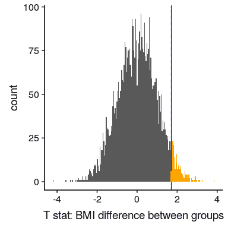

图 9.7 组标签洗牌后 t 统计量的柱状图，t 统计量的观测值以蓝线表示，其值比橙色显示的观测值更为极端。

同样，随机分组得到的 p 值（0.044）与使用 t 分布得到的 p 值（0.044）非常相似。随机化测试的优点是，它不要求我们假设来自每个组的数据是正态分布的，尽管 T-测试通常对违反该假设的情况非常健壮。此外，随机化检验可以让我们在没有理论分布的情况下计算统计学的 p 值，就像 t 检验一样。

我们在使用随机化测试时必须做出一个主要假设，我们称之为 _ 互换性 _。这意味着所有的观测都是以相同的方式分布的，这样我们就可以在不改变总体分布的情况下交换它们。当数据中有相关的观察结果时，这种情况就可以被打破了；例如，如果我们有来自 4 个不同家庭的个人的数据，那么我们就不能假设个人是可交换的，因为兄弟姐妹之间的距离比他们与个人之间的距离更近。来自其他家庭。一般来说，如果数据是通过随机抽样获得的，那么交换性假设应该成立。

### 9.3.6 步骤 6：评估结果的“统计显著性”

下一步是确定从上一步得到的 p 值是否足够小，以至于我们愿意拒绝无效假设，并得出替代方案是真的。我们需要多少证据？这是统计学中最有争议的问题之一，部分原因是它需要主观判断——没有“正确”的答案。

历史上，这个问题最常见的答案是，如果 p 值小于 0.05，我们应该拒绝无效假设。这源于罗纳德·费舍尔的著作，他被称为“20 世纪统计学中最重要的人物”（埃夫隆 1998 年）：

> “如果 p 介于.1 和.9 之间，那么肯定没有理由怀疑所测试的假设。如果低于 0.02，则强烈表明该假设不能解释全部事实。如果我们在 0.05 点画一条常规的线，我们就不会经常误入歧途。在我们可以说的水平上划一条线是很方便的：要么治疗中有某种东西，要么发生了一种巧合，比如 20 次试验中不超过一次（Fisher 1925）。

然而，费希尔从未打算将作为一个固定的规则：

> “没有一个科学工作者有一个固定的意义水平，每年，在任何情况下，他都拒绝假设；他更愿意根据自己的证据和想法来考虑每一个特定的案例”[fish:1956](fish:1956)

相反，它很可能成为一种仪式，因为在计算之前使用的 p 值表使计算统计数据任意值的 p 值变得容易。所有的表都有一个 0.05 的条目，这使得我们很容易确定一个人的统计数据是否超过了达到这一重要程度所需的值。

统计阈值的选择仍然存在很大争议，最近（Benjamin 等人，2018 年）有人提议将标准阈值从 0.05 更改为 0.005，这使得标准阈值更加严格，因此更难拒绝无效假设。在很大程度上，这一举措是由于越来越多的担忧，即从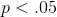的显著结果中获得的证据相对较弱；我们将在稍后的[17](#doing-reproducible-research)章中对再现性的讨论中更详细地讨论这一点。

#### 9.3.6.1 假设检验作为决策：Neyman-Pearson 方法

尽管费舍尔认为 P 值可以为一个特定的假设提供证据，但是统计学家 Jerzy Neyman 和 Egon Pearson 强烈反对。相反，他们建议我们从长期来看考虑假设检验的错误率：

> “任何基于概率论的检验本身都不能提供任何有价值的证据来证明假设是真是假。但我们可以从另一个角度来看待测试的目的。在不希望知道每一个独立的假设是正确还是错误的情况下，我们可以寻找规则来管理我们对它们的行为，在这之后，我们保证，从长期经验来看，我们不会经常出错”（J.Neyman 和 Pearson，1933）。

也就是说：我们不知道哪些具体的决定是正确的还是错误的，但是如果我们遵守规则，我们至少可以知道我们的决定会有多长时间出错。

为了理解 Neyman 和 Pearson 开发的决策框架，我们首先需要根据可能发生的结果种类讨论统计决策。存在两种可能的现实状态（为真或为假），以及两种可能的决定（拒绝或未能拒绝）。我们可以通过两种方式做出正确的决定：

*   当为假时，我们可以决定拒绝它（在决策理论的语言中，我们称之为 _hit_）
*   当为真时，我们无法拒绝它（我们称之为 _ 正确拒绝 _）

我们还可以犯两种错误：

*   当为真时，我们可以决定拒绝它（我们称之为 _ 假警报 _ 或 _ 类型 I 错误 _）
*   当实际为假时，我们无法拒绝它（我们称之为 _Miss_ 或 _Type II Error_）

Neyman 和 Pearson 创造了两个术语来描述从长远来看这两种错误的可能性：

*   P（I 类错误）=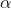
*   P（II 类错误）=

也就是说，如果我们将设置为.05，那么从长远来看，我们应该使 I 型错误占 5%。虽然通常将设置为.05，的标准值为.2-也就是说，我们愿意接受 20%的时间检测不到真正的效果。当我们在第[10.3 节](#statistical-power)中讨论统计功率时，我们将回到下面的内容，这是第二类误差的补充。

### 9.3.7 重大结果意味着什么？

关于 p 值的实际含义有很多困惑（Gigerenzer，2004 年）。假设我们做了一个实验，比较条件之间的平均值，我们发现 p 值为 0.01 的差异。有许多可能的解释。

#### 9.3.7.1 是否意味着零假设为真的概率为 0.01？

不，请记住，在空假设测试中，p 值是给定空假设（）的数据概率。对于给定数据（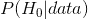）的无效假设的概率，它不保证得出结论。当我们在后面一章中讨论贝叶斯推理时，我们将回到这个问题上，因为贝叶斯定理让我们以一种可以确定后一种概率的方式反转条件概率。

#### 9.3.7.2 这是否意味着你做出错误决定的概率是.01？

不，这是，但如上所述，P 值是下数据的概率，而不是假设的概率。

#### 9.3.7.3 这是否意味着如果你再次进行研究，你将获得 99%的相同结果？

不。p 值是一个关于特定数据集在空值下的可能性的语句；它不允许我们对未来事件（如复制）的可能性进行推断。

#### 9.3.7.4 这是否意味着你发现了有意义的影响？

不，统计显著性和实际显著性之间有一个重要区别。举个例子，假设我们进行了一项随机对照试验来检验特定饮食对体重的影响，我们发现在 P&lt；.05 有统计学意义的影响。这并不能告诉我们实际损失了多少重量，我们称之为 _ 效应大小 _（将在[10](#ci-effect-size-power)章中详细讨论）。如果我们考虑一项关于减肥的研究，那么我们可能不会认为十盎司的减肥（即一袋薯片的重量）实际上是非常重要的。让我们看看我们的能力，检测 1 盎司的显著差异，随着样本量的增加。

```r
# create simulated data for weight loss trial

weightLossTrial <- function(nPerGroup, weightLossOz = 1) {
  # mean and SD in Kg based on NHANES adult dataset
  kgToOz <- 35.27396195 # conversion constant for Kg to Oz
  meanOz <- 81.78 * kgToOz
  sdOz <- 21.29 * kgToOz
  # create data
  controlGroup <- rnorm(nPerGroup) * sdOz + meanOz
  expGroup <- rnorm(nPerGroup) * sdOz + meanOz - weightLossOz
  ttResult <- t.test(expGroup, controlGroup)
  return(c(
    nPerGroup, weightLossOz, ttResult$p.value,
    diff(ttResult$estimate)
  ))
}

nRuns <- 1000
sampSizes <- 2**seq(5,17) # powers of 2

simResults <- c() ## create an empty list to add results onto
for (i in 1:length(sampSizes)) {
  tmpResults <- replicate(
    nRuns,
    weightLossTrial(sampSizes[i], weightLossOz = 10)
  )
  summaryResults <- c(
    tmpResults[1, 1], tmpResults[2, 1],
    sum(tmpResults[3, ] < 0.05),
    mean(tmpResults[4, ])
  )
  simResults <- rbind(simResults, summaryResults)
}

simResultsDf <- 
  as.tibble(simResults) %>% 
  rename(
    sampleSize = V1, 
    effectSizeLbs = V2,
    nSigResults = V3, 
    meanEffect = V4
  ) %>% 
  mutate(pSigResult = nSigResults / nRuns)
```

图[9.8](#fig:sigResults)显示了显著结果的比例如何随着样本量的增加而增加，这样，当样本量非常大（总共约 262000 名受试者）时，当体重减少 1 盎司时，我们将在 90%以上的研究中发现显著结果。尽管这些在统计学上有显著意义，但大多数医生认为一盎司的体重减轻在实际或临床上并不重要。当我们回到[10.3 节](#statistical-power)中的 _ 统计幂 _ 概念时，我们将更详细地探讨这一关系，但从这个例子中应该已经清楚，统计显著性并不一定表示实际意义。

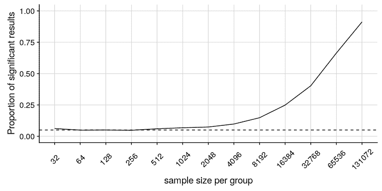

图 9.8 作为样本量函数的一个非常小的变化（1 盎司，约 0.001 标准偏差）的显著性比例。