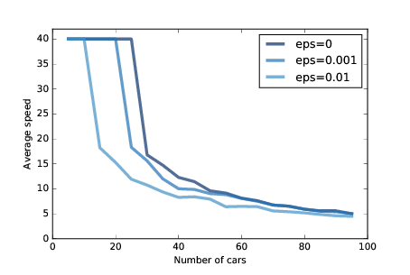

# 十、兽群、鸟群和交通堵塞

> 原文：[Chapter 10  Herds, Flocks, and Traffic Jams](http://greenteapress.com/complexity2/html/thinkcomplexity2011.html)

> 译者：[飞龙](https://github.com/wizardforcel)

> 协议：[CC BY-NC-SA 4.0](http://creativecommons.org/licenses/by-nc-sa/4.0/)

> 自豪地采用[谷歌翻译](https://translate.google.cn/)

本章的代码位于`chap10.ipynb`中，它是本书仓库中的 Jupyter 笔记本。使用此代码的更多信息，请参见第？节。

## 10.1 交通堵塞

是什么导致交通堵塞？在某些情况下，有明显的原因，如事故，车速监视或其他干扰交通的事情。 但其他时候，交通堵塞似乎没有明显的原因。

基于智能体的模型有助于解释自发性交通拥堵。 例如，我根据 Resnick，海龟，白蚁和交通堵塞模型实现了一个简单的高速路模拟。

这是代表“高速路”的类：

```py
class Highway:

    def __init__(self, n=10, length=1000, eps=0):
        self.length = length
        self.eps = eps

        # create the drivers
        locs = np.linspace(0, length, n, endpoint=False)
        self.drivers = [Driver(loc) for loc in locs]

        # and link them up
        for i in range(n):
            j = (i+1) % n
            self.drivers[i].next = self.drivers[j]
```

`n`是汽车的数量。

`length`是高速路的长度，默认为 1000（以任意单位）。

`eps`是我们将添加到系统中的随机噪声。

`loc`包含驾驶员的位置；最初它们沿着高速公路等距分布。

驾驶员由`Driver`对象表示。 每个驾驶员都包含前方驾驶员的引用。 高速公路是圆形的，所以最后的驾驶员可以引用第一个。

`step`方法简单；它只是移动每个驾驶员：

```py
def step(self):
    for driver in self.drivers:
        self.move(driver)
```

这里是`move `方法：

```py
def move(self, driver):
    d = self.distance(driver)

    # let the driver choose acceleration
    acc = driver.choose_acceleration(d)
    acc = min(acc, self.max_acc)
    acc = max(acc, self.min_acc)
    speed = driver.speed + acc

    # add random noise to speed
    speed *= np.random.uniform(1-self.eps, 1+self.eps)

    # keep it nonnegative and under the speed limit
    speed = max(speed, 0)
    speed = min(speed, self.speed_limit)

    # if current speed would collide, stop
    if speed > d:
        speed = 0

    # update speed and loc
    driver.speed = speed
    driver.loc += speed
```

`d`是驾驶员与前方驾驶员之间的距离。 这个距离被传递给`choose_acceleration`，它规定了驾驶员的行为。 这是司机做出的唯一决定; 其他一切都由模拟的“物理”决定。

+   `acc`是加速度，它受`min_acc`和`max_acc`限制。 在我的实现中，汽车可以在`max_acc = 1`时加速，在`min_acc = -10`时加速。
+   `speed`是旧的速度加上请求的加速度，但是我们做了一些调整。 首先，我们向速度添加了随机噪音，因为这个世界并不完美。 `eps`决定了噪音的幅度，这是适用于速度的百分比; 例如，如果`eps`为 0.02，则速度乘以 98% 到 102% 之间的随机数。
+   然后速度限制在 0 到`speed_limit`之间，在我的实现中为 40，所以汽车不允许后退或加速。
+   如果请求的速度会引起与下一辆车的碰撞，则速度设置为 0。
+   最后，我们更新驾驶员的速度和`loc`属性。

以下是`Driver`类的定义：

```py
class Driver:

    def __init__(self, loc, speed=0):
        self.loc = loc
        self.speed = speed

    def choose_acceleration(self, d):
        return 1
```

`loc`和`speed `属性是驾驶员的位置和速度。

`choose_acceleration`的这个实现非常简单：它总是以最大速率加速。

由于汽车起步距离相等，因此我们预计它们都会加速，直到达到限速，或者直到它们的速度超过它们之间的距离。 此时，至少会发生一次“碰撞”，导致一些汽车停下来。


图 10.1：三个时间点中，环形公路上的驾驶员的模拟。 点表示驾驶员的位置；十字表示驾驶员必须刹车来避开另一个驾驶员。

图？展示了该过程中的几个步骤，从 30 辆汽车和`eps = 0.02`开始。 左边是 16 个时间步后的状态，汽车排列成一圈。 由于随机噪音，有些汽车比其他汽车要快，并且间距变得不均匀。

在下一个时间步骤（中），两辆车相撞，用`x`标记表示。

在下一个时间步骤（右），两辆汽车会与已停车的汽车碰撞，我们可以看到最初形成的交通堵塞。 一旦堵塞形成，它就会持续下去，其它汽车从后面靠近并碰撞，而前面的汽车加速离开。

在某些情况下，堵塞本身会向后传播，如果你观看本章的笔记本中的动画，你可以看到它。

## 10.2 随机噪声



图 10.2：平均速度和汽车数量的函数，带有三个大小的附加随机噪声

随着汽车数量的增加，交通堵塞变得更加严重。 图？显示了汽车能够达到的平均速度，相对于汽车数量的函数。

最上面那行显示`eps = 0`的结果；也就是说，速度没有随机变化。 如果汽车数量少于 25 辆，则汽车之间的间隔大于 40，这样汽车可以达到并保持 40 的最大速度。超过 25 辆汽车形成交通堵塞，平均速度迅速下降。

这种效果是仿真物理学的直接结果，所以它不应该令人惊讶。 如果道路的长度为 1000，则`n`个车辆之间的间距为`1000 / n`。 而且由于汽车的行驶速度不超过前面的空间，所以我们预计，最高平均车速为`1000 / n`或 40，取最小者。

但这是最好的情况。只有少量的随机性，情况会变得更糟。

图？也显示了`eps = 0.001`和`eps = 0.01`的结果，其对应于 0.1% 和 1% 的速度误差。

即使有少量噪音，高速路的容量也会从 25 降至 20（“容量”是指可以达到并保持速度限制的最大车辆数量。 如果有 1% 的误差，容量会下降到 10。

作为本章结尾的练习之一，你将有机会设计出更好的驾驶员; 也就是说，你将在`choose_acceleration`中尝试不同的策略，并查看你是否可以找到可提高平均速度的驾驶行为。

## 10.3 Boids

1987 年，Craig Reynolds 发表了《兽群，鸟群和鱼群：分布式行为模型》（Flocks, herds and schools: A distributed behavioral model），描述了一个基于智能体的兽群行为模型。 你可以从 <http://www.red3d.com/cwr/papers/1987/boids.html> 下载他的论文。

这种模型中的智能体被称为“boids”，既是“bird-oid”的缩写，又是“bird”的口音发音（虽然 boids 也用于模拟鱼类和集中的陆生动物）。

每个智能体模拟了三种行为：

避免碰撞：

避开障碍物，包括其他鸟类。

鸟群集中：

移向鸟群的中心。

速度匹配：

将速度（速率和方向）与邻近的鸟类对齐。

Boid 只根据局部信息做出决定；每个 boid 只能看到（或注意）其视野范围内的其他 boid。


在本书的仓库中，你会发现`Boids7.py`，它包含我的 boids 实现，部分基于《Flake, The Computational Beauty of Nature》（雪花：自然的计算之美）中的描述。

该程序定义了两个类：`Boid`，实现了 boid 算法，和`World`，包含`Boid`列表和吸引`Boid`的“胡萝卜”列表。

boid 算法使用`get_neighbors`在视野中查找其他 boid：

```py
def get_neighbors(self, others, radius, angle):
    boids = []
    for other in others:
        if other is self:
           continue

        offset = other.pos - self.pos

        # if not in range, skip it
        if offset.mag > radius:
            continue

        # if not within viewing angle, skip it
        if self.vel.diff_angle(offset) > angle:
            continue

        # otherwise add it to the list
        boids.append(other)

    return boids
```

`get_neighbors`使用向量减法来计算从`self`到`other`的向量。 这个向量的们是到另一个 boid 的距离。 `diff_angle`计算`self`的速度（也是视线）与另一个 boid 之间的角度。

`center`寻找视野中 boid 的质心，并返回一个指向它的向量：

```py

def center(self, others):
    close = self.get_neighbors(others, r_center, a_center)
    t = [other.pos for other in close]
    if t:
        center = sum(t)/len(t)
        toward = vector(center - self.pos)
        return limit_vector(toward)
    else:
        return null_vector
```

同样，`avoid`寻找范围内任何障碍物的质心，并返回一个指向它的向量，`copy`将返回当前朝向和邻居的平均朝向之间的差，`love `计算出胡萝卜的朝向。

`set_goal`计算这些目标的加权总和并设定总体目标：

```py

def set_goal(self, boids, carrot):
    self.goal = (w_avoid * self.avoid(boids, carrot) +
                 w_center * self.center(boids) +
                 w_copy * self.copy(boids) +
                 w_love * self.love(carrot))
```

最后`move`更新 boid 的速度，位置和姿势。

```py
def move(self, mu=0.1):
    self.vel = (1-mu) * self.vel + mu * self.goal
    self.vel.mag = 1

    self.pos += dt * self.vel
    self.axis = b_length * self.vel.norm()
```

新速度是旧速度和目标的加权和。 参数`mu`决定鸟类能够多快地改变速度和方向。 时间步长`dt`决定了 boids 移动的距离。

许多参数影响鸟群行为，包括每个行为的范围，角度和权重以及可操作性`mu`。

这些参数决定了 boids 形成和维持鸟群的能力，以及鸟群中运动和组织的模式。 对于某些设置，boids 类似于一群鸟；其他设置类似于鱼群或一片飞虫。

## 10.4 涌现和自由意志

作为一个整体，许多复杂的系统具有它们的组件不具有的属性：

+   细胞自动机规则 30 是确定性的，控制其演化的规则是完全已知的。 尽管如此，它会生成一个序列，统计上与随机无法区分。
+   谢林模型中的智能体不是种族主义者，但他们互动的结果就好像他们是。
+   糖域中的智能体形成对角移动的波浪，尽管智能体不能。
+   即使汽车正在向前行驶，交通堵塞会向后移动。
+   兽群和鸟群的行为来自其成员之间的局部互动。

这些例子提出了一个途径，用于解决几个古老而富有挑战性的问题，包括意识和自由意志的问题。

自由意志是做出选择的能力，但是如果我们的身体和大脑受到确定性物理规律的支配，我们的选择就会是确定的。 自由意志的争论无数；我只会提到两个：

+   威廉·詹姆斯（William James）提出了一个两阶段模型，其中可能的行为由随机过程产生，然后由确定性过程选择。 在这种情况下，我们的行为基本上是不可预测的，因为生成它们的过程包含随机元素。
+   大卫休谟（David Hume）认为，我们对于做出选择的感知是一种幻觉；在这种情况下，我们的行为是确定性的，因为产生它们的系统是确定性的。

这些论点以相反的方式调解冲突，但他们同意冲突是存在的：如果这些部分是确定性的，那么系统就不会有自由意志。

本书中的复杂系统提出了另一种选择，在选择和决策层面的自由意志，相当于神经元层面的（或更低层次）的决定论。 就像汽车向前行驶时，交通堵塞后退的方式一样，即使神经元没有，人也可以有自由意志。

## 10.5 练习

练习 1

在交通堵塞的模拟中，定义一个类，`BetterDriver`，它继承`Driver`并覆盖`choose_acceleration`。 查看你是否可以定义一个驾驶规则，比`Driver`中的基本实现更好的。 你可能会尝试到达更高的平均速度，或者更少的碰撞。

练习 2

注意：为了做这个练习，你必须安装 VPython，一个用于 3D 显示和动画的库。 如果你使用 Anaconda（我在第？节中推荐过），你可以执行：

```
conda install -c vpython vpython
```

然后运行本书仓库中的`Boids7.py`。 阅读代码来查看，程序开始时定义的参数如何控制 boid 的行为。 试验不同的参数。 如果通过将权重设置为 0 来“关闭”其中一种行为，会发生什么？

为了生成更多类似鸟类的行为，Flake 建议增加第四种行为来保持清晰的视线；换句话说，如果在正前方有另一只鸟，那么它就应该从侧面移开。 你认为这个规则对鸟群的行为有什么影响？ 实现它来看看。

练习 3

在 <http://en.wikipedia.org/wiki/Free_will> 上深入了解自由意志。 自由意志与决定论相容的观点被称为相容论。 相容论最大的挑战之一是“结果论证”（consequence argument）。 什么是结果论证？ 根据你在本书中读到的内容，你对结果论证有什么样的反应？