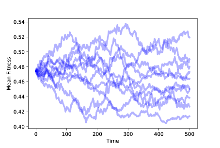
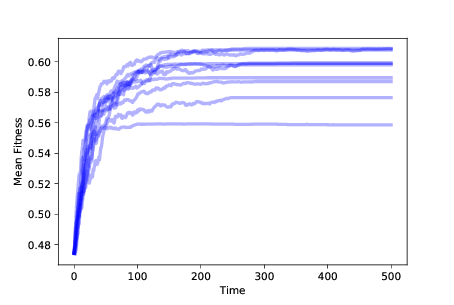
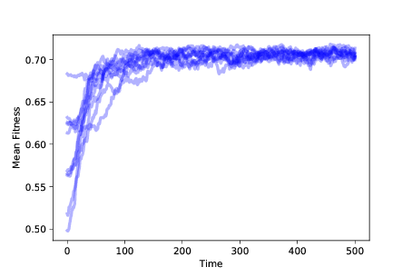
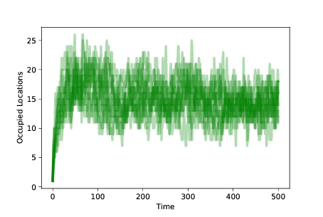
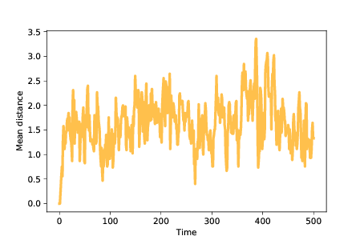
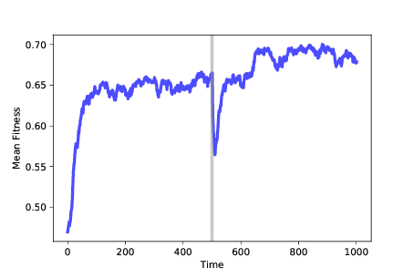

## 十一、进化

> 原文：[Chapter 11  Evolution](http://greenteapress.com/complexity2/html/thinkcomplexity2012.html)

> 译者：[飞龙](https://github.com/wizardforcel)

> 协议：[CC BY-NC-SA 4.0](http://creativecommons.org/licenses/by-nc-sa/4.0/)

> 自豪地采用[谷歌翻译](https://translate.google.cn/)

生物学乃至整个科学最重要的思想，是通过自然选择的进化论，它声称由于自然选择而创造出新的物种并改变现有的物种。自然选择是个体间遗传差异导致生存和繁殖差异的过程。

在了解生物学的人中，进化论被广泛认为是一个事实，也就是它足以接近事实，如果将来得到纠正，纠正将使中心思想基本保持完整。

尽管如此，许多人并不相信进化论。在皮尤研究中心进行的一项调查中，被调查者被问到，以下哪些断言更贴近他们的观点：

+   人类和其他生物随时间而进化。
+   起初，人类和其他生物就以其现在的形式存在。

约有 34% 的美国人选择了第二个（见 <http://www.thearda.com/Archive/Files/Codebooks/RELLAND14_CB.asp>）。

即使在那些认为生物已经进化的人中，只有一半以上的人认为进化的原因是自然选择。 换句话说，只有三分之一的美国人相信进化论是真实的。

这怎么可能？ 在我看来，促成因素包括：

+   有些人认为进化论与他们的宗教信仰之间有冲突。 感觉就像他们不得不拒绝一个，他们拒绝了进化论。
+   其他人经常被第一组成员积极误导，以至于他们对进化论的许多认识都是错误的。
+   许多人根本就不了解进化。

对于第一组，我可能没有太多可以做的事，但我认为我可以帮助其他人。 经验上，进化论很难让人理解。 同时，它非常简单：对很多人来说，一旦他们了解进化论，它似乎既明显又无可辩驳。

为了帮助人们从困惑转变为清晰，我找到的最强大的工具就是计算。 我们看到，理论上很难理解的想法，在模拟中出现时很容易理解。 这是本章的目标。

本章的代码位于`chap11.ipynb`中，该书是本书仓库中的 Jupyter 笔记本。使用此代码的更多信息，请参见第？节。

## 11.1 简单的进化

我将从一个简单的模型开始，演示一种基本的进化形式。 根据该理论，以下特征足以产生进化：

+   复制者：我们需要一批能够以某种方式复制的智能体。 我们将以复制者开始，它们生成它们自己的完美的副本。 稍后我们将添加不完美的副本，即突变。
+   突变：我们还需要一些种群中的变化，也就是个体之间的差异。
+   生存和繁殖差异：个体之间的差异必须影响其生存或繁殖的能力。

为了模拟这些特征，我们将定义智能体种群，智能体代表个体。 每个智能体都有遗传信息，称为基因型，这是智能体繁殖时复制的信息。 在我们的模型中 [1]，基因型由`N`个二进制数字（零和一）的序列表示，其中`N`是我们选择的参数。

> [1] 模型是主要由 Stuart Kauffman 开发的 NK 模型的变体（参见 <https://en.wikipedia.org/wiki/NK_model>）。

为了产生突变，我们创建了具有多种基因型的种群；稍后我们将探讨创造或增加突变的机制。

最后，为了产生生存和繁殖差异，我们定义了一个函数，将每个基因型映射为一个适应度，其中适应度是一个数量，有关智能体的生存或繁殖能力。

## 11.2 适应性景观

将基因型映射为适应性函数，称为适应性景观。 在景观的隐喻中，每个基因型对应于`N`维空间中的一个位置，并且适应性对应于该位置处的景观的“高度”。对于能够解释这个隐喻的可视化，参见 <https://en.wikipedia.org/wiki/Fitness_landscape>。

在生物学术语中，适应性景观代表一种信息，它是生物体的基因型与其物理形式和能力的关系，后者称为其表现型，以及表现型如何与其环境相互作用。

在现实世界中，适应性景观很复杂，但我们不需要建立现实模型。 为了诱导进化，我们需要基因型和适应性之间的某种关系，但事实证明它可以是任何关系。 为了证明它，我们将使用完全随机的适应性景观。

这是代表适应性景观的类的定义：

```py
class FitnessLandscape:
    def __init__(self, N):
        self.N = N
        self.one_values = np.random.random(N)
        self.zero_values = np.random.random(N)

    def fitness(self, loc):
        fs = np.where(loc, self.one_values,
                           self.zero_values)
        return fs.mean()
```

智能体的基因型，对应其在适应性景观中的位置，由一个 NumPy 的零一数组来表示，称为`loc`。 给定基因型的适应性，是`N`个适应性贡献的平均值，`loc`的每个元素都是一个。

为了计算基因型的适应性，`FitnessLandscape`使用两个数组：`one_values`，其中包含`loc`的每个元素都为 1 时的适应性贡献，以及`zero_values`，其中包含为 0 时的适应度贡献。

`fitness`方法使用`np.where`，如果`loc`中的值为 1，它从`one_values`中选择一个值，如果`loc`中的值为 0，它从`zero_values`中选择一个值。

例如，假设`N=3`：

```py
one_values =  [0.1, 0.2, 0.3]
zero_values = [0.4, 0.7, 0.9]
```

这种情况下，`loc = [0, 1, 0]`的适应性是`[0.4, 0.2, 0.9]`的均值，为 0.5。

## 11.3 智能体

接下来我们需要智能体，这是类定义：

```py
class Agent:

    def __init__(self, loc, fit_land):
        self.loc = loc
        self.fit_land = fit_land
        self.fitness = fit_land.fitness(self.loc)

    def copy(self):
        return Agent(self.loc, self.fit_land)
```

智能体的属性是：

`loc`：智能体在适应性景观中的位置。
`fit_land`：`FitnessLandscape`对象的引用。
`fitness`：智能体在`FitnessLandscape`中的适应性，表示为 0 到 1 之间的数字。
`Agent`的这个定义提供了一种简单的`copy`方法，可以精确复制基因型；之后，我们将看到一个带有突变的版本，但突变对于进化来说不是必需的。

## 11.4 模拟

现在我们有了智能体和适应性景观，我将定义一个名为`Simulation`的类，用于模拟智能体的创建，繁殖和死亡。 为了避免陷入困境，我将在这里提供一个简化版本的代码；你可以在本章的笔记本上看到细节。

这是`Simulation`的定义：

```py

class Simulation:

    def __init__(self, fit_land, agents):
        self.fit_land = fit_land
        self.agents = agents
```

`Simulation`的属性是：

+   `fit_land`：`FitnessLandscape`对象的引用。
+   `agents`：`Agent`对象的数组。

`Simulation`中最重要的函数是`step`，它模拟了单个时间步骤：

```py

# class Simulation:

    def step(self):
        n = len(self.agents)
        fits = self.get_fitnesses()

        # see who dies
        index_dead = self.choose_dead(fits)
        num_dead = len(index_dead)

        # replace the dead with copies of the living
        replacements = self.choose_replacements(num_dead, fits)
        self.agents[index_dead] = replacements
```

在每个时间步骤中，一些智能体死亡，一些智能体繁殖。 `step`使用另外三个方法：

+   `get_fitnesses`返回一个数组，包含每个智能体的适应性，按照它们在智能体数组中出现的顺序。
+   `choose_dead`决定哪些智能体在此时间步中死亡，并返回一个数组，包含死亡智能体的索引。
+   `choose_replacements`决定哪些智能体在此时间步中繁殖，在每个智能体上调用`copy`，并返回一个新的`Agent`对象的数组。

在这个版本的模拟中，每个时间步中新智能体的数量等于死亡智能体的数量，所以活动智能体的数量是恒定的。

## 11.5 没有差异

在我们运行模拟之前，我们必须指定`choose_dead`和`choose_replacements`的行为。 我们将从这些函数的简单版本开始，它们不依赖于适应性：

```py
# class Simulation

     def choose_dead(self, fits):
        n = len(self.agents)
        is_dead = np.random.random(n) < 0.1
        index_dead = np.nonzero(is_dead)[0]
        return index_dead

    def choose_replacements(self, n, fits):
        agents = np.random.choice(self.agents, size=n, replace=True)
        replacements = [agent.copy() for agent in agents]
        return replacements
```

在`choose_dead`中，`n`是智能体的数量，`is_dead`是一个布尔数组，对于此时间步骤内死亡的智能体为`True`。 在这个版本中，每个智能体都有相同的死亡概率：0.1。 `choose_dead`使用`np.nonzero`来查找`is_dead`的非零元素的索引（`True`被视为非零）。

在`choose_replacements`中，`n`是在此时间步骤中复制的智能体数量。 它使用`np.random.choice`带替换地选择`n`个智能体。 然后它在每个上调用`copy`，并返回一个新的`Agent`对象列表。

这些方法不依赖于适应性，所以这种模拟没有生存或繁殖差异。 因此，我们不应期待看到进化。 但是，我们怎么辨别呢？

## 11.6 进化的证据

进化的最具包容性的定义是，种群中基因型分布的变化。 进化是一种聚合效应：换句话说，个体不会进化；但种群会。

在这个模拟中，基因型是高维空间中的位置，因此很难将其分布中的变化可视化。 但是，如果基因型改变，我们预计它们的适应性也会改变。 所以我们将将适应性分布的变化用作进化的证据。 具体来说，我们将看看种群中适应性的均值和标准差。

在我们运行模拟之前，我们必须添加一个`Instrument`，它是在每个时间步骤后更新的对象，计算一个感兴趣的统计量，并将结果存储在一个序列中，我们稍后可以绘制它。

这是所有仪器的父类：

```py
class Instrument:
    def __init__(self):
        self.metrics = []
```

下面是`MeanFitness`的定义，`MeanFitness`是一个仪器，计算每个时间步的种群平均适应性：

```py

class MeanFitness(Instrument):
    def update(self, sim):
        mean = np.nanmean(sim.get_fitnesses())
        self.metrics.append(mean)
```

现在我们准备好运行模拟了。 为了最小化起始种群中随机变化的影响，我们使用同一组智能体启动每个模拟。 为了确保我们探索整个适应性景观，我们由每个位置的一个智能体开始。 以下是创建模拟的代码：

```py
N = 8
fit_land = FitnessLandscape(N)
agents = make_all_agents(fit_land, Agent)
sim = Simulation(fit_land, agents)
```

`make_all_agents`为每个位置创建一个智能体； 本章的实现在笔记本中。

现在我们可以创建并添加`MeanFitness`仪器，运行模拟并绘制结果：

```py
instrument = MeanFitness()
sim.add_instrument(instrument)
sim.run()
sim.plot(0)
```

模拟维护了`Instrument`对象列表。 在每个时间步之后，它在列表中的每个仪器上调用`update`。

模拟运行后，我们使用`Simulation.plot`绘制结果，它接受索引作为参数，使用索引从列表中选择一个`Instrument`并绘制结果。 在这个例子中，只有一个`Instrument`，索引为 0。



图 11.1：随着时间的推移，10 次模拟的平均适应性，没有生存或繁殖差异

图？显示了运行这个模拟 10 次的结果。 种群的平均适应性随机移动。 由于适应性的分布随时间变化，我们推断表现型的分布也在变化。 按照最具包容性的定义，这种随机游走是一种进化。 但它不是一个特别有趣的类型。

特别是，这种进化并不能解释生物物种如何随时间变化，或者如何出现新的物种。 进化论是强大的，因为它解释了我们在自然界看到的似乎无法解释的现象：

+   适应性：物种与其环境的相互作用似乎太复杂，太巧妙，并且偶然发生。 自然系统的许多特征看起来好像是设计出来的。
+   增加的多样性：地球上的物种数量随时间而普遍增加（尽管有几个时期的大规模灭绝）。
+   增加的复杂性：地球上的生命史起始于相对简单的生命形式，后来在地质记录中出现了更复杂的生物体。

这些是我们想要解释的现象。 到目前为止，我们的模型并没有完成这个任务。

## 11.7 生存差异

让我们再添加一种成分，生存差异。 以下是继承`Simulation`并覆盖`choose_dead`的类的定义：

```py

class SimWithDiffSurvival(Simulation):

    def choose_dead(self, fits):
        n = len(self.agents)
        is_dead = np.random.random(n) > fits
        index_dead = np.nonzero(is_dead)[0]
        return index_dead
```

现在生存的概率取决于适应性；事实上，在这个版本中，智能体在每个时间步骤中幸存的概率是其适应性。

由于适应性低的智能体更有可能死亡，因此适应性高的智能体更有可能生存足够长的时间来繁殖。 我们预计适应性低的智能体的数量会随时间而减少，适应性高的智能体的数量会增加。



图 11.2：随着时间的推移，10 次模拟中的适应性均值，带有生存差异

图？显示了随着时间的推移，10 次模拟中的适应性均值，带有生存差异。 平均适应性起初会迅速增加，但会逐渐平稳。

你或许可以弄清楚为什么它会平稳：如果在特定位置只有一个智能体并且它死了，它就会使这个位置变空。没有突变，就没有办法让它再次被占领。

在`N = 8`的情况下，该模拟以 256 个智能体开始，它们占用了所有可能位置。 占用位置的数量随时间而减少；如果模拟运行时间足够长，最终所有智能体将占用相同的位置。

所以这个模拟开始解释适应性：增加的适应性意味着，物种在它的环境中生存得更好。 但是占用位置的数量随时间而减少，所以这个模型根本无法解释增加的多样性。

在本章的笔记本中，你将看到差异化繁殖的效果。 正如你所预料的那样，差异化繁殖也会增加平均适应性。但没有突变，我们仍然没有看到增加的多样性。

## 11.8 突变

在目前的模拟中，我们以可能的最大多样性开始 - 在景观的每个位置都有一个智能体 - 并以可能的最小多样性结束，所有智能体都在一个位置。

这与自然界发生的情况几乎相反，它显然以单个物种开始，这种物种随时间而分化为今天的地球上数百万甚至数十亿物种（见 <https://en.wikipedia.org/wiki/Global_biodiversity>）。

使用我们模型的完美复制，我们从未看到增加的多样性。 但是如果我们加上突变，再加上生存和繁殖差异，我们距离理解自然界的进化就更近了一步。

以下是继承`Agent`并覆盖`copy`的类定义：

```py
class Mutant(Agent):

    prob_mutate = 0.05

    def copy(self):
        if np.random.random() > self.prob_mutate:
            loc = self.loc.copy()
        else:
            direction = np.random.randint(self.fit_land.N)
            loc = self.mutate(direction)
        return Mutant(loc, self.fit_land)
```

在这种突变模型中，每次我们调用`copy`时，都有 5% 的突变机会。 在突变的情况下，我们从当前位置选择一个随机方向 - 即基因型中的一个随机位 - 并翻转它。 这是`mutate`：

```py
    def mutate(self, direction):
        new_loc = self.loc.copy()
        new_loc[direction] ^= 1
        return new_loc
```

运算符`^=`计算“异或”；操作数 1 具有翻转一位的效果（请参阅 <https://en.wikipedia.org/wiki/Exclusive_or#Bitwise_operation>）。

现在我们有了突变，我们不必在每个位置都放置一个智能体。 相反，我们可以以最小变化开始：所有智能体在同一位置。



图 11.3：随着时间的推移，10 次模拟中的适应性均值，带有突变、生存繁殖差异

图？显示了 10 次模拟的结果，带有突变和生存繁殖差异。 在任何情况下，种群都会向最大适应性的位置进化。



图 11.4：随着时间的推移，10 次模拟的占用位置的数量，带有突变和生存繁殖差异。

为了测量种群的多样性，我们可以绘制每个时间步后占用位置的数量。 图？展示了结果。 我们以同一地点的 100 个智能体开始。 随着突变的发生，占用位置的数量迅速增加。

当智能体发现适应性高的位置时，它更有可能生存和繁殖。 适应性较低的位置上的智能体最终消失。 种群在整个景观中随时间而移动，直到大多数智能体处于适合性最高的位置。

此时，系统达到平衡，突变以相同的速率占据新的位置，生存差异导致适合性低的位置清空。

平衡中的占用位置的数量，取决于突变率和生存差异的程度。 在这些模拟中，任何点处的独特占用位置的数量通常为 10-20。

重要的是要记住，这个模型中的智能体不会移动，就像生物体的基因型没有改变一样。 当智能体死亡时，它可能会留下一个空位。 当发生突变时，它可以占据一个新的位置。 当智能体从某些地方消失并出现在其他地方时，种群会在景观中移动，就像生命游戏中的滑翔机一样。 但生命体不会进化；但种群可以。

## 11.9 物种形成

进化论说，自然选择改变了现有的物种并创造了新的物种。 在我们的模型中，我们看到了变化，但我们并没有看到新的物种。 在模型中，还不清楚新物种是什么样。

在有性繁殖的物种中，如果两种生物能够繁殖并产生丰富的后代，则被视为同一物种。 但是模型中的智能体不会再现性行为，所以这个定义不适用。

在无性繁殖的生物中，如细菌，物种的定义并不明确。 一般来说，如果一个种群的基因型形成一个簇，那么它就被认为是一个物种，也就是说，如果种群内的遗传差异比种群间的差异小。

在我们可以对新物种建模之前，我们需要能够识别景观中的智能体簇，这意味着我们需要定义位置之间的距离。 由于位置是用二进制数字串表示的，因此我们将距离定义为基因型中不同的位数。 `FitnessLandscape`提供了`distance `方法：

```py
# class FitnessLandscape

    def distance(self, loc1, loc2):
        return np.sum(np.logical_xor(loc1, loc2))
```



图 11.5：智能体随时间变化的平均距离

`logical_xor`函数计算“异或”，不同的元素为`True`，相同的元素为`False`。

为了量化种群的分散，我们可以计算每对智能体之间距离的平均值。 在本章的笔记本中，你会看到`MeanDistance`仪器，它会在每个时间步骤后计算这个度量。

图？ 展示了智能体随时间的平均距离。 因为我们从相同的突变开始，所以初始距离为 0。随着突变的发生，平均距离增加，在种群遍布景观时达到最大值。

一旦智能体发现最佳位置，平均距离就会减小，直到种群达到平衡，由于突变引起的距离增加通过距离的减小而平衡，因为远离最佳位置的智能体更有可能死亡。 在这些模拟中，平衡时的平均距离接近 1.5；也就是说，大多数智能体距离最佳位置只有 1-2 个突变。

现在我们准备寻找新的物种。 为了模拟一种简单的物种形成，假设一个种群在不变的环境中演化，直到它达到稳定状态（就像我们在自然界发现的一些物种，似乎在很长一段时间内变化很小）。

现在假设我们改变环境，或者将种群转移到新的环境中。 一些旧环境中适应性较高的特性，可能会在新环境中适应性较低，反之亦然。

我们可以通过运行模拟来模拟这些情景，直到种群达到稳定状态，然后改变适应性景观，然后恢复模拟，直到种群再次达到稳定状态。



图 11.6：随时间变化的适应性均值。在 500 步之后，我们改变了适应性景观


图？展示了这样的模拟结果。 再次，我们从随机位置开始，使用 100 个相同的突变体，并运行 500 个时间步骤的模拟。 在这个时候，许多智能体处于最佳位置，在这个例子中，其适应性接近 0.65。 智能体的基因型形成一个簇，智能体之间的平均距离接近 1。

经过 500 步之后，我们运行`FitnessLandscape.set_values`，这改变了适应性景观； 然后我们恢复模拟。 平均适应性会立即下降，因为旧景观中的最佳位置并不比新景观中的随机位置好。

然而，当种群迁移到新景观时，平均适应性会迅速增加，最终会找到新的最佳值，其适应度接近 0.75（在这个例子中恰好更高，但不一定是）。

一旦种群达到稳定状态，它就会形成一个新的簇，智能体之间的平均距离再次接近 1。

现在，如果我们计算智能体之前和之后的位置之间的距离，平均而言，它们相差超过 6。 簇之间的距离远大于每个簇内的距离，因此我们可以将这些簇解释为不同的物种。

## 11.10 总结

我们已经看到，突变以及生存和繁殖差异，足以导致适应性的增加，多样性的增加，并产生简单形式的物种。 这种模型并不是现实的；自然系统中的进化要比这复杂得多。 相反，它意味着一个“充足定理”；也就是说，模型的特征足以产生我们试图解释的行为（参见 <https://en.wikipedia.org/wiki/Necessity_and_sufficiency>）。

从逻辑上讲，这个“定理”并不能证明，自然界中的进化仅仅由这些机制引起，但是由于这些机制确实以多种形式出现在生物系统中，所以认为它们至少有助于自然进化，是合理的。

同样，该模型并不能证明这些机制总是会导致进化。 但是我们在这里看到的结果是可靠的：在几乎所有包含这些特征的模型中 - 不完美的复制者，变异性和繁殖差异 - 发生了进化。

我希望这一观察有助于揭开进化的神秘面纱。 当我们观察自然系统时，进化看起来很复杂。 而且由于我们主要看到了进化的结果，而没有看到这个过程，所以难以想象和相信。

但在模拟中，我们看到整个过程，而不仅仅是结果。 通过包含最少的一系列特征来产生进化 - 暂时忽略了生物生命的巨大复杂性 - 我们可以将进化看作是一个令人惊讶的简单，不可避免的想法。

## 11.11 练习

本章的代码位于本书仓库的 Jupyter 笔记本`chap11.ipynb`中。 打开笔记本，阅读代码并运行单元格。 笔记本包含本章的练习。 我的解决方案在`chap11soln.ipynb`中。
