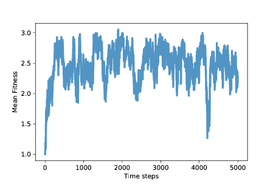
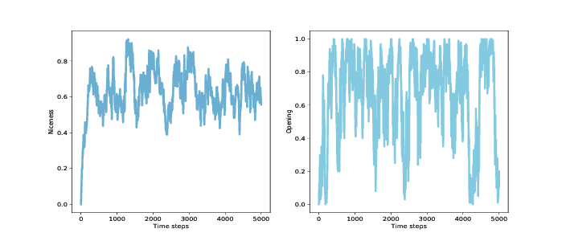

## 十二、合作进化

> 原文：[Chapter 12  Evolution of cooperation](http://greenteapress.com/complexity2/html/thinkcomplexity2012.html)

> 译者：[飞龙](https://github.com/wizardforcel)

> 协议：[CC BY-NC-SA 4.0](http://creativecommons.org/licenses/by-nc-sa/4.0/)

> 自豪地采用[谷歌翻译](https://translate.google.cn/)

在最后一章中，我们提出两个问题，一个来自生物学，一个来自哲学：

+   在生物学中，“利他主义问题”是自然选择与利他主义之间的明显冲突，自然选择表明动物生存在不断竞争的状态中来生存和繁殖，利他主义是许多动物帮助其他动物的倾向，甚至是显然对他们不利。见 <https://en.wikipedia.org/wiki/Altruism_(biology)>。
+   在道德哲学中，人性问题是，人类是否从根本上是善良的，或者邪恶的，或者是由环境塑造的空白状态。见 <https://en.wikipedia.org/wiki/Human_nature>。

我们将用来解决这些问题的工具，（同样）是基于智能体的模拟和博弈论，博弈论是一组抽象模型，旨在描述智能体交互的各种方式。具体来说，我们会考虑囚徒困境。

本章的代码位于`chap12.ipynb`中，该书是本书仓库中的`Jupyter`笔记本。使用此代码的更多信息，请参见第？节。

## 12.1 囚徒困境

囚徒困境是博弈论中的一个话题，但它不是一种有趣的博弈。相反，这种博弈揭示了人类的动机和行为。以下是来自维基百科的它的介绍（<http://en.wikipedia.org/wiki/Prisoner's_dilemma>）：

两名犯罪团伙成员被逮捕并囚禁。每个囚犯都被单独监禁，无法与另一方交流。检察官缺乏足够的证据，来证明这两个人的主要指控。他们希望以较轻的指控被判处两年徒刑。同时，检察官为每个囚犯提供商量的余地。每个囚犯都有机会：（1）通过证明对方犯罪出卖对方，或（2）通过保持沉默与另一方合作。出价是：

+   如果 A 和 B 各自背叛对方，每个人都服刑 2 年。
+   如果 A 背叛 B 但 B 保持沉默，A 将被释放，B 将被监禁 3 年（反之亦然）。
+   如果 A 和 B 都保持沉默，他们两人只会服刑 1 年（较轻的质控）。

很显然，这种情况是假想的，但它用于代表各种不同的互动，其中智能体必须选择是相互“合作”还是“背叛”，以及每个智能体的奖励（或惩罚）取决于他人的选择。

有了这套奖惩，我们很有可能说智能体应该合作，也就是说，双方都应该保持沉默。 但两个智能体不知道对方会做什么，所以每个人都必须考虑两种可能的结果。 首先，从 A 的角度来看它：

+   如果 B 保持沉默，A 最好是背叛；他会无罪而不是服刑 1 年。
+   如果 B 背叛，A 最好也是背叛；他只会服刑 2 年而不是 3 年。

不管 B 做什么，A 最好都是背叛。 而且因为博弈是对称的，所以从 B 的角度来看这个分析是一样的：不管 A 做什么，B 最好也是背叛。

在这个博弈的最简单版本中，我们假设 A 和 B 没有考虑其他因素。 他们不能互相沟通，所以他们不能协商，作出承诺或相互威胁。 他们只考虑直接目标，最小化他们的判决；他们不考虑任何其他因素。

在这些假设下，两个智能体的理性选择都是背叛。 这可能是一件好事，至少在刑事司法方面是这样。 但对囚犯来说，这令人沮丧，因为显然，他们无法获得他们双方都想要的结果。 而且这种模式适用于现实生活中的其他场合，其中合作有更大的好处以及对于玩家来说都会更好。

研究这些场景以及摆脱困境的方法，博弈论研究者关注的焦点，但这不是本章的重点。 我们正朝着不同的方向前进。

## 12.2 善良的问题

自 20 世纪 50 年代，囚徒困境被首次讨论以来，它一直是社会心理学研究的热门话题。根据前一节的分析，我们可以说一个理想的智能体应该做什么; 很难预测真正的人究竟做了些什么。 幸运的是，实验已经完成了 [1]。

> [1] 这里有一个最近的报告，提到以前的实验：Barreda-Tarrazona, Jaramillo-Gutiérrez, Pavan, and Sabater-Grande, “Individual Characteristics vs. Experience: An Experimental Study on Cooperation in Prisoner’s Dilemma", Frontiers in Psychology, 2017; 8: 596. <https://www.ncbi.nlm.nih.gov/pmc/articles/PMC5397528/>。

如果我们假设人们足够聪明地进行分析（或者在解释时理解它），并且他们通常为了自己的利益而行事，那么我们预计他们几乎总是背叛。 但他们没有。 在大多数实验中，受试者的合作远远超过理性的智能体模型的预测 [2]。

> [2] 有个不错的视频归纳了我们目前讨论的内容：<https://www.youtube.com/watch?v=t9Lo2fgxWHw>。

这个结果最明显的解释是，人们不是理性的智能体，这对任何人都不应该感到惊讶。 但为什么不是呢？ 是因为他们不够聪明，无法理解这种情况，还是因为他们故意违背自己的利益行事？

根据实验结果，似乎至少有一部分解释是纯粹的利他主义：许多人愿意为了让别人受益而承担成本。现在，在你提出《Journal of Obvious Results》上发表的结论之前，让我们继续问为什么：

+   为什么人们会帮助别人，即使自己会付出代价？至少部分原因是他们想这样；这让他们对自己和世界感觉良好。
+   为什么善良让人感觉良好？诱人的说法是，有人跟他们提出这是正确的，或者更普遍来说，他们被社会训练为想要做好事。但毫无疑问 [3]，至少有一大部分利他主义是天生的；在不同程度上，利他主义的倾向是正常大脑发育的结果。
+   那么，为什么呢？大脑发育的内在部分，以及随后的个体特征，是基因的结果。当然，基因与利他主义的关系是复杂的，可能有许多基因与环境因素相互作用，导致人们在不同情况下或多或少是无私的。尽管如此，几乎可以肯定的是基因导致人们变得无私。
+   最后，为什么呢？如果在自然选择下，动物为了生存和繁殖而彼此不断竞争，似乎显然利他主义会适得其反。在一个种群中，有些人帮助别人，甚至是为别人伤害自己，其他人纯粹是自私的，似乎自私者会受益，利他者会受到影响，并且利他主义的基因将被驱逐而灭绝。

> [3] 我希望你能原谅我在这里用“毫无疑问”代替实验的参考资料，我想在本章中介绍一些理由，而不会陷入太深。

这个明显的矛盾是“利他主义问题”：为什么利他主义的基因没有消失？

在生物学家中，有很多可能的解释，包括互惠利他主义，性选择，亲属选择和群体选择。而在非科学家中，还有更多的解释。我把它交给你去探索别的假说；现在我想专注于一种解释，可以说是最简单的一种解释：也许利他主义是适应性的。换句话说，利他主义的基因可能使人们更容易生存和繁殖。

事实证明，引发利他主义问题的囚徒困境，也可能有助于解决问题。

## 12.3 囚徒困境比赛

在 20 世纪 70 年代后期，密歇根大学的政治学家罗伯特阿克塞尔罗德（Robert Axelrod）组织了一场比赛来比较囚徒困境（PD）的策略。

他邀请参与者以计算机程序的形式提交策略，然后相互对抗并保持得分。具体来说，他们玩的是 PD 的迭代版本，其中智能体针对同一对手进行多轮比赛，因此他们的决定可以基于历史。

在 Axelrod 的比赛中，一个简单的策略出人意料地好，称为“针锋相对”，即 TFT，TFT 在第一轮迭代比赛中总是合作；之后，它会复制上一轮对手所做的任何事情。对手继续合作，TFT 保持合作，如果对手任何时候都背叛，下一轮 TFT 背叛，但如果对手变回合作，TFT 也会合作。

这些比赛的更多信息，以及 TFT 为何如此出色的解释，请参阅以下视频：<https://www.youtube.com/watch?v=BOvAbjfJ0x0>。

看看这些比赛中表现出色的策略，Alexrod 发现了他们倾向于分享的特点：

+   善良：表现好的策略在第一轮比赛中合作，并且通常会在随后的几轮中合作。
+   报复：始终合作的策略，并不如如果对手背叛就报复的策略好。
+   宽恕：但是过于斗气的策略往往会惩罚自己以及对手。
+   不嫉妒：一些最成功的策略很少超过对手；他们成功了，因为他们对各种各样的对手都做得足够好。

TFT 具有所有这些属性。

Axelrod 的比赛为利他主义问题提供了部分可能的答案：也许利他主义的基因是普遍存在的，因为它们是适应性的。 许多社会互动可以建模为囚徒困境的变种，就这种程度而言，如果将一个大脑设定为善良，平衡报复和宽恕，就会在各种各样的情况下表现良好。

但是 Axelrod 比赛中的策略是由人们设计的；他们并不进化。 我们需要考虑，善良、报复和宽恕的基因是否可以通过突变出现，成功侵入其他策略的种群，并抵制后续突变的侵入。

## 12.4 合作进化的模拟

合作进化是第一本书的标题，Axelrod 展示了来自囚徒困境比赛的结果，并讨论了利他主义问题的影响。 从那以后，他和其他研究人员已经探索了 PD 比赛的进化动态性，也就是说，PD 选手的总体中，策略的分布随时间如何变化。 在本章的其余部分中，我运行这些实验的一个版本并展示结果。

首先，我们需要一种将 PD 策略编码为基因型的方法。 在这个实验中，我考虑了一些策略，其中智能体每一轮的选择仅取决于前两轮中对手的选择。 我用字典来表示策略，它将对手的前两个选择映射为智能体的下一个选择。

以下是这些智能体的类定义：

```py
class Agent:

    keys = [(None, None),
            (None, 'C'),
            (None, 'D'),
            ('C', 'C'),
            ('C', 'D'),
            ('D', 'C'),
            ('D', 'D')]

    def __init__(self, values, fitness=np.nan):
        self.values = values
        self.responses = dict(zip(self.keys, values))
        self.fitness = fitness
```

`keys`是每个智能体的词典中的键序列，其中元组`('C', 'C')`表示对手在前两轮合作；`(None, 'C')`意味着只有一轮比赛并且对手合作；`(None, None)`表示还没有回合。

在`__init__`方法中，`values `是对应于键的一系列选项，`'C'`或`'D'`。 所以如果值的第一个元素是`'C'`，那就意味着这个智能体将在第一轮合作。 如果值的最后一个元素是`'D'`，那么如果对手在前两轮中背叛，该智能体将会背叛。

在这个实现中，总是背叛的智能体的基因型是`'DDDDDDD'`; 总是合作的智能体的基因型是`'CCCCCCC'`，而 TFT 的基因型是`'CCDCDCD'`。

`Agent`类提供`copy`，它使其它智能体具有相同的基因型，但具有一定的变异概率：

```py

prob_mutate = 0.05

def copy(self):
    if np.random.random() > self.prob_mutate:
        values = self.values
    else:
        values = self.mutate()
    return Agent(values, self.fitness)
```

突变的原理是，在基因型中选择一个随机值并从`'C'`翻转到`'D'`，或者相反：

```py

def mutate(self):
    values = list(self.values)
    index = np.random.choice(len(values))
    values[index] = 'C' if values[index] == 'D' else 'D'
    return values
```

既然我们有了智能体，我们还需要比赛。

## 12.5 `Tournament`

`Tournament`类封装了 PD 比赛的细节：

```py
payoffs = {('C', 'C'): (3, 3),
           ('C', 'D'): (0, 5),
           ('D', 'C'): (5, 0),
           ('D', 'D'): (1, 1)}

num_rounds = 6

def play(self, agent1, agent2):
    agent1.reset()
    agent2.reset()

    for i in range(self.num_rounds):
        resp1 = agent1.respond(agent2)
        resp2 = agent2.respond(agent1)

        pay1, pay2 = self.payoffs[resp1, resp2]

        agent1.append(resp1, pay1)
        agent2.append(resp2, pay2)

    return agent1.score, agent2.score
```

`payoffs`是一个字典，将从智能体的选择映射为奖励。例如，如果两个智能体合作，他们每个得到 3 分。如果一个背叛而另一个合作，背叛者得到 5 分，而合作者得到 0 分。如果他们都背叛，每个都会得到 1 分。这些是 Axelrod 在他的比赛中使用的收益。

`play `运行几轮 PD 游戏。它使用`Agent`类中的以下方法：

+   `reset`：在第一轮之前初始化智能体，重置他们的分数和他们的回应的历史记录。
+   `respond`：考虑到对手之前的回应，向每个智能体询问回应。
+   `append`：通过存储选项，并将连续轮次的分数相加，来更新每个智能体。

在给定的回合数之后，`play`将返回每个智能体的总分数。我选择了`num_rounds = 6`，以便每个基因型的元素都以大致相同的频率访问。第一个元素仅在第一轮访问，或在六分之一的时间内访问。接下来的两个元素只能在第二轮中访问，或者每个十二分之一。最后四个元素在六分之一时间内访问，平均每次访问六次，或者平均每个六分之一。

`Tournament`提供了第二种方法，即`melee`，确定哪些智能体互相竞争：

```py

def melee(self, agents, randomize=True):
    if randomize:
        agents = np.random.permutation(agents)

    n = len(agents)
    i_row = np.arange(n)
    j_row = (i_row + 1) % n

    totals = np.zeros(n)

    for i, j in zip(i_row, j_row):
        agent1, agent2 = agents[i], agents[j]
        score1, score2 = self.play(agent1, agent2)
        totals[i] += score1
        totals[j] += score2

    for i in i_row:
        agents[i].fitness = totals[i] / self.num_rounds / 2
```

`melee`接受一个智能体列表和一个布尔值`randomize`，它决定了每个智能体每次是否与同一邻居竞争，或者匹配是否随机化。

`i_row`和`j_row`包含匹配的索引。 `totals`包含每个智能体的总分数。

在循环内部，我们选择两个智能体，调用`play`和更新`totals`。 最后，我们计算每个智能体获得的，每轮和每个对手的平均点数，并将结果存储在每个智能体的`fitness `属性中。

## 12.6 `Simulation`

本章的`Simulation`类基于第？章的中的那个；唯一的区别是`__init__`和`step`。

这是`__init__`方法：

```py
class PDSimulation(Simulation):

    def __init__(self, tournament, agents):
        self.tournament = tournament
        self.agents = np.asarray(agents)
        self.instruments = []
```

`Simulation`对象包含一个`Tournament`对象，一系列的智能体和一系列的`Instrument`对象（就像第？章中一样）。

以下是`step`方法：

```py

def step(self):
    self.tournament.melee(self.agents)
    Simulation.step(self)
```

此版本的`step`使用`Tournament.melee`，它为每个智能体设置`fitness`属性；然后它调用父类的`step`方法，父类来自第？章：

```py

# class Simulation

    def step(self):
        n = len(self.agents)
        fits = self.get_fitnesses()

        # see who dies
        index_dead = self.choose_dead(fits)
        num_dead = len(index_dead)

        # replace the dead with copies of the living
        replacements = self.choose_replacements(num_dead, fits)
        self.agents[index_dead] = replacements

        # update any instruments
        self.update_instruments()
```

`Simulation.step`将智能体的适应性收集到一个数组中; 然后它会调用`choose_dead`来决定哪些智能体死掉，并用`choose_replacements`来决定哪些智能体繁殖。

我的模拟包含生存差异，就像第？章那样，但不包括繁殖差异。 你可以在本章的笔记本上看到细节。 作为练习之一，你将有机会探索繁殖差异的效果。

## 12.7 结果

假设我们从三个智能体开始：一个总是合作，一个总是背叛，另一个执行 TFT 策略。 如果我们在这个种群中运行`Tournament.melee`，合作者每轮获得 1.5 分，TFT 智能体获得 1.9 分，而背叛者获得 3.33 分。 这个结果表明，“总是背叛”应该很快成为主导策略。

但是“总是缺陷”包含着自我破坏的种子，如果更好的策略被驱使而灭绝，那么背叛者就没有人可以利用，他们的适应性下降，并且容易受到合作者的入侵。

根据这一分析，预测系统的行为不容易：它会找到一个稳定的平衡点，还是在基因型景观的各个位置之间振荡？ 让我们运行模拟来发现它！

我以 100 个始终背叛的相同智能体开始，并运行 5000 个步骤的模拟：

```py
tour = Tournament()
agents = make_identical_agents(100, list('DDDDDDD'))
sim = PDSimulation(tour, agents)
```



图 12.1：平均适应性（囚徒困境的每个回合的所得点数）

图？展示了随时间变化的平均适应性（使用第？章的`MeanFitness`仪器）。最初平均适应性是 1，因为当背叛者面对对方时，他们每轮只能得到 1 分。

经过大约 500 个时间步，平均适应性增加到近 3，这是合作者面对彼此时得到的。但是，正如我们所怀疑的那样，这种情况不稳定。在接下来的 500 个步骤中，平均适应性下降到 2 以下，回到 3，并继续振荡。

模拟的其余部分变化很大，但除了一次大的下降之外，平均适应性通常在 2 到 3 之间，长期平均值接近 2.5。

而且这还不错！它不是一个合作的乌托邦，每轮平均得 3 分，但距离始终背叛的乌托邦还很远。这比我们所期待的，自利智能体的自然选择要好得多。

为了深入了解这种适应性水平，我们来看看更多的仪器。`Niceness`在每个时间步骤之后测量智能体的基因型的合作比例：

```py

class Niceness(Instrument):

    def update(self, sim):
        responses = np.array([agent.values
                              for agent in sim.agents])
        metric = np.mean(responses == 'C')
        self.metrics.append(metric)
```



图 12.2：种群中所有基因组的平均友善度（左）和第一轮合作的种群比例（右）

图？（左图）展示结果：平均友善度从 0 迅速上升到 0.75，然后在 0.4 到 0.85 之间波动，长期平均值接近 0.65。 同样，这相当好！

具体看开始的移动，我们可以追踪第一轮合作的智能体的比例。 这是这个仪器：

```py

class Retaliating(Instrument):

    def update(self, sim):
        after_d = np.array([agent.values[2::2]
                            for agent in sim.agents])
        after_c = np.array([agent.values[1::2]
                            for agent in sim.agents])
        metric = np.mean(after_d=='D') - np.mean(after_c=='D')
        self.metrics.append(metric)
```

报复行为将所有基因组中的元素数量，其中对手背叛后智能体也背叛（元素 2, 4 和 6），与其中的元素数量，其中对手合作后智能体背叛相比较。正如你现在的预期，结果差异很大（你可以在笔记本中看到图形）。平均而言，这些分数之间的差异小于 0.1，所以如果智能体在对手合作后，30% 的时间中背叛，他们可能会在背叛后的 40% 时间中背叛。

这个结果为这个断言提供了较弱的支持，即成功的策略会报复。也许所有智能体甚至很多智能体都没有必要进行报复；如果整个种群中至少存在一定的报复倾向，那么这可能足以阻止高度报复策略的普及。

为了衡量宽恕，我再次定义了一个工具，来查看在前两轮之后，智能体是否更有可能在 D-C 之后进行合作，与 C-D 相比。在我的模拟中，没有证据表明这种特殊的宽恕。另一方面，这些模拟中的策略在某种意义上是必然的宽容，因为它们只考虑前两轮的历史。

## 12.8 总结

Axelrod 的比赛提出了解决利他主义问题的一个可能的解决办法：或许善良，但不是太善良，是适应性的。但是原始比如中的策略是由人们，而不是进化论设计的，并且策略的分布在比赛过程中没有改变。

所以这就提出了一个问题：像 TFT 这样的策略可能会在固定的人为设计策略中表现良好，但它们是否会进化？换句话说，他们是否可以通过变异出现在种群中，与祖先竞争成功，并抵抗他们的后代的入侵？

本章中的模拟表明：

+   背叛者种群容易受到更善良的策略的入侵。
+   过于善良的种群容易受到背叛者的入侵。
+   所以，善良的平均程度有所波动，但善良的平均数量普遍较高，而平均适应程度一般更接近合作乌托邦而不是偏差异议程度。
+   在 Alexrod 的比赛中，TFT 是一项成功的战略，但对于不断发展的种群来说，这似乎不是一个最佳策略。事实上，可能没有稳定的最佳策略。
+   某种程度的报复可能是适应性的，但对所有智能体来说，可能没有必要进行报复。 如果在整个种群中有足够的报复行为，这可能足以防止背叛者入侵 [4]。

> [4] 这就引入了博弈论中一个全新的话题 - 搭便车问题（见 <https://en.wikipedia.org/wiki/Free-rider_problem>）。

很明显，这些模拟中的智能体很简单，而囚徒困境是一种有限范围的社交互动的高度抽象模型。 尽管如此，本章的结果对人性提供了一些见解。 也许我们对合作，报复和宽恕的倾向是天生的，至少部分是。 这些特征是我们的大脑的工作机制的结果，至少部分是由我们的基因控制的。 也许我们的基因这样来构建我们的大脑，因为在人类进化史上，自私的大脑的基因不太可能传播。

所以也许这就是为什么自私基因会建立无私的大脑。

## 12.9 练习

本章的代码位于本书仓库的 Jupyter 笔记本`chap12.ipynb`中。打开笔记本，阅读代码并运行单元个。你可以使用这个笔记本来练习本章的练习。我的解决方案在`chap12soln.ipynb`中。

练习 1

本章中的模拟取决于我任意选择的条件和参数。作为练习，我鼓励你去探索其他条件，看看他们对结果有什么影响。这里有一些建议：

1.  改变初始条件：不要从所有背叛者开始，看看如果从所有合作者，所有 TFT 或随机智能体开始会发生什么。
1.  在`Tournament.melee`中，我在每个时间步骤开始时洗牌，所以每个玩家对抗两个随机选择的玩家。如果你不洗牌会怎么样？在这种情况下，每个智能体都会反复与相同的邻居进行比赛。这可能会让少数人的战略，更容易通过利用局部性入侵大多数。
1.  由于每个智能体只与另外两个智能体进行比赛，因此每轮比赛的结果都是非常不同的：在任何一轮比赛中，胜过大部​​分智能体的智能体可能会运气不好，或者相反。如果增加每个智能体在每轮中的对手数量会发生什么？或者如果在每一步结束时，智能体的适应性是上一轮结束时其当前得分和适应性的平均值，会怎么样？
1.  我为`prob_survival`函数选择的值从 0.7 到 0.9 不等，所以适应性最差的智能体`p = 0.7`，生存了 3.33 个时间步骤，适应性最强的智能体生存了 10 个。如果你使`prob_survival`更加或更加不“激进”，会发生什么情况。
1.  我选择了`num_rounds = 6`，以便基因组的每个元素对比赛的结果具有大致相同的影响。 但这比 Alexrod 在他的比赛中使用的值要小得多。 如果增加`num_rounds`会发生什么？ 注意：如果你研究这个参数的效果，你可能想修改`Niceness`来衡量基因组中最后4个元素的友善度，随着`num_rounds`的增加，它会受到更多的选择性压力。
1.  我的实现拥有生存差异和随机繁殖。 如果添加繁殖差异会发生什么？

练习 2

在我的模拟中，种群从未收敛到一个状态，其中多数人共享相同的，据推测是最佳的基因型。对于这个结果有两种可能的解释：一是没有最佳策略，因为无论何时种群被大多数基因型控制，这种状况为少数人入侵提供了机会；另一种可能性是，突变率高到足以维持多种基因型，即使多数是非最佳的。为了辨别这些解释，请尝试降低突变率来查看发生了什么。或者，从随机种群开始，并且不带突变来运行，直到只有一个基因型存活。或者带突变来运行，直到系统达到稳定状态；然后关闭突变并运行，直到只有一个幸存的基因型。这些情况下基因型的特征是什么？

练习 3

我的实验中的智能体是“反应型”的，因为他们在每轮中的选择只取决于对手在前几轮中的做法。考虑探索一些策略，它们也考虑到智能体过去的选择。这样的策略将能够区分报复性对手，和没有挑衅而背叛的对手。
