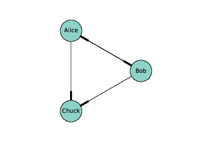
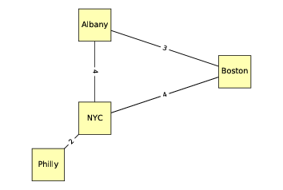
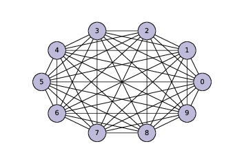
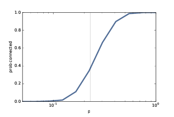
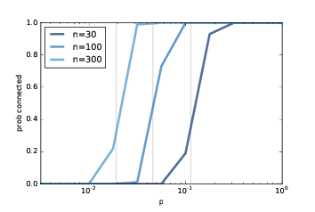

# 二、图

> 原文：[Chapter 2  Graphs](http://greenteapress.com/complexity2/html/thinkcomplexity2003.html)

> 译者：[飞龙](https://github.com/wizardforcel)

> 协议：[CC BY-NC-SA 4.0](http://creativecommons.org/licenses/by-nc-sa/4.0/)

> 自豪地采用[谷歌翻译](https://translate.google.cn/)

本书的前三章有关一些模型，它们描述了由组件和组件之间的连接组成的系统。例如，在生态食物网中，组件是物种，连接代表捕食者和猎物的关系。

在本章中，我介绍了 NetworkX，一个用于构建和研究这些模型的 Python 包。我们从 Erdős-Rényi 模型开始，它具有一些有趣的数学属性。在下一章中，我们将介绍更有用的，解释现实系统的模型。

本章的代码在本书仓库中的`chap02.ipynb`中。使用代码的更多信息请参见第（？）章。

## 2.1 图是什么？



> 图 2.1：表示社交网络的有向图

对于大多数人来说，图是数据集的视觉表示，如条形图或股票价格对于时间的绘图。这不是本章的内容。

在本章中，图是一个系统的表示，它包含离散的互连元素。元素由节点表示，互连由边表示。

例如，你可以表示一个路线图，每个城市都是一个节点，每个城市之间的路线是一条边。或者你可以表示一个社交网络，每个人是节点，如果他们是朋友，两个人之间有边，否则没有。

在某些图中，边具有长度，成本或权重等属性。例如，在路线图中，边的长度可能代表两个城市之间的距离，或旅行时间。在社交网络中，可能会有不同的边来表示不同种类的关系：朋友，商业伙伴等。

边可以是有向或无向的，这取决于它们表示的关系是不对称的还是对称的。在路线图中，你可能会使用有向边表示单向街道，使用无向边表示双向街道。在某些社交网络，如 Facebook，好友是对称的：如果 A 是 B 的朋友，那么 B 也是 A 的朋友。但在 Twitter 上，“关注”关系并不对称；如果 A 关注了 B，这并不意味着 B  关注 A。因此，你可以使用无向边来表示 Facebook 网络，并将有向边用于 Twitter。

图具有有趣的数学属性，并且有一个称为图论的数学分支，用于研究它们。

图也很有用，因为有许多现实世界的问题可以使用图的算法来解决。例如，Dijkstra 的最短路径算法，是从图中找到某个节点到所有其他节点的最短路径的有效方式。路径是两个节点之间的，带有边的节点序列。

图的节点通常以圆形或方形绘制，边通常以直线绘制。例如，上面的有向图中，节点可能代表在 Twitter 上彼此“关注”的三个人。线的较厚部分表示边的方向。在这个例子中，爱丽丝和鲍勃相互关注，都关注查克，但查克没有关注任何人。

下面的无向图展示了美国东北部的四个城市；边上的标签表示驾驶时间，以小时为单位。在这个例子中，节点的位置大致对应于城市的地理位置，但是通常图的布局是任意的。

## 2.2 NetworkX



> 图 2.2：表示城市和高速公路的无向图

为了表示图，我们将使用一个名为 NetworkX 的包，它是 Python 中最常用的网络库。你可以在 <https://networkx.github.io/> 上阅读更多信息，但是我们之后会解释。

我们可以通过导入 NetworkX 和实例化`nx.DiGraph`来创建有向图：

```py

import networkx as nx
G = nx.DiGraph()
```

通常将 NetworkX 导入为`nx`。此时，`G`是一个`DiGraph`对象，不包含节点和边。我们可以使用`add_node`方法添加节点：

```py

G.add_node('Alice')
G.add_node('Bob')
G.add_node('Chuck')
```

现在我们可以使用`nodes`方法获取节点列表：

```py

>>> G.nodes()
['Alice', 'Bob', 'Chuck']
```

添加边的方式几乎相同：

```py

G.add_edge('Alice', 'Bob')
G.add_edge('Alice', 'Chuck')
G.add_edge('Bob', 'Alice')
G.add_edge('Bob', 'Chuck')
```

我们可以使用`edges`来获取边的列表：

```py
>>> G.edges()
[('Alice', 'Bob'), ('Alice', 'Chuck'),
 ('Bob', 'Alice'), ('Bob', 'Chuck')]
```

NetworkX 提供了几个绘图的功能；`draw_circular`将节点排列成一个圆，并使用边将它们连接：

```py

nx.draw_circular(G,
                 node_color=COLORS[0],
                 node_size=2000,
                 with_labels=True)
```

这就是我用来生成图（？）的代码。`with_labels`选项标注了节点；在下一个例子中，我们将看到如何标注边。

为了产生图（？），我们以一个字典开始，它将每个城市的名称，映射为对应的经纬度：

```py

pos = dict(Albany=(-74, 43),
           Boston=(-71, 42),
           NYC=(-74, 41),
           Philly=(-75, 40))
```

因为这是个无向图，我实例化了`nx.Graph`：

```py

G = nx.Graph()
```

之后我可以使用`add_nodes_from`来迭代`pos`的键，并将它们添加为节点。

```py

G.add_nodes_from(pos)
```

下面我会创建一个字典，将每条边映射为对应的驾驶时间。

```py

drive_times = {('Albany', 'Boston'): 3,
               ('Albany', 'NYC'): 4,
               ('Boston', 'NYC'): 4,
               ('NYC', 'Philly'): 2}
```

现在我可以使用`add_edges_from`，它迭代了`drive_times`的键，并将它们添加为边：

```py
G.add_edges_from(drive_times)
```

现在我不使用`draw_circular`，它将节点排列成一个圆圈，而是使用`draw`，它接受`pos`作为第二个参数：

```py

nx.draw(G, pos,
        node_color=COLORS[1],
        node_shape='s',
        node_size=2500,
        with_labels=True)
```

`pos`是一个字典，将每个城市映射为其坐标；`draw`使用它来确定节点的位置。

要添加边的标签，我们使用`draw_networkx_edge_labels`：

```py

nx.draw_networkx_edge_labels(G, pos,
                             edge_labels=drive_times)
```

`drive_times`是一个字典，将每条边映射为它们之间的驾驶距离，每条边表示为城市名称的偶对。这就是我生成图（？）的方式。

在这两个例子中，这些节点是字符串，但是通常它们可以是任何可哈希的类型。

## 2.3 随机图

随机图就像它的名字一样：一个随机生成的节点和边的图。当然，有许多随机过程可以生成图，所以有许多种类的随机图。

其中一个更有趣的是 Erdős-Rényi 模型，PaulErdős 和 AlfrédRényi 在 20 世纪 60 年代研究过它。

Erdős-Rényi 图（ER 图）的特征在于两个参数：`n`是节点的数量，`p`是任何两个节点之间存在边的概率。见 <http://en.wikipedia.org/wiki/Erdos-Renyi_model>。

Erdős 和 Rényi 研究了这些随机图的属性；其令人惊奇的结果之一就是，随着随机的边被添加，随机图的属性会突然变化。

展示这类转变的一个属性是连通性。如果每个节点到每个其他节点都存在路径，那么无向图是连通的。

在 ER 图中，当`p`较小时，图是连通图的概率非常低，而`p`较大时接近`1`。在这两种状态之间，在`p`的特定值处存在快速转变，表示为`p*`。

Erdős 和 Rényi 表明，这个临界值是`p* = lnn / n`，其中`n`是节点数。如果`p < p*`，随机图`G(n, p)`不太可能连通，并且如果`p > p*`，则很可能连通。

为了测试这个说法，我们将开发算法来生成随机图，并检查它们是否连通。

## 2.4 生成图



我将首先生成一个完全图，这是一个图，其中每个节点都彼此连接。

这是一个生成器函数，它接收节点列表并枚举所有不同的偶对。如果你不熟悉生成器函数，你可能需要阅读附录？，然后回来。

```py

def all_pairs(nodes):
    for i, u in enumerate(nodes):
        for j, v in enumerate(nodes):
            if i>j:
                yield u, v
```

你可以使用`all_pairs`来构造一个完全图。

```py

def make_complete_graph(n):
    G = nx.Graph()
    nodes = range(n)
    G.add_nodes_from(nodes)
    G.add_edges_from(all_pairs(nodes))
    return G
```

`make_complete_graph`接受节点数`n`，并返回一个新的`Graph`，拥有`n`个节点，所有节点之间都有边。

以下代码生成了一个包含 10 个节点的完全图，并绘制出来。

```py

complete = make_complete_graph(10)
nx.draw_circular(complete,
                 node_color=COLORS[2],
                 node_size=1000,
                 with_labels=True)
```

图（？）显示了结果。不久之后，我们将修改此代码来生成 ER 图，但首先我们将开发函数来检查图是否是连通的。

## 2.5 连通图

如果每个节点到每个其他节点都存在路径，这个图就是连通图。请见<http://en.wikipedia.org/wiki/Connectivity_(graph_theory)>。

对于许多涉及图的应用，检查图是否连通是很有用的。幸运的是，有一个简单的算法。

你可以从任何节点起步，并检查是否可以到达所有其他节点。如果你可以到达一个节点`v`，你可以到达`v`的任何一个邻居，他们是`v`通过边连接的任何节点。

`Graph`类提供了一个称为`neighbors`的方法，返回给定节点的邻居列表。例如，在上一节中我们生成的完全图中：

```py
>>> complete.neighbors(0)
[1, 2, 3, 4, 5, 6, 7, 8, 9]
```

假设我们从节点`s`起步。我们可以将`s`标记为“已访问”，然后我们可以标记它的邻居。然后我们标记邻居的邻居，依此类推，直到你无法再到达任何节点。如果访问了所有节点，则图是连通图。

以下是 Python 中的样子：

```py

def reachable_nodes(G, start):
    seen = set()
    stack = [start]
    while stack:
        node = stack.pop()
        if node not in seen:
            seen.add(node)
            stack.extend(G.neighbors(node))
    return seen
```

`reachable_nodes`接受`Graph`和起始节点`start`，并返回可以从`start`到达的节点集合，他们。

最初，已访问的集合是空的，我们创建一个名为`stack`的列表，跟踪我们发现但尚未处理的节点。最开始，栈包含单个节点`start`。

现在，每次在循环中，我们：

+   从栈中删除一个节点。
+   如果节点已在`seen`中，我们返回到步骤 1。
+   否则，我们将节点添加到`seen`，并将其邻居添加到栈。

当栈为空时，我们无法再到达任何节点，所以我们终止了循环并返回。

例如，我们可以找到从节点`0`可到达的，完全图中的所有节点：

```py

>>> reachable_nodes(complete, 0)
{0, 1, 2, 3, 4, 5, 6, 7, 8, 9}
```

最初，栈包含节点`0`，`seen`是空的。第一次循环中，节点`0`添加到了`seen`，所有其他节点添加到了栈中（因为它们都是节点`0`的邻居）。

下一次循环中，`pop`返回栈中的最后一个元素，即节点`9.`因此，节点`9`被添加到`seen`，并且其邻居被添加到栈。

请注意，同一个节点在栈中可能会出现多次；实际上，具有`k`个邻居的节点将添加到栈`k`次。稍后我们将寻找方法，来使此算法更有效率。

我们可以使用`reachable_nodes`来编写`is_connected`：

```py

def is_connected(G):
    start = next(G.nodes_iter())
    reachable = reachable_nodes(G, start)
    return len(reachable) == len(G)
```

`is_connected`通过调用`nodes_iter`来选择一个起始节点，`node_iter`返回一个迭代器对象，并将结果传递给`next`，返回第一个节点。

`reachable`获取了一组节点，它们可以从`start`到达。如果这个集合的大小与图的大小相同，那意味着我们可以访问所有节点，也就是这个图是连通的。

一个完全图是连通的，毫不奇怪：

```py
>>> is_connected(complete)
True
```

下一节中，我们会生成 ER 图，并检查它们是否是连通的。

## 2.6 生成 ER图


> 图 2.4：ER 图，`n=10`，`p=0.3`

ER 图`G(n, p) `包含`n`个节点，每对节点以概率为`p`的边连接。生成 ER 图类似于生成完全图。

以下生成器函数枚举所有可能的边，并使用辅助函数`flip`，来选择哪些应添加到图中：

```py

def random_pairs(nodes, p):
    for i, u in enumerate(nodes):
        for j, v in enumerate(nodes):
            if i>j and flip(p):
                yield u, v
```

`flip`以给定概率`p`返回`True`，以互补的概率`1-p`返回`False`。

```py

from numpy.random import random

def flip(p):
    return random() < p
```

最后，`make_random_graph`生成并返回 ER 图`G(n, p)`。

```py

def make_random_graph(n, p):
    G = nx.Graph()
    nodes = range(n)
    G.add_nodes_from(nodes)
    G.add_edges_from(random_pairs(nodes, p))
    return G
```

`make_random_graph`几乎和`make_complete_graph`，唯一的不同是它使用`random_pairs`而不是`all_pairs`。

这里是`p=0.3`的例子：

```py
random_graph = make_random_graph(10, 0.3)
```

图（？）展示了结果。这个图是连通图；事实上，大多数`p=10`并且`p=3`的 ER 图都是连通图。在下一节中，我们将看看有多少。

## 2.7 连通性的概率



> 图 2.5：连通性的概率，`n=10`，`p`是一个范围。竖直的线展示了预测的临界值。



>图 2.6：连通性的概率，`n`是多个值，`p`是一个范围。

对于`n`和`p`的给定值，我们想知道`G(n, p)`连通的概率。我们可以通过生成大量随机图，来计算有多少个来估计它。就是这样：

```py

def prob_connected(n, p, iters=100):
    count = 0
    for i in range(iters):
        random_graph = make_random_graph(n, p)
        if is_connected(random_graph):
            count += 1
    return count/iters
```

`iters`是我们生成的随机图的数量。随着我们增加`iter`，估计的概率就会更加准确。

```py

>>> prob_connected(10, 0.3, iters=10000)
0.6454
```

在具有这些参数的 10000 个 ER 图中，6498 个是连通的，因此我们估计其中65％是连通的。所以 0.3 接近临界值，在这里连通概率从接近 0 变为接近 1。根据 Erdős 和 Rényi，`p* = lnn / n = 0.23`。

我们可以通过估计一系列`p`值的连通概率，来更清楚地了解转变：

```py

import numpy as np

n = 10
ps = np.logspace(-2.5, 0, 11)
ys = [prob_connected(n, p) for p in ps]
```

这是我们看到的使用 NumPy 的第一个例子。按照惯例，我将 NumPy 导入为`np`。函数`logspace`返回从`10 ** -2.5`到`10 ** 0 = 1`的 11 个元素的数组，在对数刻度上等间隔。

为了计算`y`，我使用列表推导来迭代`ps`的元素，并计算出每个值为`p`的随机图的连通概率。

图（？）展示了结果，竖直的线为`p*`。从 0 到 1 的转变发生在预测的临界值附近。在对数刻度上，这个转变大致对称。

对于较大的`n`值，图（？）展示了类似的结果。随着`n`的增加，临界值越来越小，转变越来越突然。

这些实验与 Erdős 和 Rényi 在其论文中证明的结果一致。

## 2.8 图的算法分析

这一章中，我提出了一个检查图是否连通的算法；在接下来的几章中，我们将再次看到更多的图的算法。并且我们要分析这些算法的性能，了解它们的运行时间如何随着图大小的增加而增长。

如果你还不熟悉算法分析，在你继续之前，你应该阅读附录一。

图算法的增长级别通常表示为顶点数量`n`，以及边数量`m`的函数。

作为一个例子，我们分析从前面的`reachable_nodes`：

```py

def reachable_nodes(G, start):
    seen = set()
    stack = [start]
    while stack:
        node = stack.pop()
        if node not in seen:
            seen.add(node)
            stack.extend(G.neighbors(node))
    return seen
```

每次循环，我们从栈中弹出一个节点；默认情况下，`pop`删除并返回列表的最后一个元素，这是一个常数时间的操作。

接下来我们检查节点是否被已访问，这是一个集合，所以检查成员是常数时间。

如果节点还没有访问，我们添加它是常量时间，然后将邻居添加到栈中，这相对于邻居数量是线性的。

为了使用`n`和`m`表达运行时间，我们可以将每个节点添加到`seen`和`stack`的总次数加起来。

每个节点只添加一次，所以添加的总数为`n`。

但是节点可能多次被添加到栈，具体取决于它们有多少邻居。如果节点具有`k`个邻居，则它会被添加到栈`k`次。当然，如果它有`k`个邻居，那意味着它拥有`k`个边。

所以添加到栈的总数是边的数量`m`的两倍，由于我们考虑每个边两次。

因此，这个函数的增长级别为`O(n + m)`，我们可以说，即运行时间与`n`或`m`成正比，以较大者为准。

如果我们知道`n`和`m`之间的关系，我们可以简化这个表达式。例如，在完全图中，边数是`n(n-1)/ 2`，它属于`O(n^2)`。所以对于一个完全图，`reachable_nodes`是二次于`n`的。

## 2.9 练习

本章的代码在`chap02.ipynb`中，它是本书的仓库中的 Jupyter 笔记本。使用此代码的更多信息，请参阅第（？）节。

练习 1：启动`chap02.ipynb`并运行代码。笔记本中嵌入了一些简单的练习，你可能想尝试一下。

练习 2：我们分析了`reachable_nodes`的性能，并将其分类为`O(n + m)`，其中`n`是节点数，`m`是边数。继续分析，`is_connected`的增长级别是什么？

```py

def is_connected(G):
    start = next(G.nodes_iter())
    reachable = reachable_nodes(G, start)
    return len(reachable) == len(G)
```

练习 3 ：在我实现`reachable_nodes`时，你可能很困惑，因为向栈中添加所有邻居而不检查它们是否已访问，明显是低效的。编写一个该函数的版本，在将邻居添加到栈之前检查它们。这个“优化”是否改变了增长级别？它是否使函数更快？

> 译者注：在弹出节点时将其添加到`seen`，在遍历邻居时检查它们是否已访问。

练习 4：

实际上有两种 ER 图。我们在本章中生成的一种，`G(n，p)`的特征是两个参数，节点数量和节点之间的边的概率。

一种替代定义表示为`G(n，m)`，也以两个参数为特征：节点数`n`和边数`m`。在这个定义中，边数是固定的，但它们的位置是随机的。

使用这个替代定义，重复这一章的实验。这里是几个如何处理它的建议：

1.  编写一个名为`m_pairs`的函数，该函数接受节点列表和边数`m`，并返回随机选择的`m`个边。一个简单的方法是，生成所有可能的边的列表，并使用`random.sample`。

2.  编写一个名为`make_m_graph`的函数，接受`n`和`m`，并返回`n`个节点和`m`个边的随机图。

3.  创建一个`prob_connected`的版本，使用`make_m_graph`而不是`make_random_graph`。

4.  计算一系列`m`值的连通概率。

与第一类 ER 图的结果相比，该实验的结果如何？
