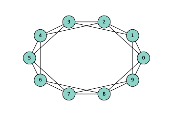
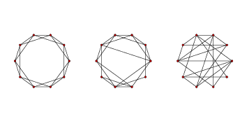
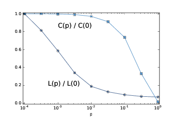

# 三、小世界图

> 原文：[Chapter 3  Small world graphs](http://greenteapress.com/complexity2/html/thinkcomplexity2004.html)

> 译者：[飞龙](https://github.com/wizardforcel)

> 协议：[CC BY-NC-SA 4.0](http://creativecommons.org/licenses/by-nc-sa/4.0/)

> 自豪地采用[谷歌翻译](https://translate.google.cn/)

现实世界中的许多网络，包括社交网络在内，具有“小世界属性”，即节点之间的平均距离，以最短路径上的边数来衡量，远远小于预期。

在本章中，我介绍了斯坦利·米拉格（Stanley Milgram）的著名的“小世界实验”，这是小世界属性在真正的社交网络中的第一次科学演示。之后我们将考虑 Watts-Strogatz 图，它是一个小世界图的模型。我将复制 Watts 和 Strogatz 所做的实验，并解释它打算展示的东西。

这个过程中，我们将看到两种新的图算法：广度优先搜索（BFS）和 Dijkstra 算法，用于计算图中节点之间的最短路径。

本章的代码在本书仓库的`chap03.ipynb`中。使用代码的更多信息请参见第（？）章。

## 3.1 Stanley Milgram

斯坦利·米拉格（Stanley Milgram）是美国社会心理学家，他进行了两项最著名的社会科学实验，即 Milgram 实验，研究人们对权威的服从（<http://en.wikipedia.org/wiki/Milgram_experiment>）和小世界实验，研究了社交网络的结构（<http://en.wikipedia.org/wiki/Small_world_phenomenon>）。

在小世界实验中，Milgram 向堪萨斯州威奇托（Wichita, Kansas）的几个随机选择的人发送了包裹，带有一个指示，要求他们向马萨诸塞州沙龙（Sharon, Massachusetts）的目标人员发送一封附带的信（在我长大的地方，波士顿附近），目标人员通过名字和职业确定。受访者被告知，只有当他亲自认识目标人员时，才可以将该信直接邮寄给目标；否则他们按照指示，将信和同一个指示发送给他们认为的，更有可能认识目标人员的亲戚或朋友。

许多信件从来没有发出过，但是对于发出的信件，平均路径长度（信件转发次数）的大约为 6。这个结果用于确认以前的观察（和猜测），社交网络中任何两个人之间的通常距离是“六度分隔”。

这个结论令人惊讶，因为大多数人都希望社交网络本地化 - 人们往往会靠近他们的朋友 - 而且在一个具有本地连接的图中，路径长度往往会与地理距离成比例增加。例如，我的大多数朋友都住在附近，所以我猜想社交网络中节点之间的平均距离是大约 50 英里。威奇托距离波士顿约有 1600 英里，所以如果 Milgram 的信件穿过了社交网络的典型环节，那么他们应该有 32 跳，而不是 6 跳。

## 3.2 Watts 和 Strogatz

1998年，Duncan Watts 和 Steven Strogatz 在 Nature 杂志上发表了一篇“小世界网络的集体动态”（Collective dynamics of ’small-world’ networks）论文，提出了小世界现象的解释。 你可以从 <http://www.nature.com/nature/journal/v393/n6684/abs/393440a0.html> 下载。

Watts 和 Strogatz 从两种很好理解的图开始：随机图和正则图。在随机图中，节点随机连接。在正则图中，每个节点具有相同数量的邻居。他们考虑这些图的两个属性，群聚性和路径长度：

群聚是图表的“集团性”（cliquishness）的度量。在图中，集团是所有节点的子集，它们彼此连接；在一个社交网络中，集团是一群人，彼此都是朋友。Watts 和 Strogatz 定义了一个群聚系数，用于量化两个节点彼此连接，并同时连接到同一个节点的可能性。

路径长度是两个节点之间的平均距离的度量，对应于社交网络中的分离度。

Watts 和 Strogatz 表明，正则图具有高群聚性和长路径长度，而大小相同的随机图通常具有群聚性和短路径长度。所以这些都不是一个很好的社交网络模型，它是高群聚性与短路径长度的组合。

他们的目标是创造一个社交网络的生成模型。生成模型通过为构建或导致现象的过程建模，试图解释现象。Watts 和 Strogatz 提出了用于构建小世界图的过程：

1.  从一个正则图开始，节点为`n`，每个节点连接`k`个邻居。

2.  选择边的子集，并将它们替换为随机的边来“重新布线”。

边的重新布线的概率是参数`p`，它控制图的随机性。当`p = 0`时，该图是正则的；`p = 1`是随机的。

Watts 和 Strogatz 发现，较小的`p`值产生高群聚性的图，如正则图，短路径长度的图，如随机图。

在本章中，我将按以下步骤复制 Watts 和 Strogatz 实验：

+   我们将从构建一个环格（ring lattice）开始，这是一种正则图。
+   然后我们和 Watts 和 Strogatz 一样重新布线。
+   我们将编写一个函数来测量群聚度，并使用 NetworkX 函数来计算路径长度。
+   然后，我们为范围内的`p`值计算群聚度和路径长度。
+   最后，我将介绍一种用于计算最短路径的高效算法，Dijkstra 算法。

## 3.3 环格



> 图 3.1 `n=10`，`k=4`的环格

正则图是每个节点具有相同数量的邻居的图；邻居的数量也称为节点的度。
环格是一种正则图，Watts 和 Strogatz 将其用作模型的基础。 在具有`n`个节点的环格中，节点可以排列成圆形，每个节点连接`k`个最近邻居。

例如，`n = 3`和`k = 2`的环形网格将拥有以下边：`(0, 1), (1, 2), (2, 0)`。 请注意，边从编号最高的节点“绕回”0。

更一般地，我们可以像这样枚举边：

```py

def adjacent_edges(nodes, halfk):
    n = len(nodes)
    for i, u in enumerate(nodes):
        for j in range(i+1, i+halfk+1):
            v = nodes[j % n]
            yield u, v
```

`adjacent_edges`接受节点列表和参数`halfk`，它是`k`的一半。它是一个生成器函数，一次产生一个边。它使用模运算符`%`，从编号最高的节点绕回最低的节点。

我们可以这样测试：

```py

>>> nodes = range(3)
>>> for edge in adjacent_edges(nodes, 1):
...     print(edge)
(0, 1)
(1, 2)
(2, 0)
```

现在我们可以使用`adjacent_edges`来生成环格。

```py

def make_ring_lattice(n, k):
    G = nx.Graph()
    nodes = range(n)
    G.add_nodes_from(nodes)
    G.add_edges_from(adjacent_edges(nodes, k//2))
    return G
```

注意，`make_ring_lattice`使用地板除计算`halfk`，所以如果`k`是奇数，它将向下取整并产生具有度`k-1`的环格。这可能不是我们想要的，但现在还不错。

我们可以像这样测试函数：

```py
lattice = make_ring_lattice(10, 4)
```

图（？）展示了结果。

## 3.4 WS 图



> 图 3.2 WS 图，`n=20`，`k=4`，`p=0`（左边），`p=0.2`（中间），`p=1`（右边）。

为了制作 Watts-Strogatz（WS）图，我们从一个环格开始，并为一些边“重新布线”。 在他们的论文中，Watts 和 Strogatz 以特定顺序考虑边，并用概率`p`重新布置每个边。 如果边被重新布置，则它们使第一个节点保持不变，并随机选择第二个节点。它们不允许自环或多边；也就是说，节点不能拥有到它自身的边，并且两个节点之间不能拥有多个边。

这是我的这个过程的实现。

```py

def rewire(G, p):
    nodes = set(G.nodes())
    for edge in G.edges():
        if flip(p):
            u, v = edge
            choices = nodes - {u} - set(G[u])
            new_v = choice(tuple(choices))
            G.remove_edge(u, v)
            G.add_edge(u, new_v)
```

参数`p`是边的重新布线的概率。`for`循环枚举了边，并使用`flip`，它以概率`p`返回`True`，来选择哪些被重新布置。

如果我们重新布置节点`u`到节点`v`的边，我们必须选择一个节点来替换`v`，称为`new_v`。为了计算可能的选择，我们从节点集开始，它是一个集合，并且移除`u`和它的邻居，这避免了自环和多边。

然后我们从选项中选择new_v，将`u`到`v`的现有删除，并从添加一个`u`到`new_v`的新边。

另外，表达式`G[u]`返回一个字典，他的键是包含`u`的邻居。在这种情况下，它比使用`G.neighbors`更快一点。

这个函数不按照 Watts 和 Strogatz 指定的顺序考虑边缘，但它似乎不会影响结果。

图（？）展示了`n = 20`，`k = 4`和范围内`p`值的 WS 图。当`p = 0`时，该图是环格。 当`p = 1`时，它是完全随机的。我们将看到，有趣的事情发生在两者之间。


## 3.5 群聚性

下一步是计算群聚系数，它量化了节点形成集团的趋势。 集团是一组完全连接的节点；也就是说，在集团中的所有节点对之间都存在边。

假设一个特定的节点`u`具有`k`个邻居。如果所有的邻居都相互连接，则会有`k(k-1)/2`个边。 实际存在的这些边的比例是`u`的局部群聚系数，表示为`Cu`。它被称为“系数”，因为它总是在 0 和 1 之间。

如果我们计算所有节点上的`Cu`平均值，我们得到“网络平均群聚系数”，表示为`C`。

这是一个计算它的函数。

```py

def node_clustering(G, u):
    neighbors = G[u]
    k = len(neighbors)
    if k < 2:
        return 0

    total = k * (k-1) / 2
    exist = 0
    for v, w in all_pairs(neighbors):
        if G.has_edge(v, w):
            exist +=1
    return exist / total
```

同样，我使用`G [u]`，它返回一个字典，键是节点的邻居。如果节点的邻居少于两个，则群聚系数未定义，但为简便起见，`node_clustering`返回 0。

否则，我们计算邻居之间的可能的边数量，`total`，然后计算实际存在的边数量。结果是存在的所有边的比例。

我们可以这样测试函数：

```py

>>> lattice = make_ring_lattice(10, 4)
>>> node_clustering(lattice, 1)
0.5
```

在`k=4`的环格中，每个节点的群聚系数是`0.5`（如果你不相信，可以看看图（？））。

现在我们可以像这样计算网络平均群聚系数：

```py

def clustering_coefficient(G):
    cc = np.mean([node_clustering(G, node) for node in G])
    return cc
```

`np.mean` 是个 NumPy 函数，计算列表或数组中元素的均值。

然后我们可以像这样测试：

```py

>>> clustering_coefficient(lattice)
0.5
```

这个图中，所有节点的局部群聚系数是 0.5，所以节点的平均值是 0.5。当然，我们期望这个值和 WS 图不同。

## 3.6 最短路径长度

下一步是计算特征路径长度`L`，它是每对节点之间最短路径的平均长度。 为了计算它，我将从 NetworkX 提供的函数开始，`shortest_path_length`。 我会用它来复制 Watts 和 Strogatz 实验，然后我将解释它的工作原理。

这是一个函数，它接受图并返回最短路径长度列表，每对节点一个。

```py

def path_lengths(G):
    length_map = nx.shortest_path_length(G)
    lengths = [length_map[u][v] for u, v in all_pairs(G)]
    return lengths
```

`nx.shortest_path_length`的返回值是字典的字典。外层字典每个节点`u`到内层字典的映射，内层字典是每个节点`v`到`u->v`的最短路径长度的映射。

使用来自`path_lengths`的长度列表，我们可以像这样计算`L`：

```py

def characteristic_path_length(G):
    return np.mean(path_lengths(G))
```

并且我们可以使用小型的环格来测试它。

```py

>>> lattice = make_ring_lattice(3, 2)
>>> characteristic_path_length(lattice)
1.0
```

这个例子中，所有三个节点都互相连接，所以平均长度为 1。

## 3.7 WS 实验



> 图 3.3：WS 图的群聚系数`C`和特征路径长度`L`，其中`n=1000, k=10`，`p`是一个范围。

现在我们准备复制 WS 实验，它表明对于一系列`p`值，WS 图具有像正则图像那样的高群聚性，像随机图一样的短路径长度。

我将从`run_one_graph`开始，它接受`n`，`k`和`p`；它生成具有给定参数的 WS图，并计算平均路径长度`mpl`和群聚系数`cc`：

```py

def run_one_graph(n, k, p):
    ws = make_ws_graph(n, k, p)
    mpl = characteristic_path_length(ws)
    cc = clustering_coefficient(ws)
    print(mpl, cc)
    return mpl, cc
```

Watts 和 Strogatz 用`n = 1000`和`k = 10`进行实验。使用这些参数，`run_one_graph`在我的电脑上需要大约一秒钟；大部分时间用于计算平均路径长度。

现在我们需要为范围内的`p`计算这些值。我将再次使用 NumPy 函数`logspace`来计算`ps`：

```py

ps = np.logspace(-4, 0, 9)
```

对于每个`p`的值，我生成了 3 个随机图，并且我们将结果平均。这里是运行实验的函数：

```py

def run_experiment(ps, n=1000, k=10, iters=3):
    res = {}
    for p in ps:
        print(p)
        res[p] = []
        for _ in range(iters):
            res[p].append(run_one_graph(n, k, p))
    return res
```

结果是个字典，将每个`p`值映射为`(mpl, cc)`偶对的列表。

最后一步就是聚合结果：

```py

L = []
C = []
for p, t in sorted(res.items()):
    mpls, ccs = zip(*t)
    mpl = np.mean(mpls)
    cc = np.mean(ccs)
    L.append(mpl)
    C.append(cc)
```

每次循环时，我们取得一个`p`值和一个`(mpl, cc)`偶对的列表。 我们使用`zip`来提取两个列表，`mpls`和`ccs`，然后计算它们的均值并将它们添加到`L`和`C`，这是路径长度和群聚系数的列表。

为了在相同的轴上绘制`L`和`C`，我们通过除以第一个元素，将它们标准化：

```py

L = np.array(L) / L[0]
C = np.array(C) / C[0]
```


图（？）展示了结果。 随着`p`的增加，平均路径长度迅速下降，因为即使少量随机重新布线的边，也提供了图区域之间的捷径，它们在格中相距很远。另一方面，删除局部链接降低了群聚系数，但是要慢得多。

因此，存在较宽范围的`p`，其中 WS 图具有小世界图的性质，高群聚度和短路径长度。

这就是为什么 Watts 和 Strogatz 提出了 WS 图，作为展示小世界现象的，现实世界网络的模型。

## 3.8 能有什么解释？

如果你问我，为什么行星轨道是椭圆形的，我最开始会为一个行星和一个恒星建模；我将在 <http://en.wikipedia.org/wiki/Newton's_law_of_universal_gravitation> 上查找万有引力定律，并用它为行星的运动写出一个微分方程。之后我会扩展轨道方程式，或者更有可能在 <http://en.wikipedia.org/wiki/Orbit_equation> 上查找。通过一个小的代数运算，我可以得出产生椭圆轨道的条件。之后我会证明我们看做行星的物体满足这些条件。

人们，或至少是科学家，一般对这种解释感到满意。它有吸引力的原因之一是，模型中的假设和近似值似乎是合理的。行星和恒星不是真正的质点，但它们之间的距离是如此之大，以至于它们的实际尺寸可以忽略不计。同一太阳系中的行星可以影响彼此的轨道，但效果通常较小。而且我们忽视相对论的影响，再次假定它们很小。

这也因为它是基于方程式的。我们可以用闭式表达轨道方程，这意味着我们可以有效地计算轨道。这也意味着我们可以得出轨道速度，轨道周期和其他数量的一般表达式。

最后，我认为这是因为它具有数学证明的形式。它从一组公理开始，通过逻辑和分析得出结果。但重要的是要记住，证明属于模型，而不是现实世界。也就是说，我们可以证明，行星的理想模型产生一个椭圆轨道，但是我们不能证明这个模型与实际的行星有关（实际上它不是）。

+   这些模型可以做什么工作：它们是预测性的还是说明性的，还是都有？
+   这些模型的解释，是否比基于更传统模型的解释更不满意？为什么？
+   我们应该如何刻画这些和更传统的模型之间的差异？他们在种类还是程度上不同？

在这本书中，我将提供我对这些问题的回答，但它们是暂时性的，有时是投机性的。我鼓励你怀疑地思考他们，并得出你自己的结论。

## 3.9 广度优先搜索

当我们计算最短路径时，我们使用了 NetworkX 提供的一个函数，但是我没有解释它是如何工作的。为此，我将从广度优先搜索开始，这是用于计算最短路径的 Dijkstra 算法的基础。

在第（？）节，我提出了`reachable_nodes`，它寻找从给定的起始节点可以到达的所有节点：

```py

def reachable_nodes(G, start):
    seen = set()
    stack = [start]
    while stack:
        node = stack.pop()
        if node not in seen:
            seen.add(node)
            stack.extend(G.neighbors(node))
    return seen
```

我当时没有这么说，但它执行深度优先搜索（DFS）。现在我们将修改它来执行广度优先搜索（BFS）。

为了了解区别，想象一下你正在探索一座城堡。你最开始在一个房间里，带有三个门，标记为 A，B 和 C 。你打开门 C 并发现另一个房间，它的门被标记为 D ，E 和 F。

下面你打开哪个门呢？如果你打算冒险，你可能想更深入城堡，选择 D，E 或 F。这是一个深度优先搜索。

但是，如果你想更系统化，你可以在 D，E 和 F 之前回去探索 A 和 B，这将是一个广度优先搜索。

在`reachable_nodes`中，我们使用`list.pop`选择下一个节点来“探索”。默认情况下，`pop`返回列表的最后一个元素，这是我们添加的最后一个元素。在这个例子中，这是门 F。

如果我们要执行 BFS，最简单的解决方案是将第一个元素从栈中弹出：

```py
node = stack.pop(0)
```

这有效，但速度很慢。在 Python 中，弹出列表的最后一个元素需要常数时间，但是弹出第一个元素线性于列表的长度。在最坏的情况下，就是堆栈的长度`O(n)`，这使得 BFS 的`O(nm)`的实现比`O(n + m)`差得多。

我们可以用双向队列（也称为`deque`）来解决这个问题。`deque`的一个重要特征就是，你可以在开头和末尾添加和删除元素。要了解如何实现，请参阅 <https://en.wikipedia.org/wiki/Double-ended_queue>。

Python 在`collections`模块中提供了`deque`，所以我们可以像这样导入它：

```py

from collections import deque
```

我们可以使用它来编写高效的 BFS：

```py

def reachable_nodes_bfs(G, start):
    seen = set()
    queue = deque([start])
    while queue:
        node = queue.popleft()
        if node not in seen:
            seen.add(node)
            queue.extend(G.neighbors(node))
    return seen
```

差异在于：

+   我用名为`queue`的`deque`替换了名为`stack`的列表。
+   我用`popleft`替换`pop`，它删除并返回队列的最左边的元素，这是第一个添加的元素。

这个版本恢复为`O(n + m)`。现在我们做好了寻找最短路径的准备。

## 3.10 （简化的）Dijkstra 算法

Edsger W. Dijkstra 是荷兰计算机科学家，发明了一种有效的最短路径算法（参见 <http://en.wikipedia.org/wiki/Dijkstra's_algorithm>）。他还发明了信号量，它是一种数据结构，用于协调彼此通信的程序（参见 <http://en.wikipedia.org/wiki/Semaphore_(programming>）和 Downey，《The Little Book of Semaphores》）。


作为一系列计算机科学论文的作者，Dijkstra 是著名（臭名昭著）的。 有些比如“反对 GOTO 语句的案例”（A Case against the GO TO Statement），对编程实践产生了深远的影响。其他比如“真正的计算机科学教学的残酷”（On the Cruelty of Really Teaching Computing Science），很有娱乐性，但效果却不好。

Dijkstra 算法解决了“单源最短路径问题”，这意味着它寻找从给定的“源”节点到图中每个其他节点（或至少每个连接节点）的最小距离。


我们最开始考虑算法的简化版本，所有边的长度相同。更一般的版本适用于任何非负的边的长度。

简化版本类似于第一节中的广度优先搜索 除了我们用称为`dist`的字典替换集合`seen`，该字典将每个节点映射为与源的距离：

```py

def shortest_path_dijkstra(G, start):
    dist = {start: 0}
    queue = deque([start])
    while queue:
        node = queue.popleft()
        new_dist = dist[node] + 1

        neighbors = set(G[node]) - set(dist)
        for n in neighbors:
            dist[n] = new_dist

        queue.extend(neighbors)
    return dist
```

这是它的工作原理：

+   最初，队列包含单个元素`start`，`dist`将`start`映射为距离 0（这是`start`到自身的距离）。
+   每次循环中，我们使用`popleft`获取节点，按照添加到队列的顺序。
+   接下来，我们发现节点的所有邻居都没有在`dist`中。
+   由于从起点到节点的距离是`dist [node]`，到任何未访问的邻居的距离是`dist [node] +1`。
+   对于每个邻居，我们向`dist`添加一个条目，然后将邻居添加到队列中。

只有在我们使用 BFS 而不是 DFS 时，这个算法才有效。为什么？

第一次循环中，`node`是`start`，`new_dist`为`1`。所以`start`的邻居距离为 1，并且进入了队列。

当我们处理`start`的邻居时，他们的所有邻居距离为`2`。我们知道，他们中没有一个距离为`1`，因为如果有的话，我们会在第一次迭代中发现它们。

类似地，当我们处理距离为 2 的节点时，我们将他们的邻居的距离设为`3`。我们知道它们中没有一个的距离为`1`或`2`，因为如果有的话，我们将在之前的迭代中发现它们。

等等。如果你熟悉归纳证明，你可以看到这是怎么回事。

但是，在我们开始处理距离为`2`的节点之前，只有我们处理了距离为`1`的所有节点，这个论证才有效，依此类推。这正是 BFS 所做的。

在本章末尾的练习中，你将使用 DFS 编写 Dijkstra 算法的一个版本，以便你有机会看到出现什么问题。

## 3.11 练习

练习 1：

在一个环格中，每个节点的邻居数量相同。邻居的数量称为节点的度，所有节点的度相同的图称为正则图。

所有环格都是正则的，但不是所有的正则图都是环格。特别地，如果`k`是奇数，则不能构造环格，但是我们可以构建一个正则图。

编写一个名为`make_regular_graph`的函数，该函数接受`n`和`k`，并返回包含`n`个节点的正则图，其中每个节点都有`k`个邻居。如果不可能使用`n`和`k`的给定值来制作正则图，则该函数应该抛出`ValueError`。

练习 2：

我的`reachable_nodes_bfs`实现是有效的，因为它是`O(n + m)`的，但它产生了很多开销，将节点添加到队列中并将其删除。 NetworkX 提供了一个简单，快速的 BFS 实现，可从 GitHub 上的 NetworkX 仓库获取，网址为 <https://github.com/networkx/networkx/blob/master/networkx/algorithms/components/connected.py>。

这里是我修改的一个版本，返回一组节点：

```py
def _plain_bfs(G, source):
    seen = set()
    nextlevel = {source}
    while nextlevel:
        thislevel = nextlevel
        nextlevel = set()
        for v in thislevel:
            if v not in seen:
                seen.add(v)
                nextlevel.update(G[v])
    return seen
```

将这个函数与`reachable_nodes_bfs`相比，看看哪个更快。之后看看你是否可以修改这个函数来实现更快的`shortest_path_dijkstra`版本。

练习 3：

下面的 BFS 实现包含两个性能错误。它们是什么？这个算法的实际增长级别是什么？

```py

def bfs(top_node, visit):
    """Breadth-first search on a graph, starting at top_node."""
    visited = set()
    queue = [top_node]
    while len(queue):
        curr_node = queue.pop(0)    # Dequeue
        visit(curr_node)            # Visit the node
        visited.add(curr_node)

        # Enqueue non-visited and non-enqueued children
        queue.extend(c for c in curr_node.children
                     if c not in visited and c not in queue)
```

练习 4：在第（？）节中，我说了除非使用 BFS，Dijkstra 算法不能工作。编写一个`shortest_path_dijkstra `的版本，它使用 DFS，并使用一些例子测试它，看看哪里不对。

练习 5：

Watts 和 Strogatz 的论文的一个自然问题是，小世界现象是否特定于它的生成模型，或者其他类似模型是否产生相同的定性结果（高群聚和短路径长度）。

为了回答这个问题，选择 WS 模型的一个变体并重复实验。 你可能会考虑两种变体：

+   不从常规图开始，从另一个高群聚的图开始。 例如，你可以将节点放置在二维空间中的随机位置，并将每个节点连接到其最近的`k`个邻居。
+   尝试不同种类的重新布线。

如果一系列类似的模型产生类似的行为，我们认为论文的结果是可靠的。

练习 6：

Dijkstra 算法解决了“单源最短路径”问题，但为了计算图的特征路径长度，我们其实需要解决“多源最短路径”问题。

当然，一个选择是运行 Dijkstra 算法`n`次，每个起始节点一次。 对于某些应用，这可能够好，但是有更有效的替代方案。

找到一个多源最短路径的算法并实现它。请参阅 <https://en.wikipedia.org/wiki/Shortest_path_problem#All-pairs_shortest_paths>。

将实现的运行时间与运行 Dijkstra 算法`n`次进行比较。哪种算法在理论上更好？哪个在实践中更好？NetworkX 使用了哪一个？
