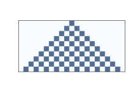
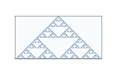
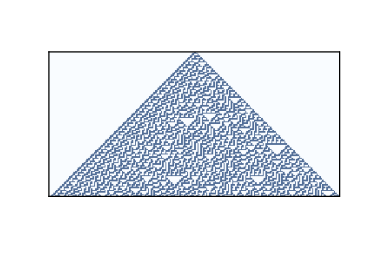
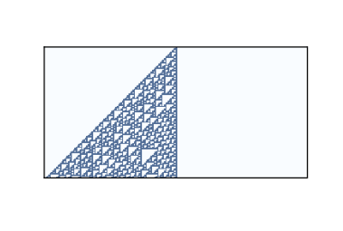
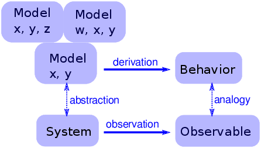
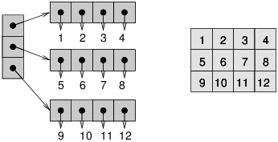

# 五、细胞自动机

> 原文：[Chapter 5  Cellular Automatons](http://greenteapress.com/complexity2/html/thinkcomplexity2006.html)

> 译者：[飞龙](https://github.com/wizardforcel)

> 协议：[CC BY-NC-SA 4.0](http://creativecommons.org/licenses/by-nc-sa/4.0/)

> 自豪地采用[谷歌翻译](https://translate.google.cn/)

细胞自动机（CA）是一个世界的模型，带有非常简单的物理。 “细胞”的意思是世界被分成一个大口袋，称为细胞。 “自动机”是一台执行计算的机器 - 它可能是一台真机。 ，但更多时候，“机器”是数学抽象或计算机的模拟。

本章介绍了史蒂文沃尔夫勒姆（Steven Wolfram）在 20 世纪 80 年代进行的实验，表明一些细胞自动机展示出令人惊讶的复杂行为，包括执行任意计算的能力。


我讨论了这些结果的含义，在本章的最后，我提出了在 Python 中高效实现 CA 的方法。

本章的代码位于本书仓库的`chap05.ipynb`中。 使用代码的更多信息，请参见第？章。

## 5.1 简单的 CA

细胞自动机 [1] 由规则来管理，它决定系统如何即时演化。 时间分为离散的步骤，规则规定了，如何根据当前状态计算下一个时间步骤中的世界状态。

> automaton（自动机）的复数为 automatons 或 automata。

作为一个微不足道的例子，考虑带有单个细胞的细胞自动机（CA）。 细胞状态是用变量`xi`表示的整数，其中下标`i`表示`xi`是时间步骤`i`期间的系统状态。 作为初始条件，`x0 = 0`。

现在我们需要一个规则。 我会任意选择`xi = x[i-1] + 1`，它表示在每个时间步骤之后，CA 的状态会增加 1。到目前为止，我们有一个简单的 CA ，执行简单的计算：它用于计数。

但是这个 CA 是不合规则的；可能的状态数通常是有限的。 为了使其成立，我将选择最小的感兴趣的状态数 2，和另一个简单的规则`xi = (x[i-1] + 1) % 2`，其中`%`是余数（或模）运算符。

这个 CA 的行为很简单：闪烁。 也就是说，在每个时间步之后，细胞的状态在 0 和 1 之间切换。

大多数 CA 是确定性的，这意味着规则没有任何随机元素；给定相同的初始状态，它们总是产生相同的结果。 也有不确定性的 CA，但我不会在这里涉及它们。

## 5.2 Wolfram 的实验

前一节中的 CA 只有一个细胞，所以我们可以将其视为零维，并且它不是很有趣。 在本章的其余部分中，我们将探索一维（1-D）CA，后者会变得非常有趣。


说 CA 有维度就是说细胞被安排在一个连续的空间中，这样它们中的一些可以看作“邻居”。 在一维中，有三种自然形式：

有限序列：

数量有限的细胞排成一排。 除第一个和最后一个之外的所有细胞都有两个邻居。

环：

数量有限的细胞排列成一个环。 所有细胞都有两个邻居。

无限序列：

数量无限的细胞排列成一排。

确定系统如何即时演化的规则，基于“邻域”的概念，即“邻域”，即决定给定细胞的下一个状态的一组细胞。

在二十世纪八十年代初，斯蒂芬沃尔夫勒姆发表了一系列论文，对一维 CA 进行了系统的研究。 他确定了四大类行为，每一类都比上一个更有趣。

Wolfram 的实验使用了三个细胞的邻域：细胞本身及其左右邻居。

在这些实验中，这些细胞有两个状态，分别表示为 0 和 1，所以规则可以通过一个表格进行汇总，它将邻域状态（状态的三元组）映射为中心细胞的下一个状态。 下表展示了一个示例：


| prev | 111 | 110 | 101 | 100 | 011 | 010 | 001 | 000 |
| --- | --- | --- | --- | --- | --- | --- | --- | --- |
| next | 0 | 0 | 1 | 1 | 0 | 0 | 1 | 0 |

第一行显示邻居可能拥有的八个状态。第二行显示下一个时间步骤中的中心细胞的状态。 作为该表的简明编码，Wolfram 建议将第二行读作二进制数。 因为二进制 00110010 是十进制的 50，所以 Wolfram 称这个 CA 为“规则 50”。



图 5.1：十个时间步骤之后的规则 50

上图展示了规则 50 在 10 个时间步骤之后的效果。 第一行展示第一个时间步骤内的系统状态; 它起始于一个“开”细胞，其余都是“关”。 第二行展示下一个时间步骤中的系统状态，以此类推。

图中的三角形是这些 CA 的典型；这是领域形状的结果吗？ 在一个时间步骤中，每个细胞都会影响任一方向上的邻居的状态。 在下一个时间步骤中，该影响可以在每个方向上向一个细胞传播。 因此，过去的每个细胞都有一个“影响三角形”，包括所有可能受其影响的细胞。

## 5.3 CA 的分类



图 5.2：64 个步骤之后的规则 18

有多少种不同的 CA？

由于每个细胞都处于开或关的状态，我们可以用一位来指定细胞的状态。在三个细胞的邻域中，有 8 种可能的情况，因此规则表中有 8 个条目。由于每个条目都占一个位，我们可以使用 8 位指定一个表。使用 8 位，我们可以指定 256 个不同的规则。

Wolfram 的第一个 CA 实验就是测试所有 256 种可能性并尝试对它们进行分类。

在视觉上检查结果时，他提出 CA 的行为可以分为四类。第一类包含最简单（也是最不感兴趣）的 CA，即从几乎任何起始条件演变为相同统一图案的 CA。作为一个简单的例子，规则 0 总是在一个时间步后产生一个空的图案。


规则 50 是第二类的一个例子。它生成一个带有嵌套结构的简单图案；也就是说，该图案包含许多自身的较小版本。规则 18 使嵌套结构更加清晰；图？显示了 64 步后的样子。


这种模式类似于谢尔宾斯基三角形，你可以在 <http://en.wikipedia.org/wiki/Sierpinski_triangle> 上阅读。

某些二类 CA 生成的图案复杂而美观，但与第三和第四类相比，它们相对简单。

## 5.4 随机性



图 5.3：100 个步骤之后的规则 30

第三类包含产生随机性的 CA。规则 30 是一个例子；图？显示 100 个时间步后的样子。

左侧有一个明显的图案，右侧有各种大小的三角形，但中心看起来很随意。 事实上，如果你把中间列看做一个比特序列，就很难将其区分于真正的随机序列。 它通过了许多统计测试，人们用来测试比特序列是否随机。

产生看起来随机的数字的程序，称为伪随机数字生成器（PRNG）。 他们不被认为是真正的随机，因为：

+   它们中的许多产生规律性序列，可以通过统计来检测。 例如，C 标准库中的`rand`的原始实现，使用了线性同余生成器，生成器生成的序列具有易于检测的序列相关性。

+   任何使用有限状态（即存储）的 PRNG 最终都会重复。 生成器的特点之一就是这种重复周期。

+   底层过程基本上是确定性的，不同于一些物理过程，如放射性衰减和热噪声，被认为是基本随机的。

现代 PRNG 产生的序列，在统计上与随机值无法区分，并且它们以很长的周期实现，以至于在重复之前宇宙将崩溃。 这些发生器的存在，提出了一个问题，即质量好的伪随机序列与由“真正的”随机过程产生的序列之间，是否存在真正差异。 在“A New Kind of Science”中，沃尔夫勒姆认为没有（第 315-326 页）。

## 5.5 确定性

第三类 CA 的存在令人惊讶。 为了解释多么令人惊讶，让我从哲学确定性（决定论）开始（参见<http://en.wikipedia.org/wiki/Determinism>）。 许多哲学立场很难准确定义，因为它们有不同的风味。 我经常发现，使用从弱到强排列的陈述列表，来定义它们是有用的：

D1：

确定性模型可以对某些物理系统做出准确的预测。

D2：

许多物理系统可以用确定性过程建模，但有些系统本质上是随机的。

D3：

所有事件都是由先验事件造成的，但许多物理系统基本上是不可预测的。

D4：

所有事件都是由先验事件造成的，并且可以（至少原则上）预测。

我构建这个范围的目标是，让 D1 如此弱以至于几乎每个人都会接受它，D4 如此强以至于几乎没有人会接受它，并且有些人会接受中间的陈述。

作为对历史发展和科学发现的回应，世界舆论的质心沿着这个范围摆动。 在科学革命之前，许多人认为宇宙的运作基本上是不可预测的，或由超自然力量所控制。 在牛顿力学的胜利之后，一些乐观主义者开始相信像 D4 这样的东西；例如，皮埃尔-西蒙拉普拉斯（Pierre-Simon Laplace）在 1814 年写道：

> 我们可以把宇宙的现状看作过去的果和未来的因。 一个智能在某个特定的时刻，知道所有使自然运动的力量，以及构成自然的所有物品的所有位置，如果它也足够大，来提交这些数据用于分析，它会将宇宙最大的天体和最小的原子的运动汇总成一个公式； 对于这样的智能来说，没有什么是不确定的，未来就像过去一样会存在于它的眼前。

这种“智能”被称为“拉普拉斯的恶魔”。见 <http://en.wikipedia.org/wiki/Laplace's_demon>。 在这种情况下，“恶魔”这个词具有“精神”的意义，没有邪恶的含义。


19 世纪和 20 世纪的发现逐渐打破了拉普拉斯的希望。 热力学，放射性和量子力学对强式的决定论构成了连续的挑战。


在 20 世纪 60 年代，混沌理论表明，在某些确定性系统中，预测只能在短时间尺度上进行，并受初始条件测量精度的限制。

大多数这些系统，是空间连续（不是时间）和非线性的，所以它们行为的复杂性并不令人惊讶。 沃尔夫勒姆在简单的细胞自动机中展示的复杂行为更令人惊讶，并且令人不安，至少对于确定性的世界观来说。


到目前为止，我一直关注对确定性的科学挑战，但是最持久的反对意见是确定性与人类自由意志之间的冲突。 复杂性科学为这种明显的冲突提供了可能的解决方案; 我将在第？章中回到这个话题。

## 5.6 飞船



图 5.4：100 步之后的规则 110

第四类 CA 的行为更令人惊讶。 几个一维 CA，最着名的是规则 110，是图灵完备的，这意味着他们可以计算任何可计算的函数。 这个属性也称为普遍性，由 Matthew Cook 在 1998 年证明。请参阅 <http://en.wikipedia.org/wiki/Rule_110>。


图？展示了初始条件为单个细胞和 100 个时间步骤的规则 110 的样子。 在这个时间尺度上，没有发生什么特别的事情。 有一些有规律的模式，但也有一些难以表述的特征。

图？展示了更大的图像，它起始于一个随机的初始条件和 600 个时间步骤：


图 5.5：初始条件随机和 600 个时间步骤的规则 110

经过大约 100 个步骤后，背景变成了简单的重复模式，但背景中有一些持久性结构表现为干扰。 其中一些结构是稳定的，所以它们表现为垂直线条。 其他的在空间中平移，表现为不同斜率的对角线，取决于它们移动一列所需的时间步数。 这些结构被称为飞船。


飞船之间的碰撞产生不同的结果，取决于飞船的类型和它们碰撞时的阶段。 一些碰撞歼灭两艘船，其他船只保持不变；还有一些产生不同类型的一艘或多艘船只。

这些碰撞是 CA 规则 110 中的计算基础。 如果你将飞船视为通过电线传播的信号，并将碰撞视为计算 AND 和 OR 等逻辑运算的门，那么你可以看到 CA 执行计算的意义。

## 5.7 通用性

为了理解通用性，我们必须理解可计算性理论，它关于计算模型和计算的东西。


最通用的计算模型之一是图灵机，它是由艾伦图灵在 1936 年提出的一种抽象计算机。图灵机是一个一维 CA，两个方向上都是无限的，并增加了一个读写头。在任何时候，头部都位于一个细胞上。它可以读取该细胞的状态（通常只有两种状态），并可以将新值写入细胞中。


此外，该机器还有一个寄存器，用于记录机器的状态（有限数量的状态之一）和一张规则表。对于每个机器状态和细胞状态，表格规定一个操作。操作包括修改头部所在的细胞，并向左或向右移动一个细胞。

图灵机并不是计算机的实际设计，但它模拟了常见的计算机体系结构。对于在真实计算机上运行的给定程序，（至少原则上）可以构造一个执行等效计算的图灵机。

图灵机很有用，因为它可以刻画一组图灵机可以计算的函数，这就是图灵所做的事情。 这个集合中的函数被称为图灵可计算的。


说图灵机可以计算任何图灵可计算函数，是一个赘述：根据定义它是真的。 但图灵可计算性比这更有趣。


事实证明，任何人提出的每个合理的计算模型都是图灵完备的；也就是说，它可以计算与图灵机完全相同的一组函数。 其中一些模型，如 lamdba 演算，与图灵机非常不同，所以它们的等价性令人惊讶。

这种观察产生了丘奇-图灵理论，它基本上定义了可计算的含义。 这个“理论”是，图灵可计算性是可计算性的正确，或至少是自然定义，因为它描述了这种计算模型的多样化集合的威力。

CA 规则 110是另一种计算模型，其简单性非常出色。 它也是通用的，为丘奇-图灵理论提供了支持。

在“A New Kind of Science”中，沃尔夫勒姆阐述了这个理论的一个变种，他称之为“计算等价性原理”：

几乎所有不明显的简单过程，都可以看作是具有复杂性相同的计算。
更具体来说，计算等价性原理表明，在自然界中发现的系统可以执行达到最高（“通用”）级别的计算能力的计算，并且大多数系统实际上实现了这种最高级别的计算能力。 因此，大多数系统在计算上是等效的（参见 <http://mathworld.wolfram.com/PrincipleofComputationalEquivalence.html>）。

将这些定义应用于 CA，第一类和第二类“显然很简单”。 第三类可能不那么明显，但在某种程度上，完美的随机性就像完美的顺序一样简单；复杂性存在于中间。 所以 Wolfram 声称第四类行为在自然界中很常见，并且几乎所有表现它的系统在计算上都是等价的。

## 5.8 可证伪性

沃尔夫勒姆认为，他的原则比丘奇图灵理论更强大，因为它是关于自然界的，而不是抽象的计算模型。但是说自然过程“可以看作计算”，使我觉得像理论选择的陈述。而不仅仅是自然世界的假设。


此外，对于像“几乎”和“明显简单”这样的未定义术语的资格，他的假设可能是不可证伪的。可证伪性是科学哲学的一个观点，由卡尔波普尔（Karl Popper）提出，作为科学假说与伪科学之间的界限。如果一个假设是假的，并且有一个实验，至少在实用性领域，它能反驳这个假设，那么这个假设是可证伪的。


例如，地球上的所有生命都来自共同祖先的说法是可证伪的，因为它对现代物种（在其他东西中）的基因相似性做出了特定的预测。如果我们发现了一种新物种，它的 DNA 与我们的 DNA 几乎完全不同，那么这就反驳了共同血统理论（或者至少引起质疑）。

另一方面，所谓“神创论”，即所有物种都是由超自然力量创造出来的，是不可证实的，因为没有任何我们可以观察到的，与自然世界相矛盾的东西。任何实验的结果都可以归因于创作者的意志。


不可证伪的假设可能有吸引力，因为不可能反驳它们。如果你的目标是永远不会被证明是错误的，你应该尽可能选择不可证伪的假设。

但是，如果你的目标是对世界做出可靠的预测 - 而这至少是科学的目标之一 - 那么不可证伪的假设是无用的。问题是他们没有结果（如果他们有结果，他们将是可证伪的）。


例如，如果神创论是真实的，那我知道它有什么好处呢？它不会告诉我任何造物主的事情，除了他有一种“对甲虫的非常喜爱”（归因于 J. B. S. Haldane）。不同于共同血统理论，它通告许多科学和生物工程领域，理解这个世界或者为之行动是没有用的。

## 5.9 这是什么模型？



图 5.6：一个简单物理模型的逻辑结构

一些细胞自动机主要是数学工艺品。 它们很有趣，因为它们令人惊讶，或者有用，或者漂亮，或者因为它们提供了创建新式数学的工具（比如丘奇图灵定理）。


但是，它们是不是物理系统的模型还并不清楚。 如果他们是，他们是高度抽象的，也就是说他们并不很详细或现实。


例如，某些锥螺物种在它们的壳上产生图案，类似于由细胞自动机产生的图案（参见`en.wikipedia.org/wiki/Cone_snail`）。 所以假设 CA 是随着壳长大而在壳上产生图案的机制的模型，这是很自然的。 但是，至少在最初阶段，模型元素（所谓的细胞，邻居之间的通信，规则）如何对应成长的蜗牛（真实细胞，化学信号，蛋白质交互网络）的元素，还并不清楚。

对于传统的物理模型，现实是一种优点。如果模型的元素对应物理系统的元素，则模型和系统之间有明显的类比。总的来说，我们期望更现实的模型能够做出更好的预测，并提供更可信的解释。


当然，这只是一个事实。更详细的模型更难以处理，并且通常不太适合分析。在某些时候，模型变得如此复杂，以至于直接对系统进行实验更容易。

在另一个极端，简单的模型可以完全引人注目，因为它们很简单。

简单模型提供了与详细模型不同的解释。使用详细的模型，论述就像这样：“我们对物理系统`S`感兴趣，所以我们构造了一个详细模型`M`，并且通过分析和模拟表明`M`表现出一种行为`B`，它与实际系统的观察`O`（定性或定量地）相似。那么为什么`O`会发生？因为`S`类似于`M`，而`B`类似于`O`，我们可以证明`M`导致`B`。”

使用简单的模型，我们不能说`S`与`M`相似，因为它不是。 相反，论述是这样的：“有一组模型共享一组共同的特征。 任何具有这些特征的模型都表现出行为`B`。如果我们进行类似于`B`的观察`O`，解释它的一种方式是，这表明系统`S`具有足以产生`1`的一组特征。”

对于这种说法，增加更多的特征并没有帮助。 使模型更真实不会使模型更可靠；它只掩盖了导致`O`的基本特征，和`S`特有的附带特征之间的差异。

图？显示了这种模型的逻辑结构。 特征`x`和`y`足以产生行为。 增加更多细节，如特征`w`和`z`，可能会使模型更加逼真，但是这种现实并没有增加解释力。

## 5.10 CA 的实现



图 5.7：列表的列表（左）和 NumPy 数组（右）

为了生成本章中的图形，我编写了一个名为 CA 的 Python 类，它代表细胞自动机，以及用于绘制结果的类。在接下来的几节中，我会解释他们如何工作。


为了存储 CA 的状态，我使用了 NumPy 数组，这是一个多维数据结构，其元素类型都相同。它与嵌套列表类似，但通常更小更快。图？说明了原因。左侧的图展示了整数列表的列表；每个点表示一个引用，它占用 4-8 个字节。要访问其中的一个整数，你必须跟随两个引用。

右图显示了相同整数的数组。因为这些元素大小都相同，所以它们可以连续存储在内存中。这种安排节省了空间，因为它不使用引用，并且节省了时间，因为可以直接从下标计算元素的位置；没有必要跟随一系列的引用。

为了解释我的代码如何工作，我将以一个 CA 开始，它计算每个邻域中细胞的“奇偶性”。如果数字是偶数，则数字的奇偶性为 0；如果数字为奇数，则奇偶性为 1。

首先，我在第一行的中间，创建带有单个 1 的零数组。

```py
>>> rows = 5
>>> cols = 11
>>> ca = np.zeros((rows, cols))
>>> ca[0, 5] = 1
print(ca)
[[ 0.  0.  0.  0.  0.  1.  0.  0.  0.  0.  0.]
 [ 0.  0.  0.  0.  0.  0.  0.  0.  0.  0.  0.]
 [ 0.  0.  0.  0.  0.  0.  0.  0.  0.  0.  0.]
 [ 0.  0.  0.  0.  0.  0.  0.  0.  0.  0.  0.]
 [ 0.  0.  0.  0.  0.  0.  0.  0.  0.  0.  0.]]
```

`plot_ca`用图形展示了结果。

```py
mport matplotlib.pyplot as plt

def plot_ca(ca, rows, cols):
    cmap = plt.get_cmap('Blues')
    plt.imshow(array, interpolation='none', cmap=cmap)
```

按照约定，我使用缩写名称`plt`引入了`pyplot`。 `imshow`将数组视为“图像”并显示它。 使用颜色表`'Blues'`，将“开”细胞绘制为深蓝色，“关”细胞绘制为淡蓝色。

现在，为了计算下一个时间步中的 CA 状态，我们可以使用`step`：


```py

def step(array, i):
    rows, cols = array.shape
    for j in range(1, cols):
        array[i, j] = sum(array[i-1, j-1:j+2]) % 2
```

参数`ca`是表示 CA 状态的 NumPy 数组。 `rows`和`col`是数组的维数，而`i`是我们应该计算的时间步骤的索引。 我用`i`来表示数组的行，它们对应于时间，`j`表示对应于空间的列。

在`step`内部，我们遍历第`i`行的元素。 每个元素是来自上一行的三个元素的总和，并对 2 取余。

## 5.11 互相关

上一节中的`step`函数很简单，但速度并不是很快。 一般来说，如果我们用 NumPy 操作替换循环，我们可以加速这样的操作，因为 Python 解释器中的`for`循环会产生大量开销。 在本节中，我将展示如何使用NumPy函数相关来加快步骤。

首先，我们可以使用数组乘法来代替切片运算符来选择邻域。 具体来说，我们将数组乘以一个窗口，其中我们想要选择的细胞为一，其余为零。

例如，以下窗口选择前三个元素：

```py

>>> window = np.zeros(cols, dtype=np.int8)
>>> window[:3] = 1
>>> print(window)
[1 1 1 0 0 0 0 0 0 0 0]
```

如果我们乘以数组的最后一行，我们会得到前三个元素：

```py
>>> print(array[4])
>>> print(window * array[4])
[0 1 0 0 0 1 0 0 0 1 0]
[0 1 0 0 0 0 0 0 0 0 0]
```

现在我们可以使用`sum`和模运算符来计算下一行的第一个元素：

```py

>>> sum(window * array[4]) % 2
1
```

如果我们将窗口向右移动，它会选择接下来的三个元素，以此类推。所以我们可以像这样重写`step`：

```py

def step2(array, i):
    rows, cols = array.shape
    window = np.zeros(cols)
    window[:3] = 1
    for j in range(1, cols):
        array[i, j] = sum(window * array[i-1]) % 2
        window = np.roll(window, 1)
```

`roll`将窗口向右移动（它也把末尾的补在开头，但不影响这个函数）。

`step2`产生`step`的相同结果。 它仍然不是非常快，但是它朝着正确的方向迈出了一步，因为我们刚刚执行的操作（乘以窗口，将结果相加，移动窗口并重复）用于各种应用。 它被称为互相关，而 NumPy 提供了一个称为`correlate`的函数来计算它。

我们可以用它来编写更快，更简单的步骤：

```py

def step3(array, i):
    window = np.array([1, 1, 1])
    array[i] = np.correlate(array[i-1], window, mode='same') % 2
```

当我们使用`np.correlate`时，窗口不必与数组大小相同，因此使窗口更简单一些。

`mode `参数决定结果的大小。 你可以阅读 NumPy 文档中的详细信息，但是当模式为`'same'`时，结果与输入大小相同。

## 5.12 CA 表

现在还差一步。 如果 CA 规则仅取决于邻居的总和，那么我们迄今为止的函数仍然有效，但大多数规则还取决于哪些邻居是开或者关的。 例如，100 和 001 可能会产生不同的结果。

我们可以使用一个包含元素`[4,2,1]`的窗口，使`step`更加通用，它将邻域解释为一个二进制数。 例如，邻域 100 产生 4；010 产生 2，001 产生 1。然后我们可以在规则表中查找这些结果。

以下是更一般的步骤：

```py

def step4(array, i):
    window = np.array([4, 2, 1])
    corr = np.correlate(array[i-1], window, mode='same')
    array[i] = table[corr]
```

前两行几乎相同。 最后一行在`table`中查找`corr`的每个元素，并将结果赋给`array[i]`。

最后，这是计算表的函数：

```py

def make_table(rule):
    rule = np.array([rule], dtype=np.uint8)
    table = np.unpackbits(rule)[::-1]
    return table
```

参数`rule`是一个 0 到 255 的整数。第一行将规则放入单个元素的数组中，以便我们可以使用`unpackbits`，将规则编号转换为其二进制表示形式。 例如，以下是规则 150 的表：

```py

>>> table = make_table(150)
>>> print(table)
[0 1 1 0 1 0 0 1]
```

在`thinkcomplexity.py`中，你将找到CA的定义，它封装了本节中的代码，以及两个绘制 CA 的类，`PyplotDrawer`和`EPSDrawer`。

## 5.13 练习

练习 1

本章的代码位于本书仓库的 Jupyter 笔记本`chap05.ipynb`中。打开这个笔记本，阅读代码，然后运行单元格。你可以使用这个笔记本来做本章的练习。我的解决方案在`chap05soln.ipynb`中。

练习 2

这个练习要求你试验规则 110 以及它的一些飞船。

1.  阅读规则 110 的维基百科页面，其中描述了其背景图案和飞船：<https://en.wikipedia.org/wiki/Rule_110>。

1.  使用产生稳定背景图案的初始条件创建 CA 规则 110。

    请注意，CA 类提供了`start_string`，它允许你使用 1 和 0 的字符串初始化数组的状态。

1.  通过在行的中心添加不同的图案来修改初始条件，并查看哪些产生了飞船。对于一些`n`的合理的值，你可能想列举所有可能的`n`位图案。对于每个飞船，你能找到平移的时间和速度吗？你能找到的最大的飞船是什么？

1.  当宇宙飞船相撞时会发生什么？

练习 3

这个练习的目标是实现一个图灵机。

1.  阅读 <http://en.wikipedia.org/wiki/Turing_machine> 来了解图灵机。
1.  编写一个名为`Turing`的类来实现图灵机。对于动作表，使用三个状态的 Busy Beaver 的规则。
1.  写一个名为`TuringDrawer`的类，该类生成一个图像，表示磁带状态以及磁头位置和状态。可能的外观的一个示例，请参阅 <http://mathworld.wolfram.com/TuringMachine.html>。

练习 4

1.  本练习要求你执行并测试几个 PRNG。为了进行测试，你需要安装 DieHarder，你可以从 <https://www.phy.duke.edu/~rgb/General/dieharder.php> 下载 DieHarder，也可能为你的操作系统作为软件包提供。
1.  编写一个程序，实现 <http://en.wikipedia.org/wiki/Linear_congruential_generator> 中描述的线性同余生成器之一。使用 DieHarder 进行测试。
1.  阅读 Python`random`模块的文档。它使用了什么 PRNG？测试它。
1.  使用几百个细胞实现 CA 规则 30，在合理的时间内以尽可能多的时间步骤运行它，然后将中心列输出为位序列。测试它。

练习 5

可证伪性是一个吸引人的和有用的想法，但在科学哲学家中，它并不普遍视为界限的解决方案，正如波普尔所声称的那样。

阅读 <http://en.wikipedia.org/wiki/Fififiability> 并回答以下问题。

1.  界限问题是什么？
1.  根据波普尔的说法，可证伪性是否解决了界限问题？
1.  给出两个理论示例，一个被认为是科学，另一个被认为是非科学，它们由可证伪性的标准成功地区分开。
1.  你能总结出科学哲学家和历史学家对波普尔的主张提出的，一个或多个反对意见吗？
1.  你是否有这样的感觉，即实践哲学家对波普尔的工作给予高度评价？
