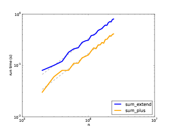
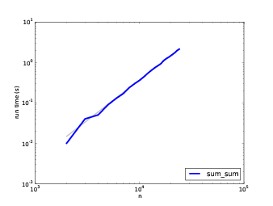

# 附录 A、算法分析

> 原文：[Appendix A  Analysis of algorithms](http://greenteapress.com/complexity2/html/thinkcomplexity2014.html)

> 译者：[飞龙](https://github.com/wizardforcel)

> 协议：[CC BY-NC-SA 4.0](http://creativecommons.org/licenses/by-nc-sa/4.0/)

> 自豪地采用[谷歌翻译](https://translate.google.cn/)

> 部分参考了[《Think Python 2e 中译本 第二十一章：算法分析》](http://codingpy.com/books/thinkpython2/21-analysis-of-algorithms.html)

_算法分析_ (**Analysis of algorithms**) 是计算机科学的一个分支， 着重研究算法的性能， 特别是它们的运行时间和资源开销。见 [http://en.wikipedia.org/wiki/Analysis_ofalgorithms](http://en.wikipedia.org/wiki/Analysis_ofalgorithms) 。

算法分析的实际目的是预测不同算法的性能，用于指导设计决策。

2008年美国总统大选期间，当候选人奥巴马(Barack Obama)访问Google时， 他被要求进行即时分析。首席执行官 Eric Schmidt 开玩笑地问他“对一百万个32位整数排序的最有效的方法”。 显然有人暗中通知了奥巴马，因为他很快回答，“我认为不应该采用冒泡排序法”。 详见 [http://www.youtube.com/watch?v=k4RRi_ntQc8](http://www.youtube.com/watch?v=k4RRi_ntQc8) 。

是真的：冒泡排序概念上很简单，但是对于大数据集来说速度非常慢。Schmidt所提问题的答案可能是 “基数排序 ([http://en.wikipedia.org/wiki/Radix_sort](http://en.wikipedia.org/wiki/Radix_sort))” [1]。

> [1] 但是，如果你面试中被问到这个问题，我认为更好的答案是，“对上百万个整数进行最快排序的方法就是用你所使用的语言的内建排序函数。它的性能对于大多数应用而言已优化的足够好。但如果最终我的应用运行太慢，我会用性能分析器找出大量的运算时间被用在了哪儿。如果采用一个更快的算法会对性能产生显著的提升，我会试着找一个基数排序的优质实现。”

算法分析的目的是在不同算法间进行有意义的比较， 但是有一些问题：

*   算法的相对性能依赖于硬件的特性，因此一个算法可能在机器A上比较快， 另一个算法则在机器B上比较快。 对此问题一般的解决办法是指定一个 _机器模型_ (machine model) 并且分析一个算法在一个给定模型下所需的步骤或运算的数目。
*   相对性能可能依赖于数据集的细节。 例如， 如果数据已经部分排好序， 一些排序算法可能更快； 此时其它算法运行的比较慢。 避免该问题的一般方法是分析 _最坏情况_。 有时分析平均情况性能也可， 但那通常更难，而且可能不容易弄清该对哪些数据集合进行平均。
*   相对性能也依赖于问题的规模。一个对于小列表很快的排序算法可能对于长列表很慢。 此问题通常的解决方法是将运行时间（或者运算的次数）表示成问题规模的函数， 并且根据各自随着问题规模的增长而增加的速度，将函数分成不同的类别。

此类比较的好处是有助于对算法进行简单的分类。 例如，如果我知道算法A的运行时间与输入的规模 `n` 成正比， 算法 B 与 `n^2` 成正比，那么我可以认为 A 比 B 快，至少对于很大的 `n` 值来说。

这类分析也有一些问题，我们后面会提到。

## A.1 增长级别

假设你已经分析了两个算法，并能用输入计算量的规模表示它们的运行时间： 若算法 A 用 `100n+1` 步解决一个规模为 `n` 的问题；而算法 B 用 `n^2 + n + 1` 步。

下表列出了这些算法对于不同问题规模的运行时间：

| 输入大小 | 算法 A 的运行时间 | 算法 B 的运行时 |
| --- | --- | --- |
| 10 | 1,001 | 111 |
| 100 | 10,001 | 10,101 |
| 1,000 | 100,001 | 1,001,001 |
| 10,000 | 1,000,001 | `> 10^10` |

当 `n=10` 时，算法 A 看上去很糟糕，它用了 10 倍于算法 B 所需的时间。 但当 `n=100` 时 ，它们性能几乎相同， 而 `n` 取更大值时，算法 A 要好得多。

根本原因是对于较大的 `n` 值，任何包含 `n^2` 项的函数都比首项为 `n` 的函数增长要快。 _首项_ (leading term) 是指具有最高指数的项。

对于算法A，首项有一个较大的系数 100，这是为什么对于小 `n` ，B比A好。但是不考虑该系数，总有一些 `n` 值使得 `a n^2 > b n`，`a` 和 `b` 可取任意值。

同样推论也适用于非首项。 即使算法 A 的运行时间为 `n+1000000` ，对于足够大的 `n` ，它仍然比算法 B 好。

一般来讲，我们认为具备较小首项的算法对于规模大的问题是一个好算法，但是对于规模小的问题，可能存在有一个 _交叉点_ (crossover point)，在此规模以下，另一个算法更好。 交叉点的位置取决于算法的细节、输入以及硬件，因此在进行算法分析时它通常被忽略。 但是这不意味着你可以忘记它。

如果两个算法有相同的首项，很难说哪个更好；答案还是取决于细节。 所以对于算法分析来说，具有相同首项的函数被认为是相当的，即使它们具有不同的系数。

_增长级别_(order of growth)是一个函数集合，集合中函数的增长行为被认为是相当的。 例如`2n`、`100n`和`n+1`属于相同的增长级别，可用 _大O符号_(Big-Oh notation) 写成`O(n)`， 而且常被称作 _线性级_ (linear)，因为集合中的每个函数随着`n`线性增长。

首项为 `n^2` 的函数属于 `O(n^2)`；它们被称为 _二次方级_ (quadratic)。

下表列出了算法分析中最通常的一些增长级别，按照运行效率从高到低排列。

| 增长级别 | 名称 |
| --- | --- |
| `O(1)` | 常数 |
| `O(logn)` | 对数 |
| `O(n)` | 线性 |
| `O(n logn)` | 线性对数 |
| `O(n^2)` | 二次 |
| `O(n^3)` | 三次 |
| `O(c^n)` | 指数 |

对于对数级，对数的基数并不影响增长级别。 改变基数等价于乘以一个常数，其不改变增长级别。相应的，所有的指数级数都属于相同的增长级别，而无需考虑指数的基数大小。指数函数增长级别增长的非常快，因此指数级算法只用于小规模问题。

练习 1

访问 [http://en.wikipedia.org/wiki/Big_O_notation](http://en.wikipedia.org/wiki/Big_O_notation) ，阅读维基百科关于大O符号的介绍，并回答以下问题：

1.  `n^3 + n^2`的增长级别是多少？`1000000 n^3 + n^2` 和 `n^3 + 1000000 n^2` 的增长级别又是多少？
2.  `(n^2 + n) * (n + 1)`的增长级别是多少？在开始计算之前，记住你只需要考虑首项即可。
3.  如果 `f` 的增长级别为 `O(g)` ，那么对于未指定的函数 `g` ，我们可以如何描述 `af+b` ？
4.  如果 `f1` 和 `f2` 的增长级别为 `O(g)`，那么 `f1 + f2` 的增长级别又是多少？
5.  如果 `f1` 的增长级别为 `O(g)` ，`f2` 的增长级别为 `O(h)`，那么 `f1 + f2` 的增长级别是多少？
6.  如果 `f1` 的增长级别为 `O(g)` ，`f2` 的增长级别为 `O(h)`，那么 `f1 * f2` 的增长级别是多少？

关注性能的程序员经常发现这种分析很难忍受。他们的观点有一定道理：有时系数和非首项会产生巨大的影响。 有时，硬件的细节、编程语言以及输入的特性会造成很大的影响。对于小问题，渐近的行为没有什么影响。

但是，如果你牢记这些注意事项，算法分析就是一个有用的工具。 至少对于大问题，“更好的” 算法通常更好，并且有时要好的多。 相同增长级别的两个算法之间的不同通常是一个常数因子，但是一个好算法和一个坏算法之间的不同是无限的！

## A.2 Python基本运算操作分析

在 Python 中，大部分算术运算的开销是常数级的；乘法会比加减法用更长的时间，除法更长， 但是这些运算时间不依赖被运算数的数量级。非常大的整数却是个例外；在这种情况下，运行时间随着位数的增加而增加。

索引操作 — 在序列或字典中读写元素 — 的增长级别也是常数级的，和数据结构的大小无关。

一个遍历序列或字典的 for 循环通常是线性的，只要循环体内的运算是常数时间。 例如，累加一个列表的元素是线性的：

```py
total = 0
for x in t:
    total += x

```

内建函数 `sum` 也是线性的，因为它做的是相同的事情，但是它要更快一些，因为它是一个更有效的实现；从算法分析角度讲，它具有更小的首项系数。

根据经验，如果循环体内的增长级别是 `O(n^a)`，则整个循环的增长级别是`O(n^(a+1))`。如果这个循环在执行一定数目循环后退出则是例外。 无论 `n` 取值多少，如果循环仅执行 `k` 次， 整个循环的增长级别是`O(n^a)`，即便 `k` 值比较大。

乘上 `k` 并不会改变增长级别，除法也是。 因此，如果循环体的增长级别是 `O(n^a)`，而且循环执行 `n/k` 次，那么整个循环的增长级别就是 `O(n^(a+1))` , 即使 `k` 值很大。

大部分字符串和元组运算是线性的，除了索引和 `len` ，它们是常数时间。 内建函数 `min` 和 `max` 是线性的。切片运算与输出的长度成正比，但是和输入的大小无关。

字符串拼接是线性的；它的运算时间取决于运算对象的总长度。

所有字符串方法都是线性的，但是如果字符串的长度受限于一个常数 — 例如，在单个字符上的运算 — 它们被认为是常数时间。字符串方法 `join` 也是线性的；它的运算时间取决于字符串的总长度。

大部分的列表方法是线性的，但是有一些例外：

*   平均来讲，在列表结尾增加一个元素是常数时间。 当它超出了所占用空间时，它偶尔被拷贝到一个更大的地方，但是对于 `n` 个运算的整体时间仍为 `O(n)` ， 所以我每个运算的平均时间是 `O(1)` 。
*   从一个列表结尾删除一个元素是常数时间。
*   排序是 `O(n logn)` 。

大部分的字典运算和方法是常数时间，但有些例外：

*   `update` 的运行时间与作为形参被传递的字典（不是被更新的字典）的大小成正比。
*   `keys`、`values` 和 `items` 是常数时间，因为它们返回迭代器。 但是如果你对迭代器进行循环，循环将是线性的。

字典的性能是计算机科学的一个小奇迹之一。在[哈希表](#hashtable)一节中，我们将介绍它们是如何工作的。

练习 2

访问 [http://en.wikipedia.org/wiki/Sorting_algorithm](http://en.wikipedia.org/wiki/Sorting_algorithm) ，阅读维基百科上对排序算法的介绍，并回答下面的问题：

1.  什么是“比较排序”？比较排序在最差情况下的最好增长级别是多少？别的排序算法在最差情况下的最优增长级别又是多少？
2.  冒泡排序法的增长级别是多少？为什么奥巴马认为是“不应采用的方法”
3.  基数排序(radix sort)的增长级别是多少？我们使用它之前需要具备的前提条件有哪些？
4.  排序算法的稳定性是指什么？为什么它在实际操作中很重要？
5.  最差的排序算法是哪一个（有名称的）？
6.  C 语言使用哪种排序算法？Python使用哪种排序算法？这些算法稳定吗？你可能需要谷歌一下，才能找到这些答案。
7.  大多数非比较算法是线性的，因此为什 Python 使用一个 增长级别为 `O(n logn)` 的比较排序？

## A.3 搜索算法分析

_搜索_ (search)算法，接受一个集合以及一个目标项，并判断该目标项是否在集合中，通常返回目标的索引值。

最简单的搜素算法是“线性搜索”，其按顺序遍历集合中的项，如果找到目标则停止。 最坏的情况下， 它不得不遍历全部集合，所以运行时间是线性的。

序列的 in 操作符使用线性搜索；字符串方法 `find` 和 `count` 也使用线性搜索。

如果元素在序列中是排序好的，你可以用 _二分搜素_ (bisection search) ，它的增长级别是 `O(logn)` 。 二分搜索和你在字典中查找一个单词的算法类似（这里是指真正的字典，不是数据结构）。 你不会从头开始并按顺序检查每个项，而是从中间的项开始并检查你要查找的单词在前面还是后面。 如果它出现在前面，那么你搜索序列的前半部分。否则你搜索后一半。如论如何，你将剩余的项数分为一半。

练习 3

编写一个叫做`bisection`的函数，它接受有序列表和目标值，并返回列表中值的索引（如果存在的话）；如果不存在则返回`None`。

或者你可以阅读对分模块的文档并使用它！

如果序列有 1,000,000 项，它将花 20 步找到该单词或判断出其不在序列中。因此它比线性搜索快大概 50,000 倍。

二分搜索比线性搜索快很多，但是它要求已排序的序列，因此使用时需要做额外的工作。

另一个检索速度更快的数据结构被称为 _哈希表_ (hashtable) — 它可以在常数时间内检索出结果 — 并且不依赖于序列是否已排序。 Python 中的字典就通过哈希表技术实现的，因此大多数的字典操作，包括 in 操作符，只花费常数时间就可完成。

## A.4 哈希表

为了解释哈希表是如何工作以及为什么它的性能如此优秀， 我们从实现一个简单的映射(map)开始并逐步改进它，直到其成为一个哈希表。

我们使用 Python 来演示这些实现，但在现实生活中，你用不着用 Python 写这样的代码；你只需用内建的字典对象就可以了！因此在接下来的内容中，你就当字典对象并不存在，你希望自己实现一个将键映射到值的数据结构。你必须实现的操作包括：

`add(k, v)`：

> 增加一个新的项，其从键 k 映射到值 v 。 如果使用 Python 的字典d，该运算被写作 `d[k] = v`。

`get(k)`：

> 查找并返回相应键的值。 如果使用 Python 的字典d，该运算被写作 `d[k]` 或 `d.get(k)` 。

现在，假设每个键只出现一次。该接口最简单的实现是使用一个元组列表，其中每个元组是一个键-值对。

```py
class LinearMap:

    def __init__(self):
        self.items = []

    def add(self, k, v):
        self.items.append((k, v))

    def get(self, k):
        for key, val in self.items:
            if key == k:
                return val
        raise KeyError

```

`add` 向项列表追加一个键—值元组，其增长级别为常数时间。

`get` 使用 `for` 循环搜索该列表：如果它找到目标键，则返回相应的值；否则触发一个 `KeyError`。因此 `get` 是线性的。

另一个方案是保持列表按键排序。那么，`get` 可以使用二分搜索，其增长级别为 `O(logn)` 。 但是在列表中间插入一个新的项是线性的，因此这可能不是最好的选择。 有其它的数据结构能在对数级时间内实现 `add` 和 `get` ，但是这仍然不如常数时间好，那么我们继续。

另一种改良 `LinearMap` 的方法是将键-值对列表分成小列表。 下面是一个被称作 `BetterMap` 的实现，它是 100 个 `LinearMap` 组成的列表。 正如一会儿我们将看到的，`get` 的增长级别仍然是线性的， 但是 `BetterMap` 是迈向哈希表的一步。

```py
class BetterMap:

    def __init__(self, n=100):
        self.maps = []
        for i in range(n):
            self.maps.append(LinearMap())

    def find_map(self, k):
        index = hash(k) % len(self.maps)
        return self.maps[index]

    def add(self, k, v):
        m = self.find_map(k)
        m.add(k, v)

    def get(self, k):
        m = self.find_map(k)
        return m.get(k)

```

`__init__`会生成一个由 n 个 `LinearMap` 组成的列表。

`add`和 `get` 使用 `find_map` 查找往哪一个列表中添加新项，或者对哪个列表进行检索。

`find_map` 使用了内建函数 `hash`，其接受几乎任何 Python 对象并返回一个整数。 这一实现的一个限制是它仅适用于可哈希的键。像列表和字典等可变类型是不能哈希的。

被认为是相等的可哈希对象返回相同的哈希值，但是反之不是必然成立：两个具备不同值的对象能够返回相同的哈希值。

`find_map`使用求余运算符将哈希值包在 0 到 `len(self.maps)` 之间， 因此结果是该列表的合法索引值。当然，这意味着许多不同的哈希值将被包成相同的索引值。 但是如果哈希函数散布相当均匀（这是哈希函数被设计的初衷）， 那么我们预计每个 `LinearMap` 会有 `n/100` 项。

由于 `LinearMap.get` 的运行时间与项数成正比，那么我们预计 `BetterMap` 比 `LinearMap` 快100倍。 增长级别仍然是线性的，但是首项系数变小了。这样很好，但是仍然不如哈希表好。

下面是使哈希表变快的关键：如果你能保证 `LinearMap` 的最大长度是有上限的，则 `LinearMap.get` 的增长级别是常数时间。你只需要跟踪项数并且当每个 `LinearMap` 的项数超过阈值时，通过增加更多的 `LinearMap` 调整哈希表的大小。

以下是哈希表的一个实现：

```py
class HashMap:

    def __init__(self):
        self.maps = BetterMap(2)
        self.num = 0

    def get(self, k):
        return self.maps.get(k)

    def add(self, k, v):
        if self.num == len(self.maps.maps):
            self.resize()

        self.maps.add(k, v)
        self.num += 1

    def resize(self):
        new_maps = BetterMap(self.num * 2)

        for m in self.maps.maps:
            for k, v in m.items:
                new_maps.add(k, v)

        self.maps = new_maps

```

每个 `HashMap` 包含一个 `BetterMap`。`__init__` 开始仅有两个 `LinearMap` ，并且初始化 `num`，用于跟踪项的数量。

`get`仅仅用来调度 `BetterMap`。真正的操作发生于 `add` 内，其检查项的数量以及 `BetterMap` 的大小： 如果它们相同，每个 `LinearMap` 的平均项数为 1，因此它调用 `resize`。

`resize` 生成一个新的 `BetterMap`，是之前那个的两倍大，然后将像从旧表“重新哈希”至到新的表。

重新哈希是必要的，因为改变 `LinearMap` 的数目也改变了 `find_map` 中求余运算的分母。 这意味着一些被包进相同的 `LinearMap` 的对象将被分离（这正是我们希望的，对吧？）。

重新哈希是线性的，因此 `resize` 是线性的，这可能看起来很糟糕，因为我保证 `add` 会是常数时间。 但是记住，我们不必每次都调整，因此 `add` 通常是常数时间，只是偶尔是线性的。 运行 `add` `n` 次的整体操作量与 `n` 成正比，因此 `add` 的平均运行时间是常数时间！

为了弄清这是如何工作的，考虑以一个空的 `HashTable` 开始并增加一系列项。 我们以两个 `LinearMap` 开始，因此前两个 `add` 操作很快（不需要调整大小）。 我们假设它们每个操作花费一个工作单元。下一个 `add` 需要进行一次大小调整， 因此我们必须重新哈希前两项（我们将其算成两个额外的工作单元），然后增加第3项（又一个工作单元）。 增加下一项的花费一个单元，所以目前为止添加四个项共需要 6 个单元。

下一个 `add` 花费 5 个单元，但是之后的3个操作每个只花费 1 个单元，所以前八个 `add` 总共需要 14 个单元。

下一个 `add` 花费 9 个单元，但是之后在下一次调整大小之前，可以再增加七个， 所以前 16 个 `add` 总共需要 30 个单元。

进行 32 次 `add` 之后，总共花费了 62 个单元，我希望你开始看到规律。 `n`次 `add` 后，其中 `n` 是 2 的倍数，总花费是 `2n-2` 个单元， 所以平均每个 `add` 操作只花费了少于 2 个单元。当 `n` 是 2 的倍数时，那是最好的情况。 对于其它的 `n` 值，平均花费稍高一点，但是那并不重要。重要的是其增长级别为 `O(1)` 。

下图形象地说明了其工作原理。每个区块代表一个工作单元。 每列显示每个 `add` 所需的单元，按从左到右的顺序排列：前两个 `add` 花费 1 个单元，第三个花费 3 个单元，等等。


图 A.1：哈希表中 `add` 操作的成本

重新哈希的额外工作，表现为一系列不断增高的高塔，各自之间的距离越来越大。 现在，如果你打翻这些塔，将大小调整的代价均摊到所有的 `add` 上，你会从图上看到 `n` 次 `add` 的整个花费是 `2n - 2` 。

该算法一个重要的特征是，当我们调整 `HashTable` 的大小时，它呈几何级增长；也就是说，我们用常数乘以表的大小。 如果你按算术级增加大小 —— 每次增加固定的数目 —— 每个 `add` 的平均时间是线性的。

你可以从 [http://thinkpython2.com/code/Map.py](http://thinkpython2.com/code/Map.py) 下载到 `HashMap` 的实现代码，你不必使用它；如果你想要一个映射数据结构，只要使用 Python 中的字典即可。

练习 4

我的`HashMap`实现直接访问`BetterMap`的属性，这表现了糟糕的面向对象设计。

+   特殊方法`__len__`由内置函数`len`调用。 为`BetterMap`编写一个`__len__`方法并在`add`中使用它。
+   使用生成器来编写`BetterMap.iteritems`，并在`resize`中使用它。

练习 5

散列表的一个缺点是元素必须是可散列的，这通常意味着它们必须是不可变的。 这就是为什么在 Python 中，可以将元组而不是列表用作字典中的键。 另一种方法是使用基于树的映射。

编写一个名为`TreeMap`的映射接口的实现，它使用红黑树，以对数时间执行`add `和`log`。

## A.5 列表的求和

假设你有一堆列表，并且你想把它们合并成一个列表。 有三种方法可以在 Python 中执行此操作：

你可以使用`+=`运算符：

```py
total = []
for x in t:
    total += x
```

或者`extend `方法：

```py
total = []
for x in t:
    total.extend(x)
```

或者内建的`sum`函数：

```py
total = sum(t, [])
```

`sum`的第二个参数是总数的初始值。

在不知道如何实现`+=`和`extend `和`sum`的情况下，很难分析它们的性能。 例如，如果`total += x`每次创建一个新列表，则循环是二次的；但如果它修改了总数，它是线性的。

为了找到答案，我们可以阅读源代码，但作为练习，让我们看看我们是否可以通过测量运行时间来弄清楚它。

测量程序运行时间的简单方法，是使用`os`模块中的`time`函数，该函数返回浮点数的元组，表示进程已经过的时间（详细信息请参阅文档）。 我使用了函数`etime`，它返回“用户时间”和“系统时间”的总和，这通常是我们关心的性能度量：

```py
import os

def etime():
    """See how much user and system time this process has used
    so far and return the sum."""

    user, sys, chuser, chsys, real = os.times()
    return user+sys
```

为了衡量一个函数的运行时间，你可以调用`etime`两次并计算差异：

```py
start = etime()

# put the code you want to measure here

end = etime()
elapsed = end - start
```

或者，如果你使用 IPython，则可以使用`timeit`命令。 请参阅`ipython.scipy.org`。

如果算法是二次的，我们期望运行时间`t`与输入大小`n`的函数，是这样的：

```
t = a * n^2 + b * n + c 
```

其中`a`，`b`和`c`是未知系数。 如果你对两边取对数，你会得到：

```
logt ~ loga + 2logn 
```

对于`n`的较大值，非主要项是微不足道的，并且这个近似值非常好。 所以如果我们在双对数刻度上绘制`t`对`n`，我们期待斜率为 2 的直线。

类似地，如果算法是线性的，我们期望斜率为 1 的直线。

我写了三个连接列表的函数：`sum_plus`使用`+=`；`sum_extend`使用`list.extend`；`sum_sum`使用`sum`。 我在`n`的范围内对它们计时，并将结果绘制在双对数刻度上。 下图展示了结果。



图 a.2：运行时间和`n`，虚线斜率为 1



图 a.3：运行时间和`n`，虚线斜率为 2

在图 a.2 中，我用斜率为 1 的直线拟合了曲线。 这条线很好地拟合了数据，所以我们得出结论，这些实现是线性的。 `+=`实现的速度比较快，因为每次循环中，查找`extend`方法需要一些时间。

在图 a.3 中，斜率 2 的线拟合了数据，所以`sum`实现是二次的。

## A.6 `pyplot`

为了制作本节中的图片，我使用了`pyplot`，它是`matplotlib`的一部分。 如果你的 Python 安装没有带着`matplotlib`，你可能需要安装它，或者你可以使用另一个库进行绘图。

下面是一个简单的例子：

```py

import matplotlib.pyplot as pyplot

pyplot.plot(xs, ys)
scale = 'log'
pyplot.xscale(scale)
pyplot.yscale(scale)
pyplot.title('')
pyplot.xlabel('n')
pyplot.ylabel('run time (s)')
pyplot.show()
```

导入语句使`matplotlib.pyplot`可以使用较短的名称`pyplot`访问。

`plot `接受`x`值列表和一个`y`值列表并绘制它们。 列表的长度必须相同。 `xscale`和`yscale`设置线性或对数轴。

`title`，`xlabel`和`ylabel`是不言自明的。 最后，`show`在屏幕上显示该图。 你也可以使用`savefig`将绘图保存在文件中。

`pyplot`的文档位于 <http://matplotlib.sourceforge.net/>。

练习 6

测试`LinearMap`，`BetterMap`和`HashMap`的性能；看看你能否描述它们的增长级别。

你可以从`thinkcomplex.com/Map.py`下载我的映射实现，以及从`thinkcomplex.com/listsum.py`下载我在本节中使用的代码。

你必须找到一个`n`的范围，它大到足以显示渐近行为，但小到足以快速运行。
