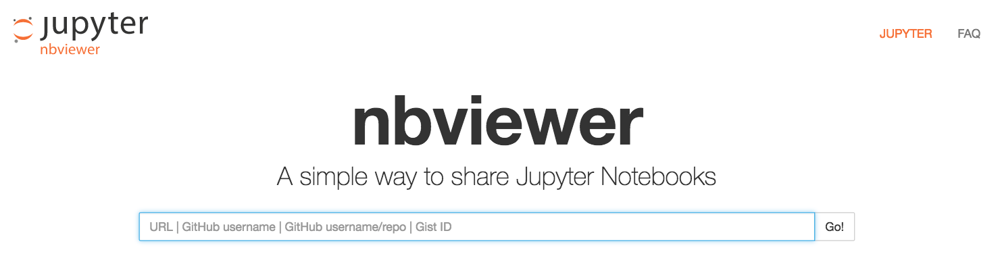

# 零、数据科学实战

> 原文：[Data Science in Practice](https://nbviewer.jupyter.org/github/COGS108/Tutorials/blob/master/00-Introduction.ipynb)
> 
> 译者：[飞龙](https://github.com/wizardforcel)
> 
> 协议：[CC BY-NC-SA 4.0](http://creativecommons.org/licenses/by-nc-sa/4.0/)

欢迎来到阅读数据科学实战课程的实践材料。

本笔记本将指导你获取使用这些教程和作业所需的工具。

## 对于这些教程你需要什么？

### 软件

- python 3.6，以及 anaconda 发行版（[datahub](http://datahub.ucsd.edu)满足此要求）
- Jupyter 笔记本（[datahub](http://datahub.ucsd.edu) 满足这个要求）
- git/GitHub

### 预备条件

本课程以及本系列教程假定你已具备一些编程基础知识。

特别是它假定了 Python 的一些知识，涵盖了标准库。

如果你对 Python 有些不熟悉，可以按照 Python 笔记本中的链接来补上。

### 计算资源

这些教程和作业中的示例在计算上并不重要。

你应该能够在你有权访问的任何计算机上运行所有这些材料，假设它将运行上述工具。

## 工具

以下是此类所需的一系列工具


Jupyter 笔记本是混合代码的，输出和纯文本的一种方法。它们在 Web 浏览器中运行，并连接到内核以便能够执行代码。


官方的 Jupyter 网站在[这里](http://jupyter.org)。


请注意，你不需要单独下载 Jupyter，因为它与 anaconda 一起打包，如下所述。




笔记本可以在网页上展示，并与他人共享。NBViewer 是一个托管和展示笔记本的工具。

NBViewer 在[这里](https://nbviewer.jupyter.org/)提供。


请注意，NBViewer 不是你需要下载的工具，或者根本不需要使用它，它只是一个在线查看笔记本的有用工具。


Anaconda 是 Python 的开源发行版，专为科学计算，数据科学和机器学习而设计。

anaconda 网站是[这里](https://www.anaconda.com)，下载页面在[这里](https://www.anaconda.com)。

Anaconda 本身就是一个发行版，即一系列包装，这些包被一起策划和维护，并且功能强大。

Anaconda 还附带了 conda，它是一个包管理器，允许你下载，安装和管理其他包。

anaconda 发行版包括这些教程所需的所有软件包。

## 注解

- 如果你使用的是 Mac，则可以使用本机安装的 python。本机安装的 Python 可能较旧，不包括此类所需的额外软件包，最好保持不变。
  - 下载 anaconda 将安装一个单独的，独立的 Python，保持原生安装不受影响。
- Windows 本身不需要 Python，因此通常不会预先安装。
- 如果你需要本地副本（这是一个好主意！），请按照本教程逐步进行操作。或者，你可以将 [datahub](http://datahub.ucsd.edu) 用于本课程的所有内容。

```python
# 你可以检查你正在使用哪个 python，以及它是什么版本。
#  一旦安装了 anaconda，你应该会看到你在 anaconda 文件夹中使用 Python
#  确保你拥有的版本是 3.6（或至少 3.X）
#  注意：这些命令行函数可能无法在 Windows 上运行
!which python
!python --version

'''
/anaconda3/bin/python
Python 3.6.8 :: Anaconda, Inc.
'''
```


Git 是一个用于版本控制的工具，一个软件包。Github 是一个可以与 git 一起使用的在线托管服务，并提供使用 git 的在线工具。

如果你还没有，请安装 [git](https://git-scm.com/book/en/v2/Getting-Started-Installing-Git)，并在 [Github](https://github.com/) 上创建一个帐户。

Git 和 GitHub 不是一回事，但在实践中，它们通常一起使用，git 用作一个工具，对代码版本控制，管理存储在计算机上的多个副本，以及存储在 Github 上的远程存储库。

请注意，虽然 GitHub 是一家私营公司，但 git 是一个开源工具，可以独立于 GitHub 使用。

```python
# 检查你是否安装了 git（哪个版本并不重要）
!git --version

# git version 2.14.3 (Apple Git-98)
```


SourceTree 是一个免费的图形用户界面（GUI），用于使用 git 和 Github 管理存储库。

SourceTree 可以在[这里](https://www.sourcetreeapp.com)获得。你需要在 [Atlassian](https://www.atlassian.com) 上创建一个 SourceTree 的帐户，但这是免费的。

如果你知道，或者想学习从命令行使用 git，则无需使用 SourceTree（或任何其他 GUI）。

## 环境

环境是独立的，编程语言和包组的独立安装，它们不会相互干扰。

Anaconda 有使用环境的详细说明，在[这里](https://conda.io/docs/using/envs.html)。

你不需要使用环境，但是如果你想要或需要维护多个不同版本的 Python，你可能会发现它很有用。

如果要使用环境，并且已经有 conda，则可以从命令行运行此命令：

```
$ conda create --name *envname* python=3.6 anaconda
```

用名称替换`*envname*`来调用此环境。这将使用 Python 3.6 和 anaconda 发行版安装新环境。

然后，你需要（每次）激活此环境来使用它。为了激活你的环境：

```
$ source activate *envname*
```

为了关闭你的环境：

```
$ source deactivate *envname*
```
