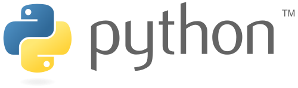

# 三、Python

> 原文：[Python](https://nbviewer.jupyter.org/github/COGS108/Tutorials/blob/master/03-Python.ipynb)
> 
> 译者：[飞龙](https://github.com/wizardforcel)
> 
> 协议：[CC BY-NC-SA 4.0](http://creativecommons.org/licenses/by-nc-sa/4.0/)

Python 是[开源](https://en.wikipedia.org/wiki/Open-source_model)，[高级](https://en.wikipedia.org/wiki/High-level_programming_language)，[通用](https://en.wikipedia.org/wiki/General-purpose_programming_language)，[解释性](https://en.wikipedia.org/wiki/Interpreted_language)的[编程语言](https://en.wikipedia.org/wiki/Programming_language)，是数据科学应用程序中最受欢迎的应用之一。

Python 的官方网站是 [这里](https://www.python.org)。

## 为什么是 Python

- 作为通用语言，Python 支持大量任务。
  - 或者说另一种方式：'Python 不是最好的，但它在所有方面都是第二好的'
  - 这很有用。数据科学项目可能包括从网上抓取数据，分析混合或文本和数字数据，计算函数，训练模型，创建高质量图表，然后托管包含结果的网站。
- Python 是设计明确的，用户友好的。
- Python 还拥有庞大的用户社区，他们贡献了大量高质量，维护良好的开源工具。
  - 项目的最佳语言是拥有你需要的东西的那个。
- 部分由于上面列出的原因，Python 在业界中被大量使用。

## 学习 Python 的教程

- [Codecademy](https://www.codecademy.com/tracks/python) 非常适合初学者。
- 也有[官方的初学者指南](https://wiki.python.org/moin/BeginnersGuide)。
- [笨办法学 Python ](https://learnpythonthehardway.org/book/)是一个很好的教程，拥有更深入的概述。
  - 它实际上并不特别难，并且在第四版中兼容了 Python3。
- [Python 的旋风之旅](https://github.com/jakevdp/WhirlwindTourOfPython) 是一个免费的 Jupyter 笔记本集合，带你浏览 Python。
  - 如果你有一些其他语言的编程经验，并希望快速浏览 Python 的细节，那么本书特别适合（并为其专门设计）。

## Python 实践

- [Python 挑战](http://www.pythonchallenge.com/)是一个（有时令人愤怒的）编程挑战的好地方。
- [LeetCode](https://leetcode.com/)是一个更强的技术编码问题和挑战的地方（面向业界面试）。

## 摆脱困境

在某些时候，你会陷入困境，它发生了。互联网是你的朋友。

如果你得到错误或不确定如何继续，请使用【你最喜欢的搜索引擎】以及与你要执行的操作相关的特定搜索字词。有时这只是意味着搜索你得到的错误。

你可能会在 [StackOverflow](https://stackoverflow.com) 上找到回复 - 这基本上是编程问题的论坛，也是寻找答案的好地方。

## Python2 vs Python3

这个课程将使用 Python3 - 它是当前开发的 Python 版本。特别是 3.6 是 2016 年发布的最新版本。

Python3 是 Python2 的一个突破，因为有一些更大的变化打破了[向后兼容性](https://en.wikipedia.org/wiki/Backward_compatibility)。

Python2 仍然很受欢迎，而且经常被使用，部分原因是，主要新版本需要一段时间才能使所有东西变得可用，并且更新他们。现在，Python3 几乎拥有所有可用的东西，并且是 Python 的未来。

在实践中，Python 2 和 3 非常相似 - 学习一个就相当于获知另一个，并且代码通常可以通过最小的更改兼容两者。

官方 Python 文档包括[ Py2 与 Py3 ](https://wiki.python.org/moin/Python2orPython3)的讨论，包括使用指南。

## 包

包基本上只是代码集合。anaconda 发行版附带了本课程所需的所有核心软件包。为获得其他包，anaconda 自带[`conda`](https://conda.io/docs/using/pkgs.html)包管理器，支持下载和安装其他包。
