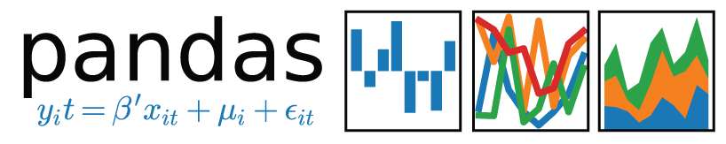
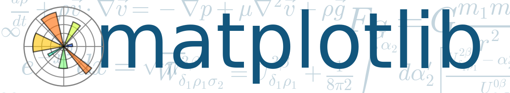

# 四、Python 中的数据科学

> 原文：[Data Science in Python](https://nbviewer.jupyter.org/github/COGS108/Tutorials/blob/master/04-DataSciencePython.ipynb)
> 
> 译者：[飞龙](https://github.com/wizardforcel)
> 
> 协议：[CC BY-NC-SA 4.0](http://creativecommons.org/licenses/by-nc-sa/4.0/)

Python 有大量可用于数据科学的工具。

Python 中的数据科学核心围绕着一些核心模块，通常包括【scipy，numpy，pandas，matplotlib 和 scikit-learn】。

在这里，我们将探讨这些模块的基础知识以及它们的作用。


Scipy是一个“生态系统”，包括一系列用于 Python 中科学计算的开源软件包。

scipy 组织的网站在[这里](https://www.scipy.org/)，包括生态系统的[描述](https://www.scipy.org/about.html)，[入门](https://www.scipy.org/getting-started.html)，以及广泛的[教程](https://docs.scipy.org/doc/scipy/reference/tutorial/)。

```python
# 你可以导入完整的 scipy 包，通常缩写为 'sp'
import scipy as sp

# 但是，导入特定子模块可能更常见
# 例如，让我们导入 stats 子模块
import scipy.stats as sts
```

Scipy 具有广泛的功能。

对于一个简单/随机的例子，让我们使用它的统计模块来模拟用[伯努利分布](https://en.wikipedia.org/wiki/Bernoulli_distribution)翻转硬币，这是一个可以模拟随机变量的分布，随机变量要么是 0（称之为反面），要么是 1（称之为正面）。

```python
# 让我们模拟一个均匀的硬币 -  0.5 的概率是正面
sts.bernoulli.rvs(0.5)

# 0


# 让我们翻转一堆硬币吧！
coin_flips = [sts.bernoulli.rvs(0.5) for i in range(100)]
print('The first ten coin flips are: ', coin_flips[:10])
print('The percent of heads from this sample is: ', sum(coin_flips) / len(coin_flips) * 100, '%')

'''
The first ten coin flips are:  [1, 1, 1, 1, 0, 1, 1, 0, 1, 1]
The percent of heads from this sample is:  60.0 %
'''
```


Numpy 包含一个数组对象（用于多维数据，通常是统一类型），以及线性代数和数组分析的操作。

numpy 网站是[这里](http://www.numpy.org/)，包括他们的官方[快速入门教程](https://docs.scipy.org/doc/numpy-dev/user/quickstart.html)。

注意：

数组是“相似对象的系统排列，通常在行和列中”（来自 [Wikipedia](https://en.wikipedia.org/wiki/Array) 的定义）

```python
# Numpy 标准导入为 'np'
import numpy as np


# Numpy 的专长是线性代数和（匀质）数据数组

# 定义一些数组
# 数组可以有不同的类型，但数组中的所有数据都需要是相同的类型
arr_1 = np.array([1, 2, 3])
arr_2 = np.array([4, 5, 6])
bool_arr = np.array([True, False, True])
str_arr = np.array(['a', 'b', 'c'])


# 请注意，如果你尝试创建混合数据类型数组，numpy 将不会失败
# 但它将（默默地）
arr = np.array([1, 'b', True])

# 检查数组元素的类型
print(type(arr[0]))
print(type(arr[2]))

'''
<class 'numpy.str_'>
<class 'numpy.str_'>
'''


# 因此，这些数组不会像你期望的那样表现
# 最后一项看起来像布尔值
print(arr[2])

# 但是，因为它实际上是一个字符串，所以它不会像布尔值一样进行求值
print(arr[2] == True)

'''
True
False
'''
```

有关 numpy 的更多练习，请查看集合 [numpy 练习](https://github.com/rougier/numpy-100)。



Pandas 是一个用于在数据结构组织数据，并对其进行数据分析的软件包。

Pandas 官方网站在[这里](http://pandas.pydata.org/)，包括[ 10 分钟入门]等材料(http://pandas.pydata.org/pandas-docs/version/0.17.0/10min.html)和[基本功能]教程(http://pandas.pydata.org/pandas-docs/version/0.17.0/basics.html)。

Pandas 主要数据对象是 DataFrame（数据帧），它是一个功能强大的数据对象，用于将混合数据类型与标签一起存储。

Pandas 数据帧还提供了大量可用于处理和分析数据的方法。

如果你熟悉 R，pandas 数据帧对象和方法与 R 非常相似。

```python
# Pandas 标准导入为 pd
import pandas as pd


# 让我们从一组数据开始，但我们也为每个数据项放置一个标签
dat_1 = np.array(['London', 'Washington', 'London', 'Budapest'])
labels = ['Ada', 'Alonzo', 'Alan', 'John']


# Pandas 提供 'Series' 数据对象来存储带有轴标签的 1d 数据
pd.Series?


# 让我们制作一个没有数据的序列，并收好它
ser_1 = pd.Series(dat_1, labels)
ser_1.head()

'''
Ada           London
Alonzo    Washington
Alan          London
John        Budapest
dtype: object
'''


# 如果我们有一些不同的数据（标签相同），我们可以制作另一个序列
dat_2 = [36, 92, 41, 53]
ser_2 = pd.Series(dat_2, labels)

ser_2.head()

'''
Ada       36
Alonzo    92
Alan      41
John      53
dtype: int64
'''


# 然而，拥有一系列序列可能会很快变得非常混乱
# 因此，Pandas 提供了数据帧 - 一个强大的数据对象，用于存储带标签的混合类型数据
pd.DataFrame?


# 有几种方法可以初始化数据帧
# 在这里，我们提供了一个由我们的序列组成的字典
df = pd.DataFrame(data={'Col-A': ser_1, 'Col-B':ser_2}, index=labels)


# 对于类别数据，我们可以检查每个值的数量
df['Col-A'].value_counts()

'''
London        2
Washington    1
Budapest      1
Name: Col-A, dtype: int64
'''


# 请注意，数据帧实际上是Series的集合
# 当我们索引 df 时，如上所述，我们实际上是拉出一个序列
# 因此，'.value_counts()' 实际上是一个 Series 方法
type(df['Col-A'])

# pandas.core.series.Series


# Pandas 还为我们提供了一种直接探索和分析数据帧中数据的方法
# 例如，所有数字数据列的平均值
df.mean()

'''
Col-B    55.5
dtype: float64
'''
```

对于 Pandas 的更多练习，你可以尝试一些练习集，包括[这个](https://github.com/guipsamora/pandas_exercises)和[这个](https://github.com/ajcr/100-pandas-puzzles)。



Matplotlib 是一个用于绘图的库，特别是 2D 绘图。

Matplotlib 官方[网站](http://matplotlib.org/)包括官方[教程](http://matplotlib.org/users/pyplot_tutorial.html)以及示例的[画廊](https://matplotlib.org/gallery.html)，你可以从中起步和修改。

```python
# 这个魔术命令用于在笔记本中内联绘制所有图形
%matplotlib inline


# Matplotlib 标准导入为 plt
import matplotlib.pyplot as plt


# 绘制基本折线图
plt.plot([1, 2, 3], [4, 6, 8])

# [<matplotlib.lines.Line2D at 0x11c0c5128>]
```


matplotlib 还有许多外部材料，包括[这个](https://github.com/rougier/matplotlib-tutorial)。


Scikit-Learn 是一个用于数据挖掘，数据分析和机器学习的软件包。

这是 scikit-learn 官方[网站](http://scikit-learn.org/)，包括他们的官方[教程](http://scikit-learn.org/stable/tutorial/basic/tutorial.html)。

```python
# 导入 sklearn
import sklearn as skl


# 查看模块说明
skl?
```

我们将在稍后的教程中入门机器学习并使用 sklearn。

## 外部资源

有许多资源可供学习如何使用这些软件包。

上面的链接包括官方文档和教程，这是最好的起点。

你还可以在谷歌中搜索其他资源和练习。

涵盖所有这些工具的特别好（和免费）的资源是 [Jake Vanderplas](https://github.com/jakevdp) 的[数据科学手册](https://github.com/jakevdp/PythonDataScienceHandbook/)。
