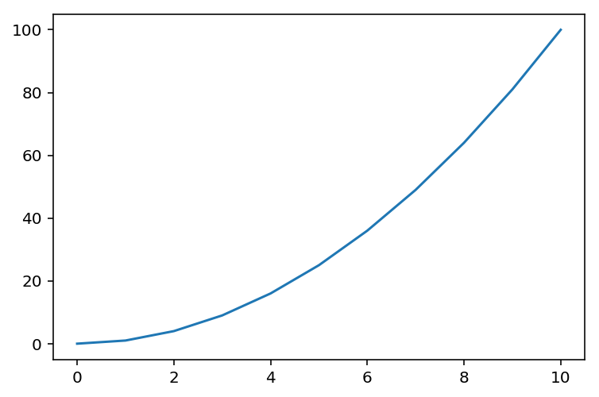
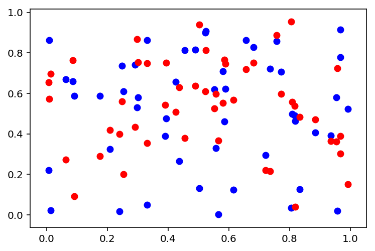
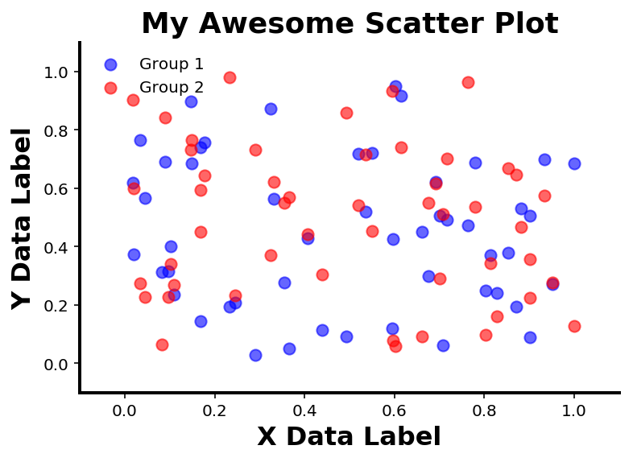

# 九、使用 Python 进行数据可视化

> 原文：[Data Visualization with Python](https://nbviewer.jupyter.org/github/COGS108/Tutorials/blob/master/09-DataVisualization.ipynb)
> 
> 译者：[飞龙](https://github.com/wizardforcel)
> 
> 协议：[CC BY-NC-SA 4.0](http://creativecommons.org/licenses/by-nc-sa/4.0/)

数据可视化可能意味着不同的东西。

在这里，我们将使用 Matplotlib 来处理基本的 2D 绘图，Matplotlib 是一个 Python 绘图库。

Matplotlib 非常支持一些示例，你可以用来弄清楚它是如何工作的。

在这里，我们将浏览 matplotlib 的快速介绍，其中的示例改编自官方资料。

数据可视化是一种“查看”数据，用于数据探索和数据通信的方法。

查看 matplotlibs 官方[网站](https://matplotlib.org/)，包括他们的介绍[教程](http://matplotlib.org/users/beginner.html)，以及[示例](http://matplotlib.org/examples/)列表。

### Pyplot vs Pylab

请注意，matplotlib 是一个旧的，非常庞大的模块，实际上有几种不同的方式来使用它。

简短版本：导入`matplotlib.pyplot`，就像我们在这里做的，或许是最常见的，并且会起作用！

长版本：请按照以下链接了解可以使用 matplotlib 的不同方式（pyplot，pylab 等）。

最终，它都调用相同的底层代码来访问所有内容，只是语法不同。

与 matplotlib 交互的不同方法的描述，在[这里](http://stackoverflow.com/questions/16849483/which-is-the-recommended-way-to-plot-matplotlib-or-pylab)。

```python
# 导入 matplotlib - 主要的 Python 绘图模块
import matplotlib.pyplot as plt

# 导入 numpy 函数来为绘图生成测试数据
import numpy as np
from numpy.random import rand

# 这个魔术命令直接在笔记本中绘制图形
%matplotlib inline
# 这为图形设置了更高的分辨率
%config InlineBackend.figure_format = 'retina'
```

## 折线图


```python
# 让我们创建一些假数据来绘制
x = np.arange(0, 11)
y = x**2

# 在 matplotlib 中，我们可以制作一个图形，然后绘制它
# 生成图形
f = plt.figure()
# 要绘图，只需将 x 和 y 数据传递给绘图函数即可
plt.plot(x, y)

# [<matplotlib.lines.Line2D at 0x119df8710>]
```




没有任何其他信息，默认情况下 matplotlib 将添加许多绘图属性。

例如，默认情况下，我们获得了图表周围的线条，刻度线以及轴编号标签。

我们可以自定义所有这些内容，并为绘图添加更多内容。

## 散点图

让我们尝试创建一个散点图。让我们想象两组数据，我们想要在散点图上一起绘制来进行比较。

```python
# 创建一些数据
n = 50                   # n 是数据点的数量
x = rand(n)              # 随机创建 x 数据点
y1 = rand(n)             # 随机创建 y 数据点的第一组
y2 = rand(n)             # 随机创建 y 数据点的第二组
```

### 创建散点图

`scatter`命令与`plot`命令的工作方式大致相同，但是会生成散点图而不是直线。

在这里，我们添加另一个参数`c`，它指定了点的颜色

我们可以向`plot`和`scatter`添加许多可选参数

```python
# 绘制第一组数据
plt.scatter(x, y1, c='blue')
# 我们现在想在同一个图上绘制第二组数据。
# 'hold' 命令告诉 Python 保持当前图形并向其添加下一个数据。
plt.hold
# 绘制第二组数据
plt.scatter(x, y2, c='red')

# <matplotlib.collections.PathCollection at 0x11aac7d68>
```




我们现在有一个散点图！

但是，它看起来不太好。 让我们看看我们是否可以改进它。让我们尝试添加大量的自定义函数来制作更好的图形。

```python
# 创建新的图形
fig = plt.figure()
# 向图形添加轴域
ax = plt.axes()

# 再次绘制数据
ax.scatter(x, y1, c='blue', alpha=0.6, label='Group 1', s=50)
plt.hold
ax.scatter(x, y2, c='red', alpha=0.6, label='Group 2', s=50)
# 这里我们添加了一些可选参数。
# alpha - 设置数据点的透明度
# label - 为我们绘制的数据制作标签，可以在图例中使用
# s - 大小。 改变我们绘制的点的大小

# 向我们的图形添加标题
plt.title('My Awesome Scatter Plot', fontsize=18, fontweight='bold')

# 添加数据标签
plt.xlabel('X Data Label', fontsize=16, fontweight='bold')
plt.ylabel('Y Data Label', fontsize=16, fontweight='bold')

# 设置范围来绘制 x 和 y 变量
plt.xlim([-0.1, 1.1])
plt.ylim([-0.1, 1.1])

# 设置刻度标签
ax.set_xticks(np.array([0.0, 0.2, 0.4, 0.6, 0.8, 1.0]))
ax.set_yticks(np.array([0.0, 0.2, 0.4, 0.6, 0.8, 1.0]))

# 关闭顶部和右侧边线
ax.spines['right'].set_visible(False)
ax.spines['top'].set_visible(False)

# 将刻度线设置为仅位于底部和左侧。
ax.xaxis.set_ticks_position('bottom')
ax.yaxis.set_ticks_position('left')

# 设置剩余刻度的线宽
ax.spines['left'].set_linewidth(2)
ax.spines['bottom'].set_linewidth(2)

# 添加图例。这将使用你在设置数据时定义的标签。
plt.legend(loc='upper left', scatterpoints=1, frameon=False)
# 图例不需要任何参数。
# 在这里，我们可以选择指定图例的位置（'loc'），
# 图例中使用的点数（'scatterpoints'），
# 以及图例周围是否有一个框（'frameon'）。

# <matplotlib.legend.Legend at 0x11a655cf8>
```



### 数字和轴域

请注意，有时我们在`ax`上调用这些函数，有时我们用`plt`调用

我们还创造了一个叫做`fig`的东西 这一切是什么？

- `plt`只是 matplotlib 模块的昵称
  - 在这里，当我们使用`plt`时，我们在当前图中隐式地从 matplotlib 调用一个函数
- `fig`只是我们分配给图形对象的任意变量名。
  - 我们可以在创建它之后使用`fig`（或我们称之为图形）来更新它
- `ax`也只是当前轴域的任意变量名。
  - 我们可以使用`ax`（或者我们称之为轴域），在我们创建它之后更新特定的轴域

```python
# 'fig'是我们正在制作的图形的标签。
# gcf() 是找到当前图形的方式
print(type(fig))             # Figure 是 matplotlib 中的一个对象
print(fig)                   # 这是我们之前制作的图形的句柄 'fig'
print(plt.gcf(), '\n')       # gcf 引用了当前的图形。在这种情况下，当前图形与 'fig' 相同

'''
<class 'matplotlib.figure.Figure'>
Figure(432x288)
Figure(432x288) 

<matplotlib.figure.Figure at 0x117779588>
'''


# 'ax' 是当前轴域的名称。一个图形可以有很多个轴域（图形可以有子图）
print(type(ax))              # Axes 是 matplotlib 中的一个类
print(ax)                    # 这是我们之前制作的轴域的句柄 'ax'
#print(plt.gca(), '\n')      # gca 引用了当前轴域。

# 在这种情况下，当前轴是'ax'。在绘制轴时关闭。
# 请注意，这里 gca 绘制一个空轴。

'''
<class 'matplotlib.axes._subplots.AxesSubplot'>
Axes(0.125,0.125;0.775x0.755)
'''
```


跟踪图形和轴域，并知道调用什么，最初可能有点混乱。

请注意，很多内容都是在幕后进行管理的 - 你没有明确创建新的图形或轴域。Matplotlib 将在需要时创建新的数字和轴域，而无需明确告知。

如果你想知道为什么我们会纠结于使用`fig`和`ax`：

- 我们通常不需要，但是在需要的时候，让标签引用我们的图形（并操纵它）会非常有用。

例如，我们可以通过访问它的名称来获取我们的图形。

```python
# 用 'fig' 变量名称重绘图
fig
```


除官方文档外，还有另一个有用的教程在[这里](https://www.labri.fr/perso/nrougier/teaching/matplotlib/)。
