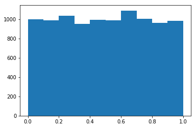
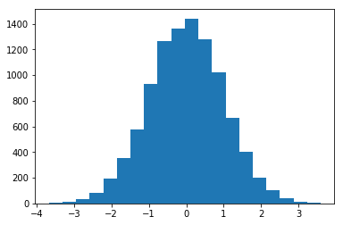
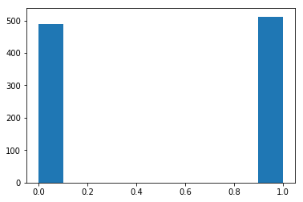
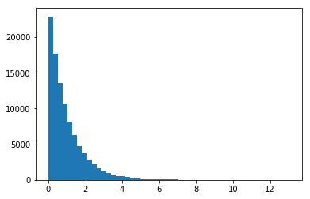
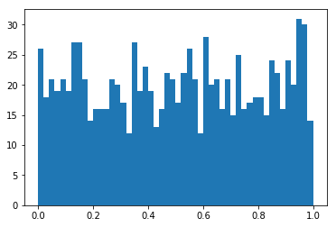
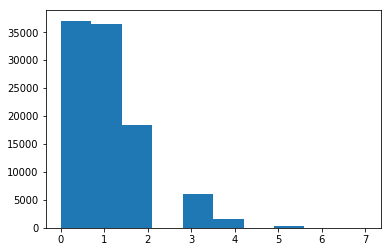

# 十、分布

> 原文：[Distributions](https://nbviewer.jupyter.org/github/COGS108/Tutorials/blob/master/10-Distributions.ipynb)
> 
> 译者：[飞龙](https://github.com/wizardforcel)
> 
> 协议：[CC BY-NC-SA 4.0](http://creativecommons.org/licenses/by-nc-sa/4.0/)

概率分布反映了函数/数据源的可能结果的发生概率。

这是[维基百科](https://en.wikipedia.org/wiki/Probability_distribution)上的概率分布。如果你想要更全面地了解概率/分布，请查看此[文章](https://betterexplained.com/articles/a-brief-introduction-to-probability-statistics/)。

```python
%matplotlib inline

import numpy as np
import matplotlib.pyplot as plt
```

### 概率分布

通常，给定数据源，我们想要考虑并检查我们的数据样本似乎遵循什么样的概率分布。更具体地说，我们试图推断出数据生成器遵循的概率分布，提出一个问题：它可以用什么函数代替？

检查数据的分布很重要，因为我们通常希望对我们的数据应用统计测试，并且许多统计测试都带有关于它们所应用的数据分布的基本假设。 确保我们应用适当的统计方法，需要考虑并检查数据的分布。

非正式地，我们可以从可视化我们的数据开始，看看它的形状是什么，以及它看起来遵循哪种分布。更正式地说，我们可以统计测试数据样本是否遵循特定分布。

在这里，我们将开始可视化一些最常见的分布。 Scipy（`scipy.stats`）有一系列代码和函数，用于处理和生成不同的分布 - 所有这些都具有一致的 API。我们将从不同的基础分布生成合成数据，并快速查看它们的外观，绘制生成数据的直方图。

你可以使用此笔记本来探索不同的参数，来了解这些分布。为进一步探索，绘制每个分布的概率密度函数。

## 均匀分布

均匀分布是一种分布，其中每个可能的值是同等可能的。

这是[维基百科](https://en.wikipedia.org/wiki/Uniform_distribution_(continuous))上的均匀分布。

```python
from scipy.stats import uniform


dat = uniform.rvs(size=10000)


plt.hist(dat);
```





## 正态分布

正态（也称为高斯或“钟形曲线”）分布是由其均值和标准差定义的分布。

[维基百科](https://en.wikipedia.org/wiki/Normal_distribution) 上的正态分布。

```python
from scipy.stats import norm


dat = norm.rvs(size=10000)


plt.hist(dat, bins=20);
```





## 伯努利分布

伯努利分布是二元分布 - 它只需要两个值（0 或 1），概率为`p`。

[维基百科](https://en.wikipedia.org/wiki/Bernoulli_distribution)上的伯努利分布.


```python
from scipy.stats import bernoulli


r = bernoulli.rvs(0.5, size=1000)


plt.hist(r);
```





## Gamma 分布

Gamma 分布是由两个参数定义的连续概率分布。

[维基百科](https://en.wikipedia.org/wiki/Gamma_distribution)上的 Gamma 分布。

给定不同的参数，伽玛分布可能看起来非常不同。探索不同的参数。

指数分布在技术上是 Gamma 分布的一个特例，但也在 scipy 中单独实现为`expon`。

```python
from scipy.stats import gamma


dat = gamma.rvs(a=1, size=100000)


plt.hist(dat, 50);
```





## Beta 分布 


Beta 分布是在区间`[0,1]`上定义的分布，由两个形状参数定义。

[维基百科](https://en.wikipedia.org/wiki/Beta_distribution)上的 Beta 分布。

```python
from scipy.stats import beta


dat = beta.rvs(1, 1, size=1000)


plt.hist(dat, 50);
```





## 泊松分布


在给定已知平均速率（和独立出现）的情况下，泊松分布建模了固定时间间隔的事件。


[维基百科](https://en.wikipedia.org/wiki/Poisson_distribution)上的泊松分布。


```python
from scipy.stats import poisson


dat = poisson.rvs(mu=1, size=100000)


plt.hist(dat);
```




