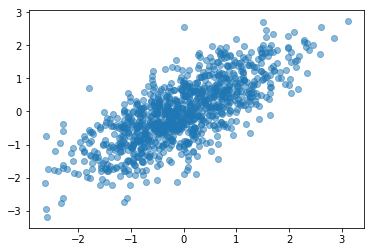
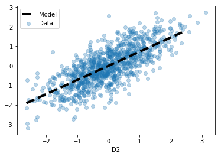

# 十四、线性模型

> 原文：[Linear Models](https://nbviewer.jupyter.org/github/COGS108/Tutorials/blob/master/14-LinearModels.ipynb)
> 
> 译者：[飞龙](https://github.com/wizardforcel)
> 
> 协议：[CC BY-NC-SA 4.0](http://creativecommons.org/licenses/by-nc-sa/4.0/)

线性（回归）建模是一种方法，将输出值预测为输入值的加权线性组合。

### 线性模型 - 概述

在最简单的情况下，我们试图拟合一条线，因此我们的模型具有以下形式：

```
y = ax + b
```

在上面的这个等式中，我们试图从一些其他数据变量`x`预测一些数据变量`y`，其中`和`b`是参数，我们需要通过拟合模型得出，并分别反映 模型（直线）的斜率和`y`轴截距。

我们需要一些过程来寻找`a`和`b`。 我们将使用 OLS 这样做 - 我们想要的`a`和`b`的值是那些满足 OLS 解的值 - 也就是使模型预测与我们的数据之间距离最小的值。

请注意，你需要`x`和`y`已知的数据，以便训练你的模型。

该方法也可以推广，包括例如使用更多特征来预测我们感兴趣的输出。

因此，我们将以一般形式重写我们的模型，如下所示：

```
y = a0 + a1 x1 + a2 x2 + ... + an xn + ε
```

在上面的等式中，`a0`是截距（与上面的`b`相同），`a1`到`an`是我们正在尝试学习的`n`个参数，因为数据的权重为`x1`到`xn`。我们的输出变量（我们试图预测的）仍然是`y`，我们引入了`ε`，这是误差，它基本上捕获了无法解释的变动。

### 线性模型实战

在下文中，我们将生成一些数据，其中两个特征`D1`和`D2`是相关的。

鉴于相关性，我们可以尝试从`D1`预测`D2`的值，我们将创建一个线性模型来实现。

使用上面第二种表示法，模型将采用以下形式：

```
D2 = a0 + a1 * D1 
```

```python
# 导入 
%matplotlib inline

import numpy as np
import pandas as pd
import matplotlib.pyplot as plt

# Statmodels & patsy
import patsy
import statsmodels.api as sm


# 生成一些互相关数据

# 设置
corr = 0.75
covs = [[1, corr], [corr, 1]]
means = [0, 0]

# 生成数据
dat = np.random.multivariate_normal(means, covs, 1000)


# 查看我们生成的数据
plt.scatter(dat[:, 0], dat[:, 1], alpha=0.5);
#plt.scatter(dat[:, 0], dat[:, 1], alpha=0.5);
```





```python
# 将数据放入 DataFrame
df = pd.DataFrame(dat, columns=['D1', 'D2'])


# 观察数据
df.head()
```

|  | D1 | D2 |
| --- | --- | --- |
| 0 | 0.305994 | 0.521119 |
| 1 | 0.262456 | 0.562350 |
| 2 | -0.289970 | 0.608496 |
| 3 | 0.025279 | 0.523315 |
| 4 | -0.561126 | -1.320507 |

```python
# 检查 D1 和 D2 之间的相关性（它与合成的东西匹配）
df.corr()
```

|  | D1 | D2 |
| --- | --- | --- |
| D1 | 1.000000 | 0.747094 |
| D2 | 0.747094 | 1.000000 |


## Statsmodels & Patsy 的线性模型

Statsmodels 是 Python 中统计分析的模块。 Patsy 是一个有用的包，用于处理和描述统计模型。


这里是 [statsmodels](http://www.statsmodels.org/stable/index.html) 和 [patsy](https://patsy.readthedocs.io/en/latest/) 的官方文档。

```python
# Patsy 为我们提供了一种构建设计矩阵的简便方法
# 出于我们的目的，“设计矩阵”只是我们的预测变量和输出变量的有组织矩阵
outcome, predictors = patsy.dmatrices('D2 ~ D1', df)
```

如果检查“结果”和“预测变量”的类型，你会发现它们是`DesignMatrix`类型的自定义 patsy 对象。

如果你将它们打印出来，你会看到它们重置了 Pandas `Series`或`DataFrames`。

你可以将它们视为自定义的类数据帧对象，以便将其组织成用于建模的矩阵。

```python
# 现在使用 statsmodels 初始化 OLS 线性模型
# 此步骤初始化模型，并提供数据（但实际上不计算模型）
mod = sm.OLS(outcome, predictors)
```

请注意，statsmodels，就像我们稍后会遇到的 scikit-learn 一样，使用面向对象的方法。

在这种方法中，你初始化将数据和方法存储在一起的复杂对象，为你提供有组织的方式来存储和检查数据和参数，拟合模型，然后甚至使用它们进行预测等等。

```python
# 检查我们刚刚创建的模型对象的类型。
# 你还可以使用 tab 补全，来探索此对象的可用内容
type(mod)

# statsmodels.regression.linear_model.OLS


# 最后，拟合模型
res = mod.fit()


# 检查结果
print(res.summary())

'''
==============================================================================
Dep. Variable:                     D2   R-squared:                       0.558
Model:                            OLS   Adj. R-squared:                  0.558
Method:                 Least Squares   F-statistic:                     1261.
Date:                Tue, 06 Mar 2018   Prob (F-statistic):          3.32e-179
Time:                        00:18:34   Log-Likelihood:                -993.04
No. Observations:                1000   AIC:                             1990.
Df Residuals:                     998   BIC:                             2000.
Df Model:                           1                                         
Covariance Type:            nonrobust                                         
==============================================================================
                 coef    std err          t      P>|t|      [0.025      0.975]
------------------------------------------------------------------------------
Intercept      0.0011      0.021      0.054      0.957      -0.039       0.042
D1             0.7546      0.021     35.506      0.000       0.713       0.796
==============================================================================
Omnibus:                        1.644   Durbin-Watson:                   1.970
Prob(Omnibus):                  0.440   Jarque-Bera (JB):                1.508
Skew:                          -0.068   Prob(JB):                        0.470
Kurtosis:                       3.133   Cond. No.                         1.05
==============================================================================

Warnings:
[1] Standard Errors assume that the covariance matrix of the errors is correctly specified.
'''
```

### 解释输出

Statsmodels 为我们提供了大量信息！

最上面的部分主要是元数据：它包括模型类型，运行它的时间和日期等内容。

它还包括 R 方，它是模型能够捕获的方差量的总体汇总。这个值在 0-1 之间，约为 0.5 ，我们在这里看到，是一个非常高的值，表明模型拟合良好。

中间一列是实际的模型结果。

每行反映一个参数，并给出它的值（`coef`），误差（`std err`），统计检验结果，关于该参数是否是输出变量的显着预测值（`t`，其中相关的 p 值为'P > | t |`），以及参数值的置信区间（`[0.025 - 0.975]`）。

最后一个模型包括对数据运行的一些其他测试，可以帮助你检查输入数据的某些描述符，以及它们是否满足这种模型拟合的必要条件。

### 检查我们的模型

就模型本身而言，最有用的组件位于第二行，其中摘要给出了参数值，以及我们的预测变量的 p 值，在这种情况下是`Intercept`和`D2`。

从上面的结果中，我们可以获取参数的值，并获得以下模型：

```
D2 = -0.0284 + 0.7246 * D1
```

但是，我们还应该记住报告的统计测试，参数值是否显着（显着不同于零）的测试。使用 0.05 的 alpha 值，在这种情况下，`D2`参数值是显着的，但`Intercept`值不是。由于`Intercept`的参数值与零没有显着差异，我们可以决定不将它包含在我们的最终模型中。

因此，我们完成了模型：

```
D2 = 0.7246 * D1
```

有了这个模型，`a1`的值很可能为 0.7246，非常接近数据点的相关值，我们将其设置为 0.75！

```python
## 绘制模型的拟合直线

# 绘制原始数据（像之前一样）
plt.scatter(df['D1'], df['D2'], alpha=0.3, label='Data');

# 生成和绘制模型的拟合直线
xs = np.arange(df['D1'].min(), df['D1'].max())
ys = 0.7246 * xs
plt.plot(xs, ys, '--k', linewidth=4, label='Model')

plt.xlabel('D1')
plt.xlabel('D2')
plt.legend();
```





### 使用多个预测值

上面的模型只使用了一个预测值，拟合了一条简单的直线，因此实际上模仿了我们用于拟合直线的先前方法。

我们还可以拟合多个预测变量，这就是 patsy 和 statsmodel 的强大功能，因为这些函数你和更复杂的模型，包括我们想要的许多参数，也处理相关特征的某些方面，等等。

在这里，我们将向数据帧添加一个新变量，并使用两个预测变量拟合 OLS 模型。

```python
# 向 df 添加数据的新列
df['D3'] = pd.Series(np.random.randn(1000), index=df.index)
df.head()
```

|  | D1 | D2 | D3 |
| --- | --- | --- | --- |
| 0 | 0.305994 | 0.521119 | 0.019043 |
| 1 | 0.262456 | 0.562350 | -0.631288 |
| 2 | -0.289970 | 0.608496 | 0.794971 |
| 3 | 0.025279 | 0.523315 | 0.447560 |
| 4 | -0.561126 | -1.320507 | -1.560199 |

```python
# 从 D2 和 D3 预测 D1
outcome, predictors = patsy.dmatrices('D1 ~ D2 + D3', df)
mod = sm.OLS(outcome, predictors)
res = mod.fit()


# 检查模型拟合摘要
print(res.summary())

'''
==============================================================================
Dep. Variable:                     D1   R-squared:                       0.558
Model:                            OLS   Adj. R-squared:                  0.557
Method:                 Least Squares   F-statistic:                     630.1
Date:                Tue, 06 Mar 2018   Prob (F-statistic):          1.25e-177
Time:                        00:18:34   Log-Likelihood:                -982.91
No. Observations:                1000   AIC:                             1972.
Df Residuals:                     997   BIC:                             1987.
Df Model:                           2                                         
Covariance Type:            nonrobust                                         
==============================================================================
                 coef    std err          t      P>|t|      [0.025      0.975]
------------------------------------------------------------------------------
Intercept     -0.0177      0.020     -0.866      0.387      -0.058       0.022
D2             0.7395      0.021     35.479      0.000       0.699       0.780
D3            -0.0121      0.021     -0.587      0.557      -0.052       0.028
==============================================================================
Omnibus:                        0.273   Durbin-Watson:                   1.993
Prob(Omnibus):                  0.872   Jarque-Bera (JB):                0.357
Skew:                          -0.019   Prob(JB):                        0.836
Kurtosis:                       2.916   Cond. No.                         1.04
==============================================================================

Warnings:
[1] Standard Errors assume that the covariance matrix of the errors is correctly specified.
'''
```

请注意，如上所述，statsmodels 是一种功能强大的通用 OLS 模型方法。

你可以进一步研究如何包含其他功能，例如输入变量之间的交互，等等。

## sklearn 线性回归

Scikit-learn 也具有线性回归模型的实现。

在这里，我们将使用 sklearn 而不是 statsmodels，快速演示运行与上述相同的线性 OLS 模型。

[sklearn](http://scikit-learn.org/stable/modules/generated/sklearn.linear_model.LinearRegression.html) 中的线性回归。

```python
# sklearn 的线性模型
from sklearn import linear_model


# 转换数据的形状，便于 sklearn 使用
d1 = np.reshape(df.D1.values, [len(df.D1), 1])
d2 = np.reshape(df.D2.values, [len(df.D2), 1])
d3 = np.reshape(df.D3.values, [len(df.D3), 1])


# 初始化线性回归模型
reg = linear_model.LinearRegression()


# 拟合线性回归模型
reg.fit(d2, d1) #d1 = a0 + a1*d2

# LinearRegression(copy_X=True, fit_intercept=True, n_jobs=1, normalize=False)


# 检查这个结果
# 如果将这些与我们上面使用的 statsmodel 进行比较，它们确实是相同的
print(reg.intercept_[0])
print(reg.coef_[0][0])

'''
-0.0179497213127
0.739686393719
'''
```

### （在 sklearn 中）使用多个预测变量

```python
# 初始化并拟合线性模型
# d1 = a1*d2 + a2*d3 + a0
reg = linear_model.LinearRegression()
reg.fit(np.hstack([d2, d3]), d1)

# LinearRegression(copy_X=True, fit_intercept=True, n_jobs=1, normalize=False)


np.hstack([d2, d3]).shape

# (1000, 2)


# 检查这个结果
# 如果将这些与我们上面使用的 statsmodel 进行比较，它们确实是相同的
print('Intercept: \t', reg.intercept_[0])
print('Theta D2 :\t', reg.coef_[0][0])
print('Theta D3 :\t', reg.coef_[0][1])

'''
Intercept: 	 -0.0177498825239
Theta D2 :	 0.739473377018
Theta D3 :	 -0.0120672090985
'''
```
