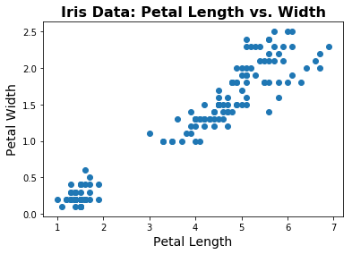
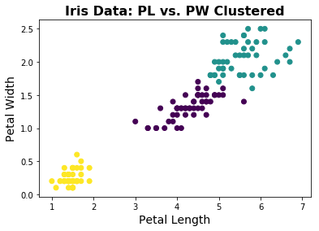

# 十五、聚类

> 原文：[Clustering](https://nbviewer.jupyter.org/github/COGS108/Tutorials/blob/master/15-Clustering.ipynb)
> 
> 译者：[飞龙](https://github.com/wizardforcel)
> 
> 协议：[CC BY-NC-SA 4.0](http://creativecommons.org/licenses/by-nc-sa/4.0/)

聚类是尝试在数据中查找结构（簇）的过程。

这是来自维基百科的文章[聚类分析](https://en.wikipedia.org/wiki/Cluster_analysis)。


```python
# 导入
%matplotlib inline

import numpy as np
import matplotlib.pyplot as plt
from sklearn import datasets
from sklearn.cluster import KMeans
from scipy.cluster.vq import whiten
```

Scikit-learn 有很多示例数据集。 在这里，我们将使用鸢尾花数据集：其中包含不同植物种类的数据。

```python
# 导入鸢尾花数据
iris = datasets.load_iris()


# 检查可用特征
print('\n'.join(iris.feature_names))

'''
sepal length (cm)
sepal width (cm)
petal length (cm)
petal width (cm)
'''


# 检查物种 ('clusters')
print('\n'.join(iris.target_names))

'''
setosa
versicolor
virginica
'''


# 实际数据存储在 iris.data 中
# 我们来看看有多少数据
[n_samples, n_features] = np.shape(iris.data) 
print("There are ", n_samples , " samples of data, each with " , n_features, " features.")

# There are  150  samples of data, each with  4  features.


# 让我们设置一些索引，以便我们知道我们正在使用哪些数据
sl_ind = 0    # 萼片长度
sw_ind = 1    # 萼片宽度
pl_ind = 2    # 花瓣长度
pw_ind = 3    # 花瓣宽度


# 让我们开始看一些数据。
# 让我们从花瓣长度与花瓣宽度的散点图开始
fig = plt.figure(1)
plt.scatter(iris.data[:, pl_ind], iris.data[:, pw_ind])

# 添加标题和标签
plt.title('Iris Data: Petal Length vs. Width', fontsize=16, fontweight='bold')
plt.xlabel('Petal Length', fontsize=14);
plt.ylabel('Petal Width', fontsize=14);
```





```python
# 绘制数据，颜色由物种编码
fig = plt.figure(1)
plt.scatter(iris.data[:, pl_ind][iris.target==0], iris.data[:, pw_ind][iris.target==0],
            c='green', label=iris.target_names[0])
plt.scatter(iris.data[:, pl_ind][iris.target==1], iris.data[:, pw_ind][iris.target==1],
            c='red', label=iris.target_names[1])
plt.scatter(iris.data[:, pl_ind][iris.target==2], iris.data[:, pw_ind][iris.target==2],
            c='blue', label=iris.target_names[2])

# 添加标题标签和图例
plt.title('Iris Data: Petal Length vs. Width', fontsize=16, fontweight='bold')
plt.xlabel('Petal Length', fontsize=14);
plt.ylabel('Petal Width', fontsize=14);
plt.legend(scatterpoints=1, loc='upper left');

# 请注意，拆分每组的绘图基本上是一个黑魔法，为了使图例正常，
# 以下命令可以很好地绘制数据，颜色由目标编码：
# plt.scatter(iris.data[:, petal_length_ind], iris.data[:, petal_width_ind], c=iris.target)
# 然而，当以这种方式绘制时，获得带标记的图例会很痛苦
```


## 任务

如果我们还不知道物种标签，我们可能会注意到似乎有不同的数据点分组。聚类是尝试在算法上找到这些组的方法。

在这里，我们将使用 KMeans 算法。有关 KMeans 及其工作原理的信息，请参阅维基百科。

```python
# 拉出感兴趣的数据 - 花瓣长度和花瓣宽度
d1 = np.array(iris.data[:, pl_ind])
d2 = np.array(iris.data[:, pw_ind])
```

#### 数据白化

如果你的不同维度使用不同的单位（或具有不同的差异），则这些差异会极大地影响聚类。

这是因为 KMeans 是各向同性的：它对待每个方向上的差异同等重要。 因此，如果单位或方差非常不同，这相当于将某些特征/维度加权，使其更重要或更不重要。

为了纠正这种情况，通常，有时需要“白化”数据：通过它各自的标准偏差来标准化每个维度。

```python
# 检查 whiten 函数
whiten?


# 白化数据
d1w = whiten(d1)
d2w = whiten(d2)


# 组合数据成某个形状，便于 skl 使用
data = np.vstack([d1w, d2w]).T


# 初始化 KMeans 对象，设置为拟合 3 个簇
km = KMeans(n_clusters=3, random_state=13)


# 使用 KMeans 拟合数据
km.fit(data)

'''
KMeans(algorithm='auto', copy_x=True, init='k-means++', max_iter=300,
    n_clusters=3, n_init=10, n_jobs=1, precompute_distances='auto',
    random_state=13, tol=0.0001, verbose=0)
'''


# 让我们看看 KMeans 找到的簇
plt.scatter(d1, d2, c=km.labels_);
plt.xlabel('Year');
plt.ylabel('Age');

# 添加标题，标签和图例
plt.title('Iris Data: PL vs. PW Clustered', fontsize=16, fontweight='bold')
plt.xlabel('Petal Length', fontsize=14);
plt.ylabel('Petal Width', fontsize=14);
```




看起来它做得很好！除了杂色和维吉尼亚边界之间的一些差异之外，仅给出关于几个特征的信息的情况下，KMeans 能够使用算法重建物种标签。