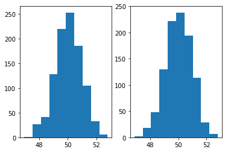
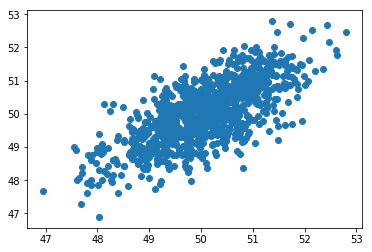
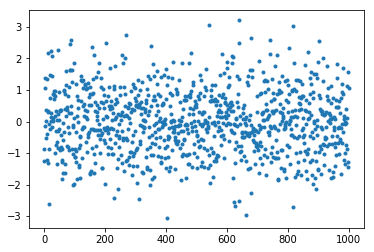

# 十六、降维

> 原文：[Dimensionality Reduction](https://nbviewer.jupyter.org/github/COGS108/Tutorials/blob/master/16-DimensionalityReduction.ipynb)
> 
> 译者：[飞龙](https://github.com/wizardforcel)
> 
> 协议：[CC BY-NC-SA 4.0](http://creativecommons.org/licenses/by-nc-sa/4.0/)

降维是将数据集转换为较低维空间的过程。

有关降维的解释，以及实际数据中的示例，请访问[这里](http://colah.github.io/posts/2014-10-Visualizing-MNIST/)。

### 降维的概述

数据集可能非常大，不仅包含数百万个数据点，还包含有关每个数据点的大量特征。 我们可以将数据集的每个特征都视为“维度”。 对于高维数据，我们可能希望或需要尝试减少这些维度。

最简单的方法可能只是放弃一些维度，我们甚至可以选择放弃看起来可能最不实用的维度。这将是一种简单的降维方法。

但通常情况下，我们希望以保留最多信息的方式减少维度的数量。 一种方法可能是聚类 - 如果我们对高维数据进行聚类分析，我们可以重新编码数据，来通过它的簇标签存储每个点，从而可能在更少的维度中维护更多信息。

在这里，我们将探索另一种降维的常用方法 - 主成分分析（PCA）。

主成分分析（PCA）是将数据集转换为主成分的过程，按捕获了多少方差排序。

有关涵盖 PCA 完整教程的论文，请访问[这里](https://arxiv.org/pdf/1404.1100.pdf)。更多技术概述和解释，请查看这个[博文](http://alexhwilliams.info/itsneuronalblog/2016/03/27/pca/)。

### 主成分分析

要使用 PCA 进行降维，我们可以选择保留`n`个成分，其中`n`是一个低于数据集原始维数的数字。

通过使用 PCA 转换数据并保留`n`个成分，我们能够在较低维空间中保持原始数据的最大方差。

最广泛地说，PCA 试图利用变量的相关结构，并使用这种结构对数据进行编码。

例如，如果我们数据的特征`x1`和`x2`是相关的，那么 PCA 会查找如何将数据重新组织成一些新的维度`x_pc`，它捕获了两者之间的大部分共享方差（相关结构）。

在这个笔记本中，我们将遵循一个简单的 PCA 示例，使用 PCA 将数据从 2D 转换为 1D。

实际上，从`m` D 转换为 `n` D 数据，PCA 最有用，其中`m`非常大，而`n < m`。

```python
# 导入
%matplotlib inline

import numpy as np
import matplotlib.pyplot as plt

from sklearn.decomposition import PCA


## 创建一些随机的互相关数据

# 设置
means = [50, 50]
covs = [[1, .75], [.75, 1]]
n = 1000

# 生成数据
dat = np.random.multivariate_normal(means, covs, n)


# 绘制我们的两个随机变量
f, ax = plt.subplots(1, 2)
ax[0].hist(dat[:, 0]);
ax[1].hist(dat[:, 1]);
```





```python
# 查看数据如何相互关联
plt.scatter(dat[:, 0], dat[:, 1])

# <matplotlib.collections.PathCollection at 0x1117902b0>
```




## 任务

假设我们想要或需要数据的较低维度表示来进行进一步分析。

虽然降维不是简单地选择维度的子集，而是在较小数量的维度中尝试从原始空间捕获最多信息的过程。

注意：这里我们将从 2D -> 1D 开始，为了简化和方便。实际上，当你有一个难以处理的大量维度，比如说 20,000，并希望将数据转换为一个较低维度的空间（捕获尽可能多的信息）时，它是最有用的，但是或许包含接近 20 个维度，可能便于管理。

在这里，我们将使用主成分分析（PCA）来降维。

```python
# 初始化PCA模型，此处指定 1 个成分
pca = PCA(n_components=1, whiten=True)


# 拟合 PCA 模型，并应用它来转换数据
out = pca.fit_transform(dat)


# 在新空间中查看转换后的数据
# 注意：由于新数据是 1D，因此这里的 x 轴只是索引号
plt.plot(out, '.')

# [<matplotlib.lines.Line2D at 0x1118b8ef0>]
```



有关使用 Python 执行 PCA 的更深入的教程，请访问[这里](https://towardsdatascience.com/pca-using-python-scikit-learn-e653f8989e60)，有关更多技术性教程，请访问[这里](http://sebastianraschka.com/Articles/2015_pca_in_3_steps.html)。
