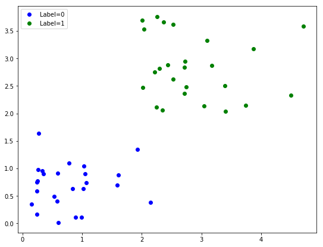
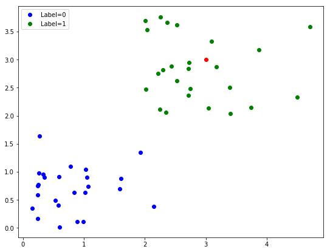
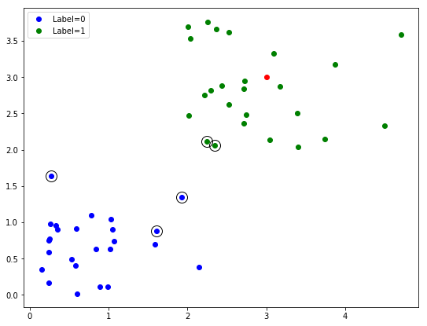
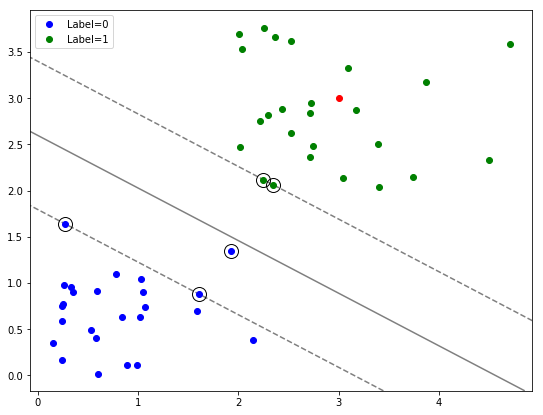

# 十七、分类

> 原文：[Classification](https://nbviewer.jupyter.org/github/COGS108/Tutorials/blob/master/17-Classification.ipynb)
> 
> 译者：[飞龙](https://github.com/wizardforcel)
> 
> 协议：[CC BY-NC-SA 4.0](http://creativecommons.org/licenses/by-nc-sa/4.0/)

分类是对数据进行分类的过程 - 将数据点分配给预定义的组（或簇）。

来自维基百科的[分类](https://en.wikipedia.org/wiki/Statistical_classification)文章。

## 支持向量机

支持向量机是一种监督分类算法。

[文章](https://medium.com/machine-learning-101/chapter-2-svm-support-vector-machine-theory-f0812effc72)提供了 SVM 算法的精彩概述。这也是来自 [scikit-learn](http://scikit-learn.org/stable/modules/svm.html) 的基于代码的解释。

```python
%matplotlib inline

import numpy as np
import matplotlib.pyplot as plt


# 从 scikit-learn 导入
from sklearn.svm import SVC
from sklearn.metrics import classification_report
```

### 概述

在此示例中，我们将生成来自两个不同（已知）组的一些二维数据，并将 SVM 分类模型应用于此数据。

```python
# 生成一些随机数据的设置
n_points = 50
label_prop = 0.5

# 初始化数据矩阵（为零）
dat = np.zeros(shape=[n_points, 2])

# 配置每类的数据点数量
n_dat_1 = int(n_points * label_prop)
n_dat_2 = n_points - n_dat_1

# 生成数据
dat[0:n_dat_1, 0] = np.abs(np.random.randn(n_dat_1))
dat[0:n_dat_1, 1] = np.abs(np.random.randn(n_dat_1))
dat[n_dat_2:, 0] = np.abs(np.random.randn(n_dat_1)) + 2
dat[n_dat_2:, 1] = np.abs(np.random.randn(n_dat_1)) + 2

# 创建标签向量
labels = np.array([0] * n_dat_1 + [1] * n_dat_2)


# 绘制出带标签数据
fig = plt.figure(figsize=[9, 7])
plt.plot(dat[0:n_dat_1, 0], dat[0:n_dat_1, 1], 'b.', ms=12, label="Label=0")
plt.plot(dat[n_dat_2:, 0], dat[n_dat_2:, 1], 'g.', ms=12, label="Label=1")
plt.legend();
```





### Scikit-Learn 对象

如上所述，我们有两组完全不同的数据。现在我们想要学习一个数学过程，可以将这些数据标记为两组，我们希望它能够学习一个可以应用于新数据点的一般过程。

在这里，我们将使用典型的 scikit-learn 方法：
- 为我们正在使用的模型对象初始化 sklearn 对象，设置所需的参数
- 在我们带标记的训练数据上训练模型
- 检查我们在带标记数据上的表现（通常是训练组和单独的带标记测试组）
- 应用模型来预测新的数据点

```python
# 初始化 SVM 分类器对象
classifier = SVC(kernel='linear')


# 将我们的分类模型拟合到我们的训练数据
classifier.fit(dat, labels)

'''
SVC(C=1.0, cache_size=200, class_weight=None, coef0=0.0,
  decision_function_shape='ovr', degree=3, gamma='auto', kernel='linear',
  max_iter=-1, probability=False, random_state=None, shrinking=True,
  tol=0.001, verbose=False)
'''


# 计算模型对训练数据的预测
train_predictions = classifier.predict(dat)


# 打印出表现指标
print(classification_report(train_predictions, labels))

'''
             precision    recall  f1-score   support

          0       1.00      1.00      1.00        25
          1       1.00      1.00      1.00        25

avg / total       1.00      1.00      1.00        50
'''
```


### 预测新数据点

一旦我们有一个训练好的模型，我们就可以预测新数据点的标签 - 我们不知道答案的数据。

```python
# 设置一个新点 - 来预测标签
new_point = np.array([[3, 3]])


# 向图形添加我们的新点（红色）
fig.gca().plot(new_point[0][0], new_point[0][1], '.r', ms=12);


# 重绘图形
fig
```



```python
# 预测新点的类别
prediction = classifier.predict(new_point)
print('Predicted class of new data point is: ', prediction[0])

# Predicted class of new data point is:  1
```


### 支持向量

SVM的一个关键特性是它们使用“支持向量”，这意味着它们优先使用靠近决策边界的数据点的信息，并使用它们来尝试找到最宽的边距 - 两组之间的距离。在这里，我们可以简单探索我们的已训练模型的支持向量。

```python
# 向绘图添加支持向量
# 支持向量将通过用黑色圆圈突出显示
for row in classifier.support_vectors_:
    fig.gca().plot(row[0], row[1], 'ok', ms=14,  mfc='none')


# 重绘图形
fig
```



### 绘制决策边界

现在让我们绘制决策边界 - 我们的学习模型认为标签在组之间切换的边界。

以下代码用于查找和可视化决策边界和边距，取自[ sklearn 示例](http://scikit-learn.org/stable/auto_examples/svm/plot_separating_hyperplane.html#sphx-glr-auto-examples-svm-plot-separating-hyperplane-py)。

```python
# 获取当前图，找到轴的大小
ax = fig.gca()
xlim = ax.get_xlim()
ylim = ax.get_ylim()

# 创建数据网格来评估模型
xx = np.linspace(xlim[0], xlim[1], 30)
yy = np.linspace(ylim[0], ylim[1], 30)
YY, XX = np.meshgrid(yy, xx)
xy = np.vstack([XX.ravel(), YY.ravel()]).T
Z = classifier.decision_function(xy).reshape(XX.shape)

# 绘制决策边界和边距
ax.contour(XX, YY, Z, colors='k', levels=[-1, 0, 1], alpha=0.5,
           linestyles=['--', '-', '--']);


# 重绘图形
fig
```




### 探索

使用上面的代码，我们鼓励你探索 SVM。

在更改数据，更改内核和预测不同数据点时，调查会发生什么。
