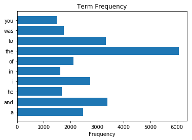
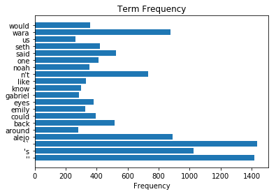
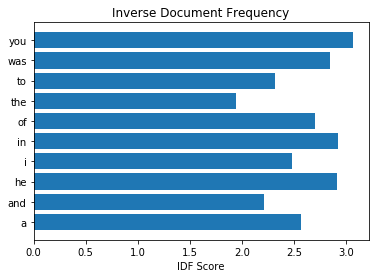
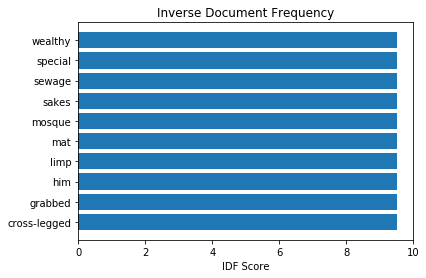

# 十八、自然语言处理

> 原文：[Natural Language Processing](https://nbviewer.jupyter.org/github/COGS108/Tutorials/blob/master/18-NaturalLanguageProcessing.ipynb)
> 
> 译者：[飞龙](https://github.com/wizardforcel)
> 
> 协议：[CC BY-NC-SA 4.0](http://creativecommons.org/licenses/by-nc-sa/4.0/)

自然语言处理（NLP）是使用计算机分析文本数据的方法。

这是[维基百科](https://en.wikipedia.org/wiki/Natural-language_processing)上的自然语言处理。

## NTLK：自然语言工具包

NLTK 是用于文本分析的主要 Python 模块。

NLTK 组织网站在[这里](http://www.nltk.org/)，他们有一整本教程在[这里](http://www.nltk.org/book/)。

#### NLTK

NLTK 为超过 50 种语料库和词汇资源（如 WordNet）提供了易于使用的界面，以及一套用于分类，分词，词干提取，标注，解析和语义推理的文本处理库，用于工业级 NLP 库的包装器，和活跃的讨论论坛。

```python
# 导入 NLTK
import nltk
```

在这个笔记本中，我们将使用 NLTK 包中的一些有用功能来完成一些基本的文本分析。

要处理文本数据，通常需要使用语料库 - 文本数据集进行比较。 NLTK 有许多这样的数据集可用，但默认情况下不会安装它们（因为它们的完整集合会非常大）。下面我们将下载其中一些数据集。

```python
# 如果你在下面的单元格中下载时，遇到了错误
# 请返回此单元格，取消注释，然后运行此代码。
# 这段代码赋予 python 写入磁盘的权限（如果它还没有这样做的权限）。
import ssl

try:
    _create_unverified_https_context = ssl._create_unverified_context
except AttributeError:
    pass
else:
    ssl._create_default_https_context = _create_unverified_https_context


# 从 NLTK 下载一些有用的数据文件
nltk.download('punkt')
nltk.download('stopwords')
nltk.download('averaged_perceptron_tagger')
nltk.download('maxent_ne_chunker')
nltk.download('words')
nltk.download('treebank')

'''
[nltk_data] Downloading package punkt to /Users/tom/nltk_data...
[nltk_data]   Package punkt is already up-to-date!
[nltk_data] Downloading package stopwords to /Users/tom/nltk_data...
[nltk_data]   Package stopwords is already up-to-date!
[nltk_data] Downloading package averaged_perceptron_tagger to
[nltk_data]     /Users/tom/nltk_data...
[nltk_data]   Package averaged_perceptron_tagger is already up-to-
[nltk_data]       date!
[nltk_data] Downloading package maxent_ne_chunker to
[nltk_data]     /Users/tom/nltk_data...
[nltk_data]   Package maxent_ne_chunker is already up-to-date!
[nltk_data] Downloading package words to /Users/tom/nltk_data...
[nltk_data]   Package words is already up-to-date!
[nltk_data] Downloading package treebank to /Users/tom/nltk_data...
[nltk_data]   Package treebank is already up-to-date!

True
'''


# 设置一些要测试的数据的测试句子
sentence = "UC San Diego is a great place to study cognitive science."
```

## 分词

分词是将文本数据拆分为“标记”的过程，这些标记是有意义的数据片段。

分词的更多信息在[这里](https://nlp.stanford.edu/IR-book/html/htmledition/tokenization-1.html)。

词可以在不同的级别完成 - 例如，你可以将文本分词为句子，和/或分词为单词。

```python
# 在单词级别对我们的句子进行分词
tokens = nltk.word_tokenize(sentence)


# 查看单词分词后的数据
print(tokens)

# ['UC', 'San', 'Diego', 'is', 'a', 'great', 'place', 'to', 'study', 'cognitive', 'science', '.']
```


## 词性（POS）标注


词性标注是根据单词的“类型”和与其他单词的关系对单词进行标记的过程。

这里是[维基百科](https://en.wikipedia.org/wiki/Part-of-speech_tagging)上的词性标注。

```python
# 对我们的句子进行词性标注
tags = nltk.pos_tag(tokens)


# 检查我们的数据的 POS 标签
print(tags)

# [('UC', 'NNP'), ('San', 'NNP'), ('Diego', 'NNP'), ('is', 'VBZ'), ('a', 'DT'), ('great', 'JJ'), ('place', 'NN'), ('to', 'TO'), ('study', 'VB'), ('cognitive', 'JJ'), ('science', 'NN'), ('.', '.')]


# 查看描述所有缩写含义的文档
nltk.help.upenn_tagset()

'''
$: dollar
    $ -$ --$ A$ C$ HK$ M$ NZ$ S$ U.S.$ US$
'': closing quotation mark
    ' ''
(: opening parenthesis
    ( [ {
): closing parenthesis
    ) ] }
,: comma
    ,
--: dash
    --
.: sentence terminator
    . ! ?
:: colon or ellipsis
    : ; ...
CC: conjunction, coordinating
    & 'n and both but either et for less minus neither nor or plus so
    therefore times v. versus vs. whether yet
CD: numeral, cardinal
    mid-1890 nine-thirty forty-two one-tenth ten million 0.5 one forty-
    seven 1987 twenty '79 zero two 78-degrees eighty-four IX '60s .025
    fifteen 271,124 dozen quintillion DM2,000 ...
DT: determiner
    all an another any both del each either every half la many much nary
    neither no some such that the them these this those
EX: existential there
    there
FW: foreign word
    gemeinschaft hund ich jeux habeas Haementeria Herr K'ang-si vous
    lutihaw alai je jour objets salutaris fille quibusdam pas trop Monte
    terram fiche oui corporis ...
IN: preposition or conjunction, subordinating
    astride among uppon whether out inside pro despite on by throughout
    below within for towards near behind atop around if like until below
    next into if beside ...
JJ: adjective or numeral, ordinal
    third ill-mannered pre-war regrettable oiled calamitous first separable
    ectoplasmic battery-powered participatory fourth still-to-be-named
    multilingual multi-disciplinary ...
JJR: adjective, comparative
    bleaker braver breezier briefer brighter brisker broader bumper busier
    calmer cheaper choosier cleaner clearer closer colder commoner costlier
    cozier creamier crunchier cuter ...
JJS: adjective, superlative
    calmest cheapest choicest classiest cleanest clearest closest commonest
    corniest costliest crassest creepiest crudest cutest darkest deadliest
    dearest deepest densest dinkiest ...
LS: list item marker
    A A. B B. C C. D E F First G H I J K One SP-44001 SP-44002 SP-44005
    SP-44007 Second Third Three Two * a b c d first five four one six three
    two
MD: modal auxiliary
    can cannot could couldn't dare may might must need ought shall should
    shouldn't will would
NN: noun, common, singular or mass
    common-carrier cabbage knuckle-duster Casino afghan shed thermostat
    investment slide humour falloff slick wind hyena override subhumanity
    machinist ...
NNP: noun, proper, singular
    Motown Venneboerger Czestochwa Ranzer Conchita Trumplane Christos
    Oceanside Escobar Kreisler Sawyer Cougar Yvette Ervin ODI Darryl CTCA
    Shannon A.K.C. Meltex Liverpool ...
NNPS: noun, proper, plural
    Americans Americas Amharas Amityvilles Amusements Anarcho-Syndicalists
    Andalusians Andes Andruses Angels Animals Anthony Antilles Antiques
    Apache Apaches Apocrypha ...
NNS: noun, common, plural
    undergraduates scotches bric-a-brac products bodyguards facets coasts
    divestitures storehouses designs clubs fragrances averages
    subjectivists apprehensions muses factory-jobs ...
PDT: pre-determiner
    all both half many quite such sure this
POS: genitive marker
    ' 's
PRP: pronoun, personal
    hers herself him himself hisself it itself me myself one oneself ours
    ourselves ownself self she thee theirs them themselves they thou thy us
PRP$: pronoun, possessive
    her his mine my our ours their thy your
RB: adverb
    occasionally unabatingly maddeningly adventurously professedly
    stirringly prominently technologically magisterially predominately
    swiftly fiscally pitilessly ...
RBR: adverb, comparative
    further gloomier grander graver greater grimmer harder harsher
    healthier heavier higher however larger later leaner lengthier less-
    perfectly lesser lonelier longer louder lower more ...
RBS: adverb, superlative
    best biggest bluntest earliest farthest first furthest hardest
    heartiest highest largest least less most nearest second tightest worst
RP: particle
    aboard about across along apart around aside at away back before behind
    by crop down ever fast for forth from go high i.e. in into just later
    low more off on open out over per pie raising start teeth that through
    under unto up up-pp upon whole with you
SYM: symbol
    % & ' '' ''. ) ). * + ,. < = > @ A[fj] U.S U.S.S.R * ** ***
TO: "to" as preposition or infinitive marker
    to
UH: interjection
    Goodbye Goody Gosh Wow Jeepers Jee-sus Hubba Hey Kee-reist Oops amen
    huh howdy uh dammit whammo shucks heck anyways whodunnit honey golly
    man baby diddle hush sonuvabitch ...
VB: verb, base form
    ask assemble assess assign assume atone attention avoid bake balkanize
    bank begin behold believe bend benefit bevel beware bless boil bomb
    boost brace break bring broil brush build ...
VBD: verb, past tense
    dipped pleaded swiped regummed soaked tidied convened halted registered
    cushioned exacted snubbed strode aimed adopted belied figgered
    speculated wore appreciated contemplated ...
VBG: verb, present participle or gerund
    telegraphing stirring focusing angering judging stalling lactating
    hankerin' alleging veering capping approaching traveling besieging
    encrypting interrupting erasing wincing ...
VBN: verb, past participle
    multihulled dilapidated aerosolized chaired languished panelized used
    experimented flourished imitated reunifed factored condensed sheared
    unsettled primed dubbed desired ...
VBP: verb, present tense, not 3rd person singular
    predominate wrap resort sue twist spill cure lengthen brush terminate
    appear tend stray glisten obtain comprise detest tease attract
    emphasize mold postpone sever return wag ...
VBZ: verb, present tense, 3rd person singular
    bases reconstructs marks mixes displeases seals carps weaves snatches
    slumps stretches authorizes smolders pictures emerges stockpiles
    seduces fizzes uses bolsters slaps speaks pleads ...
WDT: WH-determiner
    that what whatever which whichever
WP: WH-pronoun
    that what whatever whatsoever which who whom whosoever
WP$: WH-pronoun, possessive
    whose
WRB: Wh-adverb
    how however whence whenever where whereby whereever wherein whereof why
``: opening quotation mark
'''
```

## 命名实体识别（NER）


命名实体识别旨在用与相关的实体类型标记单词。


这里是[维基百科](https://en.wikipedia.org/wiki/Named-entity_recognition)上的命名实体识别。


```python
# 将命名实体识别应用于我们的 POS 标签
entities = nltk.chunk.ne_chunk(tags)


# 查看命名实体
print(entities)

'''
(S
  UC/NNP
  (PERSON San/NNP Diego/NNP)
  is/VBZ
  a/DT
  great/JJ
  place/NN
  to/TO
  study/VB
  cognitive/JJ
  science/NN
  ./.)
'''
```

    

## 停止词


“停止词”是一种语言中最常见的词语，我们经常希望在文本分析之前将其过滤掉。

这里是[维基百科](https://en.wikipedia.org/wiki/Stop_words)上的停止词。


```python
# 查看英语中的停止词语料库
print(nltk.corpus.stopwords.words('english'))

# ['i', 'me', 'my', 'myself', 'we', 'our', 'ours', 'ourselves', 'you', "you're", "you've", "you'll", "you'd", 'your', 'yours', 'yourself', 'yourselves', 'he', 'him', 'his', 'himself', 'she', "she's", 'her', 'hers', 'herself', 'it', "it's", 'its', 'itself', 'they', 'them', 'their', 'theirs', 'themselves', 'what', 'which', 'who', 'whom', 'this', 'that', "that'll", 'these', 'those', 'am', 'is', 'are', 'was', 'were', 'be', 'been', 'being', 'have', 'has', 'had', 'having', 'do', 'does', 'did', 'doing', 'a', 'an', 'the', 'and', 'but', 'if', 'or', 'because', 'as', 'until', 'while', 'of', 'at', 'by', 'for', 'with', 'about', 'against', 'between', 'into', 'through', 'during', 'before', 'after', 'above', 'below', 'to', 'from', 'up', 'down', 'in', 'out', 'on', 'off', 'over', 'under', 'again', 'further', 'then', 'once', 'here', 'there', 'when', 'where', 'why', 'how', 'all', 'any', 'both', 'each', 'few', 'more', 'most', 'other', 'some', 'such', 'no', 'nor', 'not', 'only', 'own', 'same', 'so', 'than', 'too', 'very', 's', 't', 'can', 'will', 'just', 'don', "don't", 'should', "should've", 'now', 'd', 'll', 'm', 'o', 're', 've', 'y', 'ain', 'aren', "aren't", 'couldn', "couldn't", 'didn', "didn't", 'doesn', "doesn't", 'hadn', "hadn't", 'hasn', "hasn't", 'haven', "haven't", 'isn', "isn't", 'ma', 'mightn', "mightn't", 'mustn', "mustn't", 'needn', "needn't", 'shan', "shan't", 'shouldn', "shouldn't", 'wasn', "wasn't", 'weren', "weren't", 'won', "won't", 'wouldn', "wouldn't"]
```

# 文本编码

NLP的关键组件之一是决定如何编码文本数据。

常见的编码是：

- 词袋（BoW）
  - 文本被编码为单词和频率的集合
- 词频-逆向文件频率（TF-IDF）
  - TF-IDF是一种加权，用于存储单词和语料库中的共性关系。

我们将浏览 BoW 和 TF-IDF 文本编码的示例。

```python
# 导入
%matplotlib inline

# 标准 Python 有一些有用的字符串工具
import string

# 集合是标准 Python 的一部分，包含一些有用的数据对象
from collections import Counter

import numpy as np
import matplotlib.pyplot as plt

# Scikit-learn 有一些有用的 NLP 工具，例如 TFIDF 向量化器
from sklearn.feature_extraction.text import TfidfVectorizer
```

我们将要查看的数据是 BookCorpus 数据集的一小部分。原始数据集可在此处找到：<http://yknzhu.wixsite.com/mbweb>。

原始数据集是从超过 11,000 本书中收集的，并且已经在句子和单词级别上进行了分词。这里提供和使用的小子集包含前 10,000 个句子。

```python
# 加载数据
with open('files/book10k.txt', 'r') as f:
    sents = f.readlines()


# 查看数据 - 打印出第一个和最后一个句子，作为示例
print(sents[0])
print(sents[-1])

'''
the half-ling book one in the fall of igneeria series kaylee soderburg copyright 2013 kaylee soderburg all rights reserved .

alejo was sure the fact that he was nervously repeating mass along with five wrinkly , age-encrusted spanish women meant that stalin was rethinking whether he was going to pay the price .
'''


# 预处理：从句子中删除所有额外的空格
sents = [sent.strip() for sent in sents]
```

我们首先看一下文档中的单词频率，然后打印出频率最高的前 10 个单词。

```python
# 将所有句子分词为单词
# 这会将所有单词标记收集到一个大的列表中
tokens = []
for x in sents:
    tokens.extend(nltk.word_tokenize(x))


# 查看数据中有多少单词
print('Number of words in the data: \t', len(tokens))
print('Number of unique words: \t', len(set(tokens)))

'''
Number of words in the data: 	 140060
Number of unique words: 	 8221
'''


# 使用“计数器”对象计算每个单词出现的次数
counts = Counter(tokens)


# 查看计数对象
# 这基本上是这个语料库的“词袋”表示
# 我们失去了单词顺序和语法 - 它只是单词的一个集合
# 我们所拥有的是所有单词的列表，以及它们出现的频率
counts
```

如果你滚动上面的单词列表，你可能会注意到的一点是，它仍然包含标点符号。我们删除那些。

```python
# 'string' 模块（标准库）有一个有用的标点符号列表
print(string.punctuation)

# !"#$%&'()*+,-./:;<=>?@[\]^_`{|}~


# 从计数对象中删除所有标点符号标记
for punc in string.punctuation:
    if punc in counts:
        counts.pop(punc)


# 获得前 10 个最常用的单词
top10 = counts.most_common(10)


# 提取顶部单词，并计数
top10_words = [it[0] for it in top10]
top10_counts = [it[1] for it in top10]


# 绘制文本中最常用单词的条形图
plt.barh(top10_words, top10_counts)
plt.title('Term Frequency');
plt.xlabel('Frequency');
```





正如我们所看到的，文档中出现了`the`，`was`，`a`等等。

对于弄清楚这些文档的内容，或者作为使用和理解这些文本数据的方式，这些经常出现的单词并不是很有用。

```python
# 丢弃所有停止词
for stop in nltk.corpus.stopwords.words('english'):
    if stop in counts:
        counts.pop(stop)


# 获取删除停止词的数据中，前 20 个最常用单词
top20 = counts.most_common(20)


# 绘制文本中最常用单词的条形图
plt.barh([it[0] for it in top20], [it[1] for it in top20])
plt.title('Term Frequency');
plt.xlabel('Frequency');
```





这看起来可能更相关/有用。我们可以继续探索这个 BoW 模型，但现在让我们转向，并使用 TFIDF 进行探索。

```python
# 初始化 TFIDF 对象
tfidf = TfidfVectorizer(analyzer='word',
                        sublinear_tf=True,
                        max_features=5000,
                        tokenizer=nltk.word_tokenize)


# 将 TFIDF 转换应用于我们的数据
# 请注意，这会接受句子并对其进行分词，然后应用 TFIDF
tfidf_books = tfidf.fit_transform(sents).toarray()
```

TfidfVectorizer 将计算每个单词的逆文档频率（IDF）。

然后 TFIDF 计算为`TF * IDF`，用于降低频繁出现的单词的权重。该 TFIDF 存储在`tfidf_books`变量中，该变量是一个`n_documents x n_words`矩阵，用于以 TFIDF 表示来编码文档。

让我们首先为前 10 个最常出现的单词（来自第一次分析）中的每一个绘制 IDF。

```python
# 获取前 10 个最常用单词的 IDF 权重
IDF_weights = [tfidf.idf_[tfidf.vocabulary_[token]] for token in top10_words]


# 绘制非常常见的单词的 IDF 得分
plt.barh(top10_words, IDF_weights)
plt.title('Inverse Document Frequency');
plt.xlabel('IDF Score');
```





我们将该绘图与以下绘图进行比较，该绘图显示 IDF 最高的前 10 个单词。

```python
# 获得 IDF 得分最高的单词
inds = np.argsort(tfidf.idf_)[::-1][:10]
top_IDF_tokens = [list(tfidf.vocabulary_)[ind] for ind in inds]
top_IDF_scores = tfidf.idf_[inds]


# 绘制 IDF 得分最高的单词
plt.barh(top_IDF_tokens, top_IDF_scores)
plt.title('Inverse Document Frequency');
plt.xlabel('IDF Score');
```



正如我们所看到的，与更罕见的单词相比，文档中经常出现的单词获得的 IDF 分数非常低。

在 TF-IDF 之后，我们成功地减少了文档中频繁出现的单词的权重。这允许我们通过最独特的单词来表示文档，这可以是表示文本数据的更有用的方式。
