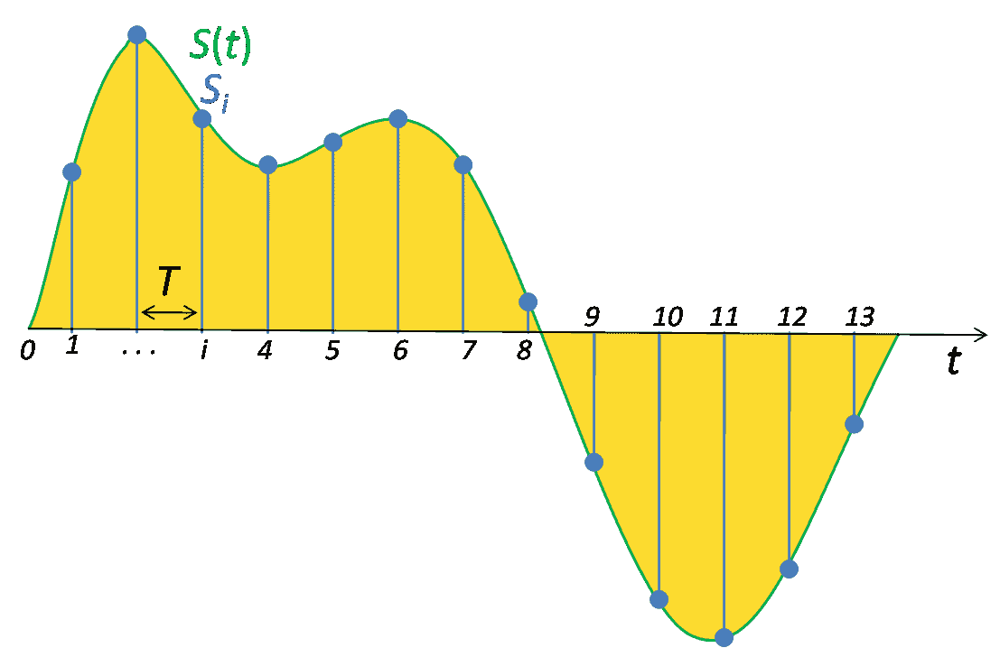
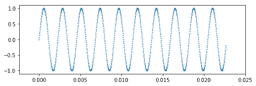
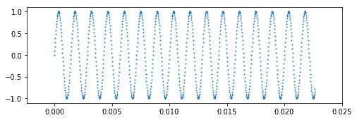
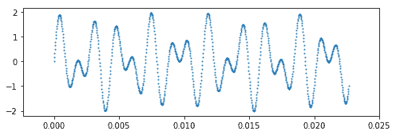
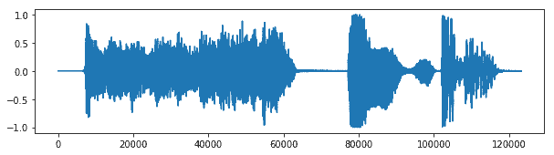
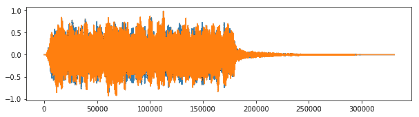
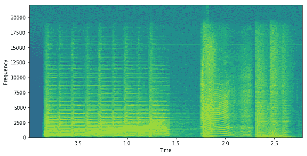

# 1.1 一些动机（音频处理）

> 原文：[A bit of motivation (Audio processing)](https://github.com/parrt/msds501/blob/master/notes/sound.ipynb)
> 
> 译者：[飞龙](https://github.com/wizardforcel)
> 
> 协议：[CC BY-NC-SA 4.0](http://creativecommons.org/licenses/by-nc-sa/4.0/)


学习编程涉及学习很多细节。 为了简单起见，教师倾向于从简单的代码示例开始，但这些最终变得非常无趣。 我想用一个有趣的计算应用开始本课程，来激励你学习如何编写代码。 我想表明，即使是一点点代码，回报也可能是巨大的。 我不希望你最初了解所有的细节，只是广泛的笔画。 在第一个讲义/实验中，我们将利用现有的代码库，来了解计算机如何表示音乐和其他音频文件。

随着我们进行下去，您将遇到许多全新的任务，例如从命令行在您的计算机上安装软件。 我们将研究一些实际应用，需要跨主题技能和知识，而不是针对特定主题提供一些讲座。 最好看看所有部分是如何组合在一起的，而不是孤立地看待主题。 随着您获得更多经验，您将回顾这些早期的例子，当你了解了一切，你会觉得“啊哈！” 。

## 播放声音文件

我们都在电脑上播放音乐文件。 例如，这里有两个有趣的：[Kiss by Prince，Kiss.aiff 的初始序列](sound/Kiss.aiff)和[ahhh sound，ahhh.mp3](sound/ahhh.mp3)。 您可以下载这些并使用音乐播放器播放它们。 但是，如果我们正在构建游戏，或进行语音识别，并且我们需要 Python 来加载声音文件并播放它们呢？通过利用类似烹饪书的代码库，我们可以使用几行 Python 代码来播放音频文件。您将有机会在[本课程的声音实验](../labs/sound.md)中，尝试所有这些 Python 代码，但现在只是尝试获取代码的要点，和数字音频背后的原理。

要在 Python 中播放音频文件，我们首先必须将该音频文件加载到内存中。 我们很快就会看到，音频文件只不过是一系列数字。 这里有一些 Python 示例，加载了 Prince's Kiss 的一首歌：

```python
import soundfile as sf
from IPython.display import Audio

kiss, samplerate = sf.read('sound/Kiss.aiff')
Audio(kiss, rate=samplerate)
```

<audio controls="controls" >
    <source src="img/Kiss.wav" type="audio/wav" />
    <a href='img/Kiss.wav'>Kiss.wav</a>
</audio>


代码首先从一些有用的 Python 包中导入一些必要的代码。 `sf.read(...)`是将文件加载到内存中的关键元素。 在该语句之后，变量`kiss`持有音频数据。 `Audio(kiss,...)`在技术上是 Python 代码，但它是特定于 Jupyter 笔记本的东西，让我可以使用浏览器播放声音。 这纯粹是为了演示目的。 在你的实验里，你会做一些像`sd.play(kiss, ...)`之类的东西。

这是另一个音频文件：

```python
import sounddevice as sd
ahhh, samplerate = sf.read('sound/ahhh.wav')
Audio(ahhh[:,0], rate=samplerate)
```


<audio controls="controls" >
    <source src="img/ahhh.wav" type="audio/wav" />
    <a href='img/ahhh.wav'>ahhh.wav</a>
</audio>
              

要查看 Kiss 音频中的内容，我们可以打印变量`kiss`中值的一个子集：

```python
import numpy as np
np.set_printoptions(suppress=True) # weird numpy thing to avoid scientific notation
```


```python
print(f"n = {len(kiss)}, rate ={samplerate}hz")
print(kiss[5000:5020])  # kiss is a numpy ndarray that you will become intimately familiar with

'''
n = 123269, rate =44100hz
[ 0.00003052  0.         -0.00009155  0.00018311 -0.00024414  0.00030518
 -0.00033569  0.00030518 -0.00027466  0.00027466 -0.00021362  0.00006104
  0.00003052 -0.00003052  0.00006104 -0.00003052 -0.00009155  0.00015259
 -0.00015259  0.00015259]
'''
```

我们可以为`ahhh`做同样的事情。

```python
print(ahhh[3000:3010]) # why is each sample actually 2 numbers?

'''
[[-0.02444458 -0.02212524]
 [-0.02230835 -0.01843262]
 [-0.01998901 -0.01403809]
 [-0.01727295 -0.00921631]
 [-0.0140686  -0.00402832]
 [-0.01025391  0.00143433]
 [-0.00570679  0.00714111]
 [-0.00042725  0.01318359]
 [ 0.0055542   0.01953125]
 [ 0.01208496  0.02587891]]
'''
```

您可能想知道，采样率是多少以及数字如何表示音频。 它的工作方式与电影非常频繁地抓取快照（图片）的方式相同。 以相同的速度播放它们会产生运动的错觉。 电影拍照的频率称为帧速率，可能是每秒 32 帧。 音频文件也会拍摄快照，但不是图像，而是在特定时刻获取音量（声压）。 音频的一个非常常见的采样率是每秒 44,100 次（44,100 赫兹）。 在音频回放期间，每个值用于使扬声器的隔膜偏离其中间位置。 信不信由你，这会以一种再现原始声音的方式震动房间内的空气分子。 在 Big Bang 理论的一个令人敬畏的场景中，看看这个演讲者的动作：

```python
from IPython.display import YouTubeVideo
YouTubeVideo("2CJJ6FrfuGU")
```

<https://www.youtube.com/embed/2CJJ6FrfuGU>

麦克风与扬声器相对，并且具有非常灵敏的振膜，在声波的存在下巧妙地振动。 如果我们以非常快速和规则的速率测量麦克风远离中线的偏离，我们将信号（例如音频信号）数字化。 在图形上，它看起来像这个时间-振幅图（麦克风偏离的幅度）



麦克风以连续的方式摆动，对采样率一无所知。这是一种所谓的模拟信号。要将其放入计算机，我们必须将其转换为数字。 您在上面看到的 Kiss 歌曲的数字是数字化的结果。

现在让我们遵循另一种方式，通过生成和数字化我们自己的简单信号，然后看看它听起来的样子。 接下来的 Python 代码中的关键位是`sin(2*numpy.pi*440*t)`，它创建一个 440 赫兹的正弦波（每秒 440 个完整正弦波，每秒通过 0 到 2pi 440个周期）。 `plt.scatter(...)`绘制信号与时间（X 轴）。

```python
import numpy
import matplotlib.pyplot as plt
%matplotlib inline
fs = 44100 # sampling frequency
T = 1.5    # seconds
t = numpy.linspace(0, T, int(T*fs), endpoint=False) # time variable
y = numpy.sin(2*numpy.pi*440*t)                     # pure sine wave at 440 Hz
print(len(y), "samples in", T, "seconds")
plt.figure(figsize=(8, 2.5))                        # Prepare a plot 8x2.5 inches
plt.scatter(t[0:1000],y[0:1000],s=1)
plt.show()

# 66150 samples in 1.5 seconds
```



**运动**：如果我们通过扬声器运行它，你觉得它是什么？

这是 440Hz 的纯音。 想象一下，一个扬声器移出移入，然后每次重复相同的距离。现在，如果你像扬声器一样上下移动你的手，你会得到一种 Boing Boing Boing 动作。 现在开始走路并以相同的速度上下移动你的手。 对观察者来说，这个动作看起来像一个正弦波！ 那么，这就是扬声器正在做的事情。上下持续偏离为人耳提供了纯音。

```python
from IPython.display import Audio
Audio(y, rate=fs)
```

<audio controls="controls" >
    <source src="img/audio3.wav" type="audio/wav" />
    <a href='img/audio3.wav'>audio3.wav</a>
</audio>

让我们制作一个更高频率（700 Hz）的另一个信号`y2`。

**练习**：您认为与之前的信号相比，它听起来像什么？

```python
y2 = numpy.sin(2*numpy.pi*700*t)                     # pure sine wave at 440 Hz

plt.figure(figsize=(8, 2.5))
plt.scatter(t[0:1000],y2[0:1000],s=1)
plt.show()
```



```python
from IPython.display import Audio
y2 = numpy.sin(2*numpy.pi*700*t)                     # pure sine wave at 700 Hz
Audio(y2, rate=fs)
```

<audio controls="controls" >
    <source src="img/audio4.wav" type="audio/wav" />
    <a href='img/audio4.wav'>audio4.wav</a>
</audio>

**练习**：如果我将这些信号加在一起并播放结果，你觉得它是什么？

```python
plt.figure(figsize=(8, 2.5))
plt.scatter(t[0:1000],y[0:1000]+y2[0:1000],s=1) # zoom in on y+y2 for a plot
plt.show()
```



是的，我们听到声音合并为一个和弦。在数学上，我们正在做的只是将信号振幅加在一起，我们可以用`y + y2`来做，其中`y`和`y2`是我们的数字列表。向量加法将第 i 个元素添加到一起来获得新信号，我们可以绘制和播放：

```python
Audio(y+y2, rate=fs)                            # Play both sounds together
```

<audio controls="controls" >
    <source src="img/audio5.wav" type="audio/wav" />
    <a href='img/audio5.wav'>audio5.wav</a>
</audio>

如果您想知道为什么这听起来就像手机上的按键音，那是因为手机按键会播放两个纯音，作为声音来识别您按下的按钮。

现在让我们看看两个音频文件的信号图：

```python
plt.figure(figsize=(10, 2.5))
plt.plot(kiss);
plt.show()
```



```python
plt.figure(figsize=(10, 2.5))
plt.plot(ahhh); # notice this one has two plots because it is a stereo signal
```



那些复杂的信号都可以被分解成一系列纯音正弦波的加法。 正弦波的频率表示音频信号中存在的声音（音调）的频率。 我认为人类可以听到大约 150Hz 到 17,000Hz 的声音。

一个非常酷的图是所谓的频谱图，它显示了特定时刻存在的频率：

```python
fs = 44100 # sampling frequency

# Plot the spectrogram
plt.figure(figsize=(10, 5))
S, freqs, bins, im = plt.specgram(kiss, NFFT=1024, Fs=fs, noverlap=512)
plt.xlabel('Time')
plt.ylabel('Frequency')
plt.show()
```





### 练习

好了，现在我们已经知道了计算机如何表示音乐，让我们做一个实验，让你尝试通过 Python 播放声音。 但首先，我们真的需要做一个简单的“欢迎”程序，来介绍我们将在这个类中使用的 Python 工具。

* [Python 工具的初次尝试](../labs/hello.md)
* [播放声音](../labs/sound.md)
