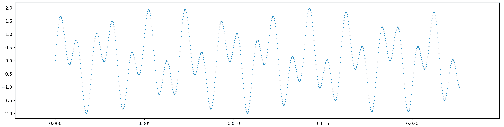

# 1.3 播放声音

> 原文：[Playing sounds](https://github.com/parrt/msds501/blob/master/labs/sound.md)
> 
> 译者：[飞龙](https://github.com/wizardforcel)
> 
> 协议：[CC BY-NC-SA 4.0](http://creativecommons.org/licenses/by-nc-sa/4.0/)


本实验的目标是让您感到惊讶，您可以使用 Python 处理一些音频文件。您将无法获得所有详细信息，但您可以剪切并粘贴此实验来启动 Python 会话。作为次要目标，您将习惯于安装 Python 包和命令行工具。

首先，下载以下两个音频文件，以便我们拥有一些要处理的原材料。

* [来自 Kiss by Prince的初始序列，`Kiss.aiff`](../notes/sound/Kiss.aiff)
* [ahhh 声音，`ahhh.mp3`](../notes/sound/ahhh.mp3)

我建议你将它们存储在如下目录中：

`/Users/YOURID/msan501/labs/sound`

其中`YOURID`是您的计算机登录名。 例如，我的登录名是`parrt`。在 Linux 上它会像：

`/home/YOURID/msan501/labs/sound`

## 安装命令行工具

事实证明，我们将在 Python 中使用的声音库，不知道如何处理 mp3 文件。 我们需要将`ahhh.mp3`文件转换为`ahhh.wav`，这些库知道如何处理它。 为此，我们将使用名为 [mpg123](https://www.mpg123.de/) 的工具。

要在 Mac 上安装大多数免费软件，我们使用一个名为 [homebrew](https://brew.sh/)（家酿啤酒）的程序（从命令行访问只是`brew`）。它可能已预先安装在您的计算机上，但如果没有，请阅读说明并进行安装。这是一个切割和粘贴以`/usr/bin/ruby...`开头的单行的问题

一旦安装完毕，我们就可以用它来安装`mpg123`。 从终端运行以下`brew`命令，该命令应该给出指示的输出：

```bash
$ brew install mpg123
...
==> Downloading https://homebrew.bintray.com/bottles/mpg123-1.25.0.el_capitan.bottle.tar.gz
######################################################################## 100.0%
==> Pouring mpg123-1.25.0.el_capitan.bottle.tar.gz
==> Using the sandbox
  /usr/local/Cellar/mpg123/1.25.0: 26 files, 765.2KB
```

在 Linux 上，mpg123 的安装是：

```bash
sudo apt-get install mpg123
```

或者：

```bash
$ sudo yum install mpg123
```

## 将`mp3`转换为`wav`文件

现在，我们安装了 mpg123，我们可以使用它将`.mp3`转换为`.wav`文件。 使用`cd`（更改目录）命令进入保存`ahhh.mp3`文件的目录，并使用`ls`列出文件：

```bash
$ cd /Users/YOURID/msan501/labs/sound
$ ls
Kiss.aiff  ahhh.mp3
```

使用以下命令转换文件：

```bash
$ mpg123 -w ahhh.wav ahhh.mp3 
High Performance MPEG 1.0/2.0/2.5 Audio Player for Layers 1, 2 and 3
	version 1.25.0; written and copyright by Michael Hipp and others
	free software (LGPL) without any warranty but with best wishes


Terminal control enabled, press 'h' for listing of keys and functions.

Playing MPEG stream 1 of 1: ahhh.mp3 ...

MPEG 1.0 L III cbr192 44100 j-s

Comment:  00000000 00000210 000009F5 000000000004FF7B 00000000 0002AB44 00000000 00000000 00000000 00000000 00000000 00000000

[0:07] Decoding of ahhh.mp3 finished.
```

在那个输出中有很多乱码，我们并不关心，但要确保它表示“完成”，并且看起来没有任何错误。 看一下当前目录中的文件，看看是否出现了`ahhh.wav`：

```bash
$ ls
Kiss.aiff  ahhh.mp3   ahhh.wav 
```

如果您无法弄清楚如何转换为`ahhh.wav`，请不要担心。 你可以[从我的笔记下载它](../ notes / sound / ahhh.wav)。

此时，我们已经学会了使用`cd`跳转到文件系统中的不同位置，并使用`ls`列出目录中的文件。 我们使用`brew`作为非 Python 包的`install`命令。

## 安装 Python 包

为了从 Python 读取和播放声音文件，我们需要利用一些现有的 Python 代码。 代码通常以包含*库*或*包*的形式提供；这些术语或多或少在实践中同义使用。

* 对于读取声音文件，我们需要 [pysoundfile](http://pysoundfile.readthedocs.io/en/0.9.0/。
* 对于播放声音文件，我们需要 [sounddevice](http://python-sounddevice.readthedocs.io/en/0.3.7/。

如果我们在安装包之前尝试使用包，那么 Python 执行器会向我们显示如下错误。

```bash
---------------------------------------------------------------------------
ImportError                               Traceback (most recent call last)
<ipython-input-61-b5992dda2a80> in <module>()
----> 1 import soundfile as sf

ImportError: No module named soundfile
```

关键是在`import`语句中，我们得到错误`No module named soundfile`。这不应该搞砸你的一天 - 这只是意味着我们必须安装该软件包。

要安装 Python 包，我们使用`pip`（或稍后，`conda`）程序。通常这个程序可以快速轻松地完成我们想要的操作，但是很多事情都可能出错。最常见的是你的`pip`程序与`python`程序不匹配。首先使用`which`验证它们是否来自同一个`bin`目录：

```bash
$ which pip
/Users/parrt/anaconda3/bin/pip
$ which python
/Users/parrt/anaconda3/bin/python
$ which python3
/Users/parrt/anaconda3/bin/python3
```

现在，让我们安装`pysoundfile`包：

```bash
$ pip install pysoundfile
Collecting pysoundfile
  Downloading PySoundFile-0.9.0.post1-py2.py3.cp26.cp27.cp32.cp33.cp34.cp35.cp36.pp27.pp32.pp33-none-macosx_10_5_x86_64.macosx_10_6_intel.macosx_10_9_intel.macosx_10_9_x86_64.whl (573kB)
    100% | | 573kB 1.4MB/s 
Requirement already satisfied: cffi>=0.6 in /Users/parrt/anaconda2/lib/python2.7/site-packages (from pysoundfile)
Requirement already satisfied: pycparser in /Users/parrt/anaconda2/lib/python2.7/site-packages (from cffi>=0.6->pysoundfile)
Installing collected packages: pysoundfile
Successfully installed pysoundfile-0.9.0.post1
```

**LINUX用户：**你需要执行`conda install libgcc`来使这个声音组件生效。

同样安装其他包：

```bash
$ pip install sounddevice
Collecting sounddevice
...
```

为了确保我们已正确安装软件包，我们可以尝试使用交互式 Python shell `python`或`ipython`导入它们：

```bash
$ python
Python 3.6.5 | packaged by conda-forge | (default, Mar 30 2018, 00:00:55) 
[GCC 4.2.1 Compatible Apple LLVM 6.1.0 (clang-602.0.53)] on darwin
Type "help", "copyright", "credits" or "license" for more information.
>>> import soundfile as sf
>>> import sounddevice as sd
```

这一次，我们的`import`语句没有出错。

## 用 Python 播放声音

此时，您已经转换了一个文件，以便我们的 Python 库可以使用它，并且您已经安装了这些 Python 库。 在这样做时，你使用了一些你应该非常熟悉的命令行工具：`brew`，`pip`，`which`，`cd`，`ls`，`python`等等...

现在是时候把所有这些放在一个简单的 Python 程序中，你可以剪切和粘贴来播放声音。 让我们从代码开始播放`Kiss.aiff`文件。 在音频文件的同一目录中创建一个名为`play.py`的文件。 您可以使用`nano`或其他文本编辑器。 这是代码：

```python
import soundfile as sf    # Use this package
import sounddevice as sd  # and this one

kiss, samplerate = sf.read('Kiss.aiff')  # load Kiss.aiff into kiss variable
sd.play(kiss, samplerate)                # start playing the music
sd.wait()                                # wait until music finishes before exiting
```

使用以下命令从命令行运行此程序：

```bash
$ python play.py
```

现在编辑程序并将`'Kiss.aiff'`字符串更改为`'ahhh.wav'`：

```python
...
kiss, samplerate = sf.read('ahhh.wav')
...
```

再次执行程序，您应该听到播放其他声音文件。

最常见的错误是声音文件没有与代码位于同一目录中。

## 生成我们自己的声音

在[声音章节](../notes/sound.ipynb)中，我们看到了如何产生正弦波，当我们将它扔给扬声器时，正弦波会产生纯音。 创建一个`puretone.py`文件并在其中放入以下代码。

```python
import numpy
import sounddevice as sd

fs = 44100 # sampling frequency
T = 1.5    # seconds
t = numpy.linspace(0, T, int(T*fs), endpoint=False) # time variable
y = numpy.sin(2*numpy.pi*440*t)                     # pure sine wave at 440 Hz
sd.play(y, fs)
sd.wait()
```

从命令行运行它。通过归纳其他程序的执行，您应该知道如何运行这个新程序，它是：

```bash
$ python puretone.py
```

将`440`更改为更高的值，如`1000`：

```python
...
y = numpy.sin(2*numpy.pi*1000*t)                    # pure sine wave at 1000 Hz
...
```

再次运行时，您应该听到更高的音调。

正如我们在演讲中所做的那样，让我们一起添加两个音调来产生更酷的声音。 带有两个正弦波结构的正弦波代码如下所示：

```python
...
y = numpy.sin(2*numpy.pi*440*t)                     # pure sine wave at 440 Hz
y2 = numpy.sin(2*numpy.pi*1000*t)                   # pure sine wave at 1000 Hz
...
```

信号在'y`和`y2`变量中。 现在，改变播放声音的语句，以便在播放之前将信号添加到一起：

```python
...
sd.play(y+y2, fs)
...
```

保存程序并运行它。 您应该听到两个声音一起播放为一个声音。

现在，让我们看看这个信号在视觉上是什么样的。 创建一个名为`twotonesplot.py`的文件并输入以下代码：

```python
import numpy
import sounddevice as sd
import matplotlib.pyplot as plt

fs = 44100 # sampling frequency
T = 1.5    # seconds
t = numpy.linspace(0, T, int(T*fs), endpoint=False) # time variable
y = numpy.sin(2*numpy.pi*440*t)                     # pure sine wave at 440 Hz
y2 = numpy.sin(2*numpy.pi*1000*t)                   # pure sine wave at 1000 Hz
plt.scatter(t[0:1000],(y+y2)[0:1000],s=1)
plt.show()
```

看看您是否可以看到此代码与之前代码之间的关系。 我们有另一个`import`语句，它引入了一些绘图代码，我们用它来生成一个散点图，用最后两行替换`play`/`wait`序列。 除此之外，代码是相同的。 运行该代码，你应该看到一个漂亮的摇摆正弦波，这是两个不同频率的纯正弦波：



## 声音处理

### 减小音量

为了让你相信声波只是数字，让我们从音频文件加载的数字更小。当我们演奏它时会产生什么声音？是的，它应该变得更安静。这是一个名为`softer.py`的`play.py`程序的版本，它有一个额外的行来减少振幅：

```python
import soundfile as sf    # Use this package
import sounddevice as sd  # and this one

kiss, samplerate = sf.read('Kiss.aiff')  # load Kiss.aiff into kiss variable
kiss = kiss * .1                         # Reduce amplitude to make quieter
sd.play(kiss, samplerate)                # start playing the music
sd.wait()                                # wait until music finishes before exiting
```

该行将数字信号中的每个值除以 10：

```python
kiss = kiss * .1                         # Reduce amplitude to make quieter
```

事实证明，当我们将信号强度除以 10 时，我们的耳朵听到的声音减小一半。（术语*分贝（decibel）*应该是个双关语，`Decimate`意味着除以 10。）

### 减慢音频（并改变音高）

让我们说我们想加深 Prince 的声音。 我们所要做的就是减慢音乐速度。 要做到这一点，我们所要做的就是玩一玩采样率。 将`play.py`文件复制到`slow.py`并将`play`行更改为：

```python
sd.play(kiss, samplerate*.8)             # play the music at 80% speed
```

现在运行`slow.py`并且 Prince 的声音在最后听起来很怪异。 整个东西听起来很慢。 直观地说，降低播放时的采样率会降低速度，因为播放器每秒消耗更少的样本。 这会使声音延长，就像用手指放慢唱片转盘一样。

可以减慢音乐速度并且**不**更改音高，这在尝试将音乐从音频转换为乐谱时非常有用。构建[我所使用的转录软件](https://www.seventhstring.com/xscribe/overview.html)的人，很好的描述了[不改变音高并减慢音乐](https://www.seventhstring.com/resources/slowdown.html)所涉及的技巧。


## 答案

您可以在[ msan501 类库](https://github.com/parrt/msan501/tree/master/labs/code/sound)中找到本实验的所有代码。 这是[声音文件](https://github.com/parrt/msan501/tree/master/notes/sound)。

## 总结

声音处理是一个非常有趣的迷人话题，你刚刚在这里做了一些尝试。我希望这个实验可以激励您深入了解编程的细节，以便您可以学习为自己构建这些类型的程序。 在第一个项目中，您将了解图像处理，您猜对了，一切都是数字。

您还了解了如何使用命令行安装其他命令行程序和 Python 包。 当您编写越来越复杂的程序时，这将是您将一次又一次地使用的东西。
