# 2.2 在内存中表示数据

> 原文：[Representing data in memory](https://github.com/parrt/msds501/blob/master/notes/data-in-memory.ipynb)
> 
> 译者：[飞龙](https://github.com/wizardforcel)
> 
> 协议：[CC BY-NC-SA 4.0](http://creativecommons.org/licenses/by-nc-sa/4.0/)


典型的程序要求我们从磁盘加载数据并放入组织成数据结构的内存中。我们在内存中表示数据的方式对于构建程序至关重要。数据科学大纲尤其如此，因为处理数据是我们的焦点。

首先，让我们直接了解数据。数据元素具有*值*和*类型*，例如`32`和*整数* 或`"hi"`和*字符串*。我们通过组合和组织这些数据元素（例如整数列表）来构建数据结构。

我们还有一个名为*指针*或*引用*的特殊元素，它引用另一个元素。这就像一个电话号码“指向”手机，但不是手机本身。使用指针我们可以找到手机。指针列表就像指向人们的电话簿，但电话簿实际上并不是人的列表。（我们稍后会看到，即使我们做了像`x = 3`之类的简单操作，变量`x`也是秘密地指向值为 3 的整数对象的指针。）

接下来，让我们稍微了解一下计算机体系结构，来了解将内容加载到内存中的含义。

## 计算机体系结构

计算机由三个主要组件组成：一个用于存放数据的磁盘，一个存储器（在断电时擦除），以及一个处理该数据的处理器（CPU）。 这是一张实际 CPU 和一些内存芯片的图片：

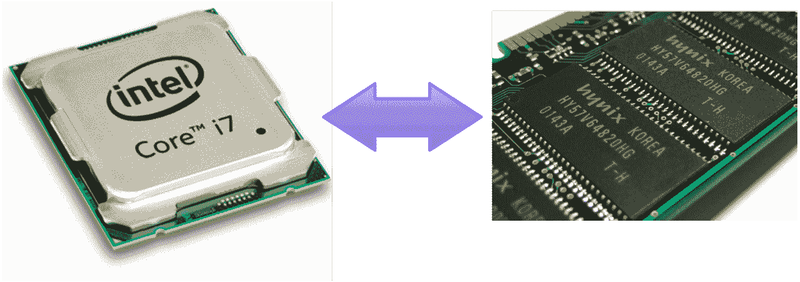

计算机内存（RAM == 随机存取内存）要快得多，但通常比磁盘小很多，并且当计算机关机时所有内存都会丢失。 将内存视为工作空间或临时空间，将磁盘视为永久存储。内存芯片有点像人类的短期以及，相对于一张读写速度较慢而且持久的纸张而言，它很容易消失。

存储器被分解成固定大小的离散单元。单元的大小是一个*字节*，由 8 *位*（二进制开/关数字）组成。 存放 0 到 255 之间的数字就足够了。每个单元都用整数地址标识，就像邮箱上的数字一样（见下图和右图）。 处理器可以请求特定地址处的数据，并且还可以在特定存储器位置存储一条数据。例如，这是字节可寻址的计算机内存的抽象表示：

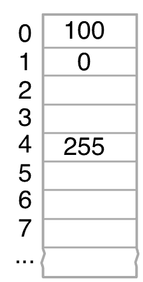

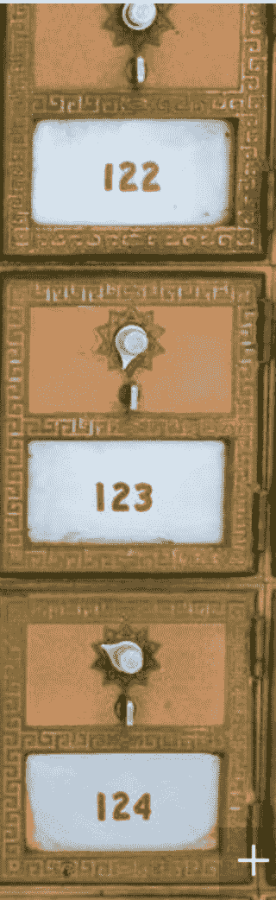

在这种情况下，存储器在地址 0 处具有值 100。在地址 1 处，存储器具有值 0。地址 4 具有我们可以存储在单个字节中的最大值：255。

**从实际数字到音乐到视频的所有内容，使用一个或多个称为字节的原子存储单元来存储。**

**所有内容都存储为计算机中的数字或数字序列，甚至是文本。**

数据存在于内存中，磁盘上，或者可以从网络中检索。作为编程计划的一部分，您需要知道数据所在的位置，以便将这些数据作为计划的一部分加载到内存中。

### 计算机体系结构的指标

以下是我们在计算机体系结构中使用的关键单位：

* Kilo. $10^3 = 1,000$ or often $2^{10} = 1024$
* Mega. $10^6 = 1,000,000$
* Giga. $10^9 = 1,000,000,000$
* Tera. $10^12 = 1,000,000,000,000$

您需要知道这些单位，因为您需要知道数据集是否适合内存，或者它是否适合磁盘，甚至需要多长时间才能通过网络传输。

例如，当我刚开始时，我的第一台微型计算机有 16k 的 RAM，但我的桌面机现在有 32G 的 RAM。内存大小增加的比例是多少？

CPU 按照时钟的心跳执行指令，在这里我们得到术语时钟速率。 Mhz（百万赫兹==周期/秒），Ghz（十亿）是每秒时钟周期中的典型单位。 我的桌面具有 4Ghz 时钟速率，这意味着您每秒可以执行大约 4 千兆或十亿条指令。 好多啊。

如果您的网络是 100Mbits 每秒，那么您可以在 8 秒内传输 800Mbit（100M 字节）文件。

旧金山电话簿（未压缩）有多大？ 你能以多快的速度在 8Mbit 每秒的网络上传输该电话簿？

## 内存的编程语言视角

编程语言以两种方式向我们提供更高级别的内存视图：我们可以使用名称来引用内存中的位置，每个内存单元可以保存任意大小的整数和实数值（它们确实有一个限制，但让我们现在保持简单）。 例如，以下是存储在内存中的两个命名值：

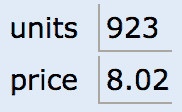


```python
units = 923
price = 8.02
```

When referring to the kind of thing a value represents, we use the word **type**. The type of the "units" cell is integer and the type of "price" is real number (or floating-point number).


```python
type(units)
```


```python
type(price)
```

另一个非常常见的值类型是*字符串*，它实际上是一个字符列表。 我们使用字符串来保存地名，书名和任何其他基于文本的值。 我们可以将字符串视为单个值，因为编程语言隐藏了细节。 字符串可以任意长，编程语言将字符串存储为内存中的字节序列。 每个字符占用一个或两个字节。 换句话说，我们认为它是：


```python
name = "Mary"
```


```python
type(name)
```

但是它更像是：

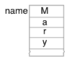

使用 [lolviz](https://github.com/parrt/lolviz) 包，我们可以可视化简单的类型，例如字符串：


```python
from lolviz import *
strviz(name)
```


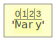


```python
objviz(name) # render as list of char
```


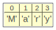


这些基本数据类型：

* 整数
* 浮点数
* 字符串

是我们的基石。 如果我们将其中一些块安排在一起，我们可以创建更复杂的结构。

## 数据结构

### 列表

最常见的*数据结构*是**列表**，它只是一系列存储单元。 因为我们都熟悉电子表格，所以让我们使用电子表格可视化这些数据结构。 电子表格中的列实际上是列表，例如以下整数，浮点数和字符串列表/列：

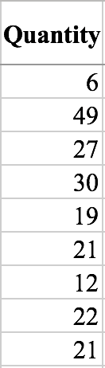

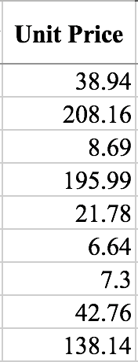

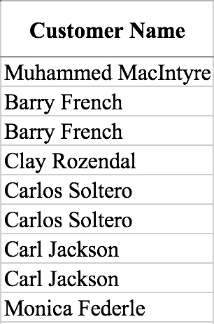


```python
Quantity = [6, 49, 27, 30, 19, 21, 12, 22, 21]
```


```python
type(Quantity)

# list
```

```python
len(Quantity)

# 9
```

```python
objviz(Quantity)
```

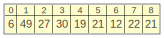

我们也可以将电子表格的行视为列表。 例如，电子表格的标题行实际上是一个字符串列表：

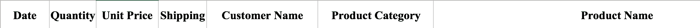


```python
headers = ['Date', 'Quantity', 'Unit Price', 'Shipping']
type(headers)

# list
```

```python
objviz(headers)
```

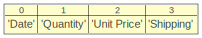

所有这些列表都有一个共同点：元素的类型是相同的。它们是*同构的*。但是，我们也可以使用*异构*元素列表，这通常是我们在电子表格行中看到的：

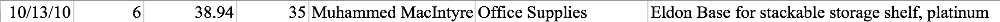


```python
arow = ['10/13/10', 6, 38.94, 35, 'Muhammed MacIntyre']
```

或者：

```python
from datetime import date
arow = [date(2010, 10, 13), 6, 38.94, 35, 'Muhammed MacIntyre']
arow

# [datetime.date(2010, 10, 13), 6, 38.94, 35, 'Muhammed MacIntyre']
```


```python
type(arow)

# list
```

```python
listviz(arow)
```


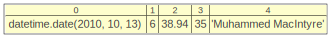

异构列表通常用于对特定实体的信息位进行分组。 在机器学习中，我们称之为**特征向量**，**实例**或**观测**。 例如，苹果与橙子分类器可能具有包含重量（数值），体积（数值）和颜色（字符串）的特征向量。 这里重要的一点是，列表也可以用作聚合特定实体的特征的方法。 元素的顺序不如它们在同一列表中包含（聚合）的事实重要。

### 元组

元组是一个不可变列表，通常用于从函数返回多个值。 它也是一种简单的方法来组合相关元素的数值，例如：

```python
me = ('parrt',607)
me

# ('parrt', 607)
```

我们像使用列表一样索引元素：


```python
print(me[0])
print(me[1])

'''
parrt
607
'''
```

但是，没有办法像列表那样改变元素。 如果我们这样做：

```python
me[0] = 'tombu'
```

结果是个错误：

```
TypeError: 'tuple' object does not support item assignment
```

这是使用多重赋值语句拆分元组的示例：

```python
userid,office = me
print(userid)
print(office)

'''
parrt
607
'''
```

元组是分组相关项的好方法，无需创建正式的 Python 类定义。

### 集合

如果我们强制确保一个规则，列表中的所有元素都是唯一的，那么我们得到一个**集合**。集合是无序的。

```python
ids = {100, 103, 121, 102, 113, 113, 113, 113}
ids

# {100, 102, 103, 113, 121}
```

```python
type(ids)

# set
```


```python
objviz(ids)
```

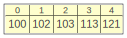

我们可以做很多有趣的集合运算：


```python
{100,102}.union({109})

# {100, 102, 109}
```


```python
{100,102}.intersection({100,119})

# {100}
```

### 表（列表的列表）

电子表格一个接一个地排列行，程序员将其解释为*列表的列表*。在分析或数据库世界中，我们称之为**表**：

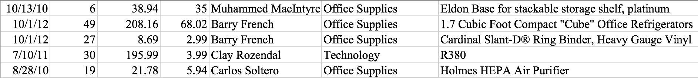

在此示例中，每行代表一个销售交易。

机器学习算法的输入通常是一个表，其中每一行聚合与特定实例或观测相关联的数据。 这些表称为**数据帧**，将成为您的 BFF。

```python
from pandas import DataFrame

df = DataFrame(data=[[99,'parrt'],[101,'sri'],[42,'kayla']],
               columns=['ID','user'])
df
```

|  | ID | user |
| --- | --- | --- |
| 0 | 99 | parrt |
| 1 | 101 | sri |
| 2 | 42 | kayla |

```python
df.values

'''
array([[99, 'parrt'],
       [101, 'sri'],
       [42, 'kayla']], dtype=object)
'''
```


```python
df.columns

# Index(['ID', 'user'], dtype='object')
```

```python
df.user

'''
0    parrt
1      sri
2    kayla
Name: user, dtype: object
'''
```

```python
objviz(df.values)
```

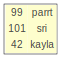


### 矩阵

如果表元素都是数字，我们称之为**矩阵**。 这是一个包含 5 行和 2 列的矩阵：

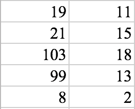

让我向您介绍另一个新的 BFF，`numpy`：

```python
import numpy as np
A = np.array([[19,11],
              [21,15],
              [103,18],
              [99,13],
              [8,2]])
print(A)

'''
[[ 19  11]
 [ 21  15]
 [103  18]
 [ 99  13]
 [  8   2]]
'''
```

这是一个形状为 5 行，2 列的矩阵：

```python
A.shape

# (5, 2)
```


```python
lolviz(A.tolist())
```

有许多方法可以表示或布局事物和内存。在这种情况下，我们可以使用`lolviz`将矩阵视为列表列表：

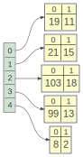

或者作为一个矩阵：

```python
objviz(A)
```

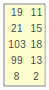

我们可以用`numpy`做很多矩阵数学：

```python
objviz(A+A)
```

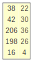


```python
objviz(A*99)
```

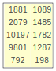

```python
objviz(A.T) #transpose
```

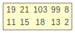

这里是个方程组：$A x = b$, $x = A^{-1} b$:


使用 numpy，我们可以使用 $ A $ 的逆来解决这个问题。

```python
from numpy.linalg import inv
A = np.array([[38, 22], [42, 30]])
b = np.array([3, 5])
x = inv(A).dot(b)
objviz(x)
```


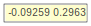

这里有一些东西，关于各种 numpy n 维数组形状：

```python
x = np.array([3, 5])     # vertical vector with 2 rows
y = np.array([[3, 5]])   # matrix with 1 row and 2 columns
z = np.array([[3],[5]])  # matrix with 2 rows, 1 column
print(x.shape)
print(y.shape)
print(z.shape)

'''
(2,)
(1, 2)
(2, 1)
'''
```


元组`(2,)`表示具有 2 个元素的一维向量。 我们不能使用符号`(2)`因为这只是一个表达式而不是一个元组。 这是一个怪癖但是必要的。

### 遍历列表

电子表格模型对于理解数据结构是一个很好的模型，但重要的是要记住计算机一次处理一个元素（数字或字符串）。

作为人类，我们可以完整地查看上面的电子表格或数据结构，但程序必须**遍历**数据结构的元素。这有点像在列表元素上滑动放大镜：

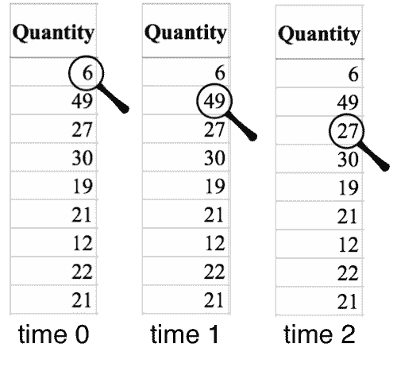

这种遍历的概念抽象为元素的任何**序列**（或**流**），而不仅仅是列表。 例如，我们最终将遍历文本文件的行或从操作系统获得的文件名序列。 序列非常强大，因为它允许我们处理比计算机内存大得多的数据。 我们可以零散地处理数据，而列表则要求所有元素同时存在于内存中。

通常我们使用`for`语句遍历列表的元素：

> 译者注：Python 没有普通的`for`语句，它的`for`就是`foreach`。

```python
for q in Quantity:
    print(q)
    
'''
6
49
27
30
19
21
12
22
21
'''
```

这里，`q`指向的对象的类型是`int`。 我们还可以使用索引的循环来遍历该列表：

```python
for i in range(len(Quantity)):
    print(Quantity[i])
    
'''
6
49
27
30
19
21
12
22
21
'''
```

对于完全适合内存的列表和其他结构，我们经常会发现**反向遍历**有用，它会从后到前检查元素：


```python
for q in reversed(Quantity):
    print(q)
    
'''
21
22
12
21
19
30
27
49
6
'''
```

### 字典

如果我们并排排列两个列表并将它们粘合在一起，我们会得到**字典**。 字典将一个值映射到另一个值，就像现实世界中的字典将单词映射到定义一样。 这是一个示例字典，将电影标题映射到获得奥斯卡奖提名的年份：


```python
{'a':1,'b':3,'hi':45}

# {'a': 1, 'b': 3, 'hi': 45}
```

```python
movies = {'Amadeus':1984, 'Witness':1985}
print(movies)
objviz(movies)

# {'Amadeus': 1984, 'Witness': 1985}
```


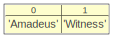

```python
print(movies.keys())
print(movies.values())

'''
dict_keys(['Amadeus', 'Witness'])
dict_values([1984, 1985])
'''
```

遍历字典也很容易，但我们必须决定是否要遍历键或值：

```python
movies = {'Amadeus':1984, 'Witness':1985}
for m in movies: # walk keys
    print(m)

'''
Amadeus
Witness
'''
```


```python
for m in movies.values(): # walk values
    print(m)
    
'''
1984
1985
'''
```


```python
for (key,value) in movies.items():
    print(f"{key} -> {value}")
    
'''
Amadeus -> 1984
Witness -> 1985
'''
```

```python
movies['Amadeus']

# 1984
```


```
movies['foo']
```

获得了`KeyError`：

```
---------------------------------------------------------------------------
KeyError                                  Traceback (most recent call last)
<ipython-input-40-72c06b90f573> in <module>()
----> 1 movies['foo'] # gets a KeyError

KeyError: 'foo'
```

## 总结

这里是一些常用数据类型：

* 整数，例如`-2, 0, 99`
* 实数（浮点数），例如`-2.3, 99.1932`
* 字符串，例如`"Mary", "President Obama"`

以下是常用的数据结构：

* 有序列表
* 集合（只是一个无序的，唯一的列表）
* 列表的列表，例如包含行和列的表或矩阵
* 元组是不可变列表
* 字典，例如将学生姓名映射到他们的学生 ID；我们可以将其视为一个表，其中表中的每一行都将键与值相关联。

请记住，所有变量名实际上都是对内存位置的间接引用。 一切都是指向实现中数据的指针。 这意味着我们可以有两个引用相同内存位置的变量名，因此变量是别名。更改一个变量的元素似乎会更改其他变量元素。

现在我们知道内存中的数据是什么，让我们考虑一下[计算模型](computation.ipynb)。
