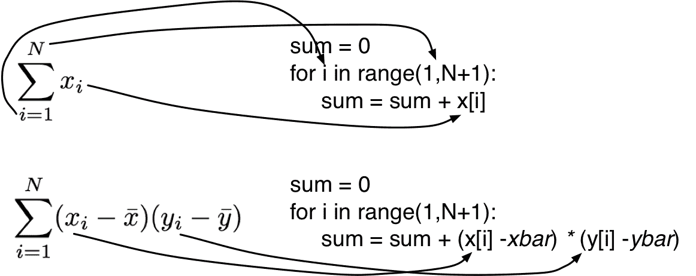

# 2.3 计算模型

> 原文：[Model of Computation](https://github.com/parrt/msds501/blob/master/notes/computation.ipynb)
> 
> 译者：[飞龙](https://github.com/wizardforcel)
> 
> 协议：[CC BY-NC-SA 4.0](http://creativecommons.org/licenses/by-nc-sa/4.0/)


现在我们知道计算机如何在内存中存储数据，我们需要对计算机如何处理数据有基本的了解。 让我们探索一下计算机可以执行的最简单，细粒度的操作。 最终，我们将从这些操作中抽取设计模式。程序员考虑高级操作，例如*映射*，*搜索*或*过滤*，但是我们的手指键入与这些高级操作相关联的细粒度代码模式。

## 规范处理器操作

我们在[在内存中表示数据](data-in-memory.ipynb)中看到，在处理器处理数据时计算机的内存暂时保存数据。 我们通常将数据从磁盘加载到内存中，并将其组织成适合我们想要执行的计算的结构。 但最后，内存只保存数据。 所有操作都发生在计算机处理器（CPU）中，它执行五个主要操作：

* 将小块数据从内存加载到 CPU 中
* 对 CPU 中的数据执行算术计算
* 将小块数据存储回内存
* 跳转到新位置（这是我们的循环方式）
* 如果条件为真，则跳转到新位置

处理器执行低级*机器指令*，它执行一个或多个主要操作。 每条指令都做了很少的工作（比如相加两个数字），但处理器可以非常快速地完成它们，大约数十亿个每秒。在这些低级机器指令中编写程序将非常繁琐，因此我们通常使用 Python 等编程语言来简化我们的工作。

为了让您了解这些低级别的机器操作，请考虑以下简单赋值语句。

```python
total = cost + tax
```

即使是这么简单的事情也需要处理器执行多个低级指令。处理器必须在内存中查看`"cost"`和`"tax"`的值，相加这两个值，然后将结果存储到内存中与`"total"`相关联的地址。

### 操作顺序

除非相反地给出，否则处理器一个接一个地执行指令。 例如，给定以下伪代码序列，处理器将执行赋值语句，然后执行打印。

```python
cost = 100.0
tax = 8.1
total = cost + tax
print(total)

# 108.1
```


使用食谱烹饪时，我们熟悉按顺序执行一系列操作的概念。例如，食谱可能会指导我们：

*   *将食材放入碗中*
*   *将成分混合在一起*
*   *倒入烤盘*
*   *以 375 度烘烤 40 分钟*

我们自然地假设步骤按执行顺序给出。

## 条件执行

一些食谱给出了条件指令，例如

*如果不够甜，加一些糖*

类似地，处理器可以有条件地执行一个或一组操作。

```python
x = -3
if x<0:
    x = 0
    print("was negative")
print(x)

'''
was negative
0
'''
```

仅当条件表达式为真时才执行条件运算。 **为清楚起见，处理器不执行程序中存在的所有操作**。

将现实问题映射到条件语句时，您的目标是识别以下关键元素：

1. 条件表达式
1. 如果它为真，所执行的操作

条件执行的模板如下所示：

```py
if condition:
    operation 1
    operation 2
    ...
```

该条件必须可由计算机操作。例如，条件“*猫饿了*”不可由计算机操作，因为计算机无法在其内存中测试任何等同于猫饿了的内容。条件几乎总是由算术的相等或关系运算符组成，例如`cost > 10`，`cost + tax < 100`或`quantity == 4`。

是时候引入一种新的数据类型：**布尔值**，它包含`true`和`false`值。 任何相等或关系运算符的结果（值）都是布尔值。 例如，“3 > 2”的计算结果为`true`，`3 > 4`的计算结果为`false`。

在某些情况下，我们希望在任何一种情况下执行操作，如果条件为真，则执行一次操作，如果条件为假，则执行不同的操作。 例如，我们可以表达一个条件运算，来找到两个值`x`和`y`中的较大值，如下：

```python
x = 99
y = 210
if x > y: max = x
else: max = y
print(max)

# 210
```

条件执行有点像执行零次或一次操作，具体取决于条件表达式。 在某些情况下，我们还需要多次执行操作。

## 重复执行

您将要做的大部分编程都涉及将操作应用于数据，这意味着逐个操作数据元素。这意味着我们需要能够重复指令，但我们很少使用这样的低级构造：`while condition`，做某些事情。例如，我们很少想要打印五次`hello`：

```python
for i in range(5):
    print("Hello")
    
'''
Hello
Hello
Hello
Hello
Hello
'''
```

（`range(n)` 从 0 到 `n-1`）

另一方面，在满足条件之前一直存在的通用循环可能很有用，例如“从网络读取数据，直到数据停止”。 或者，我们可以进行计算，例如以下对`log 10`的粗略近似：

```python
n = 1000
log = 0
i = n
while i > 1:
    log += 1
    print(i)
    i = i / 10
print(f"Log of {n} is {log}")

'''
1000
100.0
10.0
Log of 1000 is 3
'''
```

但是，大多数情况下，我们正在扫描数据，这意味着“对于每个循环”或“为循环而索引”。

### For-each 循环

`for-each`循环*遍历一系列元素（例如列表）*但可以是任何可迭代对象，例如磁盘上的文件。 这是您将使用的最常见的循环。这是模版：

```py
for x in iterable_object:
    process x in some way
```

例如：


```python
for name in ['parrt', 'mary', 'tombu']:
    print(name.upper())
    
'''
PARRT
MARY
TOMBU
'''
```

我们也可以迭代更复杂的对象，例如下面的 numpy 矩阵：

```python
import numpy as np
A = np.array([[19,11],
              [21,15],
              [103,18],
              [99,13],
              [8,2]])
for row in A:
    print(row)
    
'''
[19 11]
[21 15]
[103  18]
[99 13]
[8 2]
'''
```

或者甚至是数据帧：


```python
from pandas import DataFrame

df = DataFrame(data=[[99,'parrt'],[101,'sri'],[42,'kayla']],
               columns=['ID','user'])
df
```

| ID | user |
| --- | --- |
| 0 | 99 | parrt |
| 1 | 101 | sri |
| 2 | 42 |


```python
for row in df.itertuples():
    print(f"Info {row.ID:04d}: {row.user}")
    
'''
Info 0099: parrt
Info 0101: sri
Info 0042: kayla
'''
```

一个有用的 Python 魔术为我们提供迭代索引以及迭代值：

```python
for i,row in enumerate(A):
    print(f"{i+1}. {row}")
    
'''
1. [19 11]
2. [21 15]
3. [103  18]
4. [99 13]
5. [8 2]
'''
```

```python
# same as the enumerate
i = 1
for row in A:
    print(f"{i}. {row}")
    i += 1
    
'''
1. [19 11]
2. [21 15]
3. [103  18]
4. [99 13]
5. [8 2]
'''
```

使用此代码模式，我们的目标是找到一个命名良好的迭代变量，识别条件，然后识别要重复的操作。

### 索引循环

执行索引循环有时很有用。 当我们必须同时遍历多个列表时，这些非常有用。 例如，如果我们有名称和他们的电话号码的列表，我们可能想要使用索引循环：

```python
names = ['parrt', 'mary', 'tombu']
phones = ['5707', '1001', '3412']
for i in range(len(names)):
    name = names[i]
    phone = phones[i]
    print(f"{name:>8}: {phone}")
    
'''
parrt: 5707
mary: 1001
tombu: 3412
'''
```


### zip 循环

以下是大牛们不使用索引循环（使用`foreach`），做同样的事情的方式：

```python
for name, phone in zip(names,phones):
    print(f"{name:>8}: {phone}")
    
'''
parrt: 5707
mary: 1001
tombu: 3412
'''
```

```python
for i, (name, phone) in enumerate(zip(names,phones)):
    print(f"{i}. {name:>8}: {phone}")
    
'''
0.    parrt: 5707
1.     mary: 1001
2.    tombu: 3412
'''
```


## 列表推导式

```python
names = ['parrt', 'mary', 'tombu']
[name.upper() for name in names]

# ['PARRT', 'MARY', 'TOMBU']
```

```python
[name for name in names] # make (shallow) copy of list

# ['parrt', 'mary', 'tombu']
```


```python
[name for name in names if name.startswith('m')]

# ['mary']
```

```python
[name.upper() for name in names if name.startswith('m')]

# ['MARY']
```

```python
Quantity = [6, 49, 27, 30, 19, 21, 12, 22, 21]
[q*10 for q in Quantity]

# [60, 490, 270, 300, 190, 210, 120, 220, 210]
```

```python
Quantity2 = [6, 49, 0, 30, -19, 21, 12, 22, 21]
[q*10 for q in Quantity2 if q>0]

# [60, 490, 300, 210, 120, 220, 210]
```


```python
# Find indexes of all values <= 0 in Quantity2
[i for i,q in enumerate(Quantity2) if q<=0]

# [2, 4]
```

```python
[f"{name}: {phone}" for name, phone in zip(names,phones)]

# ['parrt: 5707', 'mary: 1001', 'tombu: 3412']
```

## 转换公式

来自数学的 Sigma 符号以直接的方式转换为索引循环。例如：

 

我们从求和中选取元素并将它们插入模板中来获得索引循环。

## 练习

**练习**：给定一个包含十进制数字的字符串，例如`s ="501"`，将该数字转换为整数并打印出来。 从期望的结果`n`反着做一遍。 回想一下`501 = 5 * 100 + 0 * 10 + 1 * 1`。 从最简单的 Python 结构开始，然后使用 Python 中的任何强大结构整理它。 提示：大牛最终会使用“霍纳法则”。如果字符串为空会发生什么？ 你不能使用`int('501')`但你需要在单个数字上使用`int('5')`。

**练习**：重用该模式将包含二进制数字的字符串（例如`s ="1101"`）转换为整数`n`，并将其打印出来。`1101`二进制是十进制的 13。 1101 是$`1 * 2 ^ 3 + 1 * 2 ^ 2 + 0 * 2 ^ 1 + 1 * 2 ^ 0`。

**练习**：给定两个列表，例如`a = [9,3]`和`b = [1,4,10]`，创建并打印一个新列表`c`，包含来自输入列表的交替元素。 在这种情况下，输出将是“[9,1,3,4,10]”。首先假设相同数量的元素，然后尝试更一般的情况。 如果一个或两个列表都是空的，会发生什么？

**练习**：Python 有一个名为`zip(a, b)`的内置函数，它是一种方便的方法，可以获得元组列表，元组包含列表`a`和`b`中元素。 例如，如果`a = [9,3]`和`b = [1,4,10]`，`zip(a, b)`给出一系列元组`(9, 1), (3, 4)`。 内置的`zip`在其中一个列表没有元素时停止，但是我们想用`None`填充缺少的元素：你应该得到输出列表`c = [(9, 1), (3, 4), (None, 10)]`。 在本练习中，我们使用上一个练习中的想法甚至代码本身来实现您自己的`zip`函数。 唯一的区别是你应该用`None`填充缺少的元素。

如果你卡住了，或者只是检查你的答案，你可以查看[我的答案](https://github.com/parrt/msan501/blob/master/notes/code/computation.py)。

## 总结

除了与存储器的传输数据之外，处理器主要执行算术运算，例如`cost + tax`。 处理器还可以有条件地或重复地执行操作。

将现实问题映射到伪代码时，您将遵循程序或函数的工作计划，并最终从所需结果反向工作，来确定合适的操作序列。 这些操作将映射到我们的高级[编程操作](operations.md)或这里描述的低级伪代码模式。

如果无法为某个问题确定更高级别的操作，请尝试将其映射到条件操作或一个或多个操作的循环。

对于条件，您必须弄清条件布尔表达式以及应有条件地执行的操作：

```py
if condition:
    operation 1
    operation 2
    ...
```

如果您需要在条件失败时执行代码，请使用以下模板：

```py
if condition:
    operation 1
    operation 2
    ...
else:
    operation 1
    operation 2
    ...
```

对于重复执行，我们有一个通用循环，在满足条件时执行一个或多个操作：

循环设置，通常是初始计数器或循环中更新的值。

```py
while condition:
    operation 1
    operation 2
    ...
```

一个非常常见的循环版本遍历一个序列，例如一个列表，其中一个变量一次接受一个序列的每个值：

```py
for x in sequence:
    operate on x
```

在同时迭代多个列表时，我们使用索引列表的形式：

```py
for i in some integer_set or range:
    operation 1
    operation 2
    ...
```
