# 2.4 Python 中的编程模式

> 原文：[Programming Patterns in Python](https://github.com/parrt/msds501/blob/master/notes/python-patterns.ipynb)
> 
> 译者：[飞龙](https://github.com/wizardforcel)
> 
> 协议：[CC BY-NC-SA 4.0](http://creativecommons.org/licenses/by-nc-sa/4.0/)


现在我们已经了解了计算机如何组织数据，并进行一些低级编程操作，现在让我们看一些常见的高级编程模式。 每一个这些操作都有一个使用条件和循环模式的实现，我们可以使用 python 语法很容易地表达。我们也可以使用现有的库函数来实现相同的功能，我们也将探索它们。

当我们进行时，你会发现程序设计和编程是一个单词关联的游戏。 高级操作（例如`map`）应该在您的脑海中触发伪代码（类似英语的“代码”）的循环模板，然后应该触发`for-each` Python 代码模板。

*请记住*，我们通过选择和应用操作来设计程序，而不是特定的代码序列。编程是设计过程中的最后一步，我们在这里获得可执行文档。因此，直观地思考如何操作数据列表，或从数据中提取信息。我经常把事情画出来或者把它们放到电子表格中，来帮助我想象。在纸上手动移动一些数据有助于我理解要执行的操作。

在设计了高级操作的序列或组合之后，我们可以用伪代码或直接使用 Python 语法来写出东西。随着您获得更多经验，从操作直接转到代码将更容易，但我们仍然在使用操作而不是代码来设计程序。对于复杂的问题，尽管有 35 年以上的编程经验，我仍然写出伪代码。

## 编程模式

选择程序的整体计划时，程序员从一组模式或模板中提取。个别行动本身也是如此。程序员有一个常见操作目录，他们在选择计划步骤时依赖他。

毫无疑问，您熟悉以下操作：

* *求和列表中的数字*
* *计数列表中的数字*

但我们可以将这些进一步抽象为：

* *查找满足条件的列表中的所有值*
* *对列表中的每个元素应用操作*
* ......

操作越抽象，它就越广泛适用。我们使用的操作类型部分取决于程序员的风格，但很大程度上受编程语言的能力及其预先存在的功能库的影响。

## 数据练习

在我们浏览这些材料时，我们将做几个小练习。 请将此 Python 代码剪切并粘贴到您正在使用的笔记本中。

请尝试在不查看练习描述正下方的解决方案的情况下进行练习。

```python
UnitPrice = [38.94, 208.16, 8.69, 195.99]
Shipping = [35, 68.02, 2.99, 3.99, 5.94, 4.95, 7.72, 6.22]
names=['Xue', 'Mary', 'Bob']
Oscars = [
    [1984, "A Soldier's Story", 0],
    [1984, 'Places in the Heart', 0],
    [1984, 'The Killing Fields', 0],
    [1984, 'A Passage to India', 0],
    [1984, 'Amadeus', 1],
    [1985, "Prizzi's Honor", 0],
    [1985, 'Kiss of the Spider Woman', 0],
    [1985, 'Witness', 0],
    [1985, 'The Color Purple', 0],
    [1985, 'Out of Africa', 1]
]
Quantity = [6, 49, 27, 30, 19, 21, 12, 22, 21]
A = [
    [1, 3, 10],
    [4, -9, 0],
    [2, 5, 8]
]
B = [
    [7, 4, 0],
    [4, 3, 1],
    [1, 6, 8]
]
first=['Xue', 'Mary', 'Robert']
last=['Li', 'Smith', 'Dixon']
```

## 累积

让我们从一个非常简单但非常常见的模式开始，称为累积。该模式遍历一系列元素并累积一个值。例如，为了对序列中的数字求和，我们使用带有`+`运算符的累加器运算。当我们遍历序列时，我们更新一个初始化为 0 的流动总和：

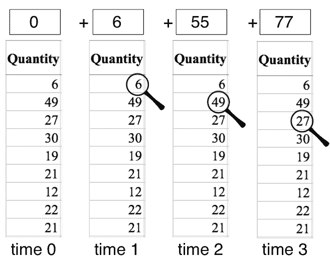

在 Excel 中，这就像在单元格中使用`sum(...)`。在 Python 中，这种模式的实现有一个初始化步骤和一个循环：

```python
sum = 0
for q in Quantity:
    sum += q # same as: sum = sum + q
print(sum)

# 207
```

我们可以使用我们想要的任何其他算术运算符，例如`*`。实际上，我们可以使用任何带有两个操作数并返回新值的函数。 对于求和，函数的两个“输入”数字是先前的累计值和序列中的下一个值。该函数的结果是新的累计值。`+`和`*`是最常见的运算符。

您还将在 Hadoop 和 Spark 的分布式计算世界中，看到这个名为`reduce`（归约）的操作，就像`map/reduce`那样。

**计数器**是累加器的一种特殊情况，它计算序列中元素的数量。它还使用`+`运算符，但两个“输入”数字是先前的累计值和固定的值 1，而不是序列中的下一个元素。

我们可以更新多个流动的累计值，而不只是一个。例如，假设我们想要计算序列中偶数和奇数值的数量。我们需要两个累加器，从零开始，但操作是相同的：

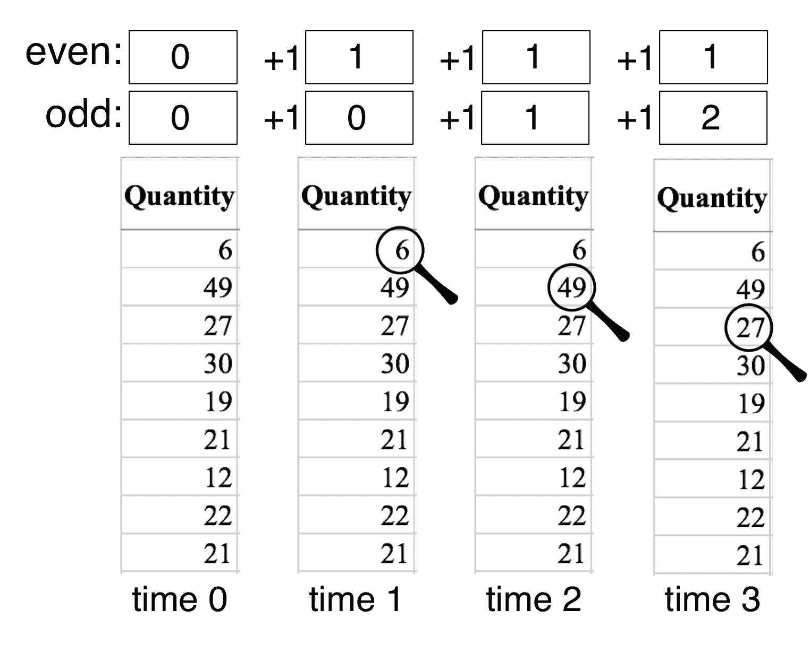

`+1`表示每一步应用的“向累加值加 1”的操作，但仅在当前值为偶数或奇数时才应用。在 Python 代码中，我们将执行以下操作：

```python
even = 0
odd = 0
for q in Quantity:
    if q % 2 == 0: even += 1 # % is mod operator
    else: odd += 1
print(even, odd)

# 4 5
```


## 映射

也许最常见的操作是，将一个序列映射到另一个序列，将运算符或函数应用于每个元素。（它就像一个累加器，它累积了一个项目列表，而不是一个单独的值。）例如，使用电子表格创建一个新列，包含 5% 折扣的单价，在电子表格中如下所示：

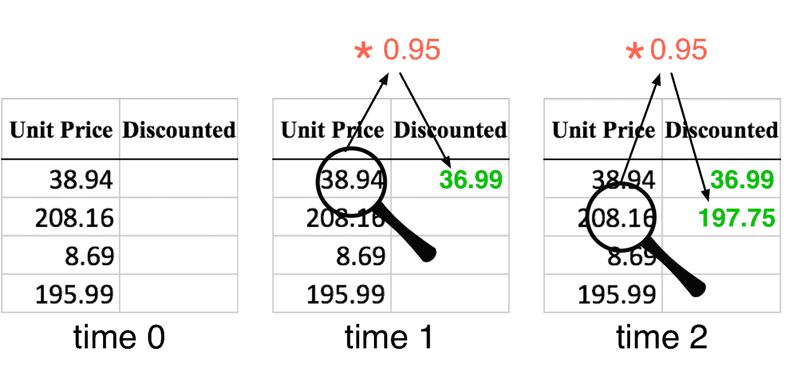

我们可以使用列表字面值，在时间 0 处表示两个列表：

```python
UnitPrice = [38.94, 208.16, 8.69, 195.99]
Discounted = [] # empty list
```

换句话说：

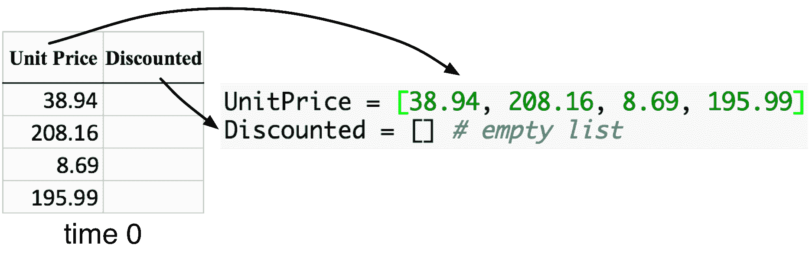

从高级操作到伪代码到代码，我们头脑中的翻译过程是*单词关联*游戏。当你的大脑看到将一列数据映射到另一个数据的操作时，请考虑“映射”。当你的大脑听到“映射”，它应该生成适当的伪代码循环，适当地填充片段。当你的大脑听到“对于每个等等等等”时，请考虑“哦，for-each 循环”并使用适当的编程模式：

```python
Discounted = [] # empty list
for price in UnitPrice:
    Discounted.append(price * 0.95)
print(Discounted)

# [36.992999999999995, 197.75199999999998, 8.2555, 186.1905, 20.691, 6.308, 6.935, 40.62199999999999, 131.23299999999998]
```

请注意，我已将空列表的初始化包含在此代码段中。原因是我们真的想在心理上，将初始化与此代码模式相关联。

即使在微观层面，也要考虑将操作映射到代码。例如，当我想到“将`x`添加到列表`y`”时，我的大脑会将其转换为`y.append(x)`。

### 用于映射操作的列表推导式

这是一种常见的模式，Python 有一个显式结构，使事情变得更容易。它被称为*列表推导式*，它实际上只是简写，看起来更像数学集符号：

```python
Discounted = [price * 0.95 for price in UnitPrice] # a list comprehension
print(Discounted)

# [36.992999999999995, 197.75199999999998, 8.2555, 186.1905, 20.691, 6.308, 6.935, 40.62199999999999, 131.23299999999998]
```


### 练习

在不查看我们刚才所做的代码的情况下，尝试使用列表推导来为映射操作编写代码，该列表推导将价格除以 2，再次将值放在`Discounted`中。**不要剪切/粘贴。输入它！**

```python
Discounted = [price/2 for price in UnitPrice] # a list comprehension
print(Discounted)

# [19.47, 104.08, 4.345, 97.995]
```


### 练习

给定一个名称列表，`['Xue', 'Mary', 'Robert']`，用代码实现一个映射操作，将名称转换为`namelens`列表，它包含名称长度。提示：函数调用`len('Xue')`返回 3。**不要剪切/粘贴。输入它！**

```python
names = ['Xue', 'Mary', 'Robert']
namelens = [len(name) for name in names]
print(namelens)

# [3, 4, 6]
```


## 组合

让我们看一下代码模式，一次遍历两个列表，将结果放在第三个列表中。例如，要计算销售交易的成本，我们将数量乘以单位价格。在电子表格中，如下所示：

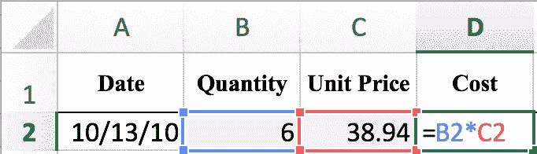

将该公式拖到“成本”列中，将公式应用于以下行，从而填充新列。

以编程方式，我们正在做的是将两个不同的序列的*第 i 个*元素相乘，并将结果放在输出序列的*第 i 个*位置：

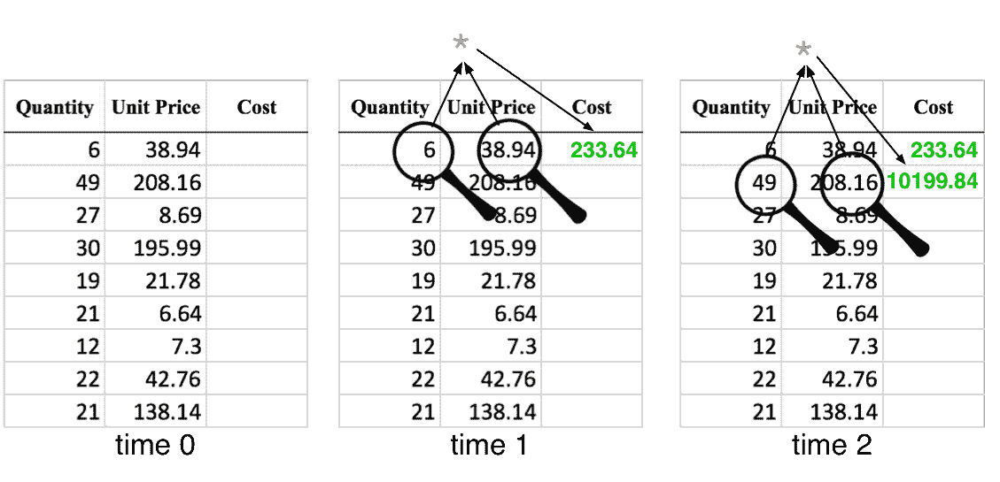

一开始，我们有以下数据：

```python
Quantity = [6, 49, 27, 30, 19, 21, 12, 22, 21]
UnitPrice = [38.94, 208.16, 8.69, 195.99, 21.78, 6.64, 7.3, 42.76, 138.14]
```

遍历多个列表时，我们通常需要使用索引循环而不是 for-each 循环：

```python
Cost = []
for i in range(len(Quantity)): # from 0 to length of Quantity-1, inclusively
    Cost.append( Quantity[i] * UnitPrice[i] )
print(Cost)

# [233.64, 10199.84, 234.63, 5879.700000000001, 413.82000000000005, 139.44, 87.6, 940.7199999999999, 2900.9399999999996]
```


### 用于组合操作的列表推导式

或者，更好的是，使用列表推导式：

```python
Cost = [Quantity[i] * UnitPrice[i] for i in range(len(Quantity))]
print(Cost)

# [233.64, 10199.84, 234.63, 5879.700000000001, 413.82000000000005, 139.44, 87.6, 940.7199999999999, 2900.9399999999996]
```

格式化技巧：

```python
f"{3.14159:.2f}"

# '3.14'
```


```python
[f"{c:.2f}" for c in Cost]

'''
['233.64',
 '10199.84',
 '234.63',
 '5879.70',
 '413.82',
 '139.44',
 '87.60',
 '940.72',
 '2900.94']
'''
```


```python
[round(c,2) for c in Cost]

# [233.64, 10199.84, 234.63, 5879.7, 413.82, 139.44, 87.6, 940.72, 2900.94]
```

请注意，您可能想在列表推导中使用两个`for`循环，但是您可能获得数量的每个值和价格的每个值的叉乘。这不是我们想要的，正如你在这里看到的：

```python
print( [q*p for q in Quantity for p in UnitPrice] ) # WRONG!

'''
[233.64, 1248.96, 52.14, 1175.94, 130.68, 39.839999999999996, 43.8, 256.56, 828.8399999999999, 1908.06, 10199.84, 425.81, 9603.51, 1067.22, 325.35999999999996, 357.7, 2095.24, 6768.86, 1051.3799999999999, 5620.32, 234.63, 5291.7300000000005, 588.0600000000001, 179.28, 197.1, 1154.52, 3729.7799999999997, 1168.1999999999998, 6244.8, 260.7, 5879.700000000001, 653.4000000000001, 199.2, 219.0, 1282.8, 4144.2, 739.8599999999999, 3955.04, 165.10999999999999, 3723.8100000000004, 413.82000000000005, 126.16, 138.7, 812.4399999999999, 2624.66, 817.74, 4371.36, 182.48999999999998, 4115.79, 457.38, 139.44, 153.29999999999998, 897.9599999999999, 2900.9399999999996, 467.28, 2497.92, 104.28, 2351.88, 261.36, 79.67999999999999, 87.6, 513.12, 1657.6799999999998, 856.68, 4579.5199999999995, 191.17999999999998, 4311.780000000001, 479.16, 146.07999999999998, 160.6, 940.7199999999999, 3039.08, 817.74, 4371.36, 182.48999999999998, 4115.79, 457.38, 139.44, 153.29999999999998, 897.9599999999999, 2900.9399999999996]
'''
```

### `zip`函数

我们也可以使用`zip`，这是一个非常有用的函数，它从每个列表中提取一个值，以便在每次迭代时生成一个元组：

```python
Cost = []
for q,u in zip(Quantity,UnitPrice):
    Cost.append( q * u )
print(Cost)

# [233.64, 10199.84, 234.63, 5879.700000000001, 413.82000000000005, 139.44, 87.6, 940.7199999999999, 2900.9399999999996]
```

或者，使用列表推导式：

```python
Cost = [q * u for q,u in zip(Quantity,UnitPrice)]
print(Cost)

# [233.64, 10199.84, 234.63, 5879.700000000001, 413.82000000000005, 139.44, 87.6, 940.7199999999999, 2900.9399999999996]
```


## 分割

组合的反面是分割，我们将流拆分为两个或更多个新的流。 例如，我经常需要将列表中的全名拆分为它们的名字和姓氏。 在电子表格中，我们创建一个空白列：

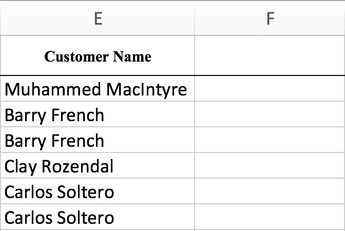

然后按空格字符拆分（在 Excel 中，使用`Data > Text to Columns`）获得两个新列：

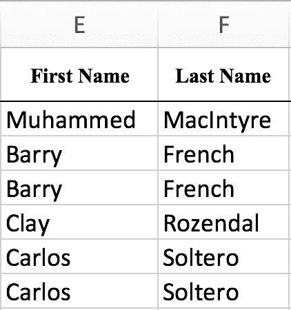

我们可以使用*组合*操作与字符串连接运算符“撤消”此拆分，该操作符将名字和姓氏组合成一个包含全名的新流。

拆分的另一个常见用途是接受表示一串数字的字符串，并将其拆分为包含这些数字的列表：

```python
'1 2 3'.split(' ')

# ['1', '2', '3']
```

```python
'1 2    3'.split(' ')

# ['1', '2', '', '', '', '3']
```

```python
values = '1 2 3'.split(' ')
[int(v) for v in values]

# [1, 2, 3]
```

我们甚至可以遍历列表来获得矩阵（列表的列表）

```python
rows = [
    '1 2 3',
    '3 4 5'
]
matrix = [[int(v) for v in row.split(' ')] for row in rows]
matrix

# [[1, 2, 3], [3, 4, 5]]
```

```python
from lolviz import *
objviz(matrix)
```

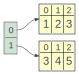

## 切片

到目前为止，我们检查过的大多数操作，都会产生与输入序列大小相同的列表或序列，但是有许多操作会产生数据的子集。第一个这样的操作是`slice`，它提取列表的子集。（同样，在这里我明确使用术语“列表”，来指示切片通常作用在适合内存的数据结构上。）

切片操作是两个值的函数，列表中的开始和结束位置。

```python
names=['Xue', 'Mary', 'Bob']
print(f"Length {len(names)}")
print(names[0:1])
print(names[0:2])
print(names[0:3])
print(names[2:3])

'''
Length 3
['Xue']
['Xue', 'Mary']
['Xue', 'Mary', 'Bob']
['Bob']
'''
```

**警告**：大多数语言和库假设结束切片位置是排除的，这意味着在这种情况下切片从位置 0 到位置 3。 为了使事情变得更复杂，Python 而不是 R，从 0 开始计数而不是 1。在这方面很难在 Python 和 R 之间来回切换，因此最好在这里强调一下，以便记住它。

## 过滤

用于从列表或序列中提取数据的最常用操作称为*过滤*。 例如，使用 Excel 的过滤机制，我们可以对`Shipping`列过滤少于 10 美元的值：

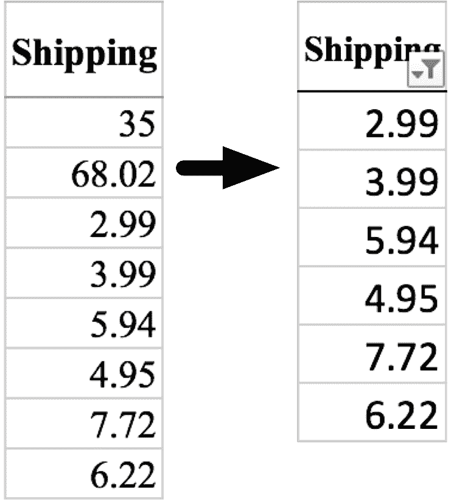

过滤操作类似于映射操作，因为计算应用于输入流的每个元素。映射将一个函数应用于序列的每个元素，并创建一个相同大小的新序列。过滤用特定条件测试每个元素，如果为真，则将该元素添加到新序列。

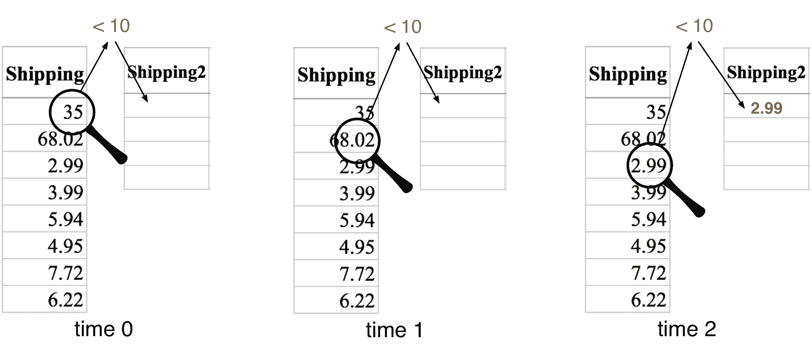

过滤操作只是一个映射，有条件地将元素添加到目标列表：

```python
Shipping = [35, 68.02, 2.99, 3.99, 5.94, 4.95, 7.72, 6.22]
Shipping2 = []
for x in Shipping:
    if x < 10:
        Shipping2.append(x)
print(Shipping2)

# [2.99, 3.99, 5.94, 4.95, 7.72, 6.22]
```


### 用于过滤操作的列表推导式

但是，我们应该使用推导式理解的变体，我们在映射操作模式中看到它：

```python
Shipping2 = [x for x in Shipping if x < 10]
print(Shipping2)

# [2.99, 3.99, 5.94, 4.95, 7.72, 6.22]
```

我们也可以过滤一列，但将每行中的数据保持在一起。这是一个使用 Excel 的例子，它从被提名者列表中过滤奥斯卡获奖者（条件是*`winner`等于 1*）：

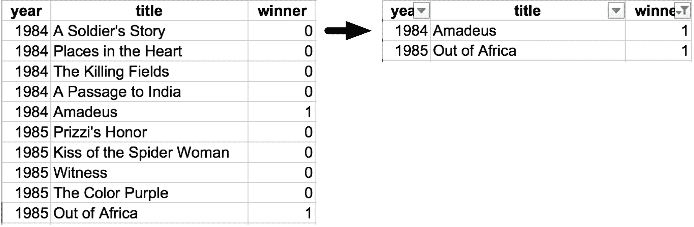

```python
Oscars = [
    [1984, "A Soldier's Story", 0],
    [1984, 'Places in the Heart', 0],
    [1984, 'The Killing Fields', 0],
    [1984, 'A Passage to India', 0],
    [1984, 'Amadeus', 1],
    [1985, "Prizzi's Honor", 0],
    [1985, 'Kiss of the Spider Woman', 0],
    [1985, 'Witness', 0],
    [1985, 'The Color Purple', 0],
    [1985, 'Out of Africa', 1]
]
objviz(Oscars)
```

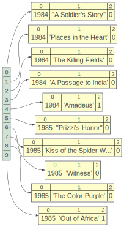

循环结构的代码看起来像（直接跳到列表推导式形式）：

```python
Oscars2 = [movie for movie in Oscars if movie[2]==1]
print(Oscars2)
objviz(Oscars2)

# [[1984, 'Amadeus', 1], [1985, 'Out of Africa', 1]]
```

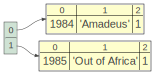

输出是列表的列表，每个电影为一行的过滤表。

注意我们如何测试`movie [2]`行中的一个列值，但是将整行添加到新表中。 如果我们只是将`winner`列值添加到新列表中，我们最终会得到一个列表：`1, 1, 1, ..., 1`。

### 练习

将`Oscars`列表中，所有具有 3 个单词的标题的电影，过滤为`Oscars2`。 要将字符串分成单词列表，请使用`title.split('')`。如果该列表的长度“len()”为3，则将整行复制到`Oscars2`。

```python
Oscars2 = [movie for movie in Oscars if len(movie[1].split(' '))==3]
print(Oscars2)

# [[1984, "A Soldier's Story", 0], [1984, 'The Killing Fields', 0], [1985, 'The Color Purple', 0], [1985, 'Out of Africa', 1]]
```

### 练习

我们还可以在列表推导中使用表达式，而不仅仅是引用迭代值`x`。如果少于 10 美元，请使用列表推导的过滤变体，将`Shipping`中的运费加倍。将结果放在列表`Shipping2`中。

```python
Shipping2 = [x*2 for x in Shipping if x < 10]
print(Shipping2)

# [5.98, 7.98, 11.88, 9.9, 15.44, 12.44]
```


### 练习

给出列表`names=['Xue', 'Mary', 'Bob']`，对于那些以`X`开头的名字，将列表过滤为`names2`。 回想一下`name [i]`在`name`中产生第`i`个字符。或者使用`name.startswith(...)`。

```python
names=['Xue', 'Mary', 'Bob']
names2 = [name for name in names if name.startswith('X')]
print(names2)

# ['Xue']
```


## 搜索

过滤操作查找序列中满足特定条件的所有元素，但通常我们想知道哪个元素首先（或最后）满足条件。（或者，我们通常只需要知道是否存在特定元素。）这将我们带到*搜索*操作。最常见的是，搜索返回序列中的第一个（或最后一个）位置，而不是该位置的值。如果我们有位置，通常称为*索引*，我们总是可以请求序列中该位置的值。如果未找到该元素，则搜索返回无效索引`-1`。

在某种意义上，搜索是过滤的变体。不同之处在于，我们在找到条件为真的元素时所做的事情。搜索不再将该元素添加到目标列表中，而是退出循环。

```python
first=['Xue', 'Mary', 'Robert']     # our given input
target = 'Mary'                     # searching for Mary
index = -1
for i in range(len(first)):         # i is in range [0..n-1] or [0..n)
    if first[i]==target:
        index = i
        break
print(index)

# 1
```

无论循环类型如何，`break`语句都会打破闭合的循环。

搜索操作甚至可以在字符串（字符列表）中使用，来找到感兴趣字符的位置。 例如，要将全名切割为名字和姓氏，我们可以将搜索空格字符与两个切片操作组合在一起。 给定全名`Xue Li`，搜索空格字符将返回第四个位置或索引 3。要提取第一个名称，我们将从索引 0 切片到索引 3，仅排除右侧。 为了获得姓氏，我们从索引 4 切换到 6，仅排除右侧。


这就是  python 的样子：

```python
name = 'Xue Li'

# SEARCH
index = -1
for i in range(len(name)):
    if name[i]==' ':
        index = i
        break
print(f"Index of space is {index}")

# SLICE
print(f"First: {name[0:index]}")
print(f"Last: {name[index+1:]}") # or name[index+1:len(name)]

'''
Index of space is 3
First: Xue
Last: Li
'''
```

为了确定字符串结尾的索引，程序员倾向于使用字符串的长度。长度可以是一个索引，其值是字符串末尾的后一个值，这是使用排除性右索引时，我们想要用于切片的。

## 嵌套循环

我们有时需要重复重复的指令，我们称之为*嵌套循环*。在分析领域，嵌套循环非常重要，因为我们使用嵌套循环来处理矩阵，图像和数据表。

### 处理矩阵

回想一下，虽然我们人类可以同时查看整个矩阵，但计算机会逐个检查每个元素。 看看这个 3x3 矩阵：

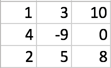

我们可以使用列表的列表在 python 中表示：

```python
A = [
    [1, 3, 10],
    [4, -9, 0],
    [2, 5, 8]
]
```

因为这不是一维数据结构，所以我们不能使用简单的“对于矩阵中的每个元素”循环来检查每个元素。 迭代`nrows x ncols`矩阵的所有元素的最常见模式如下所示：

```py
for i in 0..nrows-1:
    for j in 0..ncols-1:
        do something with matrix[i,j]
```

其中`matrix[i, j]`访问行`i`和列`j`的元素。 这样的嵌套循环给出了`i`和`j`的所有可能组合，这是我们在矩阵上操作时所需要的。考虑以下该模板到 Python 的转换，打印出所有二维索引：

```python
nrows = 3  # or len(A)
ncols = 3  # or len(A[0]) length of first row
for i in range(nrows):
    for j in range(ncols):
        print( i, j )
        
'''
0 0
0 1
0 2
1 0
1 1
1 2
2 0
2 1
2 2
'''
```

注意列`j`值如何比行`i`值变化得更快。我们可以通过改变循环次序来反转这种遍历顺序：

```python
for j in range(ncols):
    for i in range(nrows):
        print(i, j)
'''
0 0
1 0
2 0
0 1
1 1
2 1
0 2
1 2
2 2
'''
```

`j`循环在外部，它的变化速度比内部`i`循环慢。

### 用于获得所有组合的双重`for`列表推导

列表推导中的双重循环给出了所有组合，在这种情况下是我们想要的。以下代码示例创建坐标的字符串表示的列表：

```python
coords = [f"{i},{j}" for i in range(nrows) for j in range(ncols)]
print(coords)

# ['0,0', '0,1', '0,2', '1,0', '1,1', '1,2', '2,0', '2,1', '2,2']
```


现在，让我们使用累加器来求和 3x3 矩阵的所有元素，我们让`nrows = 3`和`ncols = 3`并使用加法运算：

```python
sum = 0
for i in range(nrows):
    for j in range(ncols):
        sum = sum + A[i][j]
print(sum)

# 24
```


### 处理图像

在这个课程的图像项目中，我们为图像做了很多有趣的事情。 图像只不过是二维矩阵，其条目是从 0 到 255 的像素灰度值。像素值 0 是黑色而 255 是白色。 例如，如果我们放大图像，我们会看到二维矩阵的各个元素（称为像素）：

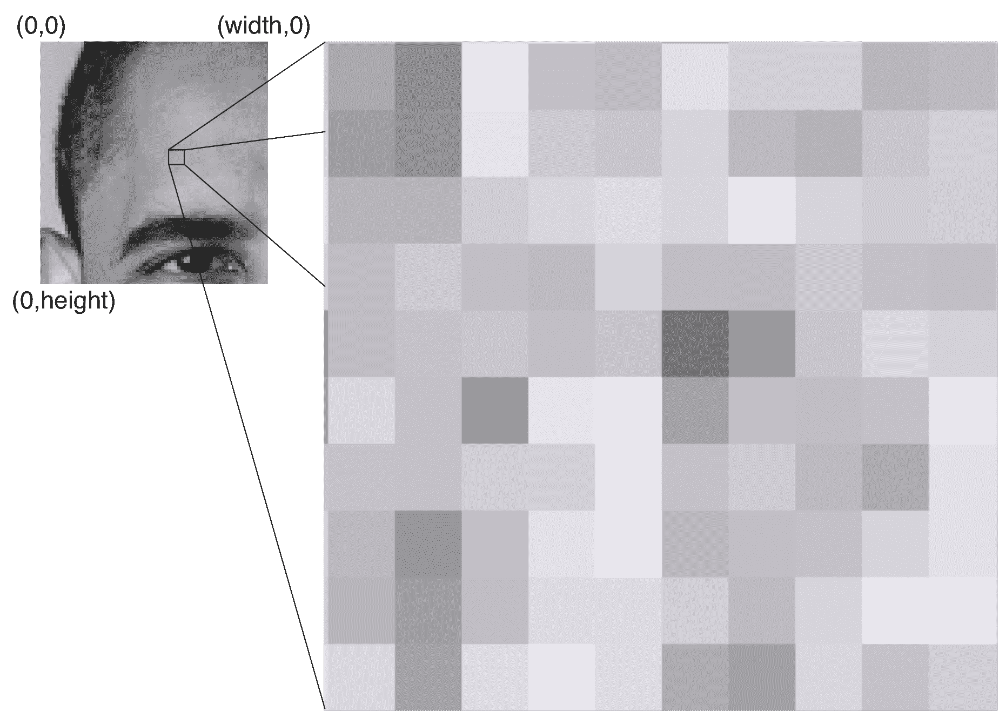

图像和矩阵之间的唯一区别是，我们通常使用`x`和`y`坐标而不是行和列来访问图像的元素。访问图像的每个元素的嵌套循环的模板如下所示：

```py
for x in 0..width-1:
    for y in 0..height-1:
        process pixel[x,y]
```

由于`y`坐标的变化快于`x`坐标，因此内部循环遍历垂直条形。外部循环将`x`移动到右边的下一个垂直条纹。

### 练习

作为一个更现实的例子，让我们将两个矩阵`A`和`B`相加为`C`。关键操作是将`A[i,j]`加上`B[i,j]`来获得`C[i,j]`。 在视觉上，它看起来像这样：

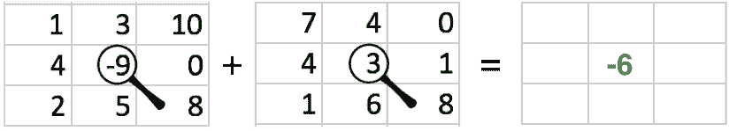

写出嵌套的 Python 索引循环，将两个矩阵相加，`C = A + B`。这里有一些定义可以帮助您入门：

```python
nrows = ncols = 3
A = [
    [1, 3, 10],
    [4, -9, 0],
    [2, 5, 8]
]
B = [
    [7, 4, 0],
    [4, 3, 1],
    [1, 6, 8]
]
# Use list comprehension to init list of lists
C = [[0]*ncols for i in range(nrows)]
```


```python
A = [
    [1, 3, 10],
    [4, -9, 0],
    [2, 5, 8]
]
B = [
    [7, 4, 0],
    [4, 3, 1],
    [1, 6, 8]
]
# Use list comprehension to init list of lists
C = [[0]*ncols for i in range(nrows)]
for i in range(nrows):
    for j in range(ncols):
        C[i][j] = A[i][j] + B[i][j]
print(C)

# [[8, 7, 10], [8, -6, 1], [3, 11, 16]]
```

```python
import numpy as np
np.array(A) + np.array(B)

'''
array([[ 8,  7, 10],
       [ 8, -6,  1],
       [ 3, 11, 16]])
'''
```

警告：不要这样做：


```python
D=[[0]*ncols]*nrows
objviz(D)
```

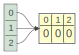

```python
D[0][1] = 3
D

# [[0, 3, 0], [0, 3, 0], [0, 3, 0]]
```

```python
# compare to this:
objviz([[0]*ncols for i in range(nrows)])
```

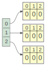

### 练习

我们也可以使用嵌套 for-each 循环，而不是使用索引循环（这非常适合于矩阵），像我们迄今为止所做的那样。 试试吧。

给出一个名字列表，`first=['Xue', 'Mary', 'Robert']`和姓氏列表，`last=['Li', 'Smith', 'Dixon']`，写 一个嵌套的 Python 循环，用于打印名字和姓氏的每个组合。

```python
first=['Xue', 'Mary', 'Robert']
last=['Li', 'Smith', 'Dixon']
for f in first:
    for l in last:
        print(f+' '+l)
        
'''
Xue Li
Xue Smith
Xue Dixon
Mary Li
Mary Smith
Mary Dixon
Robert Li
Robert Smith
Robert Dixon
'''
```

### 练习

现在使用双重循环列表推导式重复该练习。

```python
print([f+' '+l for f in first for l in last])

# ['Xue Li', 'Xue Smith', 'Xue Dixon', 'Mary Li', 'Mary Smith', 'Mary Dixon', 'Robert Li', 'Robert Smith', 'Robert Dixon']
```

