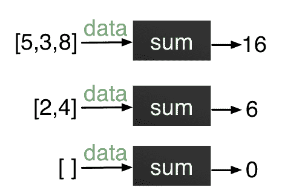
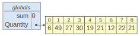
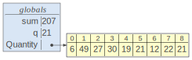
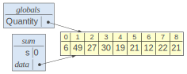
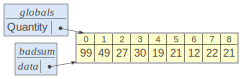
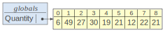
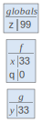

# 2.6 使用函数组织你的代码

> 原文：[Organizing your code with functions](https://github.com/parrt/msds501/blob/master/notes/functions.ipynb)
> 
> 译者：[飞龙](https://github.com/wizardforcel)
> 
> 协议：[CC BY-NC-SA 4.0](http://creativecommons.org/licenses/by-nc-sa/4.0/)


几年前，我学会了从头开始制作泰国红咖喱酱，包括烘烤，然后在巨大的研钵和杵中研磨和捣碎种子。这需要很长时间，所以我一般都会从商店购买现成的咖喱酱。


类似地，大多数烹饪书提供了许多其他食谱所使用的基本食谱，例如制作调味汁。烹饪书被组织成一系列可执行的食谱，其中一些“调用”其他食谱。 为了做晚餐，我打开一本食谱，获取一些原料，然后按照特定的顺序执行一个或多个食谱。

编写程序的方式也是一样的。打开烹饪书与导入库相同。获取原材料可能意味着将数据加载到内存中。主程序调用函数（食谱）来完成特定任务。作为编写程序的一部分，我们通常会将代码的逻辑部分分解为特定于我们问题的函数，而库中的函数则倾向于广泛适用。

我们组织代码的方式很重要。 如果我们对风格和组织不严格，程序很快就会成为难以理解的老鼠窝。 以下是我们将编写的 Python 程序的一般结构：


+   导入任何库
+   定义任何常量，简单的数据值
+   定义任何函数
+   主程序体

## 作为子程序的函数

分组为单个命名实体的一系列操作称为**函数**。函数就像迷你程序或子程序，我们可以像完整的程序一样规划。

Python **程序**由零个或多个函数和所谓的“主”程序组成，它由让事情开始的一系列操作组成。

函数不从磁盘加载数据，而是操作由调用程序提供给它们的数据。 这个输入数据类似于食谱的成分列表，并以一个或多个命名*形式参数*（或者称为*参数*）的形式指定。函数不像程序那样打印结果或显示图形，而是*返回*值。函数是指广泛有用的辅助例程。

我们通过确定以下内容开始规划函数：
 
1.描述性函数名称
2.它操作的值的类型（参数类型）
3.它返回的值的类型（返回类型）
4.函数做了什么和返回的值

如果我们无法确切地指定函数的内部和外部，那么就没有希望确定处理步骤，更不用说实现该函数了的 Python 代码了。

与程序的工作计划一样，我们手动写出一些示例函数调用，来展示输入数据和输出数据。

一旦我们完全理解了我们的目标，我们就会规划出函数所需的操作顺序，来计算所需的结果。在设计整个程序时，我们从返回值开始，向后工作，以相反的顺序确定操作。注意：操作应该纯粹是数据的函数，数据作为参数传递给它们 -- 函数应该完全不知道任何其他数据。（当我们实际将函数伪代码转换为 Python 时，会有更多相关内容。）

## 函数模板

Python 函数就像黑盒子，通常接受输入数据和并`yield`（或返回）值。每次调用函数都会触发与执行该函数的关联代码，并返回一个或多个结果值。例如，这是一个名为`pi`的函数，它不带参数，但每次调用时返回值`3.14159`：

```python
def pi():
    return 3.14159
```

没有参数的函数的代码模板是：

```py
def funcname():
    statement 1
    statement 2
    ...
    return expression
```

带有函数名称，与函数关联的语句以及描述返回值的表达式的空位。 没有返回值的函数没有`return`语句。


我们将语句与 Python 中的函数关联的方式是缩进。 所以`return 3.14159`是函数的一部分，因为它在函数头之后缩进。与`def`在同一列中的第一个语句是函数外的第一个语句。

```python
def pi():
    return 3.14159
print("this is not part of function")

# this is not part of function
```


*除非我们直接调用该函数，否则 Python 解释器不会执行函数内部的代码。* Python 将函数定义视为：我们可以根据需要调用的“食谱”定义。

函数的*定义*与调用*函数不同。调用函数需要函数名和任何参数值。在这种情况下，我们没有任何参数，所以我们将函数调用为`pi()`：

```python
pi()

# 3.14159
```

```python
pi

# <function __main__.pi()>
```

我们不需要`print`语句，因为我们在笔记本中执行，而不是在 Python 程序中执行。 如果这是在常规 Python 程序中，我们需要一个`print`语句：`print(pi())`，但当然这也适用于此。

每次调用该函数的结果都是`3.14159`。 函数返回一个值但是不打印任何东西。 例如，如果我们将结果赋给变量，则 Jupyter 笔记本或 Python 交互式 shell 不会打印任何内容：

```python
x = pi()
```

我们总是将括号放在函数名旁边，从语法上区分函数和变量。即，`pi`是一个变量引用，但`pi()`是一个函数调用。

某些函数没有返回值，例如在窗口中显示图像的函数。它有改变显示的*副作用*但实际上没有返回值。如果函数没有返回值，则省略`return`语句。这是一个人为的副作用示例，不需要返回值：

```python
def hi():
    print('hi')

hi()

# hi
```


如果你试图使用缺少`return`的函数的值，Python 会给你所谓的`None`值。

```python
x = hi()
print(x)

'''
hi
None
'''
```

当然，我们也可以返回字符串，而不仅仅是数字。 例如，这是一个名为`hello`的函数，它只返回字符串`'hello'`：

```python
def hello():
    return "hello"
```


```python
def parrt():
    return "parrt", 5707

id, phone = parrt()

print(id, phone)

# parrt 5707
```

现在转到更有趣的案例，这里是带有一个参数的函数的模板：

```py
def funcname(argname):
    statement 1
    statement 2
    ...
    return expression
```

如果有两个参数，则函数头如下所示：

```py
def funcname(argname1, argname2):
```

我们作为程序员的工作是，根据我们的函数工作计划，选择函数中的描述性函数名称，参数名称和语句。

**调用带参数的函数**看起来像`funcname(expression)`，`funcname(expression1, expression2)`等等...参数的顺序很重要。Python 将第一个表达式匹配函数定义中给出的第一个参数名称。

让我们看一下[ Python 中的编程模式](python-patterns.ipynb)中的一些代码片段，看看我们是否可以抽象一些有用的函数。

## 求和函数

在[计算模型](computation.ipynb)中，我们看到了将数学 Sigma 表示法转换为 python 的代码，因此用于汇总列表中的值的这段代码，应该是非常熟悉的：

```python
Quantity = [6, 49, 27, 30, 19, 21, 12, 22, 21]
sum = 0
for q in Quantity:
    sum = sum + q
sum

# 207
```

此操作是累积，并且存在相关的代码模板，您应该记住它。每当有人说累积，你应该考虑结果的初始化和更新部分结果的循环。

对值求和非常常见，因此我们将功能封装在一个函数中，来避免必须始终剪切和粘贴代码模板。我们的黑盒子与函数规划中的一些示例“输入-输出”对如下：



（列出这样的例子让我们意识到我们需要担心空列表。）

我们通过缩进它然后添加一个函数头来将求和功能分组到一个函数中：

```python
def sum(data):
    s = 0
    for q in data:
        s = s + q
    return s # return accumulated value s to invoker (this is not a print statement!)

Quantity = [6, 49, 27, 30, 19, 21, 12, 22, 21]
sum(Quantity) # call sum with a specific list
sum(data=Quantity) # implicit assignment here

# 207
```

这个函数版本的主要好处是，现在我们有一些通用代码，我们可以通过简单调用`sum`来调用它们。函数的参数是要求和的数据列表，因此`for`循环引用它而不是特定的`Quantity`变量。（请注意，函数内部的变量现在是`s`而不是`sum`，来避免与函数名混淆。）


```python
sum([1,2,3])

# 6
```

您可能想要构建一个直接引用`Quantity`全局列表而不是参数的函数：

```python
# OMG, this is so horrible I find it difficult to type!
def sum():
    s = 0
    for q in Quantity:
        s = s + q
    return s
```

问题是这个函数现在只适用于一个列表，并且绝不是通用的。这违背了创建函数的目的，因为它不可重用。

由于真正的函数接受列表参数，我们可以将另一个列表传递给函数：

```python
ages = [10, 21, 13]
print(sum(ages))
print(sum([1,3,5,7,9]))
print(sum([ ])) # Empty list

'''
44
25
0
'''
```

要学习的另一件事是，Python 允许我们在将参数传递给函数时命名参数：

```python
sum(data=ages)

# 44
```

函数调用`sum(Quantity)`将数据传递给函数。该函数返回一个值，因此函数调用被认为是一个值，我们可以打印出来，如上所示。像任何值一样，我们可以将调用函数的结果赋给变量：

```python
x = sum(Quantity)  # call sum and save result in x
x

# 207
```

请记住，从函数返回值与打印不同，这是一种副作用。运行程序时，只有`print`语句将值输出到控制台。*不要混淆执行程序与交互式 Python 控制台（或此笔记本），它会自动打印出我们键入的每个表达式的值。*例如：

```python
>>> 34
34
>>> 34+100
134
>>> 
```

`sum`函数有一个参数，但具有两个参数的函数也很常见。

### 练习

编写一个名为`neg`的函数，它接受一个数字参数`x`并返回`x`的相反数。

```python
def neg(x): return -x
```

### 练习

编写一个名为`max`的函数，接受 2 个数字参数，`x`和`y`，并返回两个参数的最大值。

```python
def max(x,y): return x if x>y else y

#same as:
#if x>y: return x
#else: return y

# test it
print(max(10,99))
print(max(99,10))

'''
99
99
'''
```

请注意，一旦我们使用参数名称，顺序无关紧要：

```python
print(max(x=10, y=99))
print(max(y=99, x=10))

'''
99
99
'''
```

### 练习

编写一个名为`area`的函数，它接受参数半径`r`，并返回具有该半径的圆的面积（`pi * r ** 2`）。 提示：回想一下`math`包有一个名为`pi`的变量。

```python
import math
def area(r): return math.pi * r**2  # ** is the power operator

# test it
area(1), area(r=2)

# (3.141592653589793, 12.566370614359172)
```


### 练习

编写一个名为`words`的 Python 函数，它接受一个字符串`doc`，包含一个由单个空格字符分隔的单词序列，并返回一个小写单词列表。`X Y z`的参数应该返回一个值为`['x', 'y', 'z']`的列表。 提示：`'HI'.lower()`求值为'hi'。

```python
def words(doc:str) -> list:
    words = doc.split(' ')
    return [w.lower() for w in words]

# OR

def words(doc):
    doc = doc.lower()
    return doc.split(' ')

# OR

def words(doc): return doc.lower().split(' ')

words('Terence Parr is the instructor of MSAN501')

# ['terence', 'parr', 'is', 'the', 'instructor', 'of', 'msan501']
```

## 搜索函数

我们已经看到了搜索列表元素的代码，但是特定元素和特定列表是*硬编码*。也就是说，代码只能使用特定的值，而不是通用的：

```python
first=['Xue', 'Mary', 'Robert']     # our given input
target = 'Mary'                     # searching for Mary
index = -1
for i in range(len(first)):         # i is in range [0..n-1] or [0..n)
    if first[i]==target:
        index = i
        break
index

# 1
```

有一个我们可以调用的函数会很好，因为搜索是如此常见。首先，我们可以通过缩进和添加函数头来包装函数搜索相关的逻辑。 但是，我们还应该更改列表的名称，使其更通用，并使其成为参数（与搜索目标相同）。

```python
def search(x, data):
    index = -1
    for i in range(len(data)):         # i is in range [0..n-1] or [0..n)
        if data[i]==x:
            index = i
            break
    print(index)

first=['Xue', 'Mary', 'Robert']
search('Mary', first) # invoke search with 2 parameters

# 1
```

我们现在向函数传递两个参数：`x`是要查找的元素，`data`是要搜索的列表。 只要我们想要，我们就可以通过调用`search`来搜索元素列表：

```python
search('Xue', first), search('Robert', first)

'''
0
2

(None, None)
'''
```

```python
# It is a good idea to test the failure case
search('Jim', first)

# -1
```

事实证明，我们可以通过用`return`语句替换`break`语句来简化该函数。 虽然`break`语句突破了闭合的循环，但无论函数出现在何处，`return`语句都会从函数返回。 在当前版本中，如果我们找到该元素，`break`语句就会突破循环并强制处理器执行循环后的语句，即`return`语句。因为`return`语句接受表达式参数，所以我们不需要在单独的变量中跟踪索引。*`return`语句强制处理器立即退出函数并返回指定的值。*实际上，`return`首先突破循环，然后是函数。

这是大牛写这个函数的方式：

```python
def search(x, data):
    for i in range(len(data)):  # i is in range [0..n-1] or [0..n)
        if data[i]==x:
            return i            # found element, return the current index i
    return -1                   # failure case; we did not return from inside loop

print(search('Mary', first))
print(search('Xue', first))
print(search('foo', first))

'''
1
0
-1
'''
```


## 符号的可见性

在函数外部创建的变量是所谓的*全局变量*，因为它们存在于全局空间（或帧）中。例如，让我们重新访问`sum`累加器的非函数版本，其中我添加了`lolviz`库的调用，来在循环内显示三个全局变量：

```python
from lolviz import *

Quantity = [6, 49, 27, 30, 19, 21, 12, 22, 21]
sum = 0
display(callviz(varnames=['Quantity','sum','q']))
for q in Quantity:
    sum = sum + q
display(callviz(varnames=['Quantity','sum','q']))
sum

# 207
```







这里有三个（全局）变量：`Quantity`，`sum`和`q`。该程序使用所有这些来计算结果。

让我们看看使用累加器的函数版本的“调用栈”是什么样的。

```python
reset -f
```

```python
from lolviz import *
Quantity = [6, 49, 27, 30, 19, 21, 12, 22, 21]

def sum(data):
    s = 0
    display(callsviz(varnames=['Quantity','data','s']))
    for q in data:
        s = s + q
    return s

sum(Quantity)

# 207
```



如您所见，`sum`函数有一个新的*作用域*，因为主程序调用了一个函数。该函数有一个名为`data`的参数和一个名为`s`的局部变量（我称之为`callsviz`函数）。请注意，`Quantity`和`data`变量都指向相同的共享内存位置！ 只不过，名称在不同的上下文（作用域）中定义。这是我们在上一节中讨论过的数据别名。通过遍历`data`，`sum`函数实际上是遍历来自外部上下文的`Quantity`列表。

### 注意修改数据参数的函数


```python
def badsum(data):
    #data = data.copy() # must manually make copy to avoid side-effect
    data[0] = 99
    display(callsviz(varnames=['Quantity','data','s']))
    s = 0
    for q in data:
        s = s + q
    return s

Quantity = [6, 49, 27, 30, 19, 21, 12, 22, 21]
badsum(Quantity)
print(Quantity)

# [99, 49, 27, 30, 19, 21, 12, 22, 21]
```




当函数返回时，`sum`的帧消失，只留下全局帧。

```python
def sum(data):
    s = 0
    for q in data:
        s = s + q
    return s

print(sum(Quantity))
callsviz(varnames=['Quantity','data','s'])

# 207
```



```python
reset -f
```

```python
from lolviz import *
def f(x):
    q = 0
    g(x)
    print("back from g")
    display(callsviz(varnames=['x','q','y','z']))
    
def g(y):
    print(y)
    display(callsviz(varnames=['x','q','y','z']))

z = 99
f(33)
print("back from f")
display(callsviz(varnames=['x','q','y','z']))

# 33

# back from g

# back from f
```





### 可见性规则

现在您已经考虑了上下文的概念，让我们根据上下文为变量的可见性建立一些规则：

* 主程序无法查看函数内的变量和参数；只是因为一个主程序可以调用一个函数，并不意味着它可以看到内部原理。 将函数视为带有参数和返回值的黑盒子。
* 函数在技术上可以看到全局变量，但不作为一般规则。将每个函数所需的全局变量作为参数传递。

后一条规则很好，因为违反规则通常意味着你做的事情是“错误的”。 例如，如果我们调整`sum`累积函数，来直接引用全局变量`Quantity`，我们得到：

```python
Quantity = [6, 49, 27, 30, 19, 21, 12, 22, 21]
def sum(data):         # parameter not used!
    s = 0
    for q in Quantity: # uh oh!
        s = s + q
    return s
```

问题是，现在，`sum`仅适用于该全局数据。它通常不是很有用。线索是该函数忽略了`data`参数。因此，从技术上讲，该函数可以查看全局数据，但这不是一个好主意。（违反此规则来更改全局变量，也是获取难以找到的细微错误的好方法。）

### 从技术上讲，我们需要看到全局符号（函数）

```python
def f():
    g()
    
def g():
    print("hi mom!")
    
f()

# hi mom!
```

## 返回值与打印

仅仅把这个概念灌输给你......

学生最大的困惑之一是返回值和打印结果之间的差异。当我们将计划转换为 Python 代码时，我们会再次看到这一点，但重要的是要立即理解这些差异。

分析世界中的程序，通常从文件读取数据并执行输出，或将数据写入另一个文件。 换句话说，程序与程序之外的世界交互。 程序之外的世界通常是网络，磁盘或屏幕。 相反，我们编写的大多数函数都不会与外部世界交互。


函数计算并返回（返回值）给调用者。除非明确要求使用`print`语句，否则它们不会向用户打印任何内容。

```python
def pi():
    print(3.14159) # This is not a return statement!
    
print(pi())

'''
3.14159
None
'''
```
