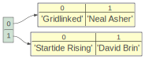
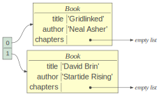
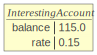

# 2.8 面向对象编程

> 原文：[Object-oriented programming](https://github.com/parrt/msds501/blob/master/notes/OO.ipynb)
> 
> 译者：[飞龙](https://github.com/wizardforcel)
> 
> 协议：[CC BY-NC-SA 4.0](http://creativecommons.org/licenses/by-nc-sa/4.0/)

## 大揭秘

到目前为止，我们一直在使用函数和函数包，以及定义我们自己的函数。 但事实证明，我们一直在使用对象，我们只是没有认识到它们。 例如，

```python
x = 'Hi'
x.lower()

# 'hi'
```

字符串`x`是我们可以发送消息的对象。

```python
print( type(x) )

# <class 'str'>
```

甚至整数都是对象：

```python
print(dir(99))

# ['__abs__', '__add__', '__and__', '__bool__', '__ceil__', '__class__', '__delattr__', '__dir__', '__divmod__', '__doc__', '__eq__', '__float__', '__floor__', '__floordiv__', '__format__', '__ge__', '__getattribute__', '__getnewargs__', '__gt__', '__hash__', '__index__', '__init__', '__init_subclass__', '__int__', '__invert__', '__le__', '__lshift__', '__lt__', '__mod__', '__mul__', '__ne__', '__neg__', '__new__', '__or__', '__pos__', '__pow__', '__radd__', '__rand__', '__rdivmod__', '__reduce__', '__reduce_ex__', '__repr__', '__rfloordiv__', '__rlshift__', '__rmod__', '__rmul__', '__ror__', '__round__', '__rpow__', '__rrshift__', '__rshift__', '__rsub__', '__rtruediv__', '__rxor__', '__setattr__', '__sizeof__', '__str__', '__sub__', '__subclasshook__', '__truediv__', '__trunc__', '__xor__', 'bit_length', 'conjugate', 'denominator', 'from_bytes', 'imag', 'numerator', 'real', 'to_bytes']
```

*类*是对象的蓝图，基本上是类型的名称，在这种情况下是`str`。 对象称为类的*实例*。

在`x.lower()`中，我们将`lower`消息发送到`x`字符串对象。 消息实际上只是与类/对象相关的函数。

```python
x.lower

# <function str.lower>
```

在不支持对象学习编程的语言中，我们会做类似的事情：

```python
lower(x)
```

Python 有函数和对象重编程，这就是为什么有`x.lower()`和：

```python
len(x)

# 2
```


函数或“消息”的选择取决于库设计者，但是`lower`仅对字符串有意义，因此将它与`str`的定义组合起来是有意义的。

然而，在实现方面，`x.lower()`实际上实现为`str.lower(x)`其中`str`是字符串的类定义。 电脑处理器了解函数调用; 他们不理解对象，所以我们在 Python 解释器本身中执行了这个翻译。

## 包 VS 对象成员

让我们直截了当。点`.`运算符在 Python 中重载，表示包成员和对象成员访问。你已经熟悉了这个：

```python
import numpy as np
np.array([1,2,3])

# array([1, 2, 3])
```


```python
import math
math.log(3000)

# 8.006367567650246
```

阅读代码时，这是一个常见的混淆点。 当我们看到`a.f()`时，我们不知道函数`f`是由`a`标识的包的成员，还是由`a`引用的对象的成员。

在`wordsim`项目中，你定义了一个名为`wordsim.py`的文件，然后我的`test_wordsim.py`文件执行`from wordsim import *`来导入`wordsim.py`中的所有函数。

### 练习

在下文中，将*标识符*（单词）标识为包或函数或字段：

1. `np.log(3)`
1. `np.linalg.norm(v)`
1. `from sklearn.ensemble import RandomForestRegressor`
1. `pd.read_csv("foo.csv")`
1. `pd.read_csv`
1. `'hi'.lower()`
1. `'hi'.lower`
1. `df_train.columns`
1. `np.pi`
1. `img = img.convert("L")`

现在，确定子表达式的数据类型，并将*标识符*（单词）标识为包或函数或字段：

1. `df["saledate"].dt.year`
1. `df_train.isnull().any().head(60)`

## 字段 VS 方法

对象具有函数，我们将其称为*方法*，以将它们与不与对象关联的函数区分开来。 对象也有变量，我们称之为*字段*或*实例变量*。

字段是对象的*状态*。 方法是对象的*行为*。

我们一直在使用字段，例如`df.columns`，它获取数据帧中的列名的列表。

```python
import datetime
now = datetime.date.today()
print( type(now) )
print( now.year ) # access field year
print( now.month )

'''
<class 'datetime.date'>
2018
8
'''
```

如果尝试在没有括号的情况下访问对象函数，则表达式将计算为函数对象本身而不是调用它：

```python
s='hi'
s.title

# <function str.title>
```

## 简单的对象定义

类是多个对象的蓝图，通常称为*实例*。 类*封装了对象的状态和行为。

想象一下外星人在你家后院的土地上，并要求你描述一辆汽车。 您可能会描述其属性，例如轮子的数量及其功能，例如可以启动和停止。 这些是状态和行为。 通过定义它们，我们有效地定义了对象。 类名仅仅为实体命名。

按照惯例，类名称应该像“Point”一样大写。

### 作为对象替代品的元组

对象的字段是我们想要关联在一起的数据项。 例如，如果我想跟踪书名/作者，我可以使用元组列表：

```python
from lolviz import *
books = [
    ('Gridlinked', 'Neal Asher'),
    ('Startide Rising', 'David Brin')
]

objviz(books)
```



```python
for b in books:
    print(f"{b[1]}: {b[0]}")
    
'''
Neal Asher: Gridlinked
David Brin: Startide Rising
'''
```

```python
# Or, more fancy
for title, author in books:
    print(f"{author}: {title}")
    
'''
Neal Asher: Gridlinked
David Brin: Startide Rising
'''
```

为了在两种情况下访问元组的元素，我们必须跟踪我们头脑中的顺序。 换句话说，我们必须访问元组元素，就像它们是列表元素一样。

### 形式对象

更好的方法是正式声明，作者和标题数据元素应该封装到称为书籍的单个实体中。我认为 Python 的规范非常古怪，但它非常灵活。 例如，我们可以定义一个没有方法没有字段的对象，但是可以使用赋值语句动态添加字段：

```python
class Book:
    pass

b = Book()
print(b)
b.title = 'Gridlinked'
b.author = 'Neal Asher'
print(b.title, b.author)
objviz(b)


'''
<__main__.Book object at 0x115c51fd0>
Gridlinked Neal Asher
'''
```


但这并不能让我们定义与该对象相关的方法（很容易）。让我们看看我们的第一个真正的类定义，它包含一个名为*构造器*的函数。

```python
class Book:
    def __init__(self, title, author):
        self.title = title
        self.author = author
        self.chapters = []
```

构造器通常根据参数设置初始和默认字段值。

在对象中定义的所有方法，函数必须有一个名为`self`的显式第一个参数。 这是正在考虑的对象。

然后我们可以使用实例创建语法`Book(..., ...)`来创建一列`Book`类的书籍对象或实例：

```python
books = [
    Book('Gridlinked', 'Neal Asher'),
    Book(title='David Brin', author='Startide Rising')
]
```

```python
objviz(books)
```



```python
for b in books:
    print(f"{b.author}: {b.title}") # access fields
    
'''
Neal Asher: Gridlinked
Startide Rising: David Brin
'''
```

请注意，我们不会将`self`参数传递给构造函数。 **它在调用一侧隐藏，但在定义一侧出现！**

### 顽皮的行为

还要注意我们一直在使用构造函数设置对象的字段，Python 以其无限的灵活性允许你做非常顽皮的事情，比如在任意对象上设置字段：

```python
class Foo:
    pass # just says "empty"

x = Foo()
x.foo = 3
```

即使类本身没有定义`foo`，也不会出错！

您甚至可以[动态添加方法](https://stackoverflow.com/questions/972/adding-a-method-to-an-existing-object-instance)。

## 定义方法

如果您尝试打印一本书，您将只看到类型信息和物理内存地址：

```python
print(books[0])

# <__main__.Book object at 0x115c51eb8>
```

```python
class Book:
    def __init__(self, title, author):
        self.title = title
        self.author = author
        
    def __str__(self): # called when conversion to string needed like print
        return f"Book({self.title}, {self.author})"
    
    def __repr__(self): # called in interactive mode
        return self.__str__() # call the string
    
books = [
    Book('Gridlinked', 'Neal Asher'),
    Book('Startide Rising', 'David Brin')
]
```

```python
print(books[0]) # calls __str__()
books[0]        # calls __repr__()

'''
Book(Gridlinked, Neal Asher)

Book(Gridlinked, Neal Asher)
'''
```

确保使用`self.x`来引用字段`x`，否则你在方法中创建一个局部变量：

```python
class Foo:
    def __init__(self):
        self.x = 0
    def foo(self):
        x = 3 # WARNING: does not alter the field! should be self.x
```

让我们创建另一种设置销售图书数量的方法。

```python
class Book:
    def __init__(self, title, author):
        self.title = title
        self.author = author
        self.sold = 0 # set default
        
    def sell(self, n):
        self.sold += n
        
    def __str__(self): # called when conversion to string needed like print
        return f"Book({self.title}, {self.author}, sold={self.sold})"
    
    def __repr__(self): # called in interactive mode
        return self.__str__() # call the string
```


```python
b = Book('Gridlinked', 'Neal Asher')
print(b)
b.sell(100) # Book.sell(b, 100)
print(b)

'''
Book(Gridlinked, Neal Asher, sold=0)
Book(Gridlinked, Neal Asher, sold=100)
'''
```

**注意**：在方法定义中，我们调用同一对象上的其他方法，使用`self.foo(...)`调用方法`foo`。

### 理解方法和函数的关键

`b.sell(100)`**方法调用**由 Python 解释器翻译并执行为**函数调用**`Book.sell(b, 100)`。 `b`变成参数`self`，所以`sell()`函数正在更新`book b`。

为什么我们更喜欢`b.sell(100)`而不是`Book.sell(b, 100)`：我们不仅仅在函数，并且在对象之间来回传递消息。 我们说`dog.bark()`，不是`bark(dog)`，或我们说`ball.inflate()`，而不是`inflate(ball)`。

### 练习

真实世界的对象包含......和......

软件对象的状态存储在......

软件对象的行为通过......公开

软件对象的蓝图称为...

### 练习

定义一个名为`Point`的类，它有一个构造函数，接受`x`，`y`坐标并使它们成为类的字段。

定义方法`distance(q)`，它接受一个`Point`并返回从`self`到`q`的欧几里德距离。

使用这个来测试：

```
p = Point(3,4)
q = Point(5,6)
print(p.distance(q))
```

添加方法`__str__`，以便`print(q)`打印出类似`(3, 4)`的东西。

### 答案

```python
import numpy as np

class Point:
    def __init__(self, x, y):
        self.x = x
        self.y = y
        
    def distance(self, other):
        return np.sqrt( (self.x - other.x)**2 + (self.y - other.y)**2 )
    
    def __str__(self):
        return f"({self.x},{self.y})"
```

```python
p = Point(3,4)
q = Point(5,6)
print(p, q)
print(p.distance(q))

'''
(3,4) (5,6)
2.8284271247461903
'''
```


## 继承

定义一些与我们已经理解的东西相关的新东西，通常要容易得多。 在编程中也是如此。 让我们从一个帐户对象开始：

```python
class Account:
    def __init__(self, starting):
        self.balance = starting

    def add(self, value):
        self.balance += value

    def total(self):
        return self.balance
```


```python
a = Account(100.0)
a.add(15)
a.total()

# 115.0
```

```python
objviz(a)
```


继承的行为类似于`import`，或从另一个类导入操作到新类。 （*请注意，这不是真的，但我们可以将其视为包含，对于我们目的。*）

如果我们不指定超类，则类`object`是隐式超类。 该类称为类层次结构的根，并定义了许多标准方法：

```python
x = object() # yes, we can make a generic object
print(dir(x))

# ['__class__', '__delattr__', '__dir__', '__doc__', '__eq__', '__format__', '__ge__', '__getattribute__', '__gt__', '__hash__', '__init__', '__init_subclass__', '__le__', '__lt__', '__ne__', '__new__', '__reduce__', '__reduce_ex__', '__repr__', '__setattr__', '__sizeof__', '__str__', '__subclasshook__']
```

我们可以定义一个有息账户，因为它与普通账户不同：

```python
class InterestingAccount(Account): # derive from super class to get subclass
    def __init__(self, starting, rate):
        self.balance = starting # super().__init__(starting)
        self.rate = rate
    def total(self): # OVERRIDE method
        return self.balance + self.balance * self.rate

b = InterestingAccount(100.0, 0.15)
b.add(15)
b.total()
```

```python
objviz(b)
```



要点是我们可以使用`add()`而不必在`InterestingAccount`中重新定义它，而`InterestingAccount`也可以覆盖帐户的`total()`。 我们已经*复用*和*覆盖*以前的功能。您可以将超类视为定义一些初始函数，我们可以在子类中重用或覆盖他们。

我们还可以通过添加不在超类中的方法来*扩展*功能。

```python
class InterestingAccount(Account): # derive from super class to get subclass
    def __init__(self, starting, rate):
        super().__init__(starting) # does self.balance = starting above
        self.rate = rate

    def total(self): # OVERRIDE method
        return self.balance + self.balance * self.rate
    
    def profit(self):
        return self.balance * self.rate
```


```python
b = InterestingAccount(100.0, 0.15)
b.add(15)
b.profit()

# 17.25
```

```python
a = Account(100.0)
b = InterestingAccount(100.0, 0.15)
print(type(a))
print(type(b))

'''
<class '__main__.Account'>
<class '__main__.InterestingAccount'>
'''
```

类的定义实际上本身是对象，您可以使用任何对象的秘密字段访问它们：

```python
print(b.__class__)
print(b.__class__.__base__)

'''
<class '__main__.InterestingAccount'>
<class '__main__.Account'>
'''
```

### 练习

1. 什么是类？
1. 类和实例之间有什么区别？
1. 使用不带参数的构造函数定义类`Foo`的新实例。
1. 访问对象字段的语法是什么？
1. 方法与函数有何不同？
1. `__init__`方法有什么作用？
1. 给定类`Employee`和`Manager`，哪个是子类或者超类？
1. 子类中的方法可以调用超类中定义的方法吗？
1. 如何覆盖从超类继承的方法？

## 动态调度（高级）

当你调用`b.add(15)`时，Python 在`b`（`InterestingAccount`）的对象定义中查找函数`add`。 因为我们从超类继承了该方法，所以子类知道它。 当我们调用`b.total()`时，Python再次查找`InterestingAccount`中的方法并找到一个重写方法。 这就是为什么`b.total()`不会调用`Account`版本。

这种行为是可取的，但起初非常混乱。 下面是一个实例，其中我添加了一个`__str__`方法给超类：

```python
class Account:
    def __init__(self, starting):
        self.balance = starting

    def add(self, value):
        self.balance += value

    def total(self):
        return self.balance
    
    def __str__(self):
        return f"Balance {self.total()}" # can call 2 different functions
    
class InterestingAccount(Account): # derive from super class to get subclass
    def __init__(self, starting, rate):
        self.balance = starting
        self.rate = rate

    def total(self): # OVERRIDE method
        return self.balance + self.balance * self.rate
    
    def profit(self):
        return self.balance * self.rate
```

微妙的部分是`Account`中的`__str__`调用`Account.total()`或`InterestingAccount.total()`，具体取决于`self`的类型：

```python
a = Account(100.0)
b = InterestingAccount(100.0, 0.15)
print(a) # calls Account.total()
print(b) # calls InterestingAccount.total()

'''
Balance 100.0
Balance 115.0
'''
```

### 练习

定义一个继承自`Point`的`Point3D`。

定义接受`x, y, z`值并设置字段的构造函数。 调用`super().__init__(x, y)`来调用超类的构造函数。

定义/覆盖`distance(q)`，以便它处理 3D 字段值来返回距离。

使用这个来测试：

```
p = Point3D(3,4,9)
q = Point3D(5,6,10)
print(p.distance(q))
```

添加方法`__str__`，以便`print(q)`打印出类似`(3, 4, 5)`的东西。记住：

$dist(x,y) = \sqrt{(x_1-y_1)^2 + (x_2-y_2)^2 + (x_3-y_3)^2)}$


### 答案


```python
import numpy as np

class Point3D(Point):
    def __init__(self, x, y, z):
        # reuse/refine super class constructor
        super().__init__(x,y)
        self.z = z
        
    def distance(self, other):
        return np.sqrt( (self.x - other.x)**2 +
                        (self.y - other.y)**2 +
                        (self.z - other.z)**2 )
    
    def __str__(self):
        return f"({self.x},{self.y},{self.z})"
```


```python
p = Point3D(3,4,9)
q = Point3D(5,6,10)
print(p.distance(q))

# 3.0
```


## 理由和一般思想

因为猎人 - 收集者的思想将世界视为通过发送消息交互的对象集合，所以 OO 编程范例很好地映射到现实世界问题，我们试图通过计算机模拟它们。 此外，在使用我们的思维方式编程时，我们处于最佳状态。

通常，在编写软件时，我们会尝试将现实实体映射到编程结构中。 如果我们有了单词问题，名词通常会成为对象，而动词通常会成为这些对象中的方法。

因为我们可以指定不同类型的对象如何相似，所以我们可以定义新对象，因为它们与现有对象不同。 通过按类别/共性/相似性正确地关联类似的类，作为继承的副作用，代码重用就出现了。

非 OO 语言是不灵活/脆弱的，因为必须指定确切的变量类型。在 OO 语言中，*多态*是使用单个类型引用，来引用相似但不同类型的分组的能力。
