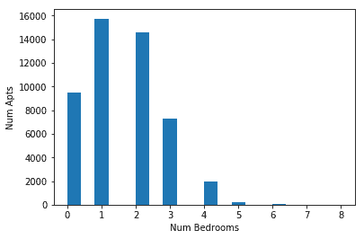
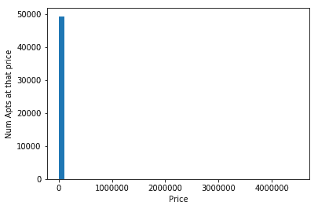
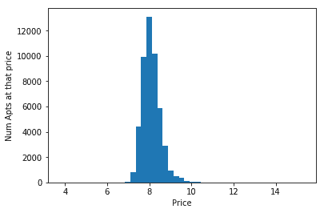
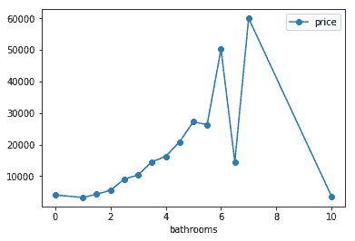
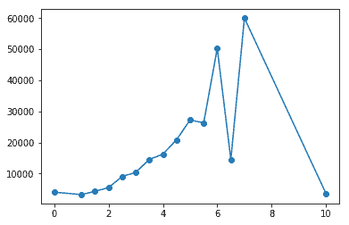
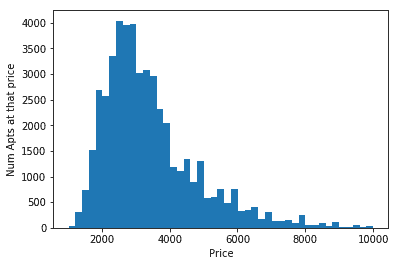
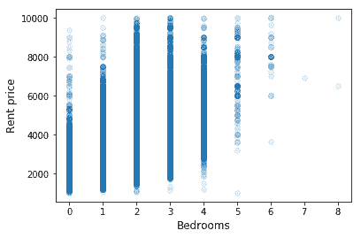
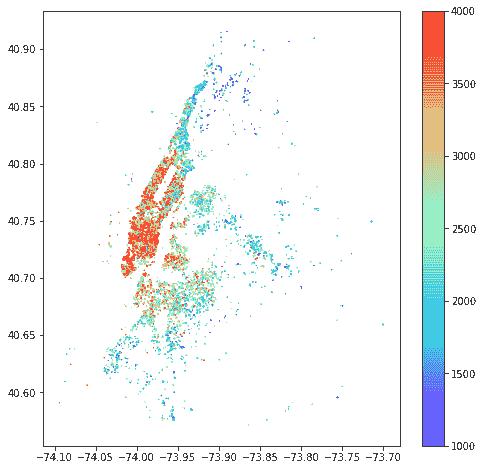
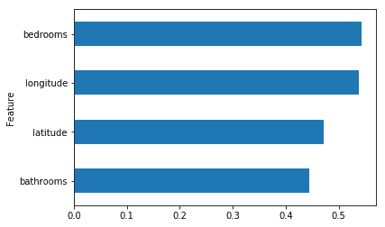

# 3.2 数据帧

> 原文：[Pandas dataframes](https://github.com/parrt/msds501/blob/master/notes/dataframes.ipynb)
> 
> 译者：[飞龙](https://github.com/wizardforcel)
> 
> 协议：[CC BY-NC-SA 4.0](http://creativecommons.org/licenses/by-nc-sa/4.0/)


我们将使用真实的[ kaggle 比赛](https://www.kaggle.com/c/two-sigma-connect-rental-listing-inquiries)数据集来探索 Pandas 数据帧。获取[`rent.csv.zip`](https://mlbook.explained.ai/data/rent.csv.zip)文件并解压缩。

```python
import pandas as pd
df = pd.read_csv("data/rent.csv", parse_dates=['created'])
df.head(2)
```

|  | bathrooms | bedrooms | building_id | created | description | display_address | features | interest_level | latitude | listing_id | longitude | manager_id | photos | price | street_address |
| --- | --- | --- | --- | --- | --- | --- | --- | --- | --- | --- | --- | --- | --- | --- | --- |
| 0 | 1.5 | 3 | 53a5b119ba8f7b61d4e010512e0dfc85 | 2016-06-24 07:54:24 | A Brand New 3 Bedroom 1.5 bath ApartmentEnjoy ... | Metropolitan Avenue | [] | medium | 40.7145 | 7211212 | -73.9425 | 5ba989232d0489da1b5f2c45f6688adc | ['https://photos.renthop.com/2/7211212_1ed4542... | 3000 | 792 Metropolitan Avenue |
| 1 | 1.0 | 2 | c5c8a357cba207596b04d1afd1e4f130 | 2016-06-12 12:19:27 |  | Columbus Avenue | ['Doorman', 'Elevator', 'Fitness Center', 'Cat... | low | 40.7947 | 7150865 | -73.9667 | 7533621a882f71e25173b27e3139d83d | ['https://photos.renthop.com/2/7150865_be3306c... | 5465 | 808 Columbus Avenue |


```python
df.head(2).T
```


|  | 0 | 1 |
| --- | --- | --- |
| bathrooms | 1.5 | 1 |
| bedrooms | 3 | 2 |
| building_id | 53a5b119ba8f7b61d4e010512e0dfc85 | c5c8a357cba207596b04d1afd1e4f130 |
| created | 2016-06-24 07:54:24 | 2016-06-12 12:19:27 |
| description | A Brand New 3 Bedroom 1.5 bath ApartmentEnjoy ... |  |
| display_address | Metropolitan Avenue | Columbus Avenue |
| features | [] | ['Doorman', 'Elevator', 'Fitness Center', 'Cat... |
| interest_level | medium | low |
| latitude | 40.7145 | 40.7947 |
| listing_id | 7211212 | 7150865 |
| longitude | -73.9425 | -73.9667 |
| manager_id | 5ba989232d0489da1b5f2c45f6688adc | 7533621a882f71e25173b27e3139d83d |
| photos | ['https://photos.renthop.com/2/7211212_1ed4542... | ['https://photos.renthop.com/2/7150865_be3306c... |
| price | 3000 | 5465 |
| street_address | 792 Metropolitan Avenue | 808 Columbus Avenue |

## 观察数据


```python
df.info()

'''
<class 'pandas.core.frame.DataFrame'>
RangeIndex: 49352 entries, 0 to 49351
Data columns (total 15 columns):
bathrooms          49352 non-null float64
bedrooms           49352 non-null int64
building_id        49352 non-null object
created            49352 non-null datetime64[ns]
description        47906 non-null object
display_address    49217 non-null object
features           49352 non-null object
interest_level     49352 non-null object
latitude           49352 non-null float64
listing_id         49352 non-null int64
longitude          49352 non-null float64
manager_id         49352 non-null object
photos             49352 non-null object
price              49352 non-null int64
street_address     49342 non-null object
dtypes: datetime64[ns](1), float64(3), int64(3), object(8)
memory usage: 5.6+ MB
'''
```

```python
df.describe()
```

|  | bathrooms | bedrooms | latitude | listing_id | longitude | price |
| --- | --- | --- | --- | --- | --- | --- |
| count | 49352.00000 | 49352.000000 | 49352.000000 | 4.935200e+04 | 49352.000000 | 4.935200e+04 |
| mean | 1.21218 | 1.541640 | 40.741545 | 7.024055e+06 | -73.955716 | 3.830174e+03 |
| std | 0.50142 | 1.115018 | 0.638535 | 1.262746e+05 | 1.177912 | 2.206687e+04 |
| min | 0.00000 | 0.000000 | 0.000000 | 6.811957e+06 | -118.271000 | 4.300000e+01 |
| 25% | 1.00000 | 1.000000 | 40.728300 | 6.915888e+06 | -73.991700 | 2.500000e+03 |
| 50% | 1.00000 | 1.000000 | 40.751800 | 7.021070e+06 | -73.977900 | 3.150000e+03 |
| 75% | 1.00000 | 2.000000 | 40.774300 | 7.128733e+06 | -73.954800 | 4.100000e+03 |
| max | 10.00000 | 8.000000 | 44.883500 | 7.753784e+06 | 0.000000 | 4.490000e+06 |

```python
df.price.sort_values(ascending=False).head(10)

'''
19558    4490000
9590     1150000
30689    1070000
29665    1070000
10581     135000
25538     111111
45674     100000
29082      90000
7336       85000
47995      80000
Name: price, dtype: int64
'''
```


### 获取列


```python
df.price.head(5) # works only on right hand side of assignment or in expression

'''
0    3000
1    5465
2    2850
3    3275
4    3350
Name: price, dtype: int64
'''
```

```python
df['price'].head(5)

'''
0    3000
1    5465
2    2850
3    3275
4    3350
Name: price, dtype: int64
'''
```

## 列的计算

可以获取值并取平均值：

```python
prices = df['price']
avg_rent = prices.mean()
print(f"Average rent is ${avg_rent:.0f}")

# Average rent is $3830
```


```python
df.latitude.min(), df.latitude.max()

# (0.0, 44.8835)
```

```python
bybaths = df.groupby(['bathrooms']).mean()
bybaths
```

|  | bedrooms | latitude | listing_id | longitude | price |
| --- | --- | --- | --- | --- | --- |
| bathrooms |  |  |  |  |  |
| --- | --- | --- | --- | --- | --- |
| 0.0 | 0.849840 | 40.756168 | 7.027187e+06 | -73.970516 | 4001.530351 |
| 1.0 | 1.251662 | 40.740873 | 7.024082e+06 | -73.954589 | 3233.940490 |
| 1.5 | 2.271318 | 40.748909 | 7.026701e+06 | -73.965980 | 4257.066667 |
| 2.0 | 2.685117 | 40.750483 | 7.022952e+06 | -73.974603 | 5501.066971 |
| 2.5 | 2.851986 | 40.759694 | 7.018145e+06 | -73.968822 | 9028.920578 |
| 3.0 | 3.293960 | 40.764863 | 7.028051e+06 | -73.999571 | 10391.060403 |
| 3.5 | 3.542857 | 40.764344 | 7.061043e+06 | -73.964676 | 14534.785714 |
| 4.0 | 4.301887 | 40.513449 | 7.025477e+06 | -73.492230 | 16239.213836 |
| 4.5 | 4.137931 | 40.780462 | 7.058375e+06 | -73.900438 | 20868.000000 |
| 5.0 | 4.400000 | 38.723515 | 7.024429e+06 | -70.273665 | 27214.700000 |
| 5.5 | 4.400000 | 40.745340 | 6.975588e+06 | -73.975340 | 26300.000000 |
| 6.0 | 5.250000 | 40.762925 | 7.005858e+06 | -73.966400 | 50250.000000 |
| 6.5 | 7.000000 | 40.833600 | 7.198431e+06 | -74.216000 | 14500.000000 |
| 7.0 | 5.000000 | 40.733500 | 6.840943e+06 | -73.997400 | 60000.000000 |
| 10.0 | 2.000000 | 40.763300 | 6.849204e+06 | -73.984900 | 3600.000000 |


```python
bybaths = bybaths.reset_index() # overcome quirk in Pandas
bybaths.head(3)
```

|  | bathrooms | bedrooms | latitude | listing_id | longitude | price |
| --- | --- | --- | --- | --- | --- | --- |
| 0 | 0.0 | 0.849840 | 40.756168 | 7.027187e+06 | -73.970516 | 4001.530351 |
| 1 | 1.0 | 1.251662 | 40.740873 | 7.024082e+06 | -73.954589 | 3233.940490 |
| 2 | 1.5 | 2.271318 | 40.748909 | 7.026701e+06 | -73.965980 | 4257.066667 |

```python
bybaths[['bathrooms','price']] # print just num baths, avg price
```

|  | bathrooms | price |
| --- | --- | --- |
| 0 | 0.0 | 4001.530351 |
| 1 | 1.0 | 3233.940490 |
| 2 | 1.5 | 4257.066667 |
| 3 | 2.0 | 5501.066971 |
| 4 | 2.5 | 9028.920578 |
| 5 | 3.0 | 10391.060403 |
| 6 | 3.5 | 14534.785714 |
| 7 | 4.0 | 16239.213836 |
| 8 | 4.5 | 20868.000000 |
| 9 | 5.0 | 27214.700000 |
| 10 | 5.5 | 26300.000000 |
| 11 | 6.0 | 50250.000000 |
| 12 | 6.5 | 14500.000000 |
| 13 | 7.0 | 60000.000000 |
| 14 | 10.0 | 3600.000000 |

### 列 VS 子集


```python
# get column
df['bedrooms'].head(5)

'''
0    3
1    2
2    1
3    1
4    4
Name: bedrooms, dtype: int64
'''
```


```python
df[['bedrooms','bathrooms']].head(3)
```

|  | bedrooms | bathrooms |
| --- | --- | --- |
| 0 | 3 | 1.5 |
| 1 | 2 | 1.0 |
| 2 | 1 | 1.0 |

### 获取行


```python
# get index 3 row
df.iloc[3] # same as df.iloc[3,:]

'''
bathrooms                                                          1
bedrooms                                                           1
building_id                         28d9ad350afeaab8027513a3e52ac8d5
created                                          2016-04-18 02:22:02
description        Building Amenities - Garage - Garden - fitness...
display_address                                     East 49th Street
features                               ['Hardwood Floors', 'No Fee']
interest_level                                                   low
latitude                                                     40.7539
listing_id                                                   6888711
longitude                                                   -73.9677
manager_id                          1067e078446a7897d2da493d2f741316
photos             ['https://photos.renthop.com/2/6888711_6e660ce...
price                                                           3275
street_address                                  333 East 49th Street
Name: 3, dtype: object
'''
```

```python
df.iloc[0:2] # first two rows
```

|  | bathrooms | bedrooms | building_id | created | description | display_address | features | interest_level | latitude | listing_id | longitude | manager_id | photos | price | street_address |
| --- | --- | --- | --- | --- | --- | --- | --- | --- | --- | --- | --- | --- | --- | --- | --- |
| 0 | 1.5 | 3 | 53a5b119ba8f7b61d4e010512e0dfc85 | 2016-06-24 07:54:24 | A Brand New 3 Bedroom 1.5 bath ApartmentEnjoy ... | Metropolitan Avenue | [] | medium | 40.7145 | 7211212 | -73.9425 | 5ba989232d0489da1b5f2c45f6688adc | ['https://photos.renthop.com/2/7211212_1ed4542... | 3000 | 792 Metropolitan Avenue |
| 1 | 1.0 | 2 | c5c8a357cba207596b04d1afd1e4f130 | 2016-06-12 12:19:27 |  | Columbus Avenue | ['Doorman', 'Elevator', 'Fitness Center', 'Cat... | low | 40.7947 | 7150865 | -73.9667 | 7533621a882f71e25173b27e3139d83d | ['https://photos.renthop.com/2/7150865_be3306c... | 5465 | 808 Columbus Avenue |

```python
df.iloc[0:2][['created','features']] # first two rows, show 2 columns
```

|  | created | features |
| --- | --- | --- |
| 0 | 2016-06-24 07:54:24 | [] |
| 1 | 2016-06-12 12:19:27 | ['Doorman', 'Elevator', 'Fitness Center', 'Cat... |

## 索引，通过索引的键获取行


```python
df = df.set_index('listing_id')
df.head(3)
```

|  | bathrooms | bedrooms | building_id | created | description | display_address | features | interest_level | latitude | longitude | manager_id | photos | price | street_address |
| --- | --- | --- | --- | --- | --- | --- | --- | --- | --- | --- | --- | --- | --- | --- |
| listing_id |  |  |  |  |  |  |  |  |  |  |  |  |  |  |
| --- | --- | --- | --- | --- | --- | --- | --- | --- | --- | --- | --- | --- | --- | --- |
| 7211212 | 1.5 | 3 | 53a5b119ba8f7b61d4e010512e0dfc85 | 2016-06-24 07:54:24 | A Brand New 3 Bedroom 1.5 bath ApartmentEnjoy ... | Metropolitan Avenue | [] | medium | 40.7145 | -73.9425 | 5ba989232d0489da1b5f2c45f6688adc | ['https://photos.renthop.com/2/7211212_1ed4542... | 3000 | 792 Metropolitan Avenue |
| 7150865 | 1.0 | 2 | c5c8a357cba207596b04d1afd1e4f130 | 2016-06-12 12:19:27 |  | Columbus Avenue | ['Doorman', 'Elevator', 'Fitness Center', 'Cat... | low | 40.7947 | -73.9667 | 7533621a882f71e25173b27e3139d83d | ['https://photos.renthop.com/2/7150865_be3306c... | 5465 | 808 Columbus Avenue |
| 6887163 | 1.0 | 1 | c3ba40552e2120b0acfc3cb5730bb2aa | 2016-04-17 03:26:41 | Top Top West Village location, beautiful Pre-w... | W 13 Street | ['Laundry In Building', 'Dishwasher', 'Hardwoo... | high | 40.7388 | -74.0018 | d9039c43983f6e564b1482b273bd7b01 | ['https://photos.renthop.com/2/6887163_de85c42... | 2850 | 241 W 13 Street |

```python
df.loc[7150865]

'''
bathrooms                                                          1
bedrooms                                                           2
building_id                         c5c8a357cba207596b04d1afd1e4f130
created                                          2016-06-12 12:19:27
description                                                         
display_address                                      Columbus Avenue
features           ['Doorman', 'Elevator', 'Fitness Center', 'Cat...
interest_level                                                   low
latitude                                                     40.7947
longitude                                                   -73.9667
manager_id                          7533621a882f71e25173b27e3139d83d
photos             ['https://photos.renthop.com/2/7150865_be3306c...
price                                                           5465
street_address                                   808 Columbus Avenue
Name: 7150865, dtype: object
'''
```

```python
df = df.reset_index()
df.head(3)
```

|  | listing_id | bathrooms | bedrooms | building_id | created | description | display_address | features | interest_level | latitude | longitude | manager_id | photos | price | street_address |
| --- | --- | --- | --- | --- | --- | --- | --- | --- | --- | --- | --- | --- | --- | --- | --- |
| 0 | 7211212 | 1.5 | 3 | 53a5b119ba8f7b61d4e010512e0dfc85 | 2016-06-24 07:54:24 | A Brand New 3 Bedroom 1.5 bath ApartmentEnjoy ... | Metropolitan Avenue | [] | medium | 40.7145 | -73.9425 | 5ba989232d0489da1b5f2c45f6688adc | ['https://photos.renthop.com/2/7211212_1ed4542... | 3000 | 792 Metropolitan Avenue |
| 1 | 7150865 | 1.0 | 2 | c5c8a357cba207596b04d1afd1e4f130 | 2016-06-12 12:19:27 |  | Columbus Avenue | ['Doorman', 'Elevator', 'Fitness Center', 'Cat... | low | 40.7947 | -73.9667 | 7533621a882f71e25173b27e3139d83d | ['https://photos.renthop.com/2/7150865_be3306c... | 5465 | 808 Columbus Avenue |
| 2 | 6887163 | 1.0 | 1 | c3ba40552e2120b0acfc3cb5730bb2aa | 2016-04-17 03:26:41 | Top Top West Village location, beautiful Pre-w... | W 13 Street | ['Laundry In Building', 'Dishwasher', 'Hardwoo... | high | 40.7388 | -74.0018 | d9039c43983f6e564b1482b273bd7b01 | ['https://photos.renthop.com/2/6887163_de85c42... | 2850 | 241 W 13 Street |
Allows non-unique indexes


```python
df_beds = df.set_index('bedrooms')
df_beds.loc[3].head(3)
```

|  | listing_id | bathrooms | building_id | created | description | display_address | features | interest_level | latitude | longitude | manager_id | photos | price | street_address |
| --- | --- | --- | --- | --- | --- | --- | --- | --- | --- | --- | --- | --- | --- | --- |
| bedrooms |  |  |  |  |  |  |  |  |  |  |  |  |  |  |
| 3 | 7211212 | 1.5 | 53a5b119ba8f7b61d4e010512e0dfc85 | 2016-06-24 07:54:24 | A Brand New 3 Bedroom 1.5 bath ApartmentEnjoy ... | Metropolitan Avenue | [] | medium | 40.7145 | -73.9425 | 5ba989232d0489da1b5f2c45f6688adc | ['https://photos.renthop.com/2/7211212_1ed4542... | 3000 | 792 Metropolitan Avenue |
| 3 | 6858062 | 1.0 | 205f95d4a78f1f3befda48b89edc9669 | 2016-04-12 02:39:45 | BEAUTIFUL 2 BEDROOM POSSIBLE CONVERSION INTO T... | Madison Avenue | ['Doorman', 'Elevator', 'Dishwasher', 'Hardwoo... | low | 40.7454 | -73.9845 | 3793e58c60343a3fd6846ca2d2ef3c7f | ['https://photos.renthop.com/2/6858062_5cfb9d9... | 4395 | 121 Madison Avenue |
| 3 | 6890563 | 1.0 | be6b7c3fdf3f63a2756306f4af7788a6 | 2016-04-18 04:46:30 | These pictures are from a similarlisting. | Thompson St | ['Washer/Dryer'] | low | 40.7231 | -74.0044 | 64249f81378907ae7cf65e8ccb4bd8dc | ['https://photos.renthop.com/2/6890563_1b98fae... | 3733 | 25 Thompson St |

## 检查缺失值


```python
df.isnull().head(5)
```

|  | listing_id | bathrooms | bedrooms | building_id | created | description | display_address | features | interest_level | latitude | longitude | manager_id | photos | price | street_address |
| --- | --- | --- | --- | --- | --- | --- | --- | --- | --- | --- | --- | --- | --- | --- | --- |
| 0 | False | False | False | False | False | False | False | False | False | False | False | False | False | False | False |
| 1 | False | False | False | False | False | False | False | False | False | False | False | False | False | False | False |
| 2 | False | False | False | False | False | False | False | False | False | False | False | False | False | False | False |
| 3 | False | False | False | False | False | False | False | False | False | False | False | False | False | False | False |
| 4 | False | False | False | False | False | False | False | False | False | False | False | False | False | False | False |


```python
df.isnull().any()

'''
listing_id         False
bathrooms          False
bedrooms           False
building_id        False
created            False
description         True
display_address     True
features           False
interest_level     False
latitude           False
longitude          False
manager_id         False
photos             False
price              False
street_address      True
dtype: bool
'''
```

查找数据帧中缺少描述的所有行：

```python
df.description.isnull().head(5)

'''
0    False
1    False
2    False
3    False
4    False
Name: description, dtype: bool
'''
```

```python
df[df.description.isnull()].head(5)
```


|  | listing_id | bathrooms | bedrooms | building_id | created | description | display_address | features | interest_level | latitude | longitude | manager_id | photos | price | street_address |
| --- | --- | --- | --- | --- | --- | --- | --- | --- | --- | --- | --- | --- | --- | --- | --- |
| 57 | 6923973 | 1.0 | 0 | ca9c594aba4534beae6ce71def209994 | 2016-04-26 01:39:25 | NaN | East 74th Street | [] | low | 40.7699 | -73.9565 | b7de4cb395920136663132057fa89d84 | [] | 2700 | 315 East 74th Street |
| 67 | 6891766 | 1.0 | 1 | 5a922b81c28dd44b2ffadf603c90c0d5 | 2016-04-19 01:42:01 | NaN | West 50th Street | ['Doorman', 'Fitness Center', 'Pool', 'Elevato... | low | 40.7619 | -73.9854 | 62b685cc0d876c3a1a51d63a0d6a8082 | [] | 3697 | 250 West 50TH Street |
| 73 | 6890772 | 1.0 | 1 | bde4018a1c4f290eb89af695a7a1d644 | 2016-04-18 04:59:44 | NaN | East 85th Street | ['Elevator', 'Cats Allowed', 'Dogs Allowed', '... | low | 40.7777 | -73.9532 | d1737922fe92ccb0dc37ba85589e6415 | [] | 2945 | 225 East 85th Street |
| 174 | 6853469 | 1.0 | 1 | 0 | 2016-04-10 05:13:03 | NaN | 83rd Avenue | ['Doorman', 'Elevator', 'Cats Allowed', 'Dogs ... | low | 40.7111 | -73.8272 | e6472c7237327dd3903b3d6f6a94515a | ['https://photos.renthop.com/2/6853469_75548f7... | 1675 | 123-30 83rd Avenue |
| 210 | 6846567 | 1.0 | 1 | 6289dd7229f0d3b87254860764be70ab | 2016-04-09 01:39:12 | NaN | West 28th Street | ['Doorman', 'Fitness Center', 'Elevator', 'Cat... | low | 40.7512 | -74.0026 | 62b685cc0d876c3a1a51d63a0d6a8082 | [] | 4030 | 525 West 28th Street |

另一个查询，获得价格高于 1M 美金的所有`apt`行

```python
(df.price>1000000).head(5)

'''
0    False
1    False
2    False
3    False
4    False
Name: price, dtype: bool
'''
```

```python
df[df.price>1000000]
```


|  | listing_id | bathrooms | bedrooms | building_id | created | description | display_address | features | interest_level | latitude | longitude | manager_id | photos | price | street_address |
| --- | --- | --- | --- | --- | --- | --- | --- | --- | --- | --- | --- | --- | --- | --- | --- |
| 9590 | 7208794 | 1.0 | 2 | 5d3525a5085445e7fcd64a53aac3cb0a | 2016-06-24 05:02:58 | NaN | West 116th Street | ['Doorman', 'Elevator', 'Cats Allowed', 'Dogs ... | low | 40.8011 | -73.9480 | d1737922fe92ccb0dc37ba85589e6415 | [] | 1150000 | 40 West 116th Street |
| 19558 | 7208764 | 1.0 | 2 | cd25bbea2af848ebe9821da820b725da | 2016-06-24 05:02:11 | NaN | Hudson Street | ['Doorman', 'Elevator', 'Cats Allowed', 'Dogs ... | low | 40.7299 | -74.0071 | d1737922fe92ccb0dc37ba85589e6415 | [] | 4490000 | 421 Hudson Street |
| 29665 | 7013217 | 1.0 | 1 | 37385c8a58176b529964083315c28e32 | 2016-05-14 05:21:28 |  | West 57th Street | ['Doorman', 'Cats Allowed', 'Dogs Allowed'] | low | 40.7676 | -73.9844 | 8f5a9c893f6d602f4953fcc0b8e6e9b4 | [] | 1070000 | 333 West 57th Street |
| 30689 | 7036279 | 1.0 | 1 | 37385c8a58176b529964083315c28e32 | 2016-05-19 02:37:06 | This 1 Bedroom apartment is located on a prime... | West 57th Street | ['Doorman', 'Elevator', 'Pre-War', 'Dogs Allow... | low | 40.7676 | -73.9844 | 18133bc914e6faf6f8cc1bf29d66fc0d | ['https://photos.renthop.com/2/7036279_924b52f... | 1070000 | 333 West 57th Street |

```python
df[(df.price>1000) & (df.price<10_000)].head(3) # parentheses are required in query!!!!
```

|  | listing_id | bathrooms | bedrooms | building_id | created | description | display_address | features | interest_level | latitude | longitude | manager_id | photos | price | street_address |
| --- | --- | --- | --- | --- | --- | --- | --- | --- | --- | --- | --- | --- | --- | --- | --- |
| 0 | 7211212 | 1.5 | 3 | 53a5b119ba8f7b61d4e010512e0dfc85 | 2016-06-24 07:54:24 | A Brand New 3 Bedroom 1.5 bath ApartmentEnjoy ... | Metropolitan Avenue | [] | medium | 40.7145 | -73.9425 | 5ba989232d0489da1b5f2c45f6688adc | ['https://photos.renthop.com/2/7211212_1ed4542... | 3000 | 792 Metropolitan Avenue |
| 1 | 7150865 | 1.0 | 2 | c5c8a357cba207596b04d1afd1e4f130 | 2016-06-12 12:19:27 |  | Columbus Avenue | ['Doorman', 'Elevator', 'Fitness Center', 'Cat... | low | 40.7947 | -73.9667 | 7533621a882f71e25173b27e3139d83d | ['https://photos.renthop.com/2/7150865_be3306c... | 5465 | 808 Columbus Avenue |
| 2 | 6887163 | 1.0 | 1 | c3ba40552e2120b0acfc3cb5730bb2aa | 2016-04-17 03:26:41 | Top Top West Village location, beautiful Pre-w... | W 13 Street | ['Laundry In Building', 'Dishwasher', 'Hardwoo... | high | 40.7388 | -74.0018 | d9039c43983f6e564b1482b273bd7b01 | ['https://photos.renthop.com/2/6887163_de85c42... | 2850 | 241 W 13 Street |

## 直方图变量


```python
df.bathrooms.value_counts()

'''
1.0     39422
2.0      7660
3.0       745
1.5       645
0.0       313
2.5       277
4.0       159
3.5        70
4.5        29
5.0        20
5.5         5
6.0         4
6.5         1
10.0        1
7.0         1
Name: bathrooms, dtype: int64
'''
```

```python
import matplotlib.pyplot as plt

plt.xlabel('Num Bathrooms')
plt.ylabel('Num Apts')
plt.hist(df.bathrooms, bins=20)
plt.show()

# <Figure size 640x480 with 1 Axes>
```

```python
plt.xlabel('Num Bedrooms')
plt.ylabel('Num Apts')
plt.hist(df.bedrooms, bins=20)
plt.show()
```



```python
plt.xlabel('Price')
plt.ylabel('Num Apts at that price')
plt.hist(df.price, bins=45) # not useful since loooong right tail
plt.show()
```




```python
import numpy as np
df_log = df.copy()
df_log["price"] = np.log( df["price"] )
#OR:
#df_log["price"] = df["price"].apply(np.log)
df_log.price.head(3)

'''
0    8.006368
1    8.606119
2    7.955074
Name: price, dtype: float64
'''
```


```python
plt.xlabel('Price')
plt.ylabel('Num Apts at that price')
plt.hist(df_log.price, bins=45) # not useful since loooong right tail
plt.show()
```





## 变量间的变化


```python
bybaths.plot.line('bathrooms','price', style='-o')   
plt.show()
```



```python
# OR, can do directly
plt.plot(bybaths.bathrooms, bybaths.price, marker='o') # note slightly different arguments
plt.show()
```



# 测试你的知识

从`df`获取浴室一列

迭代列的列表并将其打印出来

从`df`获取第 6 行

将`df`索引设置为卧室，然后使用索引获得所有带 3 间卧室的公寓

获取每月价格`> 100_000`的所有行

从`df`中删除列`building_id`

获取价格介于 1000 和 2000 之间的所有行。

将`np.log()`函数应用于价格并存储在名为`log_price`的新列中

将纬度和经度列放入到自己的数据帧中

## 答案


```python
df.bathrooms

for colname in df:
    print(colname)
    
df.loc[5]

df = df.set_index('bedrooms')
df.loc[3]

df[df.price > 100_000]

#del df.building_id
df = df.drop('building_id', axis=1)

df[ (df.price>1000) & (df.price<2000) ]

df['log_price'] = np.log( df.price )

df[ ['longitude','latitude'] ]
```

# 清理

## 价格


```python
df_clean = df[(df.price>1_000) & (df.price<10_000)]
```


```python
plt.xlabel('Price')
plt.ylabel('Num Apts at that price')
plt.hist(df_clean.price, bins=45)
plt.show()
```



```python
plt.scatter(df_clean.bedrooms, df_clean.price, alpha=0.1)
plt.xlabel("Bedrooms", fontsize=12) 
plt.ylabel("Rent price", fontsize=12)
plt.show()
```




## 位置


```python
df_missing = df_clean[(df_clean.longitude==0) |
                      (df_clean.latitude==0)]
len(df_missing)

# 11
```

```python
# only 11 filter out
df_clean = df_clean[(df_clean.longitude!=0) |
                    (df_clean.latitude!=0)]
```

Use `&` to get "and" whereas `|` is "or".

Using [GPS checker](https://gps-coordinates.org/new-york-city-latitude.php) gives a rough outline for New York City of latitude, longitude 40.55, -74.1 on the lower left and 40.94, -73.67 on the upper right. Let's filter others out.


```python
df_clean = df_clean[(df_clean['latitude']>40.55) &
                    (df_clean['latitude']<40.94) &
                    (df_clean['longitude']>-74.1) &
                    (df_clean['longitude']<-73.67)]
print(len(df_clean), len(df))

# 48300 49352
```

## 热力图


```python
from matplotlib import colors

fig = plt.figure(figsize=(8,8))
ax = fig.add_subplot(111)
plt.scatter(df_clean.longitude,
            df_clean.latitude,
            alpha=0.8,
            s=1.5, # pixel size
            vmin=1000, vmax=4000, # limit price range so 4000 is red
            c=df_clean['price'],
            cmap='rainbow', # color map
            marker='.')
plt.colorbar()
plt.show()
```





# 训练模型

仅仅获取数值字段

```python
df_train = df_clean[['bathrooms', 'bedrooms', 'longitude', 'latitude', 'price']]
df_train.head(5)
```

|  | listing_id | bathrooms | bedrooms | building_id | created | description | display_address | features | interest_level | latitude | longitude | manager_id | photos | price | street_address |
| --- | --- | --- | --- | --- | --- | --- | --- | --- | --- | --- | --- | --- | --- | --- | --- |
| 0 | 7211212 | 1.5 | 3 | 53a5b119ba8f7b61d4e010512e0dfc85 | 2016-06-24 07:54:24 | A Brand New 3 Bedroom 1.5 bath ApartmentEnjoy ... | Metropolitan Avenue | [] | medium | 40.7145 | -73.9425 | 5ba989232d0489da1b5f2c45f6688adc | ['[https://photos.renthop.com/2/7211212_1ed4542](https://hacpai.com/forward?goto=https%3A%2F%2Fphotos.renthop.com%2F2%2F7211212_1ed4542)... | 3000 | 792 Metropolitan Avenue |
| 1 | 7150865 | 1.0 | 2 | c5c8a357cba207596b04d1afd1e4f130 | 2016-06-12 12:19:27 |  | Columbus Avenue | ['Doorman', 'Elevator', 'Fitness Center', 'Cat... | low | 40.7947 | -73.9667 | 7533621a882f71e25173b27e3139d83d | ['[https://photos.renthop.com/2/7150865_be3306c](https://hacpai.com/forward?goto=https%3A%2F%2Fphotos.renthop.com%2F2%2F7150865_be3306c)... | 5465 | 808 Columbus Avenue |
| 2 | 6887163 | 1.0 | 1 | c3ba40552e2120b0acfc3cb5730bb2aa | 2016-04-17 03:26:41 | Top Top West Village location, beautiful Pre-w... | W 13 Street | ['Laundry In Building', 'Dishwasher', 'Hardwoo... | high | 40.7388 | -74.0018 | d9039c43983f6e564b1482b273bd7b01 | ['[https://photos.renthop.com/2/6887163_de85c42](https://hacpai.com/forward?goto=https%3A%2F%2Fphotos.renthop.com%2F2%2F6887163_de85c42)... | 2850 | 241 W 13 Street |

```python
X_train = df_train[['bedrooms','bathrooms','latitude','longitude']]
y_train = df_train['price']
```

```python
from sklearn.ensemble import RandomForestRegressor
rf = RandomForestRegressor(n_estimators=100, n_jobs=-1, oob_score=True)

rf.fit(X_train, y_train)
print(f"OOB R^2 score is {rf.oob_score_:.3f} (range is -infinity to 1.0; 1.0 is perfect)")

# OOB R^2 score is 0.867 (range is -infinity to 1.0; 1.0 is perfect)
```

## 模型告诉我们特征的什么信息？


```python
# pip install rfpimp
from rfpimp import *
I = oob_importances(rf, X_train, y_train)
I.plot(kind='barh', legend=False)
plt.show()
```




# 合成特征


```python
df['one'] = 1
df.head(3)
```

|  | listing_id | bathrooms | bedrooms | building_id | created | description | display_address | features | interest_level | latitude | longitude | manager_id | photos | price | street_address | log_price | one |
| --- | --- | --- | --- | --- | --- | --- | --- | --- | --- | --- | --- | --- | --- | --- | --- | --- | --- |
| 0 | 7211212 | 1.5 | 3 | 53a5b119ba8f7b61d4e010512e0dfc85 | 2016-06-24 07:54:24 | A Brand New 3 Bedroom 1.5 bath ApartmentEnjoy ... | Metropolitan Avenue | [] | medium | 40.7145 | -73.9425 | 5ba989232d0489da1b5f2c45f6688adc | ['https://photos.renthop.com/2/7211212_1ed4542... | 3000 | 792 Metropolitan Avenue | 8.006368 | 1 |
| 1 | 7150865 | 1.0 | 2 | c5c8a357cba207596b04d1afd1e4f130 | 2016-06-12 12:19:27 |  | Columbus Avenue | ['Doorman', 'Elevator', 'Fitness Center', 'Cat... | low | 40.7947 | -73.9667 | 7533621a882f71e25173b27e3139d83d | ['https://photos.renthop.com/2/7150865_be3306c... | 5465 | 808 Columbus Avenue | 8.606119 | 1 |
| 2 | 6887163 | 1.0 | 1 | c3ba40552e2120b0acfc3cb5730bb2aa | 2016-04-17 03:26:41 | Top Top West Village location, beautiful Pre-w... | W 13 Street | ['Laundry In Building', 'Dishwasher', 'Hardwoo... | high | 40.7388 | -74.0018 | d9039c43983f6e564b1482b273bd7b01 | ['https://photos.renthop.com/2/6887163_de85c42... | 2850 | 241 W 13 Street | 7.955074 | 1 |

添加适当长度的随机列

```python
df2 = df.copy()
df2['random'] = np.random.random(size=len(df))
df2.head(2).T
```

|  | 0 | 1 |
| --- | --- | --- |
| listing_id | 7211212 | 7150865 |
| bathrooms | 1.5 | 1 |
| bedrooms | 3 | 2 |
| building_id | 53a5b119ba8f7b61d4e010512e0dfc85 | c5c8a357cba207596b04d1afd1e4f130 |
| created | 2016-06-24 07:54:24 | 2016-06-12 12:19:27 |
| description | A Brand New 3 Bedroom 1.5 bath ApartmentEnjoy ... |  |
| display_address | Metropolitan Avenue | Columbus Avenue |
| features | [] | ['Doorman', 'Elevator', 'Fitness Center', 'Cat... |
| interest_level | medium | low |
| latitude | 40.7145 | 40.7947 |
| longitude | -73.9425 | -73.9667 |
| manager_id | 5ba989232d0489da1b5f2c45f6688adc | 7533621a882f71e25173b27e3139d83d |
| photos | ['https://photos.renthop.com/2/7211212_1ed4542... | ['https://photos.renthop.com/2/7150865_be3306c... |
| price | 3000 | 5465 |
| street_address | 792 Metropolitan Avenue | 808 Columbus Avenue |
| log_price | 8.00637 | 8.60612 |
| one | 1 | 1 |
| random | 0.630259 | 0.124522 |


```python
df2['i'] = [i for i in range(len(df))]
df2.head(2).T
```

|  | 0 | 1 |
| --- | --- | --- |
| listing_id | 7211212 | 7150865 |
| bathrooms | 1.5 | 1 |
| bedrooms | 3 | 2 |
| building_id | 53a5b119ba8f7b61d4e010512e0dfc85 | c5c8a357cba207596b04d1afd1e4f130 |
| created | 2016-06-24 07:54:24 | 2016-06-12 12:19:27 |
| description | A Brand New 3 Bedroom 1.5 bath ApartmentEnjoy ... |  |
| display_address | Metropolitan Avenue | Columbus Avenue |
| features | [] | ['Doorman', 'Elevator', 'Fitness Center', 'Cat... |
| interest_level | medium | low |
| latitude | 40.7145 | 40.7947 |
| longitude | -73.9425 | -73.9667 |
| manager_id | 5ba989232d0489da1b5f2c45f6688adc | 7533621a882f71e25173b27e3139d83d |
| photos | ['https://photos.renthop.com/2/7211212_1ed4542... | ['https://photos.renthop.com/2/7150865_be3306c... |
| price | 3000 | 5465 |
| street_address | 792 Metropolitan Avenue | 808 Columbus Avenue |
| log_price | 8.00637 | 8.60612 |
| one | 1 | 1 |
| random | 0.630259 | 0.124522 |
| i | 0 | 1 |

数据集具有`features`属性（类型为字符串），其中包含公寓的特性列表。

```python
df.features.head(5)

'''
0                                                   []
1    ['Doorman', 'Elevator', 'Fitness Center', 'Cat...
2    ['Laundry In Building', 'Dishwasher', 'Hardwoo...
3                        ['Hardwood Floors', 'No Fee']
4                                          ['Pre-War']
Name: features, dtype: object
'''
```

让我们创建三个新的布尔列，指示公寓是否有门卫，停车或洗衣房。 首先制作数据帧的副本，因为我们将对其进行修改（否则我们将收到错误“正在尝试在`DataFrame`的切片副本上设置值”）：

```python
df_aug = df[['bedrooms','bathrooms','latitude','longitude',
             'features','price']].copy()
```

然后我们规范化特性列，以便缺少的特性值变为空白，并且我们将所有字符串小写。

```python
# rewrite features column
df_aug['features'] = df_aug['features'].fillna('') # fill missing w/blanks
df_aug['features'] = df_aug['features'].str.lower() # normalize to lower case
```

通过检查`features`列中是否存在字符串来创建三个布尔列。

```python
df_aug['doorman'] = df_aug['features'].str.contains("doorman")
df_aug['parking'] = df_aug['features'].str.contains("parking|garage")
df_aug['laundry'] = df_aug['features'].str.contains("laundry")
del df_aug['features'] # don't need this anymore
df_aug.head(3)
```

|  | bedrooms | bathrooms | latitude | longitude | price | doorman | parking | laundry |
| --- | --- | --- | --- | --- | --- | --- | --- | --- |
| 0 | 3 | 1.5 | 40.7145 | -73.9425 | 3000 | False | False | False |
| 1 | 2 | 1.0 | 40.7947 | -73.9667 | 5465 | True | False | False |
| 2 | 1 | 1.0 | 40.7388 | -74.0018 | 2850 | False | False | True |

删除`del`以外的列的另一种方法是使用`drop()`函数：

```python
df2 = df.drop('description',axis=1) # drop doesn't affect df in place, returns new one
df2.head(2).T # kill this column, return new df without that column
```

|  | 0 | 1 |
| --- | --- | --- |
| listing_id | 7211212 | 7150865 |
| bathrooms | 1.5 | 1 |
| bedrooms | 3 | 2 |
| building_id | 53a5b119ba8f7b61d4e010512e0dfc85 | c5c8a357cba207596b04d1afd1e4f130 |
| created | 2016-06-24 07:54:24 | 2016-06-12 12:19:27 |
| display_address | Metropolitan Avenue | Columbus Avenue |
| features | [] | ['Doorman', 'Elevator', 'Fitness Center', 'Cat... |
| interest_level | medium | low |
| latitude | 40.7145 | 40.7947 |
| longitude | -73.9425 | -73.9667 |
| manager_id | 5ba989232d0489da1b5f2c45f6688adc | 7533621a882f71e25173b27e3139d83d |
| photos | ['https://photos.renthop.com/2/7211212_1ed4542... | ['https://photos.renthop.com/2/7150865_be3306c... |
| price | 3000 | 5465 |
| street_address | 792 Metropolitan Avenue | 808 Columbus Avenue |

让我们对数值特征做一些事情。

```python
df_aug["beds_to_baths"] = df_aug["bedrooms"]/(df_aug["bathrooms"]+1)
df_aug.head(3)
```

|  | bedrooms | bathrooms | latitude | longitude | price | doorman | parking | laundry | beds_to_baths |
| --- | --- | --- | --- | --- | --- | --- | --- | --- | --- |
| 0 | 3 | 1.5 | 40.7145 | -73.9425 | 3000 | False | False | False | 1.2 |
| 1 | 2 | 1.0 | 40.7947 | -73.9667 | 5465 | True | False | False | 1.0 |
| 2 | 1 | 1.0 | 40.7388 | -74.0018 | 2850 | False | False | True | 0.5 |

超出我们的范围，但让我们重新训练模型，看看它是否提高了 OOB 得分。

```python
df_clean = df_aug[(df.price>1_000) & (df.price<10_000)]
df_train = df_clean[['bathrooms', 'bedrooms', 'longitude', 'latitude',
                   'doorman', 'parking', 'laundry', 'beds_to_baths', 'price']]
X_train = df_train[['bedrooms','bathrooms','latitude','longitude',
                    'doorman', 'parking', 'laundry', 'beds_to_baths']]
y_train = df_train['price']

rf = RandomForestRegressor(n_estimators=100, n_jobs=-1, oob_score=True)
rf.fit(X_train, y_train)
print(f"OOB R^2 score is {rf.oob_score_:.3f} (range is -infinity to 1.0; 1.0 is perfect)")

# OOB R^2 score is 0.870 (range is -infinity to 1.0; 1.0 is perfect)
```

```python
I = pd.DataFrame(data={'Feature':X_train.columns, 'Importance':rf.feature_importances_})
```

```python
I.sort_values('Importance',ascending=False)
```

|  | Feature | Importance |
| --- | --- | --- |
| 1 | bathrooms | 0.426254 |
| 3 | longitude | 0.234839 |
| 2 | latitude | 0.168338 |
| 0 | bedrooms | 0.067082 |
| 7 | beds_to_baths | 0.062770 |
| 4 | doorman | 0.026538 |
| 6 | laundry | 0.010321 |
| 5 | parking | 0.003859 |

这个分数稍微好一些，但不是很多。

## 将类别转换为数值数据

这不是通用的，但适用于小型（有序）类别集：

```python
df['interest_level'] = df['interest_level'].map({'low':1,'medium':2,'high':3})
```

```python
df[['interest_level']].head(5)
```

|  | interest_level |
| --- | --- |
| 0 | 2 |
| 1 | 1 |
| 2 | 3 |
| 3 | 1 |
| 4 | 1 |

## 转换类型


```python
df['some_boolean'] = True
```


```python
df['some_boolean'] = df['some_boolean'].astype('int8')
df.some_boolean.head()

'''
bedrooms
3    1
2    1
1    1
1    1
4    1
Name: some_boolean, dtype: int8
'''
```

## 转换日期


```python
df['dayofweek'] = df['created'].dt.dayofweek  # add dow column
df['day'] = df['created'].dt.day
df['month'] = df['created'].dt.month
df.head(1).T
```


|  | 0 |
| --- | --- |
| listing_id | 7211212 |
| bathrooms | 1.5 |
| bedrooms | 3 |
| building_id | 53a5b119ba8f7b61d4e010512e0dfc85 |
| created | 2016-06-24 07:54:24 |
| description | A Brand New 3 Bedroom 1.5 bath ApartmentEnjoy ... |
| display_address | Metropolitan Avenue |
| features | [] |
| interest_level | 2 |
| latitude | 40.7145 |
| longitude | -73.9425 |
| manager_id | 5ba989232d0489da1b5f2c45f6688adc |
| photos | ['https://photos.renthop.com/2/7211212_1ed4542... |
| price | 3000 |
| street_address | 792 Metropolitan Avenue |
| log_price | 8.00637 |
| one | 1 |
| some_boolean | 1 |
| dayofweek | 4 |
| day | 24 |
| month | 6 |

# Feather 格式


```python
df.to_feather("/tmp/rent.feather")
```


```python
% time df = pd.read_feather("/tmp/rent.feather")

'''
CPU times: user 70.6 ms, sys: 43.9 ms, total: 114 ms
Wall time: 113 ms
'''
```

与加载 CSV 相比，似乎慢 5 倍：


```python
% time df = pd.read_csv("data/rent.csv")

'''
CPU times: user 597 ms, sys: 73.5 ms, total: 671 ms
Wall time: 670 ms
'''
```


# 测试你的知识

过滤出超过 5 个浴室的所有行，并重新放入相同的数据帧

显示浴室与价格的散点图

显示热力图，其颜色是卧室数量的函数。

插入一个名为`avg_price`的列，它是所有价格的平均值

使用字典，将所有原始`interest_level`值转换为`10, 20, 30`，用于低，中和高类别

将`manager_id`列转换为类别而不是字符串类型

从`created`字段创建一个名为`day_of_year`的新列，带有每年的日期 1-365
