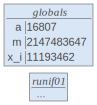
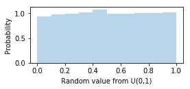

# 4.1 生成均匀的随机数

> 原文：[Generating Uniform Random Numbers](https://github.com/parrt/msds501/blob/master/notes/random-uniform.ipynb)
> 
> 译者：[飞龙](https://github.com/wizardforcel)
> 
> 协议：[CC BY-NC-SA 4.0](http://creativecommons.org/licenses/by-nc-sa/4.0/)

<!--break-->

> **Q**：如何生成随机字符串？
> 
> **A**：把一个新学生放在 vi 编辑器前面，让他/她退出。
> 
> -- Emiliano Lourbet (@taitooz)


要执行基于计算机的模拟，我们需要能够生成随机数。 生成均匀分布的随机数是最容易的，并且是标准编程语言的“给我一个随机数”函数。 这是一个 Python 会话示例：

```python
import random
print(random.random())
print(random.random())
print(random.random())

'''
0.3562460099444431
0.8189486725857756
0.8483609628240635
'''
```

均匀随机变量非常重要，因为它们是我们生成其他随机变量的基础，如二项，正态，指数等。

## 讨论

我们可以通过访问以太网网络设备上的噪声来生成实际随机数，但噪声可能不是均匀分布的。 我们通常会生成伪随机数，这些伪随机数不是随机的，而是看起来像。 从 Ross' Simulation 一书中，我们看到一个非常简单的递归机制（递归关系），使用 [模/余数](https://en.wikipedia.org/wiki/Modulo_operation)操作生成`[0,1)`中的值：

```
x{i+1} = a xi modulo m
```

这是递归的（或迭代的而不是*闭式*），因为`xi`是先前值的函数：

```
x1 = a x0 modulo m
x2 = a x1 modulo m
x3 = a x2 modulo m
x4 = a x3 modulo m
...
```

Ross 表示`xi`在`[0, m-1]`中，但设置任何`xi = 0`会使所有后续`xi = 0`，所以我们应该避免这种情况。 实际上，然后，此方法返回`(0,1)`中的值。

要从`xi`获得`[0,1)`中的随机数，我们计算`xi / m`。

我们必须为`a`和`m`选择一个使`xi`看似随机的值。 Ross 建议为`m`选择一个大的素数，它符合我们的整数的字大小，例如`m = 2 ^ 31  -  1`，`a = 7 ^ 5 = 16807`。

最初我们为`x0`设置了一个值，称为*随机种子*（它不是第一个随机数）。 每个种子都会产生不同的伪随机数序列。 （在 Python 中，您可以使用`random.seed(x)`来设置标准库的种子。）

## Python 实现

我们的目标是采用这个简单的递归公式并使用它来生成统一的随机数。 函数`runif01()`为每个调用*返回一个新的随机值*。 使用`m = 2 ^ 31  -  1`，`a = 7 ^ 5 = 16807`，初始种子`x0 = 666`。

```python
a = 16807
m = pow(2,31)-1
DFLT_SEED = 666
x_i = DFLT_SEED # this is our x_i that changes each runif01() call

def runif01():
    "Return a random value in U(0,1)"
    global x_i
    x_i = a * x_i % m
#    display(callsviz(varnames=['a','m','x_i']))
    return x_i / float(m)
```

请注意，`xi`位于全局空间而不是`runif()`空间。

```python
from lolviz import callsviz
runif01()

# 0.005212361926777457
```



让我们试试它：

```python
[runif01() for i in range(4)]

'''
[0.21940766983637944,
 0.5847069400291457,
 0.1695410698510432,
 0.4767609864830789]
'''
```

### 练习

定义一个新函数`runif(a, b)`，它生成`[a,b)`中的随机数而不是`[0,1]`。 提示：我们需要缩放和移动`[0,1)`中的均匀随机值。 注意：*您不能在本实验中使用`random.random()`或任何其他内置随机数生成器。*

```python
def runif(a,b):
    "Return a random value in U(a,b)"
    ...
```


```python
def runif(a,b):
    "Return a random value in U(a,b)"
    if b<a: # swap
        t = a
        a = b
        b = t
        
    return runif01()*(b-a) + a

print([runif(0,10) for i in range(3)])
print([runif(5,6) for i in range(3)])

'''
[5.931631259588352, 2.926579901448721, 7.028403648654187]
[5.638012293091981, 5.072609996922599, 5.356218278108266]
'''
```

### 练习

定义一个新函数`setseed(x)`，它更新`seed`全局变量。

```python
def setseed(s):
    "Update the seed global variable but ensure seed > 0"
    ...
```

测试序列：

```python
setseed(501)
print runif01()
print runif01()
print runif01()
```

应该生成：

```
0.00392101099897
0.900431859726
0.558266419712
```


```python
def setseed(s):
    "Update the seed global variable but ensure seed > 0"
    global x_i
    if s <= 0: s = 666
    x_i = s

setseed(501)

print([runif01() for i in range(3)])
print([runif(5,6) for i in range(3)])

'''
[0.003921010998972231, 0.9004318597262874, 0.5582664197116468]
[5.783716093648093, 5.916385943496779, 5.698552350373265]
'''
```


### 随机数密度函数估计

稍微向前走一步，我们可以将[数据操纵和可视化](data.ipynb)中的直方图绘制示例，用作密度估计的粗略形式，来验证随机值的分布是近似均匀的：

```python
import matplotlib.pyplot as plt
# jupyter notebook command (ignore)
%matplotlib inline 

sample = [runif01() for i in range(5000)] # Get 5000 random variables
plt.figure(figsize=(4, 1.5))
plt.hist(sample, bins=10, density=True, alpha=0.3)
plt.xlabel('Random value from U(0,1)')
plt.ylabel('Probability')
plt.show()
```



在生成伪随机数的情况下，我们感兴趣的是由递归关系生成的值序列。 现在我们将注意力转向迭代方法，它循环到递归关系的值收敛为止。
