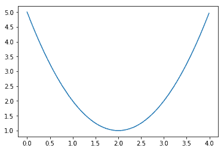
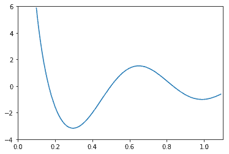
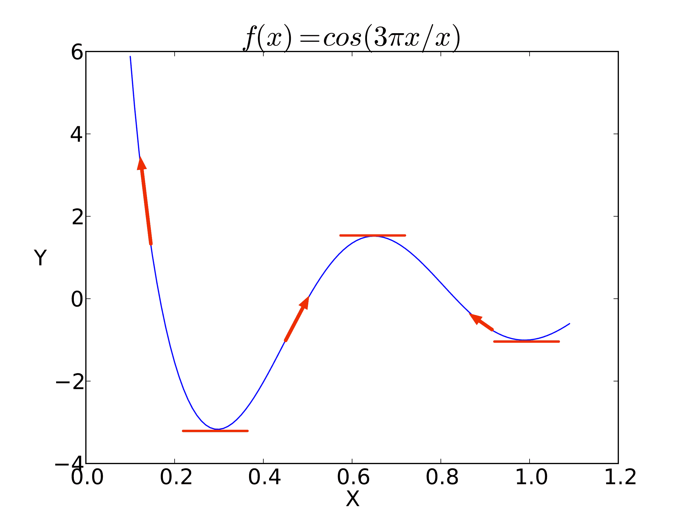
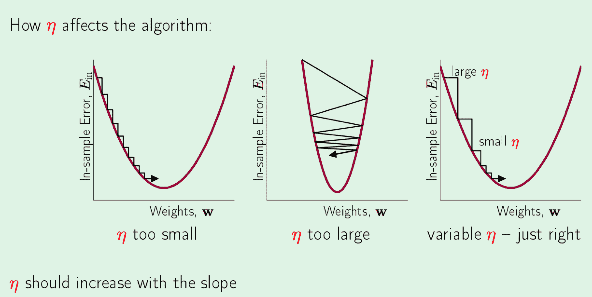
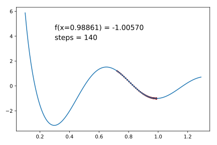
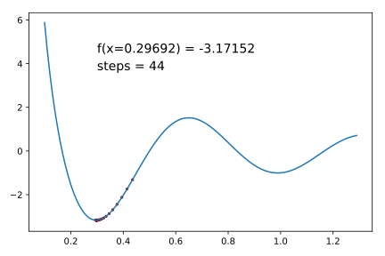
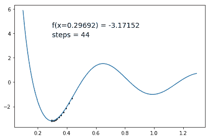

# 4.3 单变量梯度下降

> 原文：[Iterative Optimization Via Gradient Descent](https://nbviewer.jupyter.org/github/parrt/msan501/blob/master/notes/gradient-descent.ipynb)
> 
> 译者：[飞龙](https://github.com/wizardforcel)
> 
> 协议：[CC BY-NC-SA 4.0](http://creativecommons.org/licenses/by-nc-sa/4.0/)


本讲座/实验的目标是解决一个重要的迭代计算问题：*梯度下降函数最小化*。 我希望你会看到梯度下降与平方根近似相同，只是具有不同的递归关系。 本课程的完整[源代码在这里](https://github.com/parrt/msan501/blob/master/notes/code/descent.py)。

## 讨论

找到最小化或“优化”函数`f(x)`（通常在某个范围内）的`x`是一项非常重要的操作，因为我们可以使用它来最小化风险，并且对于机器学习，可以学习我们的分类器或预测器的参数。 例如，深度学习使用成本函数优化来训练神经网络。 通常`x`将是一个向量，但我们假设`x`是一个标量来学习基础知识。 如果我们知道函数像二次多项式一样是凸的，那么有一个独特的解决方案，我们可以简单地将导数设置为零并求解`x`：

```
f'(x) = 0
```

这基本上是在问“这个函数在哪里变平？” 例如，函数`f(x) = (x-2)^2 + 1`的导数为`f'(x) = 2x - 4`，其零点为`x = 2`。

```python
import matplotlib.pyplot as plt
import numpy as np

def f(x): return (x - 2)**2 + 1

graphx = np.arange(0, 4, 0.01)
graphy = f(graphx) # apply f to all of graphx (BROADCAST)
plt.plot(graphx, graphy)
plt.show()
```



```python
def foo(x): 
    print(type(x))
    return (x - 2)**2 + 1
foo(2), foo(10)

'''
<class 'int'>
<class 'int'>

(1, 65)
'''
```

```python
X = np.array([1,2,3])
foo(X)

'''
<class 'numpy.ndarray'>

array([2, 1, 2])
'''
```

我们更喜欢找到`f(x)`的*全局最小值*，但通常必须满足*局部最小值*，我们希望它接近全局最小值。 找到全局最小值的一个不错的方法是通过随机初始化`x0`的位置，找到一些局部最小值，然后选择所发现的`f(x)`最小的最小值的`x`。 例如，函数`f(x) = cos(3\pi x) / x`在`[0,1.3]`中有两个最小值，其中一个是明显的全局最小值：

```python
def f(x): return np.cos(3 * np.pi * x) / x

graphx = np.arange(.1, 1.1, 0.01)
graphy = f(graphx)
plt.plot(graphx, graphy)
plt.axis([0, 1.1, -4, 6])
plt.show()
```




如果函数有很多最小值/最大值或非常复杂，则可能没有简单的解析解。

有许多方法可以迭代地（即非解析地）找到函数最小值，但我们将使用一种众所周知的技术，称为*梯度下降*或*最速下降法*。

### 梯度下降

梯度下降需要一个起始位置，`x0`，优化函数，`f(x)`及其导数`f'(x)`。 回想一下，导数只是特定点处函数的斜率。 换句话说，当`x`从特定位置移动时，`f(x)`是上涨还是下跌，以及涨多少？ 例如，`x ^ 2`的导数是`2x`，当`x > 0`时为正斜率，当`x < 0`时为负斜率。 梯度下降使用导数，迭代地选择`x`的新值，使我们越来越接近`f(x)`的最小值。 斜率的符号告诉我们最接近的最小值的方向（以`x`为单位）。 例如，这里再次是余弦图，这次显示了代表特定点的导数的多个向量。



注意，导数在最小值处为零，即平坦（对于最大值也是如此）。 请注意，导数（红色向量）指向最接近的最小值的相反方向。 如果我们想要朝最近的最小值方向移动，我们应该通过加上导数的相反数来调整`x`; 也就是说，我们应该从`xi`中减去导数，得到`x_{i + 1}`。 更新我们对`x`的估计来最小化`f(x)`的递归关系就是：

```
x_{i+1} = xi - η f'(xi)
```

其中`η`被称为*学习率*，我们将在下面讨论。` η f'(xi)`一项表示我们采取的最小步骤的大小。

基本的算法为：

+   选取初始值`x0`，让`x = x0`
+   让`x_{i+1} = xi - η f'(x_i)` 直到`f'(x_i)=0`

该算法非常简单，但在处理计算机的有限精度时，知道何时停止算法是个问题。 具体来说，没有两个浮点数真的相等。所以`f'(x) = 0`总是假的。通常我们会这样做：

```
abs(x_{i+1} - xi) < precision
```

精度是一些非常小的数字，如 0.0000001。 我们也可以测试一下

```
abs(f(x_{i+1}) - f(xi)) < precision
```

看看函数是否变平或者是否有一个非常小的垂直变化，**和**`f(x_{i+1})`是否正在回升。第三种方法是测试导数是否接近于零。 我尝试了所有这三个，并发现只检查`x_ {i + 1}`是否收敛是最好的（例如，它允许我具有非常高的学习率）。 第三种方法是有问题的，因为我们使用有限差分，这是对真实导数的不良近似。

我们采取的步骤按学习率`η`缩放。 Yaser S. Abu-Mostafa 有一些[很棒的幻灯片](http://www.amlbook.com/slides/iTunesU_Lecture09_May_01.pdf)和你应该看的视频。以下是他在幻灯片 21 中对学习率如何影响收敛的描述：



`x`的范围也会影响学习率。 这是一个非常复杂的挑剔的任务，那些在该领域经验丰富的人告诉我，这是一个挑选学习率，起始位置，精确度等等的艺术。 您可以从较低的学习率开始，然后将其调高，来确定您是否仍在收敛而不会在最小值附近摆动。 可以在[数值秘籍](http://apps.nrbook.com/fortran/index.html)中找到梯度下降和其他最小化技术的优秀描述。

### 使用有限差分来近似导数

有时，导数很难，昂贵，或者无法通过解析（符号）找到。 例如，某些函数本身就是迭代的，甚至是必须优化的模拟。`f(x)`可能没有闭式。 为了解决这个问题并减少输入要求，我们可以估算出特定`x`值附近的导数。 这样我们可以优化任何合理的表现良好的函数（左右连续性很好）。 我们的最小化器只需要一个起始位置和`f(x)`，而不是`f'(x)`，这使我们的用户的生活更加简单，我们的最小化器更加灵活。

为了近似导数，我们可以采取几种方法。 最简单的是比较。由于我们真的只需要一个方向，我们所要做的就是将当前的`f(xi)`与两个方向上的小步（`h`）进行比较：`f(xi - h)`和`f(xi + h)`。 如果`f(xi - h) < f(xi)`，我们应该将`x{i+1}`移到`xi`的左边。 如果`f(xi + h) < f(xi)`，我们应该向右移动`x{i+1}`。 这些被称为后向和前向差异，但也存在中心差异。 优秀的文章[随机梯度下降技巧](http://research.microsoft.com/pubs/192769/tricks-2012.pdf)有很多计算梯度的实用信息......

使用斜率的方向是有效的，但不会很快收敛。 我们真正想要的是使用斜率的模，来使算法在陡的地方变快，浅的地方变慢，，因为它将接近最小值。 因此，我们应该使用变化的模或速率，而不仅仅使用有限差分的符号。 在递推关系中，用我们的（前向）有限差分替换导数，我们得到一个类似的公式：

```
x{i+1} = xi - η (f(xi+h) - f(xi)) / h , where  f'(x) ~ (f(xi+h) - f(xi)) / h
```

为了简化操作，我们可以将步长`h`折叠到学习率`η`常数中，因为我们无论如何都要选择它。

```
x{i+1} = xi - η (f(xi+h) - f(xi))
```

当斜率越大时，步长越大，当接近最小值时，步长变小（因为该区域更平坦）。 Abu-Mostafa 在他的幻灯片中指出，`η`应该随坡度增加而增加，但我们保持固定并允许有限差分增加步长。 我们没有像他那样将导数/差分归一化为单位向量（参见他的幻灯片）。

## 一个实现

我们的目标是使用梯度下降来最小化`f(x) = cos(3 pi x) / x`。 为了增加找到全局最小值的几率，我们可以使用标准 python 的`random.uniform()`，在`[0.1,1.3]`范围内选择一些随机起始位置，并对所有这些位置执行梯度下降。为了观察我们的最小化器，我们最终将绘制`x`的轨迹，表明我们的梯度下降所采取的步骤。 下面是两个示例下降，其中显示了`x`和`f(x)`值以及最小值：





回想一下我们的平方根讲义，我们有一个迭代方法的基本大纲：

```python
x_prev = initial value
while True:
    x_next = function-giving-next-value(x_prev)
    if abs(x_next - x_prev) < precision:
        return x_next
```

为了实现我们的梯度下降，我们只需用`xi - η (f(xi+h) - f(xi))`替换`function-giving-next-value`：

```python
def minimize(f, x0, eta, h, precision):
    x = x0
    while True:
        prev = x
        finite_diff = f(x + h) - f(x)	 # division by h rolls into learning rate
        x = x - eta * finite_diff 		# decelerates x step as it flattens out
        if abs(x - prev) < precision:
            return x   # x is coordinate where f(x) is a minimum
```

选择一个合适的步长值`h`，对于通过有限差分获得良好的导数近似非常重要，但这足以避免因精度不足而导致的错误结果（在计算机中减去两个浮点数会使精度低于原始数字）。 您希望该数字足够小，以便您的算法不会在最小值附近振荡。 如果`η`太大，则递归关系将计算有限差分，使得`x{i + 1}`跳过函数的另一个最小值。 我们还必须选择学习率`η`，这样我们可以走得尽可能快，但不要太快，以至于`x{i + 1}`来回越过最小值。 当我把学习率提高太多时，我看到算法在振荡：

```
...
f(2.470932790352) = -0.109488272790 , delta = -0.39601471581233022023
f(2.099265953523) = 0.282655040497 , delta = 0.39214331328753893047
f(2.474216657712) = -0.097250083113 , delta = -0.37990512360965078553
f(2.100529851383) = 0.277900324077 , delta = 0.37515040718930170449
f(2.478172114663) = -0.082429682649 , delta = -0.36033000672594917013
...
```

这里有一些不错的参数以及我们如何调用最小化函数：

```python
import random
ETA = 10
h = 0.0001
PRECISION = 0.0000001 # can't be too small as f(x)-f(xprev) prec is low
def f(x): return np.cos(3*np.pi*x) / x
x0 = random.uniform(.1, 1.2)
minx = minimize(f, x0, ETA, h, PRECISION)
print(f"f({minx}) = {f(minx)}")

# f(0.9886073570106972) = -1.0056986067028884
```

为了帮助您了解程序正在执行的操作，您可以打印`x`，`f(x)`以及您认为有助于查看程序如何探索曲线的任何其他值。在循环中：


```python
print(f"f({x:.12f}) = {f(x):.12f} delta = {delta:.20f}")
```

## 显示最小化轨迹

如果我们可视化它，而不是打印出来，那么理解最小化函数所采用的路径就非常简单了。 我们需要的第一件事是该函数的一个版本，它保留了所有`x`值的轨迹：

```python
def minimize_trace(f, x0, eta, h, precision):
    tracex = [x0]
    x = x0
    while True:
        prev = x
        finite_diff = f(x + h) - f(x)  # /h rolls into learning rate
        x = x - eta * finite_diff  # decelerates x step as it flattens out
        tracex.append(x)
        if abs(x - prev) < precision:
            return tracex
```

接下来，我们导入 matplotlib 库以进行绘图，然后定义以下展示函数。

```python
import matplotlib.pyplot as plt

def viz_trace(x0, minimizer):
    # Plot the damped sine curve
    graphx = np.arange(.1, 1.3, 0.01)
    graphy = [f(x) for x in graphx] # or just f(graphx)!
    plt.plot(graphx, graphy)

    # Minimize and get trace of x locations
    tracex = minimizer(f, x0, ETA, h, PRECISION)

    # Plot the trace
    tracey = [f(x) for x in tracex]
    plt.scatter(tracex, tracey, color="darkred", marker='o', s=5)
    
    # Add some text describing trace
    plt.text(0.3, 4.5, f"f(x={tracex[-1]:.5f}) = {f(tracex[-1]):.5f}",
             fontsize=14)
    plt.text(0.3, 3.7, f"steps = {len(tracex)}", fontsize=14)
    plt.tight_layout()
    plt.savefig("img/cos-trace-2minima-another.svg")
    plt.show()
```

为了测试该例程，我们传递一些随机的起始点并让它显示轨迹：

```python
# every time you run this, it'll start at new initial location and find nearest minimum
import time
random.seed(int(round(time.time() * 1000))) # get new pseudo-random sequence each time
x0 = random.uniform(.1, 1.3)
viz_trace(x0, minimize_trace)
```


# 使用符号导数

比起有限差分的解，使用[符号导数](https://m.wolframalpha.com/input/?i=derivative+cos%283*pi*x%29+%2F+x)，我们可以做得更好。我们可以使用 Wolfram Alpha 或[其他工具](https://www.derivative-calculator.net/#expr=cos%283%2Api%2Ax%29%20%2F%20X＆showsteps=1)对任何函数做这件事。 理论上有限差分很好，但它们对于有限精度浮点数（即在计算机上）不起作用。 减法会破坏精度，尤其是当操作数非常相似时。

```
d/dx(cos(3pi x)/x) = (-3pi x sin(3pi x) + cos(3pi x))/x^2
```


```python
def minimize_dx(f, x0, eta, h, precision):
    tracex = [x0]
    x = x0
    while True:
        prev = x
        dx = - (3 * np.pi * x * np.sin(3*np.pi*x) + np.cos(3 * np.pi * x)) / x**2
        x = x - eta * dx 		# decelerates x step as it flattens out
#         if len(tracex)<300:
#             print(f"x={x:.3f}, dx={dx:.3f}")
        tracex.append(x)
        if abs(x - prev) < precision:
            return tracex
```


```python
ETA = 0.001
random.seed(int(round(time.time() * 1000))) # get new pseudo-random sequence each time
x0 = random.uniform(.1, 1.3)
viz_trace(x0, minimize_dx)
```





## 总结

许多数学计算问题需要迭代解。 其中最重要的是最小化误差函数来训练机器学习模型。 好消息是，这里描述的梯度下降方法，遵循我们在近似平方根时看到的简单迭代方法。 下一步是将梯度下降扩展为两个变量，您将作为一个项目来解决回归（直线拟合）问题。
