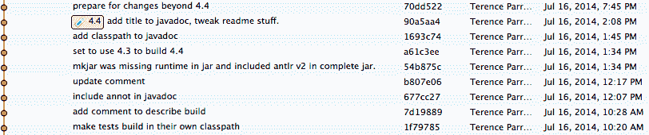

# 5.2 使用 git 版本控制工具

> 原文：[Introduction to git and revision control](https://github.com/parrt/msds501/blob/master/notes/git.md)
> 
> 译者：[飞龙](https://github.com/wizardforcel)
> 
> 协议：[CC BY-NC-SA 4.0](http://creativecommons.org/licenses/by-nc-sa/4.0/)


**动机**。 每个商业开发人员都在工作时使用版本控制。 您将遇到的每家公司都使用它。 仅仅因为这个原因，您需要学习版本控制来在商业环境中发挥作用。 在本课程中，您还将使用版本控制（一种名为`git`的系统）来提交您的作品。

对于我们在 MSAN 中的目的，我们将忽略程序员常规使用的大多数非平凡功能，例如分支和合并。 Git 非常复杂，如果没有优秀的`github.com`，它将不是我的首选。

在本实验中，目标是基本了解版本控制和 git / github 的工作原理。 我们将借此机会，通过开始使用图像项目仓库来学习主要的 git 命令。

这是一个互动式[ git “游戏”](https://github.com/git-game/git-game)，来帮助您学习。 网上有很多[课程资料](https://lab.github.com/courses)。

## 版本控制入门

让我绕个弯子，你应该备份你的笔记本电脑。想象一下你的笔记本电脑丢了。 你的所有工作将在哪里？不见了。 我推荐 Carbonite 或 Mozy。 就个人而言，我的计算机旁边有一个本地 Timemachine OS X 备份硬盘，每小时拍摄一次快照。 它跟踪与前一个快照的差异，而不是再次复制整个硬盘驱动器（缓慢/浪费）。 然后，我使用 Carbonite 进行异地云备份，当我晚上睡觉时备份。

使用这种多层备份策略，是思考程序员如何使用版本控制的好方法。 git 有点像 Time Machine，一个本地备份，github.com 有点像 Carbonite 异地云备份。 版本控制系统和备份系统之间的区别在于，我们指示版本控制系统**什么时候生成快照**。 每个快照应该是对文件所做的逻辑工作块。备份系统自动拍摄快照。

我们不仅告诉版本控制系统何时拍摄快照，我们还告诉它**快照是什么**。 您处理的每个项目都在一个目录中，与该项目关联的所有文件都位于该子树中的某个位置。 文件集称为*仓库*，在任何给定时间，我的计算机都有很多这样的存储库。

`git`存储库实例只是磁盘上的一个目录，但它也有一个`.git`（隐藏）目录。 该目录包含一个完整的数据库，其中包含存储库中发生的所有事情，因为它是使用`git init`创建的（或者因为你从 github 克隆了它）。 如果要丢弃存储库，只需从磁盘中删除整个子树。没有通知中央服务器。 每个存储库实例都是一个完整的副本，因此您可以拥有 10 个存储库版本，这些存储库位于不同目录中，从同一磁盘上的原始存储库克隆。

**跟踪变化**

与 Time Machine 备份一样，git 跟踪快照与上次请求快照时的差异。 每个快照都被称为*提交*（并且程序员将这些提交视为*事务*。）您应该请求提交来锁定逻辑工作块，例如功能添加或错误修复。 拥有完整的更改列表非常有用。例如，这是一个块，取自 ANTLR 存储库中我的提交，由 [SourceTree](https://www.sourcetreeapp.com) git GUI 所示：




您可以返回并查看对存储库的任何提交所做的更改。 无论是使用 PyCharm 还是 git，我发现回顾最近的提交来查看哪些更改引入了错误非常重要。 有时我决定放弃一小部分正在做的事情并将文件翻转回旧版本。 如果你走错了路并希望恢复所有这些变化，git 可以很容易地做到这一点。 它甚至可以将存储库重置为某些早期提交的状态。

**github.com 上的镜像仓库**

继续这个类比，github.com 就像我使用的基于云的异地备份。 我们通常会在 github.com 上保留我们本地存储库的完整副本。与提交更改一样，我们还必须将本地存储库*推送*到 github。每次推送都可以确保完整的文件集和 git 更改数据库（在`.git`子目录中）备份到了 Github 上。 当然，作为这样的副作用，您现在拥有了您的工作的备份。 丢失你的笔记本电脑并不是灾难性的，至少就你的工作而言。

使用 github 的原因是我也可以访问你的存储库，而我无法访问你的笔记本电脑硬盘。 为了给项目评分，我将将您的存储库*克隆*到我的硬盘上。 如果你进行了更改，我可以*拉取*那些。我也可以编辑你的代码来发表评论，然后将我的存储库副本*推*回 github，然后你可以将这些更改*拉*回你的硬盘。 一切都是同步的，它不会错误地覆盖更改。 这是多个程序员之间的沟通方式，并且有点超出了这个介绍性的课程，但你至少应该在抽象中意识到这一点。

还有一种情况是，您可以使用 github.com 在两台不同的计算机上处理相同的软件，例如笔记本电脑和台式机。 拥有两台具有相同软件的计算机意味着它们具有副本。 这会使您可能覆盖软件的正确/最新版本。 或者，您会忘记您已经对笔记本电脑进行了更改，但现在已经在桌面上进行了一系列更改。 您在两台不同的计算机上进行了更改 解决问题可能很棘手且容易出错，所以我们`push/pull`到/从 github 来保持同步。

## 图像项目入门

您将收到一个指向 github 的链接，该链接是为图像项目创建存储库的邀请。 在您接受之后，它将为您提供指向私有存储库的链接（只有您和我可以看到存储库的内容）。 我的 github id 是`parrt`，所以我的 URL 是：

```
https://github.com/USF-MSAN501/images-parrt
```

我教的每个课程都将在 github 上拥有自己的组织，在这种情况下：`https://github.com/USF-MSAN501`。每个人在 github 的目录下都有一个存储库，每个项目一个。

我们的第一步是从 github *克隆*空存储库到我们的本地磁盘上。从您的 github 存储库页面，复制 HTTPS URL，如下所示：


如果选择 SSH 版本，则需要我们为身份验证设置 SSH 密钥。这是你最后想要做的，但就目前而言，不要担心，只需使用 HTTPS。

**克隆到你的笔记本**

现在，打开终端或其他 bash shell 程序并创建一个目录，该目录将以有序的方式容纳所有 MSAN 项目。 我强烈建议您创建一个整体目录，在该目录下为每个课程创建一个目录。 从命令行看起来像这样：

```bash
$ pwd             # print working directory
/Users/parrt     
$ mkdir classes   # make directory called classes
$ cd classes      # change current working directory to classes
$ mkdir msan501   # create directory msan501 under classes
$ cd msan501      # jump into msan501
```


不要在您创建的任何文件名或目录中使用空格。 许多开源项目是在 UNIX 下开发的，UNIX 讨厌文件名中的空格。 如果你使用空格，东西会神秘地无效。

根据您设置 shell 的方式，您可能会看到`$`提示符左侧的当前工作目录。 这是我的提示符：

```bash
beast:~/classes/msan501 $ 
```

我的机器名称是beast，`~`是`/Users/parrt`的简写或者你的用户 ID。

现在我们有了一个合适的结构，是时候在`/Users/parrt/classes/msan501`下克隆你的存储库了：

```bash
$ git clone https://github.com/USF-MSAN501/images-parrt.git
Cloning into 'images-parrt'...
warning: You appear to have cloned an empty repository.
$ cd images-parrt/
$ ls
```

克隆后，在`msan501`下有一个名为`images-YOURID`的空目录。 您可以在此目录下完成所有工作。**此目录称为存储库**。从技术上讲，它不是空的，如果你在`ls`命令中使用`-a`选项，请求当前目录中的所有文件，你将看到 git 用来存储快照的子目录：

```bash
$ ls -a
./                 ../                .git/
```

**由 git 管理的文件**

在 github 上创建存储库并在本地克隆它之后，你可以在 git 管理的目录下创建各种文件，但是 git 忽略它们直到你“添加”它们。 `add`命令基本上通知存储库它应该关心该文件。 你可以放置你想要的任何其他文件。 除非你“添加”它们，否则 Git 会忽略它们。

从 github 下载[`images-starterkit.ipynb`](https://github.com/parrt/msan501/blob/master/projects/images-starterkit.ipynb)到您的`images-YOURID`目录，并将其命名为`images.ipynb`。 大牛在一个命令中下载和重命名，不需要浏览器：

```bash
$ curl -o images.ipynb https://github.com/parrt/msan501/raw/master/projects/images-starterkit.ipynb
  % Total    % Received % Xferd  Average Speed   Time    Time     Time  Current
                                 Dload  Upload   Total   Spent    Left  Speed
100 41311    0 41311    0     0  87895      0 --:--:-- --:--:-- --:--:-- 87895
$ ls
images.ipynb
```

如果没有安装`curl`，请使用`brew`进行安装。

**制作快照（提交）**

我们在目录中有一个文件，但是 git 不知道它应该跟踪它。 我们必须明确地将它添加到版本控制：

```bash
$ git add images.ipynb
$ git status
On branch master

Initial commit

Changes to be committed:
  (use "git rm --cached <file>..." to unstage)

	new file:   images.ipynb
...
```

此时，我们可以自由添加更多文件或更改该文件。 当我们想制作快照时，我们提交更改：

```bash
$ git commit -a -m 'initial add'
[master (root-commit) b40aca4] initial add
 1 file changed, 9 insertions(+)
 create mode 100644 images.ipynb
```

`-m`是在命令行后面指定提交消息的选项。 您可以放心地忽略`-a`的含义，但请确保始终在提交命令中使用它。

在提交之前，文件更改位于所谓的暂存区域中。 这有点像把所有东西放在一个盒子里（添加），然后邮寄盒子（提交）。

**推回到 github**

每次执行提交时，都会创建文件当前状态的快照。 Git 跟踪每次提交的更改集和提交消息，我们可以轻松检索：

```bash
$ git log
commit b40aca41ed4b94731a2ec87e9c11a60a1a4ef234
Author: parrt <parrt@cs.usfca.edu>
Date:   Fri Jun 30 12:50:42 2017 -0700

    initial add
```


在您明确推回到 github 之前，github 不知道您在本地磁盘上对存储库进行了更改。 Git 知道原始存储库的来源，但它不会在提交时自动将任何内容推送到 github。 Commit 用于本地存储库，push 用于与远程存储库同步。远程存储库称为*来源（origin）*。 使用以下命令询问 git 它认为来源是什么：

```
$ git remote -v
origin	https://github.com/USF-MSAN501/images-parrt.git (fetch)
origin	https://github.com/USF-MSAN501/images-parrt.git (push)
```

好吧，让我们将我们的更改（我们添加一个文件）推回给 github：

```bash
$ git push origin master
Counting objects: 3, done.
Delta compression using up to 8 threads.
Compressing objects: 100% (2/2), done.
Writing objects: 100% (3/3), 408 bytes | 0 bytes/s, done.
Total 3 (delta 0), reused 0 (delta 0)
To github.com:USF-MSAN501/images-parrt.git
 * [new branch]      master -> master
```

该消息中有很多内容，但如果没有错误，那么你很高兴。 *master*就是我们所说的分支，你将始终在`master`分支中工作。

在你对 git 和 github 非常熟悉之前，你应该总是检查 github 上的远程存储库来验证你的推送是否成功。 刷新你的`https://github.com/USF-MSAN501/images-parrt` URL 的版本，它应该显示文件`images.ipynb`（以及你推送的任何其他文件）。 一旦下载，解压缩，“添加”[图像项目 zip](https://github.com/parrt/msan501/blob/master/projects/images-expected-output.zip?raw=true)，并推回到 github，您的 github 页面应如下所示：


确保您要为项目提交的所有文件都在本地正确提交，然后再推回到 github！
 
**做出更改**

您可以进行更改并使用其他提交将其锁定。（确保在`git commit`上使用`-a`选项。）

```bash
...change existing file images.ipynb from jupyter lab...
$ git commit -a -m 'what I did to images notebook'
```

**删除文件**

删除由 git 跟踪的文件也被视为更改，但您也可以显式使用`git rm`*文件名*，这就是我所做的。

```bash
$ git rm foo.py
$ git commit -a -m 'I do not need foo anymore'
```

**检查仓库的差异**

如果您进行了更改并想知道它与当前存储库版本的不同之处，请使用`diff`：

```bash
$ ... tweak images.ipynb ...
$ git diff images.ipynb # kinda sucks with notebooks
...
```

**还原**

如果你搞砸了并且想丢弃自上次提交以来**所有东西**，请进行硬重置（确保使用`--hard`选项）：

```bash
$ ... tweak whatever you want ...
$ git reset --hard HEAD
```

这会丢弃自上次提交以来的所有更改。 如果您只想将未提交的更改还原为单个文件，则可以运行以下命令：

```bash
$ git checkout -- filename
```

我认为他们把这种有趣的破折号选项称为“稀疏模式”。（怎么叫都随便。）
