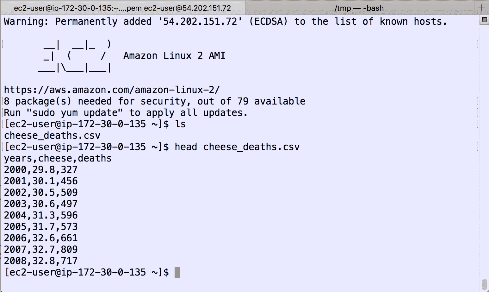
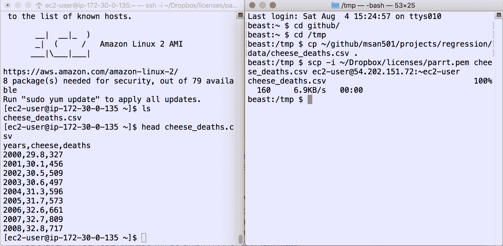
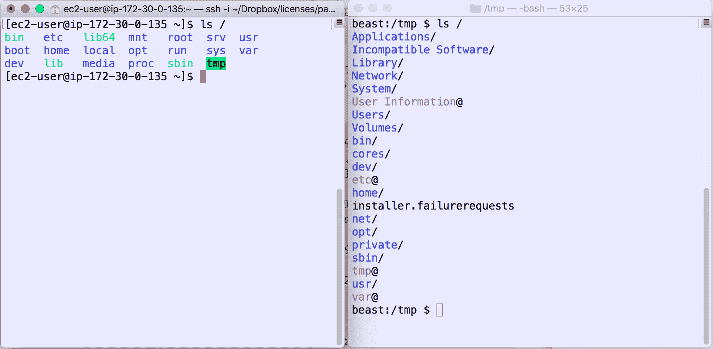

# 5.3 在 Amazon Web Services 上启动虚拟机

> 原文：[Launching a Virtual Machine at Amazon Web Services](https://github.com/parrt/msds501/blob/master/notes/aws.md)
> 
> 译者：[飞龙](https://github.com/wizardforcel)
> 
> 协议：[CC BY-NC-SA 4.0](http://creativecommons.org/licenses/by-nc-sa/4.0/)


本实验的目的是教您在 *Amazon Web Services* 上创建 Linux 机器，登录并将一些数据复制到该机器。

以下是我为 MSAN692 制作的视频，其中显示了[如何启动 AWS 实例并启动基于 Python 的 Web 服务器](https://www.youtube.com/watch?v=qQncEJL6NHs&t=2s)。

##  讨论

登录 AWS 并转到[ AWS 控制台](http://aws.amazon.com/console)并单击“EC2”链接。


单击“启动实例”，这将启动过程，在云中创建虚拟机。 实例只是一个虚拟机。


选择“Amazon Linux 2 AMI”条目，该条目应该是第一个。 这是一个常用的“映像”，它使得 Linux 机器包含许多有用的东西，从该列表中可以看到，例如 Python 和 MySQL。 在有人在 Linux 机器上正确安装软件之后，映像只是磁盘的快照。 这意味着我们不必在每次创建新机器时都安装软件。


选择实例类型`t2.micro`，它应该是列出的第一个机器类型。 这台机器功率非常低，但足以让你玩玩。 点击“查看并启动”。


这将打开一个屏幕，描述我们正在启动的实例的详细信息。 暂时忽略所有这些，只需点击右下方的“查看并启动”即可。 这会打开一个摘要页面，我们可以根据需要进行检查，但只需点击右下角的“启动”即可。

这将打开一个对话框来选择密钥对。 密钥对允许您安全地访问服务器并防止未经授权的访问。 *第一次*，您需要创建一个新的密钥对。 将其命名为您的用户 ID，然后单击“下载密钥对”。 它将下载`userid.pem`文件，这是您进入机器的安全凭据。将该文件保存在安全位置。如果丢失了，您将无法进入您创建的机器。 从现在开始，您可以重用该预先存在的密钥。


下载后，单击“启动实例”。 你应该看到类似的东西：


单击`i-...`链接转到显示实例的 EC2 控制台。


单击您的实例，您应该会在底部看到一个描述框。 查找“公共IP”地址，在这种情况下为`54.196.174.210`：


我们必须等到状态停止显示“正在初始化”，这可能需要几分钟。

## 连接到远程服务器

单击页面顶部的“连接”按钮，将弹出一个对话框，告诉您如何连接到服务器。 您想要使用“独立 SSH 客户端”链接来连接（Java 现在是浏览器中的安全风险，因此我们无法使用该选项。）在内部您将看到连接到您的计算机所需的`ssh`命令。 如果您有 Windows，则会显示一个链接，向您展示如何使用名为 PuTTY 的 SSH 客户端。


在我们连接之前，我们必须确保计算机上的每个人都看不到安全文件（其他用户）。 否则 ssh 将不允许我们连接，因为安全文件不安全：

```bash
@@@@@@@@@@@@@@@@@@@@@@@@@@@@@@@@@@@@@@@@@@@@@@@@@@@@@@@@@@@
@         WARNING: UNPROTECTED PRIVATE KEY FILE!          @
@@@@@@@@@@@@@@@@@@@@@@@@@@@@@@@@@@@@@@@@@@@@@@@@@@@@@@@@@@@
Permissions 0644 for '/Users/parrt/Dropbox/licenses/parrt.pem' are too open.
It is required that your private key files are NOT accessible by others.
This private key will be ignored.
bad permissions: ignore key: /Users/parrt/Dropbox/licenses/parrt.pem
Permission denied (publickey).
```

哇！执行这个：

```bash
$ cd ~/Dropbox/licenses
$ ls -l parrt.pem
-rw-r--r--@ 1 parrt  parrt  1696 Aug  4 15:15 /Users/parrt/Dropbox/licences/parrt.pem
```

要修复权限，我们可以使用您的操作系统具有的 GUI 来“显示文件信息”，或者从命令行执行以下操作：

```bash
$ cd ~/Dropbox/licenses
$ chmod 400 parrt.pem
```

它像这样改变了权限：

```bash
$ ls -l parrt.pem
-r--------@ 1 parrt  501  1696 Aug  1 12:12 /Users/parrt/Dropbox/licenses/parrt.pem
```

如果您不明白究竟发生了什么，请不要担心。 它基本上是说，该文件仅仅对我，当前用户，来说可读可写，任何其他人没有权限。

对于 mac 和 linux 用户，我们将直接使用命令行中`ssh`命令。它将是这样的：

```bash
ssh -i parrt.pem ec2-user@54.196.174.210
```

当然，您必须提供`userid.pem`文件的完整路径名。 所以我需要输入：

```bash
ssh -i ~/Dropbox/licenses/parrt.pem ec2-user@54.196.174.210
```

尝试再次连接，它现在会警告您之前从未连接过该机器。 同样，这是一项安全措施。 你可以在这里简单地说“是”。

```bash
$ ssh -i parrt.pem ec2-user@54.196.174.210
The authenticity of host '54.196.174.210 (54.196.174.210)' can't be established.
ECDSA key fingerprint is SHA256:BYGiV2qRthhw52HQni5vnoRtiT16cplmdbXAuXqQdqc.
Are you sure you want to continue connecting (yes/no)? yes
Warning: Permanently added '54.196.174.210' (ECDSA) to the list of known hosts.
Last login: Thu Aug  4 20:04:07 2016 from sentinel.cs.usfca.edu

       __|  __|_  )
       _|  (     /   Amazon Linux AMI
      ___|\___|___|

https://aws.amazon.com/amazon-linux-ami/2016.03-release-notes/
8 package(s) needed for security, out of 17 available
Run "sudo yum update" to apply all updates.
[ec2-user@ip-172-30-0-97 ~]$ 
```

`$`是你的提示符，就像你在本地机器上使用终端 /shell 一样，但是你给远程服务器而不是本地机器发出命令。

## 多个 shell

你可以从`Terminal.app`点击`command-T`并获得多个标签，一个用于远程主机，一个用于本地/笔记本电脑：



或者在`Terminal.app`中使用`command-N`获取两个窗口。



通过在两台计算机上执行命令`ls /`，来验证远程计算机不是您的笔记本电脑：


 
## 上传数据或代码

要将数据提供给服务器，如果文件很小，可以剪切和粘贴。 例如，将以下数据剪切并粘贴到该远程计算机上主目录中名为`coffee`的文件中。 首先从这些笔记中复制这些数据：

```bash
3 parrt
2 jcoker
8 tombu
```

然后在远程计算机上启动`nano`编辑器：

```bash
[ec2-user@ip-172-30-0-97 ~]$ nano coffee
```

将数据粘贴到该文件中并键入`control-X`，然后单击“是”以保存文件。 退出后应该返回到提示符。

```bash
[ec2-user@ip-172-30-0-97 ~]$ cat coffee # print it back out
3 parrt
2 jcoker
8 tombu
$ 
```

对于较大的文件，我们需要使用安全 copy `scp`命令，与安全 shell `ssh`具有相同参数结构。在笔记本电脑上运行另一个 shell。 下载数据文件[`cheese_deaths.csv`](https://raw.githubusercontent.com/parrt/msan501/master/projects/regression/data/cheese_deaths.csv)，并存储在笔记本上，您当前正在处理笔记本命令行的目录中。现在，在笔记本电脑上的 shell 中，使用以下命令（类似于`ssh`）将其复制到远程计算机：

```bash
$ scp -i ~/Dropbox/licenses/parrt.pem cheese_deaths.csv ec2-user@54.196.174.210:~ec2-user
cheese_deaths.csv                                100%  160     6.9KB/s   00:00
$ 
```

不要忘记该行末尾的`~ec2-user`。 该命令的一般形式是：

```bash
scp -i your-pem-file file-to-copy user@machine-name:directory-on-remote-machine
```

从连接到远程服务器的 shell，请求目录列表，您将看到新文件：

```bash
[ec2-user@ip-172-30-0-135 ~]$ ls
cheese_deaths.csv
[ec2-user@ip-172-30-0-135 ~]$ head cheese_deaths.csv 
years,cheese,deaths
2000,29.8,327
2001,30.1,456
2002,30.5,509
2003,30.6,497
2004,31.3,596
2005,31.7,573
2006,32.6,661
2007,32.7,809
2008,32.8,717
```

要退出远程服务器，请在`$`提示符下键入`exit`或使用`^ D`。 机器仍在运行，但您不再通过笔记本电脑连接它。

玩转你的实例，然后**当你完成时终止你的实例**，否则将继续向你收取使用该机器的费用。在 AWS 控制台上右键单击实例，然后选择“实例状态”，然后选择子菜单“终止”。 它会警告您所有本地存储都将消失。 点击“是，终止”按钮。 完成后应该如下所示：


如果你点击“停止”，它会停止机器，但仍然会向你收费。 另一方面，这很有用，因为您可以重新启动该计算机而无需执行整个过程。 您的所有数据都将完整无缺。 如果您点击“终止”，它将把机器丢弃，您将不得不再次执行此过程来获得新机器。