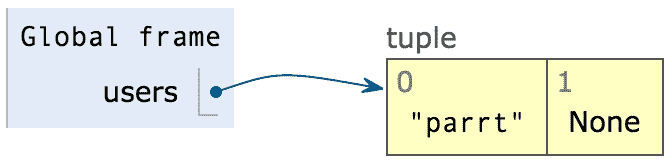
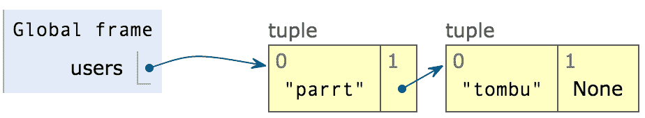
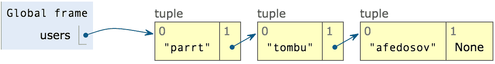

# 6.1 链表

> 原文：[Linked lists](https://github.com/parrt/msds501/blob/master/notes/linked-list.ipynb)
> 
> 译者：[飞龙](https://github.com/wizardforcel)
> 
> 协议：[CC BY-NC-SA 4.0](http://creativecommons.org/licenses/by-nc-sa/4.0/)


我们已经研究了 Python 内置的数组/列表，但它们并不总是最好的列表。 有时，我们会在列表的头部或中间插入和删除内容。 如果我们使用实现为连续数组（由内存中的连续单元组成）的列表来执行此操作，我们必须移动大量单元以为新元素腾出空间或填充删除所产生的空隙。

*链接列表*抽象列表的实现允许我们有效地插入和删除任何我们想要的东西。 这种灵活性是以更多内存为代价的。

研究链表的另一个原因是链表*节点*的概念很容易扩展，以创建分层的父子数据结构，称为*树*，然后是*图*（跟踪任何节点->节点的关系）。

*TODO*：使用 graphviz 或其他东西来可视化结构。 将树的讨论移动到单独的页面。 这个讲座进行得很快，让一些学生感到困惑，花了大约 1.5 个小时都没有讲到树。 让学生将几个笔记连在一起并将其可视化。 从元组开始然后执行 graphviz。

## 链表与数组的隐喻

想象一下，我想在课堂上点名。 由于每个人都坐在彼此旁边，即连续，我可以通过向左或向右看，从一个人指向下一个人。这就是列表的工作方式，就像连续的块一样。

链表要求每个人不仅要记住他们的名字，还要记住他们的右边（下一个指针）。 只要我记得列表中的第一个人（头部），我可以稍后给那个人打电话并询问他们的名字。 然后我可以让他们引用下一个排队的人。 即使人们分布在整个大陆或随意重新分布他们所在的位置，这也是有效的。 这些元素不要求是连续的，因为列表中的每个节点都具有到达下一个人所需的信息。

链表实现将下一个指针与每个列表值相关联。 我们称这些东西*节点*，通常是：`[value, next]`或`(value, next)`。 我们还维护指向列表的*头部*的指针，有时是列表的*尾部*。

最简单的列表有一个元素，`next`指针/引用不指向任何东西。

```python
users = ("parrt", None)
```



这是一个有两个元素的链表：

```python
users = ("parrt", ("tombu", None))
```


三个元素的：

```python
users = ("parrt", ("tombu", ("afedosov", None)))
```


在实践中，我们将使用列表而不是元组，因为元组是不可变的。 我们希望能够更改节点的`next`指针：

```python
a = ["parrt", None]
b = ["tombu", None]
c = ["afedosov", None]
users = a # points to first node of list
a[1] = b  # first node's next points to 2nd element
b[1] = c
```

链表的最基本实现只是一个*头部*指针（这里我使用`users`作为特定链表）。 创建一个空链表只需要`users = None`。

当然，我们可以存储我们想要的任何类型的对象，而不仅仅是字符串。 我们可以存储数字甚至其他列表！

## 支持代码

让我们添加一些支持代码，以便更轻松地构建和操作链表。 它使用 Python 中的一些面向对象的编程语法，如果需要，可以忽略它。 基本上，我正在定义一个名为`Node`的对象（一个数据聚合），它将有两个字段`value`和`next`。对于某些元组/列表`p`，访问字段名称要比`p[0]`和`p[1]`容易得多。

```python
class Node:
    def __str__(self):
        return "(%s,%s)" % (self.value, str(self.next))
    def __repr__(self):
        return str(self)
    def __init__(self, value, next=None):
        self.value = value
        self.next = next
```

有了这个定义，我们可以更自然地创建列表：

```python
a = Node("parrt")
b = Node("tombu")
c = Node("dmose")
print(a, b, c)

# Now link them up
users = a
a.next = b
b.next = c
print(users)

'''
(parrt,None) (tombu,None) (dmose,None)
(parrt,(tombu,(dmose,None)))
'''
```

## 在头部插入节点

好的，我们假设我们用`head = None`创建一个空链表。 要在链表的头部插入一些东西，比如`hi`，有两种情况：空列表和非空列表。 空链表是`head == None`的情况，即链表的初始条件。 一个非空的链表当然会让`head`指向一些元组。 这两种情况都可以用同样的方式处理：

```python
head = Node('hi', head)
```

这使得一个新节点持有新值`hi`和一个`next`指针，指向旧的头元组（即使是`None`）。 最后，它设置`head`指针来指向新元组。

在中间插入更复杂。 我们需要找到一个节点，在它*之后*我们要插入一些东西。 然后我们挂载新的节点。例如，要在`tombu`和`dmose`之间插入一些东西，我们创建一个新的节点，其`next`指针指向`dmose`的节点（`tombu`指向的东西）。然后 我们设置`tombu`的`next`指针来指向包含`mary`的新节点：

```python
b.next = Node("mary",b.next)
users

# (parrt,(tombu,(mary,(mary,(dmose,None)))))
```


## 遍历链表

假设我们构建了一个链表，我们如何遍历这个列表呢？ 使用数组，我们只需访问第 *i* 个值并沿列表移动 *i*。 要遍历链表，我们必须定义一个*光标*（通常称为`p`或`q`），我们可以将其视为一个手指，我们在链表中的节点之间移动。 以下是遍历链表并打印出值的代码模式：

```python
p = users
while p is not None:
    print(p.value)
    p = p.next
    
'''
parrt
tombu
mary
mary
dmose
'''
```

### 递归版本

还有另一种遍历数据结构的方法，我们称之为*递归*。 我们熟悉递归关系的概念。 在这种情况下，请注意，从链表中的任何节点开始，链表的其余部分看起来像链表。 它就像一个分形，无论你放大多少，它仍然看起来像一个分形。

递归函数调用是调用它周围函数的调用。 最明显的一个是：

```python
def f():
    f()
```

但是，这不是很有用，因为它是一个无限循环。 函数`f()`做的第一件事是调用自己，从而产生循环。 我们通常有一个终止条件，告诉它何时停止递归。

以下是我们递归遍历列表的方式：

```python
def walk(p):
    if p is None: return
    print(p.value)
    walk(p.next)

walk(users)

'''
parrt
tombu
mary
mary
dmose
'''
```


## 练习

创建一个名为`tostr`的函数，给定一个链表`head`作为参数，它返回一个括号包围的字符串，如`['parrt', 'tombu', 'dmose']`。 提示：将此问题转化为我们知道如何解决的问题。 只需将元素添加到常规 Python 列表（`[]`），就像在链表中找到它们一样; 然后使用`str()`返回该列表的字符串表示形式。

```python
def tostr(head):
    p = head
    values = []
    while p is not None:
        values.append(p.value)
        p = p.next
    return str(values)

tostr(users)

# "['parrt', 'tombu', 'mary', 'mary', 'dmose']"
```


## Exercise

Implement method `len(head)` that counts and returns the number of elements in the linked list referred to by `head`.  Return zero if the list is empty. Hint: This is just adding a counter-accumulator pattern to the list walking pattern.


```python
def len(head):
    p = head
    n = 0
    while p is not None:
        n = n + 1
        p = p.next
    return n

len(users)

# 5
```

我们还可以制作该函数的递归版本：

```python
def rlen(head):
    if head is None: return 0
    return 1 + rlen(head.next)

rlen(users)

# 5
```

## 练习

实现名为`getitem(head, i)`的方法，返回列表`head`中的第i个节点，从零开始。 提示：将一个计数器累加器循环与一个搜索循环（查找等于`i`的计数器）和列表遍历模式相结合。 考虑这一点的另一种方式是，它在前一个长度练习中添加搜索模式。

```python
def getitem(head,j):
    "Return ith node in the list starting from 0 or return None if invalid index"
    i = 0
    p = head
    while p is not None:
        if i == j:
            return p
        i = i + 1
        p = p.next
    return None

print(getitem(users, 0).value)
print(getitem(users, 1).value)
print(getitem(users, 2).value)
print(getitem(users, -1))
print(getitem(users, 999))

'''
parrt
tombu
mary
None
None
'''
```


## 删除第一个元素

要删除列表的第一个节点，我们所要做的就是将`head`指向第一个节点的`next`，注意检查空列表条件：

```python
if head is not None:
    head = head.next
```


## 树的一次尝试

一旦我们熟悉了从一个节点到另一个节点的指针/引用的概念，我们就可以扩展节点来拥有两个指针，而不仅仅是一个`next`指针。*二叉树*由具有`left`和`right`子指针的节点组成；这些指针中的一个或两个可以是`None`。 如果每个树节点最多只有一个子节点，则树会简化为链表。

树是分析中非常常见的数据结构，尤其是机器学习。 例如，有一种称为*层次聚类*的聚类形式，它构造相关元素组的树。 然后，最强大的机器学习模型之一被称为*随机森林*，它由一组决策树组成，它们协同工作来提供非常强大的预测器或分类器。

我们从正常的生物学角度颠倒树木。 树的**根**是单个节点，并在图的顶部绘制。 树的**叶子**是没有子节点的子节点。

下面是一些树节点的支持代码，除了树节点（数据聚合）包含`value`，`left`和`right`字段，你可以安全忽略它。

```python
class TNode:
    def __str__(self):
        return "(%s,%s,%s)" % (self.value, str(self.left), str(self.right))
    def __repr__(self):
        return str(self)
    def __init__(self, value, left=None, right=None):
        self.value = value
        self.left = left
        self.right = right
```

为了测试它，我们可以像链表节点一样创建节点，然后根据需要将它们连接起来：

```python
myroot = prez = TNode("Paul")
provost = TNode("Don")
som = TNode("Liz")
cas = TNode("Marcelo")

prez.left = provost
provost.left = som
provost.right = cas

prez

# (Paul,(Don,(Liz,None,None),(Marcelo,None,None)),None)
```

```python
from lolviz import *
treeviz(prez)
```


### 树的遍历

虽然最常见的是使用`while`循环来遍历链表，但最常见的是使用递归来遍历树。 例如，以下是我们如何*前序*打印树中的所有元素，这意味着在它的子节点之前打印它的值。

```python
def walk(t):
    if t is None: return
    print(t.value)
    walk(t.left)
    walk(t.right)

walk(prez)

'''
Paul
Don
Liz
Marcelo
'''
```
