# 第 1 章。Jupyter 基础知识

Jupyter Notebook 是，是使用 Python 的数据科学家最重要的工具之一。 这是因为它们是开发可重现的数据分析管道的理想环境。 可以在单个 Notebook 内全部加载，转换和建模数据，在此方便快捷地测试代码并探索思路。 此外，所有这些都可以使用格式文本“内联”记录，因此您可以自己做笔记，甚至生成结构化的报告。

其他类似的平台（例如 RStudio 或 Spyder）为用户提供了多个窗口，这些窗口促进了繁重的任务，例如在周围复制和粘贴代码以及重新运行已经执行的代码。 这些工具还倾向于涉及**读取评估提示循环**（**REPL**），其中代码在已节省内存的终端会话中运行。 这种开发环境不利于可重复性，也不适合开发。 Jupyter Notebook 通过为用户提供一个在其中执行代码段并内联显示输出的窗口，解决了所有这些问题。 这使用户可以有效地开发代码，并允许他们回顾以前的工作以供参考，甚至进行更改。

我们将通过确切地解释什么是 Jupyter Notebook 开始本课，并继续讨论为什么它们在数据科学家中如此受欢迎。 然后，我们将一起打开一个 Notebook，并进行一些练习以了解如何使用该平台。 最后，我们将深入研究第一个分析并对*基本功能和特性*进行探索性分析。

# 课程目标

在本课程中，您将：

*   了解什么是 Jupyter Notebook 及其为何对数据分析有用
*   使用 Jupyter Notebook 功能
*   学习 Python 数据科学库
*   执行简单的探索性数据分析

### 注意

本书中的所有代码都可以在代码包中作为特定于课程的 IPython 笔记本使用。 本书中的所有色图也可在代码包中找到。

# 基本功能和特性

在本节中，我们首先通过示例和讨论来证明 Jupyter Notebooks 的有用性。 然后，为了涵盖面向初学者的 Jupyter Notebooks 的基础知识，我们将在启动平台和与平台交互方面看到它们的基本用法。 对于以前使用 Jupyter 笔记本的用户，这主要是评论。 但是，您当然也会在该主题中看到新事物。

## 副题 A：什么是 Jupyter 笔记本，为什么有用？

Jupyter Notebook 是在本地运行的 Web 应用程序，其中包含实时代码，方程式，图形，交互式应用程序和 Markdown 文本。 标准语言是 Python，这就是我们将在本书中使用的。 但是，请注意，支持多种选择。 这包括其他主导数据科学语言 R：

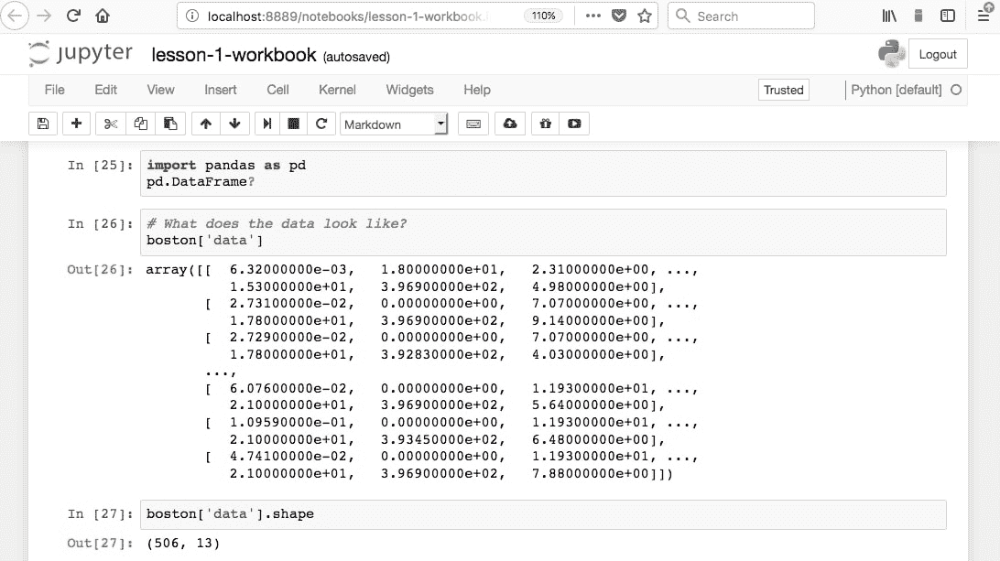

那些熟悉 R 的人会知道 R Markdown。 Markdown 文档允许将 Markdown 格式的文本与可执行代码结合在一起。 Markdown 是一种用于在网络上设置样式的简单语言。 例如，大多数 GitHub 存储库都有一个`README.md` Markdown 文件。 此格式对于基本文本格式很有用。 它可以与 HTML 媲美，但允许更少的自定义。 Markdown 中常用的符号包括将文本变成标题的哈希（`#`），用于插入超链接的方括号和圆括号，以及用于创建斜体或粗体文本的星号：


了解了 Markdown 的基础知识之后，让我们回到 R Markdown，其中 Markdown 文本可以与可执行代码一起编写。 Jupyter Notebook 提供了与 Python 相同的功能，尽管我们将看到，它们的功能与 R Markdown 文档完全不同。 例如，除非另有说明，否则 R Markdown 假定您正在编写 Markdown，而 Jupyter Notebooks 假定您正在输入代码。 这使使用 Jupyter 笔记本进行快速开发和测试更具吸引力。

从数据科学的角度来看，Jupyter 笔记本电脑有两种主要类型，具体取决于使用方式：实验室型和可交付使用。

实验室样式的笔记本旨在用作研究期刊的编程类似物。 这些应该包含您为加载，处理，分析和建模数据所做的所有工作。 这里的想法是记录您所做的一切，以备将来参考，因此通常不建议删除或更改以前的实验室样式的笔记本。 最好在分析过程中累积多个带日期戳的笔记本版本，以防您想回顾以前的状态。

可交付使用的笔记本旨在作为展示，并且应仅包含实验室样式笔记本的某些部分。 例如，这可能是一个有趣的发现，可以与您的同事共享，可以为经理提供深入的分析报告，也可以为利益相关者总结重要发现。

在这两种情况下，重要的概念都是可重复性。 如果您一直在努力记录软件版本，则收到报告的任何人都可以重新运行 Notebook 并计算与您相同的结果。 在可重复性变得越来越困难的科学界，这是新鲜空气。

## 子主题 B：浏览平台

现在，我们将打开 Jupyter 笔记本并开始学习界面。 在这里，我们将假设您没有平台的先验知识，然后介绍基本用法。

### 介绍 Jupyter 笔记本

1.  Navigate to the companion material directory in the terminal.

    ### 注意

    在 Mac 或 Linux 等 Unix 机器上，可以使用`ls`显示目录内容，并使用`cd`更改目录来完成命令行导航。

    在 Windows 计算机上，使用`dir`显示目录内容，而使用`cd`更改目录。 例如，如果要将驱动器从`C:`更改为`D:`，则应执行`d:`来更改驱动器。

2.  Start a new local Notebook server here by typing the following into the terminal:

    ```py
    jupyter notebook
    ```

    默认浏览器的新窗口或新标签页将打开 Notebook Dashboard 至工作目录。 在这里，您将看到其中包含的文件夹和文件的列表。

3.  单击文件夹以导航到该特定路径，然后通过单击打开文件。 尽管 Jupyter 的主要用途是编辑 IPYNB Notebook 文件，但 Jupyter 也可以用作标准的文本编辑器。
4.  Reopen the terminal window used to launch the app. We can see the `NotebookApp` being run on a local server. In particular, you should see a line like this:

    ```py
    [I 20:03:01.045 NotebookApp] The Jupyter Notebook is running at: http://localhost:8888/ ?token=e915bb06866f19ce462d959a9193a94c7c088e81765f9d8a
    ```

    转到该 HTTP 地址将在浏览器窗口中加载该应用程序，就像启动该应用程序时自动完成的一样。 关闭窗口不会停止应用程序； 这应该从终端通过键入 *Ctrl* + *C* 完成。

5.  通过在终端中键入 *Ctrl* + *C* 关闭应用程序。 您可能还需要输入`y`进行确认。 同时关闭 Web 浏览器窗口。
6.  加载 NotebookApp 时，有多种可用选项。 在终端中，通过运行以下命令查看可用选项的列表：

    ```py
    jupyter notebook –-help
    ```

7.  一种这样的选择是指定一个特定的端口。 通过运行以下命令，在本地端口`9000`上打开`NotebookApp`：

    ```py
    jupyter notebook --port 9000
    ```

8.  The primary way to create a new Jupyter Notebook is from the Jupyter Dashboard. Click **New** in the upper-right corner and select a kernel from the drop-down menu (that is, select something in the **Notebooks** section):

    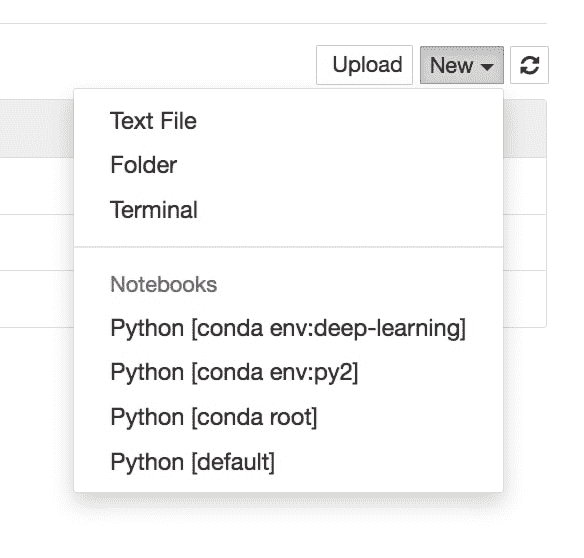

    内核为 Notebook 提供编程语言支持。 如果您在 Anaconda 中安装了 Python，则该版本应为默认内核。 Conda 虚拟环境也将在此处提供。

    ### 注意

    虚拟环境是在同一台计算机上管理多个项目的绝佳工具。 每个虚拟环境可能包含不同版本的 Python 和外部库。 Python 具有内置的虚拟环境。 但是，Conda 虚拟环境与 Jupyter Notebooks 集成得更好，并拥有其他出色的功能。 [该文档位于](https://conda.io/docs/user-guide/tasks/manage-environments.html)。

9.  With the newly created blank Notebook, click in the top cell and type `print('hello world')`, or any other code snippet that writes to the screen. Execute it by clicking in the cell and pressing *Shift* + *Enter*, or by selecting **Run Cell** in the **Cell** menu.

    单元运行时，代码的任何`stdout`或`stderr`输出将显示在下方。 此外，写在最后一行的对象的字符串表示形式也会显示在中。 这非常方便，尤其是对于显示表格而言，但有时我们不希望显示最终对象。 在这种情况下，可以在行的末尾添加分号（`;`）以抑制显示。

    默认情况下，新单元格期望并运行代码输入； 但是，可以将它们更改为呈现 Markdown。

10.  单击进入一个空单元格并将其更改为接受 Markdown 格式的文本。 这可以通过工具栏中的下拉菜单图标或通过从**单元格**菜单中选择 **Markdown** 来完成。 在此处写一些文本（任何文本都可以），确保使用 Markdown 格式符号，例如`#`。
11.  Focus on the toolbar at the top of the Notebook:

    

    工具栏中有一个“播放”图标，可用于运行单元格。 但是，正如我们稍后将看到的那样，使用键盘快捷键 Shift + Enter 来运行单元格更加方便。 在其旁边是一个停止图标，可以使用来停止运行单元。 例如，这在单元运行时间过长时非常有用：

    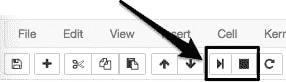

    可以从**插入**菜单中手动添加新单元格：

    

    可以使用图标或通过从**编辑**菜单中选择选项来复制，粘贴和删除单元格：

    

    

    单元也可以通过以下方式上下移动：

    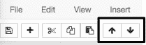

    **单元格**菜单下有一些有用的选项，可以运行一组单元格或整个笔记本：

    

12.  Experiment with the toolbar options to move cells up and down, insert new cells, and delete cells.

    关于这些笔记本电脑要了解的重要一点是单元之间的共享内存。 这非常简单：工作表中存在的每个单元格都可以访问全局变量集。 因此，例如，在一个单元格中定义的函数可以从任何其他单元调用，并且同样适用于变量。 正如人们所期望的，函数范围内的任何内容都不是全局变量，只能从该特定函数中进行访问。

13.  打开**内核**菜单以查看选择。 如果内核死了，**内核**菜单对于停止脚本执行和重新启动笔记本电脑很有用。 也可以随时在此处交换内核，但是由于对可重复性的考虑，建议不要在单个笔记本中使用多个内核。
14.  Open the **File** menu to see the selections. The **File** menu contains options for downloading the Notebook in various formats. In particular, it's recommended to save an HTML version of your Notebook, where the content is rendered statically and can be opened and viewed "as you would expect" in web browsers.

    笔记本名称将显示在左上角。 新笔记本将自动命名为**无标题**。

15.  通过单击左上角的当前名称并输入新名称来更改 IPYNB 笔记本文件的名称。 然后，保存文件。
16.  Close the current tab in your web browser (exiting the Notebook) and go to the **Jupyter Dashboard** tab, which should still be open. (If it's not open, then reload it by copy and pasting the HTTP link from the terminal.)

    由于我们没有关闭笔记本电脑，因此我们保存并退出了笔记本电脑，在 Jupyter 仪表板的**文件**部分中，它的名称旁边会有一个绿皮书符号，并将列为 **最后修改日期旁边的**。 可以从此处关闭笔记本电脑。

17.  Quit the Notebook you have been working on by selecting it (checkbox to the left of the name) and clicking the orange **Shutdown** button:

    

### 注意

如果您打算花费大量时间使用 Jupyter Notebook，则值得学习键盘快捷键。 这将大大加快您的工作流程。 要学习的特别有用的命令是用于手动添加新单元格并将单元格从代码转换为 Markdown 格式的快捷方式。 单击**帮助**菜单中的**键盘快捷方式**，以了解操作方法。

## 子主题 C：Jupyter 功能

Jupyter 具有的许多吸引人的功能，这些特征使高效的 Python 编程成为可能。 这些包括各种各样的东西，从查看文档字符串的方法到执行 Bash 命令。 让我们在本节中一起探讨其中一些功能。

### 注意

[可以在以下位置找到 IPython 的官方文档](http://ipython.readthedocs.io/en/stable/)。 它包含有关我们将在此处和其他地方讨论的功能的详细信息。

### 探索 Jupyter 的一些最有用的功能

1.  从 Jupyter 仪表板中，导航到`lesson-1`目录，然后通过选择它来打开`lesson-1-workbook.ipynb`文件。 Jupyter Notebooks 的标准文件扩展名是`.ipynb`，它在被称为 IPython Notebooks 时就引入了。
2.  Scroll down to `Subtopic C: Jupyter Features` in the Jupyter Notebook. We start by reviewing the basic keyboard shortcuts. These are especially helpful to avoid having to use the mouse so often, which will greatly speed up the workflow. Here are the most useful keyboard shortcuts. Learning to use these will greatly improve your experience with Jupyter Notebooks as well as your own efficiency:

    *   Shift + Enter 用于运行单元格
    *   Esc 键用于离开单元格
    *   M 键用于将单元格更改为 Markdown（按 Esc 后）
    *   Y 键用于更改要编码的单元格（按 Esc 后）
    *   箭头键移动单元格（按 Esc 后）
    *   Enter 键用于输入单元格

    从快捷方式继续，帮助选项对初学者和经验丰富的编码人员都非常有用。 它可以为每个不确定的步骤提供指导。

    通过在任何对象的末尾添加问号并运行单元格，用户可以获得帮助。 Jupyter 找到该对象的文档字符串，并在应用程序底部的弹出窗口中将其返回。

3.  Run the **Getting Help** section cells and check out how Jupyter displays the docstrings at the bottom of the Notebook. Add a cell in this section and get help on the object of your choice:

    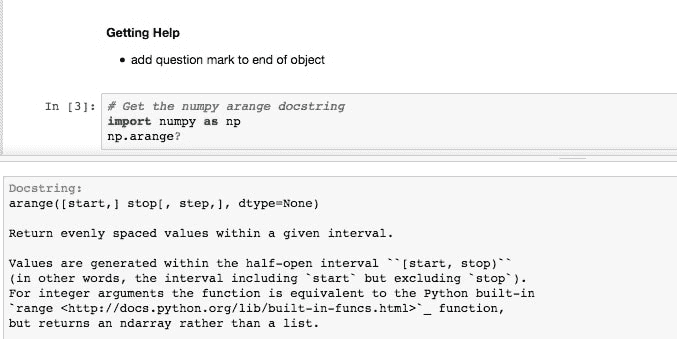

    制表符补全可用于执行以下操作：

    *   导入外部库时列出可用的模块
    *   列出导入的外部库的可用模块
    *   功能和变量完成

    当您需要了解模块的可用输入参数，探索新库，发现新模块或只是加快工作流程时，尤其有用。 它们将节省写出变量名或函数的时间，并减少了拼写错误。 制表符的完成效果非常好，以至于您可能在今天以后难以在其他编辑器中编写 Python 代码！

4.  Click into an empty code cell in the **Tab Completion** section and try using tab completion in the ways suggested immediately above. For example, the first suggestion can be done by typing `import` (including the space after) and then pressing the *Tab* key:

    

5.  Last but not least of the basic Jupyter Notebook features are **magic** commands. These consist of one or two percent signs followed by the command. Magics starting with `%%` will apply to the entire cell, and magics starting with `%` will only apply to that line. This will make sense when seen in an example.

    滚动到 **Jupyter Magic Functions** 部分，然后运行包含`%lsmagic`和`%matplotlib inline:`的单元格

    

    `%lsmagic`列出了可用的选项。 我们将讨论并显示一些最有用的示例。 您可能会看到的最常见的魔术命令是`%matplotlib inline`，它允许 matplotlib 图形显示在笔记本中，而无需显式使用`plt.show()`。

    计时功能非常方便，分为两种：标准计时器（`%time`或`%%time`）和用于测量多次迭代的平均运行时间的计时器（`%timeit`和`%%timeit`）。

6.  Run the cells in the **Timers** section. Note the difference between using one and two percent signs.

    即使使用 Python 内核（如您目前所做的那样），也可以使用魔术命令来调用其他语言。 内置选项包括 JavaScript，R，Pearl，Ruby 和 Bash。 Bash 特别有用，因为您可以使用 Unix 命令来查找当前位置（`pwd`），目录中的内容（`ls`），创建新文件夹（`mkdir`）以及写入文件内容（`cat` / `head` / `tail`）。

7.  Run the first cell in the **Using bash in the notebook** section. This cell writes some text to a file in the working directory, prints the directory contents, prints an empty line, and then writes back the contents of the newly created file before removing it:

    

8.  Run the following cells containing only `ls` and `pwd`. Note how we did not have to explicitly use the Bash magic command for these to work.

    有很多可以安装的外部魔术命令。 流行的是`ipython-sql`，它允许在单元格中执行 SQL 代码。

9.  If you've not already done so, install `ipython-sql` now. Open a new terminal window and execute the following code:

    ```py
    pip install ipython-sql
    ```

    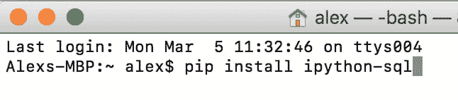

10.  Run the `%load_ext sql` cell to load the external command into the Notebook:

    

    这样就可以连接到远程数据库，以便可以直接在 Notebook 内部执行查询（并记录在文档中）。

11.  Run the cell containing the SQL sample query:

    

    在这里，我们首先连接到本地 sqlite 来源； 但是，该行可能指向本地或远程服务器上的特定数据库。 然后，我们执行一个简单的`SELECT`来显示如何将单元转换为运行 SQL 代码而不是 Python。

12.  Moving on to other useful magic functions, we'll briefly discuss one that helps with documentation. The command is `%version_information`, but it does not come as standard with Jupyter. Like the SQL one we just saw, it can be installed from the command line with `pip`.

    如果尚未完成，请立即使用`pip`从终端安装版本文档工具。 打开一个新窗口并运行以下代码：

    ```py
    pip install version_information
    ```

    安装后，可以使用`%load_ext version_information`将其导入任何笔记本电脑。 最后，一旦加载，它就可以用于显示笔记本电脑中每个软件的版本。

13.  Run the cell that loads and calls the `version_information` command:

    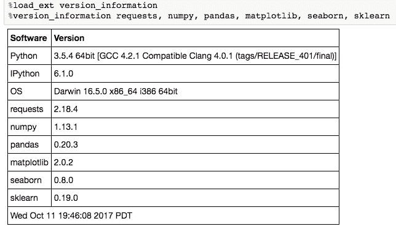

### 将 Jupyter Notebook 转换为 Python 脚本

您可以将 Jupyter Notebook 转换为 Python 脚本。 这等效于将每个代码单元的内容复制并粘贴到单个`.py`文件中。 Markdown 部分也包含在注释中。

可以从`NotebookApp`或在命令行中进行转换，如下所示：

```py
jupyter nbconvert --to=python lesson-1-notebook.ipynb
```


例如，当您要使用`pipreqs`之类的工具确定笔记本的库要求时，此功能很有用。 该工具确定项目中使用的库，并将它们导出到`requirements.txt`文件中（可以通过运行`pip install pipreqs`进行安装）。

从包含`.py`文件的文件夹外部调用该命令。 例如，如果`.py`文件位于名为`lesson-1`的文件夹中，则可以执行以下操作：

```py
pipreqs lesson-1/
```


`lesson-1-workbook.ipynb`的结果`requirements.txt`文件如下所示：

```py
cat lesson-1/requirements.txt
matplotlib==2.0.2
numpy==1.13.1
pandas==0.20.3
requests==2.18.4
seaborn==0.8
beautifulsoup4==4.6.0
scikit_learn==0.19.0
```

## 子主题 D：Python 库

现在看到了 Jupyter Notebook 的所有基础知识，甚至还有一些更高级的功能，我们将注意力转移到本书中将要使用的 Python 库中。 通常，库会扩展默认的 Python 函数集。 常用标准库的示例是`datetime`，`time`和`os`。 这些之所以称为标准库，是因为它们是每个 Python 安装中的标准库。

对于使用 Python 的数据科学，最重要的库是外部的，这意味着它们不是 Python 的标准配置。

本书中将使用的外部数据科学库是 NumPy，Pandas，Seaborn，matplotlib，scikit-learn，Requests 和 Bokeh。 让我们简单介绍一下。

### 注意

使用行业标准导入库是个好主意，例如，通过`import numpy as np;`这样可以提高代码的可读性。 尽量避免执行`from numpy import *`之类的事情，因为您可能会无意间覆盖函数。 此外，将模块通过点（`.`）链接到库通常很不错，以提高代码的可读性。

*   **NumPy** 提供了多维数据结构（数组），可以在其中执行的操作要比标准 Python 数据结构（例如，列表）快得多。 这部分是通过使用 C 在后台执行操作来完成的。NumPy 还提供了各种数学和数据操作功能。
*   **熊猫**是 Python 对 R DataFrame 的回答。 它以 2D 表格结构存储数据，其中列代表不同的变量，行代表样本。 Pandas 提供了许多方便的数据整理工具，例如填写 NaN 条目和计算数据的统计描述。 使用 Pandas DataFrames 将是本书的重点。
*   **Matplotlib** 是一款受 MATLAB 平台启发的绘图工具。 熟悉 R 的可以将其视为 ggplot 的 Python 版本。 它是用于绘制图形的最受欢迎的 Python 库，并允许进行高级别的自定义。
*   **Seaborn** 是作为 matplotlib 的扩展，其中包括对数据科学有用的各种绘图工具。 一般来说，与使用诸如 matplotlib 和 scikit-learn 之类的库手动创建*相同的东西*相比，这样做可以更快地完成分析。**
*   **scikit-learn** 是最常用的机器学习库。 它提供了一流的算法和非常优雅的 API，其中实例化了模型，然后*使*与数据匹配。 它还提供了对预测分析有用的数据处理模块和其他工具。
*   **请求**是用于发出 HTTP 请求的转到库。 它使从网页获取 HTML 以及与 API 交互变得很简单。 为了解析 HTML，许多人选择 BeautifulSoup4，我们还将在本书中进行介绍。
*   **散景**是一个交互式可视化库。 它的功能类似于 matplotlib，但是允许我们将悬停，缩放，单击以及使用其他交互式工具添加到绘图中。 它还使我们能够在 Jupyter Notebook 内部渲染和玩游戏。

介绍了这些库之后，让我们回到笔记本并通过运行`import`语句加载它们。 这将使我们进入第一个分析，最后我们开始使用数据集。

### 导入外部库并设置绘图环境

1.  Open up the `lesson 1` Jupyter Notebook and scroll to the `Subtopic D: Python Libraries` section.

    就像常规 Python 脚本一样，可以随时将库导入到 Notebook 中。 最佳做法是将您使用的大多数软件包放在文件顶部。 有时在笔记本中途加载东西是有意义的，这完全可以。

2.  Run the cells to import the external libraries and set the plotting options:

    

    对于一个不错的 Notebook 设置，设置各种选项以及顶部的导入通常很有用。 例如，可以执行以下操作来将图形外观更改为比 matplotlib 和 Seaborn 默认设置更美观的外观：

    ```py
    import matplotlib.pyplot as plt
    %matplotlib inline
    import seaborn as sns
    # See here for more options: https://matplotlib.org/users/customizing.html
    %config InlineBackend.figure_format='retina'
    sns.set() # Revert to matplotlib defaults
    plt.rcParams['figure.figsize'] = (9, 6)
    plt.rcParams['axes.labelpad'] = 10
    sns.set_style("darkgrid")
    ```

到目前为止，本书已经介绍了使用 Jupyter Notebooks 进行数据科学的基础知识。 我们首先探索平台并找到围绕界面的方法。 然后，我们讨论了最有用的功能，其中包括制表符补全和魔术功能。 最后，我们介绍了将在本书中使用的 Python 库。

下一部分将非常互动，因为我们将使用 Jupyter Notebook 一起执行我们的第一个分析。

# 我们的第一个分析-波士顿住房数据集

到目前为止，本课程重点介绍 Jupyter 的功能和基本用法。 现在，我们将其付诸实践，并进行一些数据探索和分析。

我们将在本节中看到的数据集是所谓的*波士顿住房数据集*。 它包含有关波士顿市区各个地区房屋的美国人口普查数据。 每个样本对应一个唯一的区域，并具有大约十二个小节。 我们应该将样本视为行，将度量视为列。 该数据于 1978 年首次发布，非常小，仅包含约 500 个样本。

现在，我们对数据集的上下文有所了解，让我们为探索和分析制定一个粗略的计划。 如果适用，该计划将适应正在研究的相关问题。 在中，目标不是回答问题，而是演示 Jupyter 的实际操作并举例说明一些基本的数据分析方法。

我们进行此分析的一般方法是执行以下操作：

*   使用 Pandas DataFrame 将数据加载到 Jupyter 中
*   定量了解功能
*   寻找模式并提出问题
*   回答问题的问题

## 子主题 A：使用 Pandas DataFrame 将数据加载到 Jupyter 中

通常，数据存储在表中，这意味着可以将其保存为**逗号分隔的变量**（**CSV**）文件。 使用 Pandas 库，可以将这种格式以及许多其他格式作为 DataFrame 对象读入到 Python 中。 其他常见格式包括**制表符分隔的变量**（**TSV**），SQL 表和 JSON 数据结构。 实际上，熊猫支持所有这些。 但是，在此示例中，我们不会以这种方式加载数据，因为可以直接通过 scikit-learn 获得数据集。

### 注意

加载数据进行分析后，重要部分是确保数据干净。 例如，我们通常需要处理丢失的数据，并确保所有列都具有正确的数据类型。 我们在本节中使用的数据集已经清理完毕，因此我们无需担心。 但是，我们将在第二课中看到更混乱的数据，并探讨处理这些数据的技术。

### 加载波士顿住房数据集

1.  In the `lesson 1` Jupyter Notebook, scroll to `Subtopic A` of `Our First Analysis: The Boston Housing Dataset`.

    可以使用`load_boston`方法从`sklearn.datasets`模块访问 Boston 住房数据集。

2.  Run the first two cells in this section to load the Boston dataset and see the `datastructures` type:

    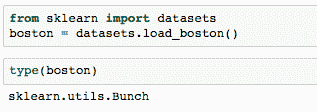

    第二个单元格的输出告诉我们这是一个 scikit-learn `Bunch`对象。 让我们获得更多有关此的信息，以了解我们正在处理的内容。

3.  Run the next cell to import the base object from scikit-learn `utils` and print the docstring in our Notebook:

    

    读取生成的文档字符串表明它基本上是一本字典，并且基本上可以这样对待。

4.  Print the field names (that is, the keys to the dictionary) by running the next cell.

    我们发现这些字段是不言自明的：`['DESCR', 'target', 'data', 'feature_names']`。

5.  Run the next cell to print the dataset description contained in `boston['DESCR']`.

    请注意，在此调用中，我们明确希望打印该字段值，以使 Notebook 以比字符串表示形式更可读的格式呈现内容（也就是说，如果我们只键入`boston['DESCR']`而没有将其包装在`print`语句）。 然后，我们将数据集信息视为先前总结的：

    ```py
    Boston House Prices dataset
    ===========================
    Notes
    ------
    Data Set Characteristics:  
        :Number of Instances: 506 
        :Number of Attributes: 13 numeric/categorical predictive
        :Median Value (attribute 14) is usually the target
       :Attribute Information (in order):
            - CRIM     per capita crime rate by town
    …
    …
            - MEDV     Median value of owner-occupied homes in $1000's
        :Missing Attribute Values: None
    ```

    这里特别重要的是功能说明（在`Attribute Information`下）。 在分析过程中，我们将使用作为参考。

    ### 注意

    有关完整的代码，请参考`Lesson 1`文件夹中的`Lesson 1.txt`文件。

    现在，我们将创建一个包含数据的 Pandas DataFrame。 这出于以下几个原因是有好处的：我们的所有数据都将包含在一个对象中，可以使用有用且计算效率高的 DataFrame 方法，而其他诸如 Seaborn 之类的库都具有可以很好地与 DataFrames 集成的工具。

    在的情况下，我们将使用标准的构造函数方法创建 DataFrame。

6.  Run the cell where Pandas is imported and the docstring is retrieved for `pd.DataFrame`:

    

    该文档字符串显示了 DataFrame 输入参数。 我们要为数据输入`boston['data']`，并为标头使用`boston['feature_names']`。

7.  Run the next few cells to print the data, its shape, and the feature names:

    

    查看输出，我们看到我们的数据在 2D NumPy 数组中。 运行命令`boston['data'].shape`，分别返回长度（样本数）和特征数作为第一和第二输出。

8.  Load the data into a Pandas DataFrame `df` by running the following:

    ```py
    df = pd.DataFrame(data=boston['data'], columns=boston['feature_names'])
    ```

    在机器学习中，正在建模的变量称为目标变量； 这就是您要预测的给定功能。 对于此数据集，建议的目标是 **MEDV**，即房屋价值中位数（以 1,000 美元计）。

9.  Run the next cell to see the shape of the target:

    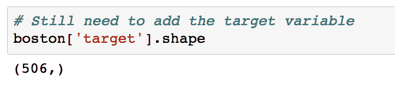

    我们看到与特征具有相同的长度，这正是我们所期望的。 因此，可以将其作为新列添加到 DataFrame 中。

10.  通过使用以下命令运行单元格，将目标变量添加到`df`：

    ```py
    df['MEDV'] = boston['target']
    ```

11.  To distinguish the target from our features, it can be helpful to store it at the front of our DataFrame.

    通过使用以下命令运行单元格，将目标变量移至`df`的前面：

    ```py
    y = df['MEDV'].copy()
    del df['MEDV']
    df = pd.concat((y, df), axis=1)
    ```

    在这里，我们引入了一个虚拟变量`y`来保存目标列的副本，然后再将其从 DataFrame 中删除。 然后，我们使用 Pandas 串联函数将其与沿第 1 轴（而不是第 0 轴，后者组合行）的其余 DataFrame 组合在一起。

    ### 注意

    您经常会看到点标记用于引用 DataFrame 列。 例如，以前我们可以完成`y = df.MEDV.copy()`。 但是，这不适用于删除列。 `del df.MEDV`会引发错误。

12.  Now that the data has been loaded in its entirety, let's take a look at the DataFrame. We can do `df.head()` or `df.tail()` to see a glimpse of the data and `len(df)` to make sure the number of samples is what we expect.

    在接下来的几个单元格中运行，以查看`df`的头，尾和长度：

    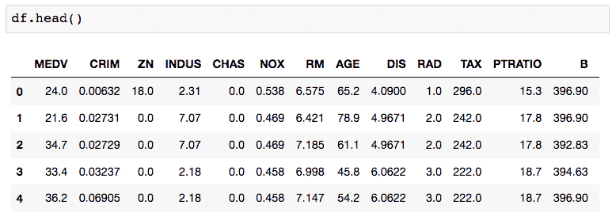

    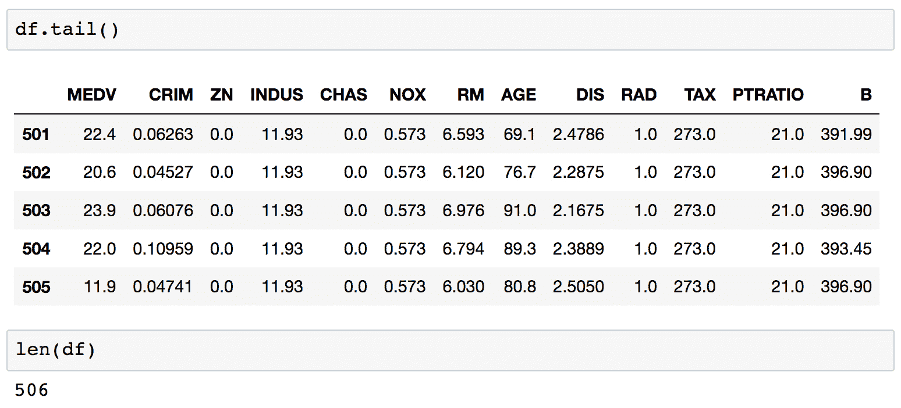

    每行都标有一个索引值，如表左侧的粗体所示。 默认情况下，它们是一组整数，从 0 开始，每行递增一个。

13.  Printing `df.dtypes` will show the datatype contained within each column.

    运行下一个单元格以查看每一列的数据类型。

    对于此数据集，我们看到每个字段都是浮点数，因此很可能是连续变量，包括目标。 这意味着预测目标变量是一个回归问题。

14.  The next thing we need to do is clean the data by dealing with any missing data, which Pandas automatically sets as `NaN` values. These can be identified by running `df.isnull()`, which returns a Boolean DataFrame of the same shape as `df`. To get the number of NaNs per column, we can do `df.isnull().sum()`.

    运行下一个单元格以计算每列中`NaN`值的数量：

    

    对于此数据集，我们看到没有 NaN，这意味着我们在清理数据方面没有立即要做的工作并且可以继续。

15.  To simplify the analysis, the final thing we'll do before exploration is remove some of the columns. We won't bother looking at these, and instead focus on the remainder in more detail.

    通过运行包含以下代码的单元格来删除一些列：

    ```py
    for col in ['ZN', 'NOX', 'RAD', 'PTRATIO', 'B']:
        del df[col]
    ```

## 子主题 B：数据探索

由于这是我们从未见过的全新数据集，因此这里的首要目标是了解数据。 我们已经看到了数据的文本描述，这对于定性理解很重要。 现在，我们将计算定量描述。

### 探索波士顿住房数据集

1.  Navigate to `Subtopic B: Data exploration` in the Jupyter Notebook and run the cell containing `df.describe()`:

    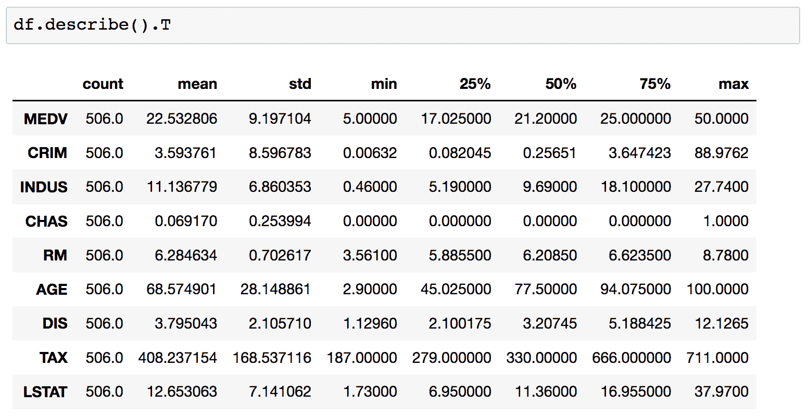

    这将计算各种属性，包括每列的平均值，标准偏差，最小值和最大值。 该表提供了有关所有内容分配方式的高级思路。 注意，我们通过在输出中添加`.T`对结果进行了转换。 这将交换行和列。

    继续进行分析，我们将指定一组要关注的列。

2.  运行定义了这些“焦点列”的单元格：

    ```py
    cols = ['RM', 'AGE', 'TAX', 'LSTAT', 'MEDV']
    ```

3.  This subset of columns can be selected from `df` using square brackets. Display this subset of the DataFrame by running `df[cols].head()`:

    

    提醒一下，让我们回顾一下这些列的含义。 从数据集文档中，我们有以下内容：

    ```py
            - RM       average number of rooms per dwelling
            - AGE      proportion of owner-occupied units built prior to 1940
            - TAX      full-value property-tax rate per $10,000
            - LSTAT    % lower status of the population
            - MEDV     Median value of owner-occupied homes in $1000's
    ```

    为了在此数据中查找模式，我们可以开始使用`pd.DataFrame.corr`计算成对相关性。

4.  Calculate the pairwise correlations for our selected columns by running the cell containing the following code:

    ```py
    df[cols].corr()
    ```

    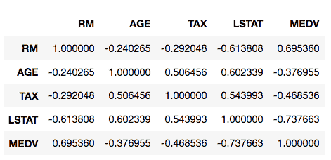

    此结果表显示了每组值之间的相关性得分。 较大的正面分数表示强烈的正面（即，朝着同一方向）相关。 如预期的那样，我们在对角线上看到最大值 1。

    ### 注意

    皮尔逊系数定义为两个变量之间的协方差，除以它们的标准偏差的乘积：

    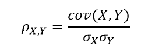

    协方差定义如下：

    

    *n* 是样本数， *x* *<sub>i</sub>* 和 *y* *<sub>i</sub>* 是要累加的各个样本，和是每组的平均值。

    与其费力地看着前面的表格，不如用热图可视化它。 使用 Seaborn 可以轻松做到这一点。

5.  Run the next cell to initialize the plotting environment, as discussed earlier in the lesson. Then, to create the heatmap, run the cell containing the following code:

    ```py
    import matplotlib.pyplot as plt
    import seaborn as sns
    %matplotlib inline
    ax = sns.heatmap(df[cols].corr(),
                     cmap=sns.cubehelix_palette(20, light=0.95, dark=0.15))
    ax.xaxis.tick_top() # move labels to the top
    plt.savefig('../figures/lesson-1-boston-housing-corr.png',
                bbox_inches='tight', dpi=300)
    ```

    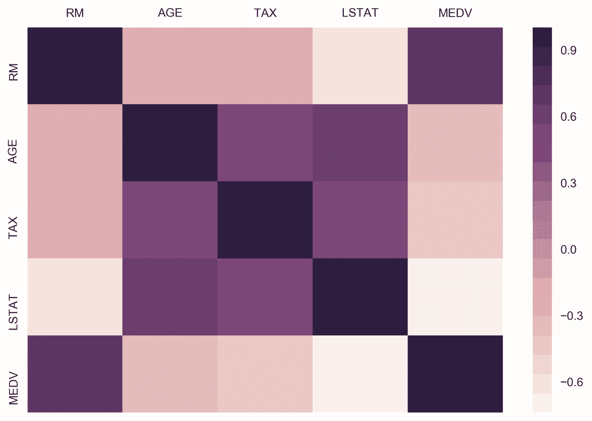

    我们称`sns.heatmap`，并将成对相关矩阵作为输入。 我们在此处使用自定义调色板来覆盖 Seaborn 的默认设置。 该函数返回一个`matplotlib.axes`对象，该对象由变量`ax`引用。 然后将最终图形作为高分辨率 PNG 保存到`figures`文件夹。

6.  For the final step in our dataset exploration exercise, we'll visualize our data using Seaborn's `pairplot` function.

    使用 Seaborn 的`pairplot`函数可视化 DataFrame。 运行包含以下代码的单元格：

    ```py
    sns.pairplot(df[cols], 
                 plot_kws={'alpha': 0.6},
                 diag_kws={'bins': 30})
    ```

    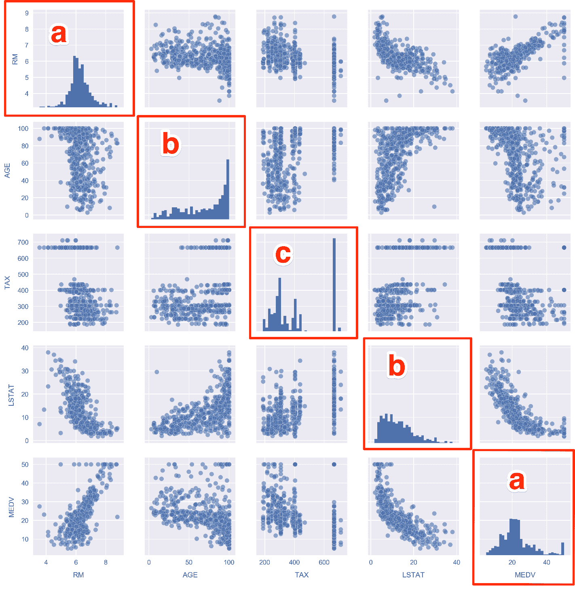

以前使用热图可视化相关性的简单概述，此图使我们可以更详细地查看这些关系。

查看对角线上的直方图，我们看到以下内容：

*   **a**：**RM** 和 **MEDV** 具有最接近正态分布的形状。
*   **b**：**AGE** 偏向左侧，**LSTAT** 偏向右侧（这似乎是违反直觉的，但偏斜是根据均值的位置定义的 相对于最大值）。
*   **c**：对于 **TAX**，我们发现大量分布在 700 左右。这从散点图中也很明显。

仔细观察右下角的 **MEDV** 直方图，我们实际上会看到类似于 **TAX** 的东西，其中有一个上限为$ 50,000 的大上限。 回想一下当我们执行`df.describe()`时，**MDEV** 的最小值和最大值分别为 5k 和 50k。 这表明数据集中的房屋中位价上限为 50k。

## 子主题 C：使用 Jupyter Notebooks 进行预测分析的简介

继续我们对波士顿住房数据集的分析，我们可以看到它给我们带来了回归问题，在该问题中，我们根据给定的特征预测了一个连续的目标变量。 特别是，我们将预测中位数房屋价值（**MEDV**）。 我们将训练仅采用一项功能作为输入进行预测的模型。 这样，模型将在概念上易于理解，并且我们可以将更多精力放在 scikit-learn API 的技术细节上。 然后，在下一课中，您将更轻松地处理相对复杂的模型。

### 带有 Seaborn 和 scikit-learn 的线性模型

1.  Scroll to `Subtopic C: Introduction to predictive analytics` in the Jupyter Notebook and look just above at the pairplot we created in the previous section. In particular, look at the scatter plots in the bottom-left corner:

    

    请注意，每间房屋的房间数（**RM**）和低阶层人口的百分比（**LSTAT**）与房屋中位数（**MDEV**）。 让我们提出以下问题：给定这些变量，我们如何预测 **MDEV**？

    为了帮助回答这个问题，让我们首先使用 Seaborn 可视化关系。 我们将与最佳拟合线性模型一起绘制散点图。

2.  Draw scatter plots along with the linear models by running the cell that contains the following:

    ```py
    fig, ax = plt.subplots(1, 2)
    sns.regplot('RM', 'MEDV', df, ax=ax[0],
                scatter_kws={'alpha': 0.4}))
    sns.regplot('LSTAT', 'MEDV', df, ax=ax[1],
                scatter_kws={'alpha': 0.4}))
    ```

    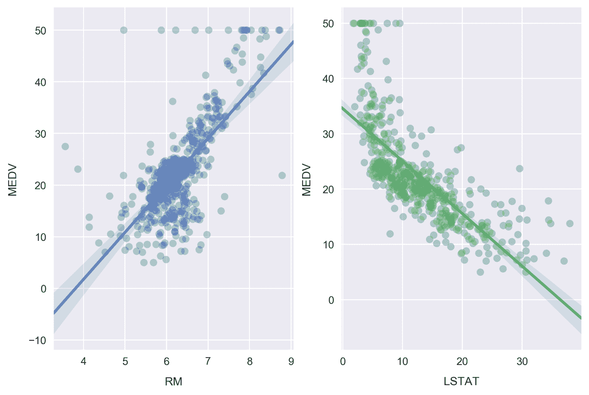

    最佳拟合线是通过最小化普通最小二乘误差函数来计算的，当我们调用`regplot`函数时，Seaborn 会自动执行。 还要注意线条周围的阴影区域，代表 95％的置信区间。

    ### 注意

    通过获取垂直于最佳拟合线的仓中数据的标准偏差，有效地确定沿最佳拟合线的每个点的置信区间，可以计算出这 95％的置信区间。 在实践中，这涉及 Seaborn 引导数据，该过程是通过随机采样替换产生新数据的过程。 自举的样本数是根据数据集的大小自动确定的，但也可以通过传递`n_boot`参数来手动设置。

3.  Seaborn can also be used to plot the residuals for these relationships. Plot the residuals by running the cell containing the following:

    ```py
    fig, ax = plt.subplots(1, 2)
    ax[0] = sns.residplot('RM', 'MEDV', df, ax=ax[0],
                          scatter_kws={'alpha': 0.4})
    ax[0].set_ylabel('MDEV residuals $(y-\hat{y})$')
    ax[1] = sns.residplot('LSTAT', 'MEDV', df, ax=ax[1],
                          scatter_kws={'alpha': 0.4})
    ax[1].set_ylabel('')
    ```

    

    这些残差图上的每个点都是该样本（`y`）与线性模型预测（`ŷ`）之间的差。 大于零的残差是模型会低估的数据点。 同样，小于零的残差是数据点，可能会被模型高估。

    这些图中的模式可以指示次优建模。 在前面的每种情况下，我们都在正区域看到对角线排列的散射点。 这些是由 **MEDV** 的$ 50,000 上限引起的。 **RM** 数据很好地聚集在 0 周围，表明拟合良好。 另一方面，**LSTAT** 似乎低于 0。

4.  Moving on from visualizations, the fits can be quantified by calculating the mean squared error. We'll do this now using scikit-learn. Define a function that calculates the line of best fit and mean squared error, by running the cell that contains the following:

    ```py
    def get_mse(df, feature, target='MEDV'):
        # Get x, y to model
        y = df[target].values
        x = df[feature].values.reshape(-1,1)
    ...
    ...
    error = mean_squared_error(y, y_pred)
        print('mse = {:.2f}'.format(error))
        print()
    ```

    ### 注意

    有关完整的代码，请参考`Lesson 1`文件夹中的`Lesson 1.txt`文件。

    在 get_mse 函数中，我们首先分别将变量 y 和 x 分配给目标 MDEV 和从属特征。 通过调用 values 属性将它们强制转换为 NumPy 数组。 从属特征数组将重塑为 scikit-learn 期望的格式； 仅在对一维特征空间建模时才需要这样做。 然后实例化模型并将其拟合到数据上。 对于线性回归，拟合包括使用普通最小二乘法（最小化每个样本的平方误差之和）来计算模型参数。 最后，在确定参数之后，我们预测目标变量并使用结果来计算 MSE。

5.  Call the `get_mse` function for both **RM** and **LSTAT**, by running the cell containing the following:

    ```py
    get_mse(df, 'RM')
    get_mse(df, 'LSTAT')
    ```

    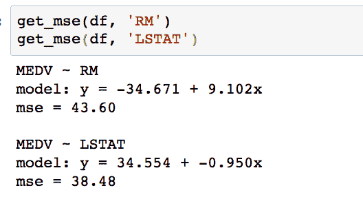

比较 **MSE**，结果发现 **LSTAT** 的误差略低。 但是，回头看散点图，似乎对于 **LSTAT** 使用多项式模型，我们可能会取得更大的成功。 在下一个活动中，我们将通过使用 scikit-learn 计算一个三阶多项式模型来对此进行测试。

暂时忘掉我们的波士顿住房数据集，请考虑另一种可能使用多项式回归的现实情况。 以下示例是对天气数据进行建模。 在以下图表中，我们看到加拿大不列颠哥伦比亚省温哥华的温度（线）和降水量（条形图）：


这些字段中的任何一个都可能很适合四阶多项式。 例如，如果您有兴趣预测连续日期范围内的温度或降水，这将是一个非常有价值的模型。

[您可以在此处找到此数据源](http://climate.weather.gc.ca/climate_normals/results_e.html?stnID=888)。

## 活动 B：建立三阶多项式模型

将我们的注意力转移回 Boston 住房数据集，我们想建立一个三阶多项式模型来与线性模型进行比较。 回想一下我们要解决的实际问题：在低阶层人口百分比的情况下，预测房屋中位数。 这种模式可以使潜在的波士顿购房者受益，他们关心他们的社区中有多少是低阶层。

给定 LSTAT 值，使用 scikit-learn 拟合多项式回归模型来预测房屋中位数（**MEDV**）。 我们希望建立一个模型，该模型具有较低的均方误差（**MSE**）。

1.  Scroll to the empty cells at the bottom of `Subtopic C` in your Jupyter Notebook. These will be found beneath the linear-model **MSE** calculation cell under the `Activity` heading.

    ### 注意

    在完成活动时，应使用代码填充这些空白单元格。 您可能需要在新单元格已填满时插入它们。 请根据需要这样做！

2.  Given that our data is contained in the DataFrame `df`, we will first pull out our dependent feature and target variable using the following:

    ```py
    y = df['MEDV'].values
    x = df['LSTAT'].values.reshape(-1,1)
    ```

    这与我们之前对线性模型所做的相同。

3.  Check out what `x` looks like by printing the first few samples with `print(x[:3])`:

    

    请注意，数组中的每个元素本身就是一个长度为 1 的数组。这是`reshape(-1,1)`的功能，它是 scikit-learn 期望的形式。

4.  Next, we are going to transform `x` into "polynomial features". The rationale for this may not be immediately obvious but will be explained shortly.

    从 scikit-learn 导入适当的转换工具并实例化三次多项式特征转换器：

    ```py
    from sklearn.preprocessing import PolynomialFeatures
    poly = PolynomialFeatures(degree=3)
    ```

5.  At this point, we simply have an instance of our feature transformer. Now, let's use it to transform the **LSTAT** feature (as stored in the variable `x`) by running the `fit_transform` method.

    通过运行以下代码来构建多项式特征集：

    ```py
    x_poly = poly.fit_transform(x)
    ```

6.  Check out what `x_poly` looks like by printing the first few samples with `print(x_poly[:3])`.

    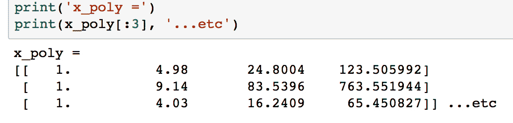

    与`x`不同，现在每行中的数组的长度为 4，其中的值已计算为 *x* *<sup>0</sup>* ， *x* *<sup>1</sup>* ， *x* *<sup>2</sup>* 和 *x* *<sup>3 [</sup>* 。

    我们现在将使用此数据来拟合线性模型。 将特征标记为 *a* ， *b* ， *c* 和 *d* ，我们将计算系数*α* *<sub>0</sub>* ，*α* *<sub>1</sub>* ，*α* *<sub>2</sub>* 和*α* *<sub>3</sub>* 的线性模型：

    

    我们可以插入 *a* ， *b* ， *c* 和 *d* 的定义，以获得以下多项式模型，其中系数 与以前的相同：

    

7.  在计算 MSE 时，我们将以与以前相同的方式导入`LinearRegression`类并构建线性分类模型。 运行以下命令：

    ```py
    from sklearn.linear_model import LinearRegression
    clf = LinearRegression()
    clf.fit(x_poly, y)
    ```

8.  Extract the coefficients and print the polynomial model using the following code:

    ```py
    a_0 = clf.intercept_ + clf.coef_[0] # intercept
    a_1, a_2, a_3 = clf.coef_[1:] 		# other coefficients
    msg = 'model: y = {:.3f} + {:.3f}x + {:.3f}x^2 + {:.3f}x^3'\
    		.format(a_0, a_1, a_2, a_3)
    print(msg)
    ```

    

    为了获得实际的模型截距，我们必须添加`intercept_`和`coef_[0]`属性。 然后，高阶系数由`coef_`的剩余值给出。

9.  通过运行以下代码，确定每个样本的预测值并计算残差：

    ```py
    y_pred = clf.predict(x_poly)
    resid_MEDV = y - y_pred
    ```

10.  Print some of the residual values by running `print(resid_MEDV[:10])`:

    

    我们将尽快绘制这些图以与线性模型残差进行比较，但首先我们将计算 MSE。

11.  Run the following code to print the MSE for the third-order polynomial model:

    ```py
    from sklearn.metrics import mean_squared_error
    error = mean_squared_error(y, y_pred)
    print('mse = {:.2f}'.format(error))
    ```

    

    可以看出，与线性模型（38.5）相比，多项式模型的 **MSE** 明显更少。 通过取平方根，可以将该误差度量转换为以美元为单位的平均误差。 对多项式模型执行此操作，我们发现的平均误差中位数房屋价值仅为$ 5,300。

    现在，我们将通过绘制最佳拟合的多项式线和数据来可视化模型。

12.  Plot the polynomial model along with the samples by running the following:

    ```py
    fig, ax = plt.subplots()
    # Plot the samples
    ax.scatter(x.flatten(), y, alpha=0.6)
    # Plot the polynomial model
    x_ = np.linspace(2, 38, 50).reshape(-1, 1)
    x_poly = poly.fit_transform(x_)
    y_ = clf.predict(x_poly)
    ax.plot(x_, y_, color='red', alpha=0.8)
    ax.set_xlabel('LSTAT'); ax.set_ylabel('MEDV');
    ```

    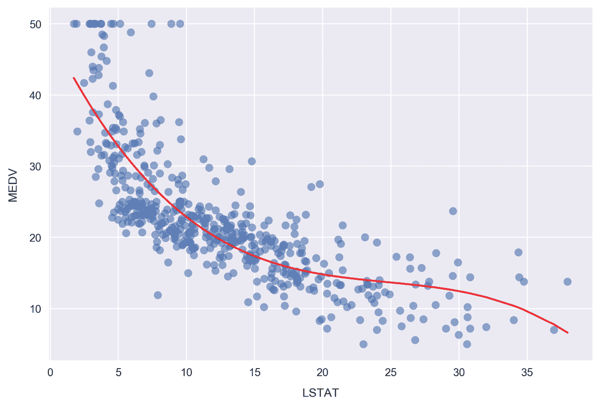

    在这里，我们通过在`x`值数组上计算多项式模型预测来绘制红色曲线。 `x`值数组是使用`np.linspace`创建的，导致 50 个值均匀排列在 2 和 38 之间。

    现在，我们将绘制对应的残差。 尽管我们之前曾使用 Seaborn 进行过开发，但我们必须手动进行操作才能显示 scikit-learn 模型的结果。 由于我们已经较早地计算了残差（作为`resid_MEDV`变量的参考），因此我们只需要在散点图上绘制此值列表即可。

13.  Plot the residuals by running the following:

    ```py
    fig, ax = plt.subplots(figsize=(5, 7))
    ax.scatter(x, resid_MEDV, alpha=0.6)
    ax.set_xlabel('LSTAT')
    ax.set_ylabel('MEDV Residual $(y-\hat{y})$')
    plt.axhline(0, color='black', ls='dotted');
    ```

    

    与线性模型 LSTAT 残差图相比，多项式模型残差似乎更紧密地聚集在 *y-= 0 =* 周围。 注意，`y`是样本 **MEDV**，`ŷ`是预测值。 仍然存在清晰的模式，例如 *x = 7* 和 *y = -7* 附近的簇，这表明模型不是最佳的。

使用多项式模型成功建模数据后，让我们通过查看分类特征来结束本节。 特别是，我们将构建一组分类特征，并使用它们来更详细地探索数据集。

## 子主题 D：使用分类特征进行细分分析

通常，我们发现数据集包含连续字段和分类字段。 在这种情况下，我们可以通过使用分类字段对连续变量进行分段来了解我们的数据并找到模式。

举一个具体的例子，假设您正在评估广告系列的投资回报率。 您可以访问的数据包含一些计算出的**投资回报率**（**ROI**）度量的度量。 每天计算这些值并记录，您正在分析上一年的数据。 您的任务是寻找以数据为依据的见解，以改善广告系列。 查看 ROI 的每日时间序列，您会看到每周的数据波动。 按星期几细分，您会发现以下 ROI 分布（其中 0 代表一周的第一天，而 6 代表最后一天）。


此清楚地表明，该广告系列在一周开始时获得了最大的投资回报率，随后逐渐减少。 因此，建议可能是减少下周的广告支出。 为了继续寻找见解，您还可以想象对按月分组的 ROI 重复相同的过程。

由于在我们正在使用的 Boston 房屋数据集中没有任何分类字段，因此我们将通过有效离散连续字段来创建一个分类字段。 在我们的案例中，这将涉及将数据分为“低”，“中”和“高”类别。 重要的是要注意，我们并不是简单地创建分类数据字段来说明本节中的数据分析概念。 可以看到，这样做可以从数据中揭示洞察力，否则这些洞察力将很难被发现或完全不可用。

### 从连续变量创建分类字段，并进行分段可视化

1.  Scroll up to the pairplot in the Jupyter Notebook where we compared **MEDV**, **LSTAT**, **TAX**, **AGE**, and **RM**:

    

    查看包含 AGE 的面板。 提醒一下，此功能定义为在 1940 年之前建造的*自住单位比例*。 我们将将此功能转换为分类变量。 转换后，我们将能够按照年龄类别对每个面板按颜色进行细分，以重新绘制该图形。

2.  Scroll down to `Subtopic D: Building and exploring categorical features` and click into the first cell. Type and execute the following to plot the AGE cumulative distribution:

    ```py
    sns.distplot(df.AGE.values, bins=100,
    			hist_kws={'cumulative': True},
    			kde_kws={'lw': 0})
    plt.xlabel('AGE')
    plt.ylabel('CDF')
    plt.axhline(0.33, color='red')
    plt.axhline(0.66, color='red')
    plt.xlim(0, df.AGE.max());
    ```

    

    注意，我们设置`kde_kws={'lw': 0}`是为了绕过上图中绘制内核密度估计值的过程。

    从图中的看，只有很少的样品具有较低的 AGE，而有更多的样品具有较高的 AGE。 这通过最右边的分布的陡度来表示。

    红线表示分布中的 1/3 和 2/3 点。 观察分布分布与这些水平线相交的地方，我们可以看到，只有约 33％的样本的 AGE 小于 55，而 33％的样本的 AGE 大于 90！ 换句话说，三分之一的住房社区在 1940 年之前建造房屋的比例不到 55％。这些社区被认为是相对较新的社区。 另一方面，另外三分之一的住房社区在 1940 年之前建造了超过 90％的房屋。这些房屋被认为是非常古老的。

    我们将使用红色水平线截取分布的位置作为将要素划分为类别的指导：**相对较新**，**相对较旧**和 **旧的**。

3.  Setting the segmentation points as 50 and 85, create a new categorical feature by running the following code:

    ```py
    def get_age_category(x):
    	if x < 50:
    		return 'Relatively New'
    	elif 50 <= x < 85:
    		return 'Relatively Old'
    	else:
    	return 'Very Old'
    df['AGE_category'] = df.AGE.apply(get_age_category)
    ```

    在这里，我们使用非常方便的 Pandas 方法`apply`，该方法将函数应用于给定的列或一组列。 在本例中为`get_age_category`时，所应用的函数应采用一个表示一行数据的参数，并为新列返回一个值。 在这种情况下，要传递的数据行只是一个值，即样本的 AGE。

    ### 注意

    `apply`方法之所以出色，是因为它可以解决各种问题并允许易于阅读的代码。 但是，矢量化方法（例如`pd.Series.str`）通常可以更快地完成同一件事。 因此，建议尽可能避免使用它，尤其是在处理大型数据集时。 在接下来的课程中，我们将看到一些矢量化方法的示例。

4.  Check on how many samples we've grouped into each age category by typing `df.groupby('AGE_category').size()` into a new cell and running it:

    

    查看结果，可以看出两个班级的人数相当相等，而“非常老”的一班人大约大 40％。 我们有兴趣保持类的大小可比，以使每个类都有很好的表示，并且可以直接从分析中进行推断。

    ### 注意

    并非总是可以将样本均匀地分配给类，在现实世界中，找到高度不平衡的类是很常见的。 在这种情况下，请务必牢记，对于人数不足的类别很难做出具有统计意义的声明。 类不平衡的预测分析可能特别困难。 [以下博客文章提供了有关在进行机器学习时处理不平衡类的方法的出色总结](https://svds.com/learning-imbalanced-classes/)。

    让我们看看通过新功能`AGE_category`进行细分时目标变量的分布情况。

5.  Make a violin plot by running the following code:

    ```py
    sns.violinplot(x='MEDV', y='AGE_category', data=df,
    				order=['Relatively New', 'Relatively Old', 'Very Old']);
    ```

    

    小提琴图显示了每个年龄类别的房屋中值分布的核密度估计。 我们看到它们都类似于正态分布。 “非常老”组的房价中位数样本最低，并且宽度相对较大，而其他组则更紧密地围绕其平均值。 青年组偏向高端，这可以从右半部分的放大和白点在分布主体内的粗黑线中的位置明显看出。

    这个白点代表平均值，粗黑线跨越了大约 50％的总体（填充到白点两侧的第一个分位数）。 黑色的细线代表箱线图的晶须，覆盖 95％的人口。 通过将`inner='point'`传递给`sns.violinplot()`，可以修改此内部可视化以显示各个数据点。 现在开始吧。

6.  Redo the violin plot adding the `inner='point'` argument to the `sns.violinplot` call:

    

    为了进行测试，最好制作这样的图，以查看基础数据如何连接到视觉。 例如，我们可以看到相对新细分市场的房价中位数如何不低于约$ 16,000，因此因此分配尾部实际上不包含任何数据。 由于我们的数据集较小（仅约 500 行），我们可以看到每个细分市场都是这种情况。

7.  Re-do the pairplot from earlier, but now include color labels for each **AGE** category. This is done by simply passing the `hue` argument, as follows:

    ```py
    cols = ['RM', 'AGE', 'TAX', 'LSTAT', 'MEDV', 'AGE_category']
    sns.pairplot(df[cols], hue='AGE_category',
    			hue_order=['Relatively New', 'Relatively Old', 'Very Old'],
    			plot_kws={'alpha': 0.5}, diag_kws={'bins': 30});
    ```

    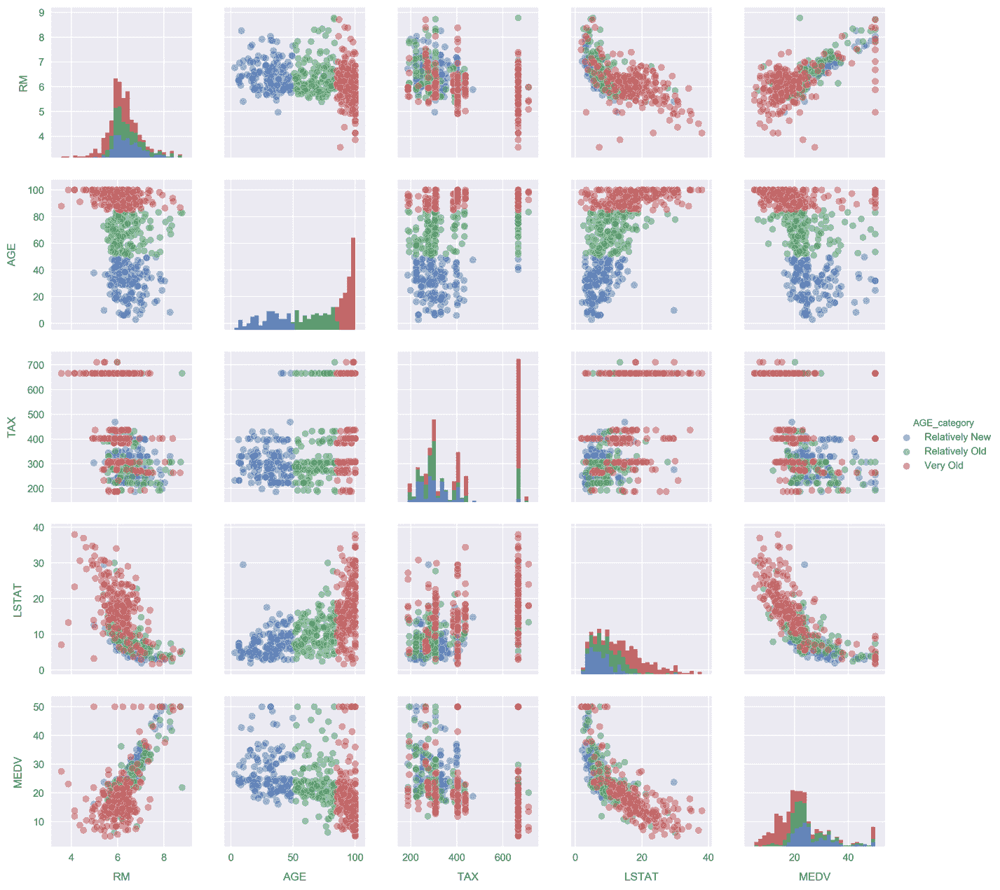

    查看直方图上的，对于 **RM** 和 **TAX**，每个段的基础分布显得相似。 另一方面，**LSTAT** 分布看起来更加不同。 我们可以再次使用小提琴图来更详细地关注它们。

8.  Make a violin plot comparing the **LSTAT** distributions for each `AGE_category` segment:

    

与 **MEDV** 小提琴图不同，在每个小提琴图中，[分布图] 的宽度大致相同，而这里的宽度随 **AGE** 的增加而增加。 以旧房屋为主的社区（“极老”部分）的居民数量很少，甚至很多，而相对较新的社区更可能是较高阶级的人群，超过 95％的样本的较低阶级百分比低于“非常”阶级 旧社区。 这是有道理的，因为相对而言，新街区会更昂贵。

# 摘要

在本课程中，您已经了解了 Jupyter 中数据分析的基础。

我们从 Jupyter 的用法说明和功能开始，例如魔术功能和制表符补全。 然后，过渡到特定于数据科学的材料，我们介绍了使用 Python 进行数据科学最重要的库。

在课程的后半部分，我们在现场 Jupyter Notebook 中进行了探索性分析。 在这里，我们使用了视觉辅助工具，例如散点图，直方图和小提琴图，以加深我们对数据的理解。 我们还执行了简单的预测建模，这是本书下一课的重点。

在下一课中，我们将讨论如何进行预测分析，在准备用于建模的数据时应考虑的事项以及如何使用 Jupyter Notebooks 实现和比较各种模型。